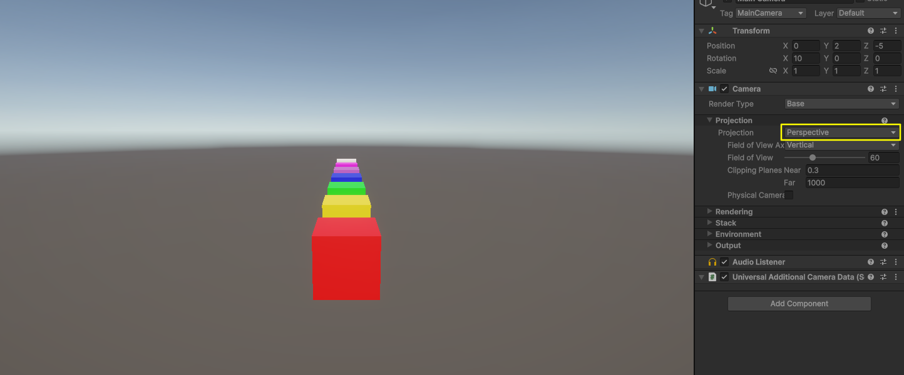
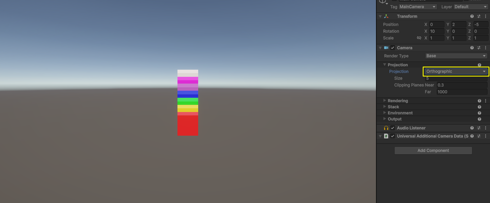
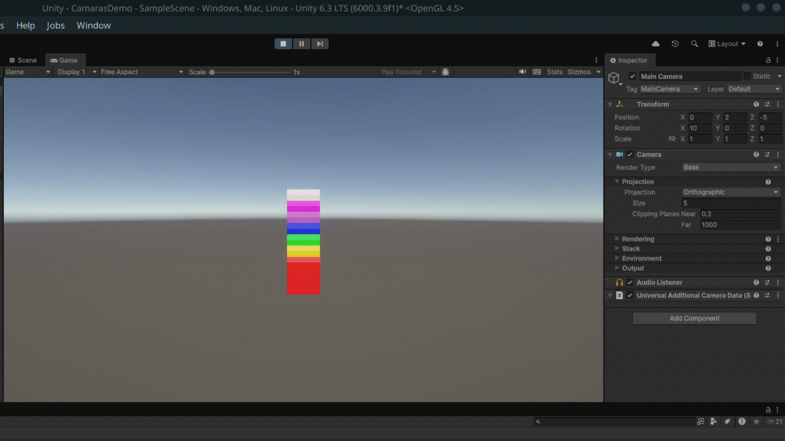

# Taller - Espacios Proyectivos y Matrices de Proyección
## Nombres: 
Jeronimo Bermudez Hernandez

Juan Felipe Fajardo Garzón

Juan David Buitrago Salazar

Juan David Cardenas Galvis

Nelson Ivan Castellanos Betancourt

Juan Pablo Correa Sierra


## Fecha de entrega: 27/02/2026

## Descripción breve: 


## Implementaciones: 

## 1. Python con Jupyter Notebook

**Plataforma:** Jupyter Notebook  
**Tecnologías:** Python, NumPy, Matplotlib

#### Funcionalidades implementadas:

- **Matrices de proyección en 3D**:
  - Proyección perspectiva con parámetros configurables (FOV, aspect ratio, near, far)
  - Proyección ortográfica con volumen de vista definido
  - Comparación matemática entre ambos tipos de proyección
- **Visualización de efectos de proyección**:
  - Transformación de puntos 3D a espacio de clip
  - Comparación visual de objetos a diferentes profundidades
  - Gráficas que muestran cómo la distancia afecta el tamaño en pantalla
- **Análisis de parámetros**:
  - Efecto del campo de visión (FOV) en la proyección perspectiva
  - Impacto de los planos near y far
  - Diferencias en la preservación de proporciones
- **Casos de uso prácticos**:
  - Visualización de escenas con múltiples objetos
  - Demostración de distorsión perspectiva
  - Comparación lado a lado de proyecciones

#### Características técnicas:

- Implementación manual de matrices de proyección 4x4
- Uso de coordenadas homogéneas para transformaciones
- División por perspectiva (w-divide) en proyección perspectiva
- Gráficas comparativas con matplotlib
- Análisis numérico de valores transformados

#### Ecuaciones matemáticas implementadas:

**Matriz de Proyección Perspectiva:**
```
[f/aspect   0      0           0    ]
[   0       f      0           0    ]
[   0       0   -(far+near)/(far-near)  -2*far*near/(far-near)]
[   0       0     -1           0    ]

donde f = 1/tan(FOV/2)
```

**Matriz de Proyección Ortográfica:**
```
[2/(r-l)    0        0      -(r+l)/(r-l)]
[  0     2/(t-b)     0      -(t+b)/(t-b)]
[  0        0    -2/(f-n)   -(f+n)/(f-n)]
[  0        0        0            1     ]
```

**Código relevante:** Ver notebook [python/semana_02_1_espacios_proyectivos_matrices_proyeccion.ipynb](python/semana_02_1_espacios_proyectivos_matrices_proyeccion.ipynb)

### 2. Three.js con React Three Fiber

**Plataforma:** Web  
**Tecnologías:** Vite, React, React Three Fiber, @react-three/drei

#### Funcionalidades implementadas:

- **Escena 3D con objetos a diferentes profundidades**:
  - **Cubo Rojo**: Posicionado cerca (z = 0)
  - **Esfera Azul**: Posicionado a media distancia (z = -5)
  - **Cono Verde**: Posicionado lejos (z = -10)
- **Dos tipos de cámara intercambiables**:
  - **Cámara Perspectiva**: FOV 50°, simula visión humana
  - **Cámara Ortográfica**: Zoom 50, proyección paralela
- **Controles interactivos**:
  - Botones para cambiar entre tipos de cámara en tiempo real
  - OrbitControls para navegación libre (rotar, zoom, pan)
  - Indicador visual del tipo de cámara activa
- **Elementos visuales de referencia**:
  - Grid infinito para orientación espacial
  - Líneas de profundidad conectando los objetos
  - Marcadores de posición en cada objeto
  - Panel informativo con explicación de cada proyección
  - Panel lateral con información de profundidad de cada objeto
- **Iluminación y materiales**:
  - Iluminación ambiental y direccional
  - Luz puntual con color temático
  - Materiales PBR con propiedades metálicas

### Processing:

En este entorno se desarrolló una escena sencilla con 3 objetos sobre el eje Z, donde se implementaron controles de traslación (flechas del teclado), y de rotación de la cámara (wasd), con el objetivo de simular la visión de una cámara, además de ello se hizo uso de perspective() y ortho() con el fin de ser más fiel a la proyección y vista que tiene una camara en un entorno 3D

### 3. Unity

**Mención:** Implementación de Unity desarrollada por Juan David Buitrago Salazar.  
**Plataforma:** Unity 3D (Core)  
**Tecnologías:** Unity Camera, proyección perspectiva y ortográfica, configuración de Field of View y Clipping Planes

#### Objetivo de la implementación:

Construir una escena de referencia en el eje de profundidad para evidenciar, de manera práctica, el comportamiento de las proyecciones perspectiva y ortográfica, así como el efecto de los parámetros intrínsecos de cámara (FOV, plano cercano y plano lejano).

#### Desarrollo realizado:

1. **Creación de la escena base**:
  - Se creó un proyecto 3D llamado **CamarasDemo**.
  - Se construyó una escena con cubos duplicados y alineados sobre el eje Z (profundidad), en posiciones progresivas (z = 0, 2, 4, 6, 8), para facilitar la comparación visual.

2. **Configuración de cámara en perspectiva**:
  - Se trabajó con la **Main Camera** en modo **Perspective**.
  - Se estableció una vista inicial con posición aproximada $(x=0, y=2, z=-10)$ y una leve inclinación en X para observar todos los objetos.
  - Se verificó el efecto característico: los objetos lejanos se perciben más pequeños, con clara sensación de profundidad y convergencia visual.

3. **Cambio a cámara ortográfica**:
  - Se cambió la misma cámara al modo **Orthographic**.
  - Se observó que los objetos conservan su tamaño aparente independientemente de la distancia.
  - Se confirmó la pérdida de convergencia y de sensación de profundidad propia de esta proyección.

4. **Exploración del Field of View (FOV)**:
  - En modo perspectiva se evaluaron diferentes valores de FOV:
    - **FOV = 20**: efecto de zoom y menor distorsión angular.
    - **FOV = 60**: comportamiento estándar.
    - **FOV = 100**: gran angular con mayor deformación en objetos cercanos.
  - Esta variación permitió analizar el compromiso entre amplitud de escena y distorsión geométrica.

5. **Análisis de Clipping Planes (Near/Far)**:
  - Se probaron configuraciones como:
    - **Near = 0.1, Far = 100**: escena completa visible.
    - **Near = 5**: recorte de objetos cercanos.
    - **Far = 5**: recorte de objetos lejanos.
  - Se comprobó experimentalmente que solo se renderizan objetos dentro del rango $[near, far]$.

## Resultados visuales:

### Python

*Fig 1: Comparación matemática entre proyección perspectiva y ortográfica, mostrando cómo afecta la transformación de coordenadas*


*Fig 2: Análisis del efecto del campo de visión (FOV) en la proyección perspectiva*


*Fig 3: Visualización de cómo diferentes valores de FOV afectan la proyección de la misma escena*

### Three.js - Visualizador Interactivo de Proyecciones


*Fig 4: Demostración con cámara perspectiva - observa cómo los objetos lejanos se ven progresivamente más pequeños y la navegación con OrbitControls*


*Fig 5: Demostración con cámara ortográfica - nota cómo todos los objetos mantienen su tamaño relativo sin importar la distancia*

### Processing:

En la siguiente imagen se presenta la vista de la cámara desde el eje z, se observa unicamente la proyección de los 2 elementos más cercanos a la cámara, la segunda esfera se encuentra oculta


En esta imagen se presenta la proyección desde una vista lateral  de los tres objetos, esta proyección se debe a la instrucción ortho(), puesto que esta cambia la vista en perspectiva a una proyección ortogonla, asimilandose más a una vista de cámara


También se puede tener una vista superior del objeto


### Unity


*Fig 9: Construcción de la escena base con múltiples cubos alineados en profundidad (eje Z), usada como referencia para evaluar las proyecciones.*


*Fig 10: Resultado con cámara en modo perspectiva: los objetos más lejanos se observan más pequeños y se evidencia la percepción de profundidad.*


*Fig 11: Resultado con cámara ortográfica: se preserva el tamaño aparente de los objetos y desaparece la convergencia visual.*


*Fig 12: Comparación dinámica entre proyección perspectiva y ortográfica en la misma escena.*


*Fig 13: Efecto del cambio del Field of View: FOV bajo comprime la escena, FOV alto incrementa la distorsión angular.*


*Fig 14: Demostración del recorte por planos Near/Far y su impacto directo en los objetos visibles de la escena.*

## Código relevante: 

### Python - Implementación de Matriz de Proyección Perspectiva

```python
import numpy as np

def perspective_projection_matrix(fov_degrees, aspect_ratio, near, far):
    """
    Crea una matriz de proyección perspectiva.
    
    Args:
        fov_degrees: Campo de visión vertical en grados
        aspect_ratio: Relación de aspecto (ancho/alto)
        near: Distancia al plano cercano
        far: Distancia al plano lejano
    
    Returns:
        Matriz 4x4 de proyección perspectiva
    """
    fov_rad = np.radians(fov_degrees)
    f = 1.0 / np.tan(fov_rad / 2.0)
    
    matrix = np.array([
        [f / aspect_ratio, 0, 0, 0],
        [0, f, 0, 0],
        [0, 0, -(far + near) / (far - near), -2 * far * near / (far - near)],
        [0, 0, -1, 0]
    ])
    
    return matrix

# Aplicar proyección a un punto 3D
def project_point(point_3d, projection_matrix):
    """Proyecta un punto 3D usando la matriz de proyección."""
    # Convertir a coordenadas homogéneas
    point_homogeneous = np.append(point_3d, 1)
    
    # Aplicar matriz de proyección
    projected = projection_matrix @ point_homogeneous
    
    # División por perspectiva (w-divide)
    if projected[3] != 0:
        projected = projected / projected[3]
    
    return projected[:3]
```

### Python - Implementación de Matriz de Proyección Ortográfica

```python
def orthographic_projection_matrix(left, right, bottom, top, near, far):
    """
    Crea una matriz de proyección ortográfica.
    
    Args:
        left, right: Límites horizontales del volumen de vista
        bottom, top: Límites verticales del volumen de vista
        near, far: Distancias a los planos cercano y lejano
    
    Returns:
        Matriz 4x4 de proyección ortográfica
    """
    matrix = np.array([
        [2 / (right - left), 0, 0, -(right + left) / (right - left)],
        [0, 2 / (top - bottom), 0, -(top + bottom) / (top - bottom)],
        [0, 0, -2 / (far - near), -(far + near) / (far - near)],
        [0, 0, 0, 1]
    ])
    
    return matrix
```

### Three.js - Implementación de Cambio de Cámara

```jsx
import { useState } from 'react'
import { Canvas } from '@react-three/fiber'
import { OrbitControls, PerspectiveCamera, OrthographicCamera } from '@react-three/drei'

function App() {
  const [cameraType, setCameraType] = useState('perspective')

  return (
    <div className="app-container">
      <Canvas>
        {/* Cámara Perspectiva */}
        {cameraType === 'perspective' && (
          <PerspectiveCamera
            makeDefault
            position={[8, 6, 12]}
            fov={50}
          />
        )}

        {/* Cámara Ortográfica */}
        {cameraType === 'orthographic' && (
          <OrthographicCamera
            makeDefault
            position={[8, 6, 12]}
            zoom={50}
          />
        )}

        {/* OrbitControls compartidos */}
        <OrbitControls makeDefault />

        {/* Objetos a diferentes profundidades */}
        <mesh position={[0, 1, 0]}>
          <boxGeometry args={[2, 2, 2]} />
          <meshStandardMaterial color="#ff4444" />
        </mesh>

        <mesh position={[0, 1, -5]}>
          <sphereGeometry args={[1.5, 32, 32]} />
          <meshStandardMaterial color="#4444ff" />
        </mesh>

        <mesh position={[0, 1, -10]}>
          <coneGeometry args={[1.5, 3, 32]} />
          <meshStandardMaterial color="#44ff44" />
        </mesh>
      </Canvas>

      {/* Controles de cámara */}
      <div className="camera-controls">
        <button onClick={() => setCameraType('perspective')}>
          Cámara Perspectiva
        </button>
        <button onClick={() => setCameraType('orthographic')}>
          Cámara Ortográfica
        </button>
      </div>
    </div>
  )
}
```

### Processing

El siguiente código es el encargado de "configurar" la cámara dentro de processing, puesto que con perspective se pueden fijar parámetros como el field of view, el plano near y el plano rear
```java
float fov = PI/3.0;
  float cameraZ = (height/2.0) / tan(fov/2.0);
  perspective(fov, float(width)/float(height),cameraZ/10.0, cameraZ*10.0);
```

Luego tenemos el código encargado de aplicar las trasnformaciones a nuestros elementos, después de esa instrucción se tiene la creación de las esferas y el cubo.
Los parametros de posición y rotación se modifican haciendo uso de las teclas antes mencionadas

La instrucción ortho() sirve para cambiar la vista a proyección ortográfica
```java
background(0);
  
  ortho();
  pushMatrix();
  
  translate(xpos,ypos,zpos);
  rotateX(radians(xrot));
  rotateY(radians(yrot));
```

## Prompts utilizados: 

Durante el desarrollo de este taller se utilizaron prompts de IA generativa para:

1. **Implementación de matrices de proyección en Python**
   - "Implementar matriz de proyección perspectiva en Python con numpy siguiendo la especificación OpenGL"
   - "Crear visualización comparativa de proyección perspectiva vs ortográfica con matplotlib"
   - "Cómo aplicar división por perspectiva (w-divide) después de multiplicar por matriz de proyección"

2. **Desarrollo de visualizador Three.js**
   - "Crear escena Three.js con React Three Fiber que permita cambiar entre cámara perspectiva y ortográfica"
   - "Implementar botones de control para alternar tipos de cámara en React Three Fiber"
   - "Cómo usar OrbitControls con PerspectiveCamera y OrthographicCamera de @react-three/drei"
   - "Crear líneas de referencia en Three.js para mostrar profundidad entre objetos"

3. **Implementación y validación en Unity**
  - "Cómo comparar proyección perspectiva y ortográfica en Unity usando una misma escena"
  - "Qué valores de Field of View permiten observar diferencias claras de distorsión"
  - "Cómo demostrar visualmente el efecto de los planos Near y Far en una cámara de Unity"
  - "Configuración base de cámara para escena de prueba con objetos alineados en el eje Z"


## Aprendizajes y dificultades: 

La principal dificultad del taller fue configurar los parámetros de perspectiva de la cámara, puesto que en algunos casos los planos quedaban mal y por ende los elementos nos se van a observar en la vista de cámara

En el componente de Unity, una dificultad adicional fue ajustar de forma consistente los parámetros de cámara para que las comparaciones entre perspectiva, ortográfica, FOV y clipping planes fueran reproducibles en la misma escena. Como aprendizaje principal, se consolidó la relación entre formulación matemática de la proyección y su efecto visual directo en un motor 3D en tiempo real.


  