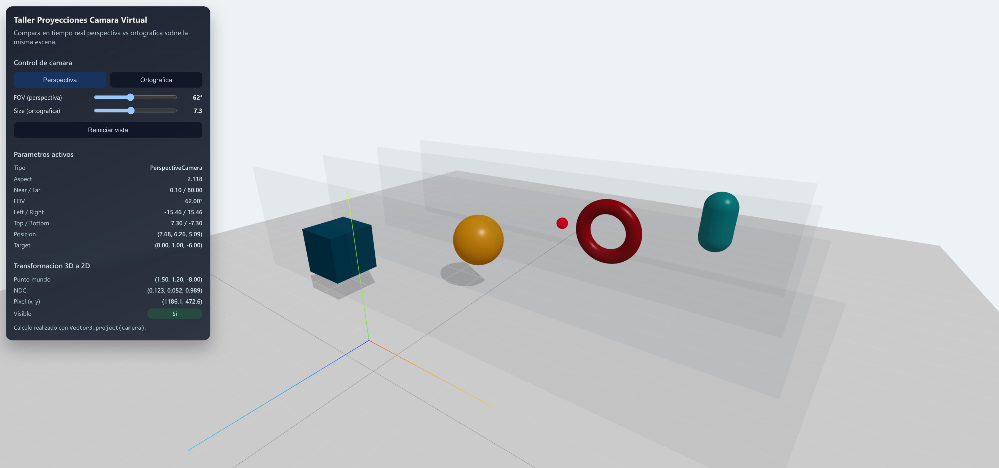
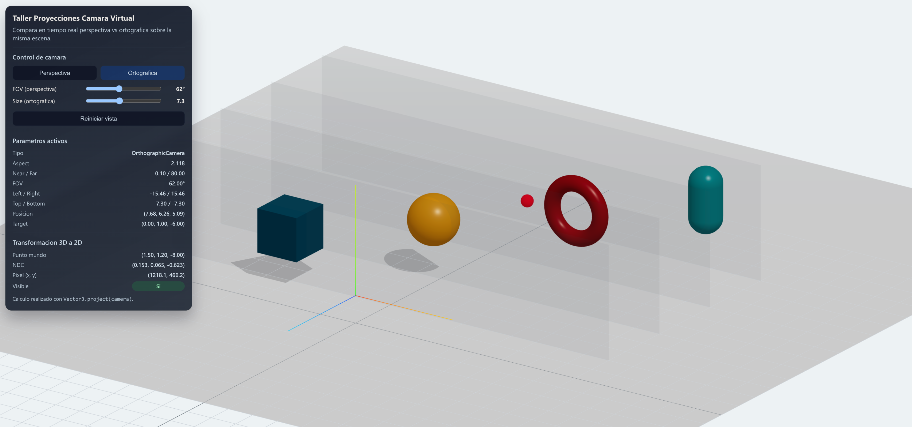
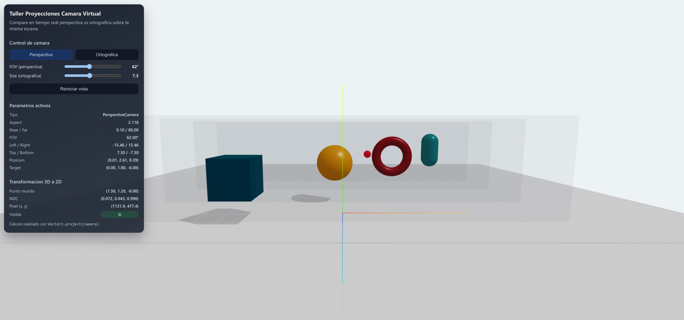
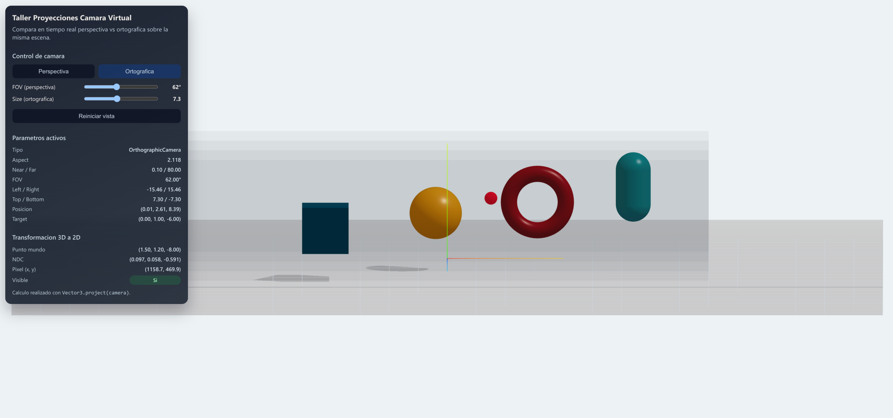
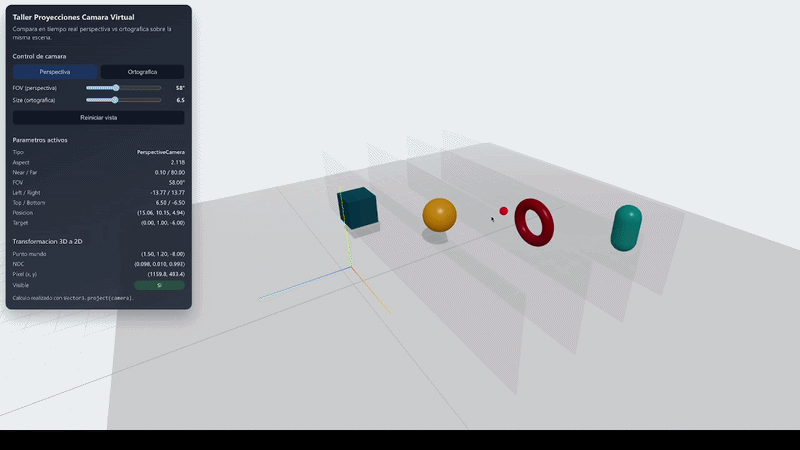

# Taller - Proyecciones 3D: Cómo ve una Cámara Virtual
## Integrantes
- Juan David Buitrago Salazar
- Juan David Cardenas Galvis
- Jeronimo Bermudez Hernandez
- Nelson Ivan Castellanos Betancourt
- Juan Pablo Correa Sierra
- Juan Felipe Fajardo Garzón

**Fecha de entrega:**  27/02/2026

## Descripción breve: 
Este taller explora como una camara virtual transforma una escena 3D en una imagen 2D.

## Implementaciones: 

### Unity:

Se desarrolló una escena simple con 2 cubos, una esfera y un plano inclinado, a esta se le añadió un script con el que se puede cambiar el modo de proyección para pasar de un modo de perspectiva a una proyección ortogonal, además, se implementó un slider con el fin de poder cambiar el tamaño del plano de proyección

### Three.js

- Escena con objetos distribuidos en distintas profundidades sobre el eje Z.
- Alternancia entre `PerspectiveCamera` y `OrthographicCamera`.
- Controles de orbita (`OrbitControls`) para inspeccion en tiempo real.
- Panel informativo con parametros de camara:
  - Perspectiva: `fov`, `aspect`, `near`, `far`
  - Ortografica: `left`, `right`, `top`, `bottom`, `near`, `far`

## Resultados visuales:

### Unity:

En la siguiente imagen se observa la vista en perspecitiva de los objetos de la escena, se evidencia a simple vista la inclinación de los mismos, en especial la del plano, y parece que el cuadro de la derecha no se encuentra en el mismo eje que el plano inclinado


Sin embargo, al cambiar a proyección ortogonal la escena cambia totalmente


Debido a que el cubo más lejano es el de mayor tamaño, se ve como es el más grande en la proyección ortogonal; por otro lado, el cambio más visible es la vista del plano y el cubo de la derecha, estos al estar justo frente a la cámara su forma cambia a la de 2 cuadros 2D, y se ve como el cubo que antes no parecía al frente del plano ahora si lo está, evidenciando como la cámara vería los objetos desde el punto exacto donde está

### Three.js
| Perspectiva | Ortográfica |
|-------------|-------------|
|  |  |
|  |  |


## Código relevante: 

### Unity
La siguiente función se encarga de cambiar el modo de vista, evalua si se encuentra en perpectiva o proyección ortogonal y cambia el valor de la cámara por el otro; esta función se encuentra asociada al botón de la UI
```cs
void CambiarModo()
    {
        if (cam.orthographic)
        {
            cam.orthographic = false;
        }else
        {
            cam.orthographic = true;
        }
    }
```
De modo similar se tiene la función de cambiar el tamaño de la proyección otrogonal, esta recibe como parámeetro el valor del slider, luego evalua si se encuentra en modo de proyección ortogonal y finalmente ajusta el valor del atributo de la cámara
```cs
void CambiarTamano(float value)
    {
        if (cam.orthographic)
        {
            cam.orthographicSize = value;
        }
    }
```

### Three.js
- `threejs/src/components/CameraSystem.jsx`: logica de camaras, sincronizacion y telemetria.
- `threejs/src/components/OverlayPanel.jsx`: UI para control e inspeccion de parametros.
- `threejs/src/components/SceneObjects.jsx`: escena y objetos a diferentes profundidades.

## Prompts utilizados: 
1. "Pon rectangulos transparentes entre los objetos para poder visualizar mejor la diferencia entre camara en perspectiva y ortografica."
2. "Separar el proyecto por componentes con buenas practicas y sin depender de codigo previo."


## Aprendizajes y dificultades: 
La principal dificultad en Unity fue configurar el cambio de perspectivas correctamente, puesto que en algunos casos lanzaba un error relacionado con que el puntero se encontraba fuera del frustrum, lo cual se debía a problemas al inicializar la perspectiva ortogonal

## Contribuciones del grupo

- **Juan David Buitrago Salazar:** Coordinación técnica del entregable, integración final y soporte en implementación.
- **Juan David Cardenas Galvis:** Desarrollo de componentes matemáticos y validación de resultados.
- **Jeronimo Bermudez Hernandez:** Implementación de funcionalidades y apoyo en integración.
- **Nelson Ivan Castellanos Betancourt:** Desarrollo de visualización y pruebas de comportamiento.
- **Juan Pablo Correa Sierra:** Implementación de componentes pendientes y soporte de integración.
- **Juan Felipe Fajardo Garzón:** Documentación de resultados y elaboración de evidencias.