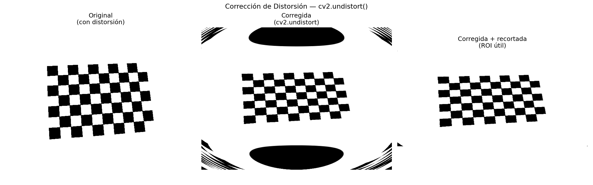
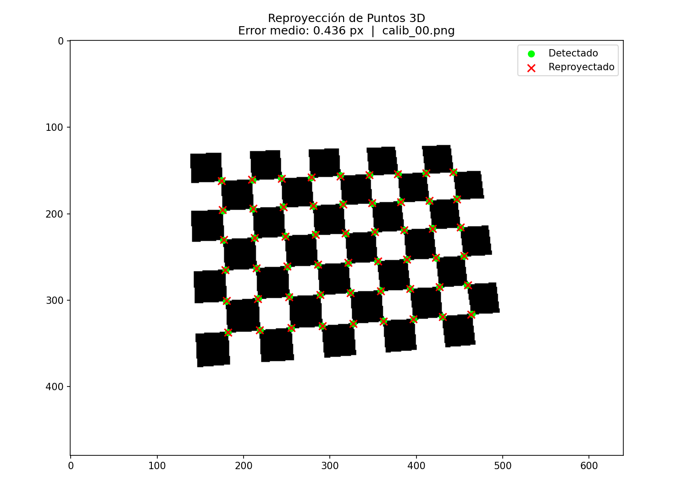
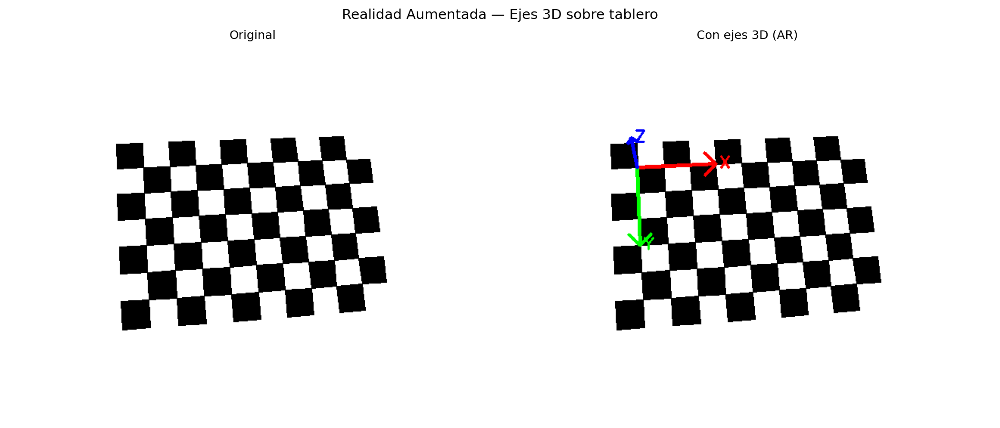
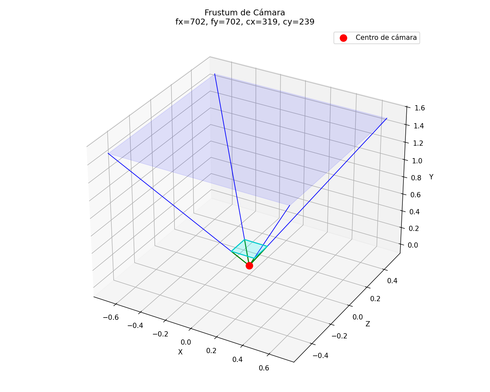
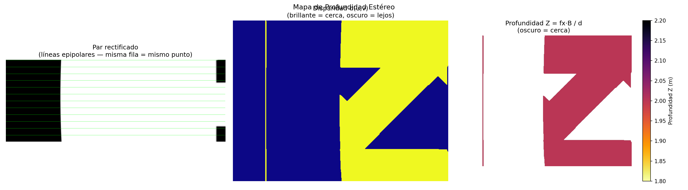
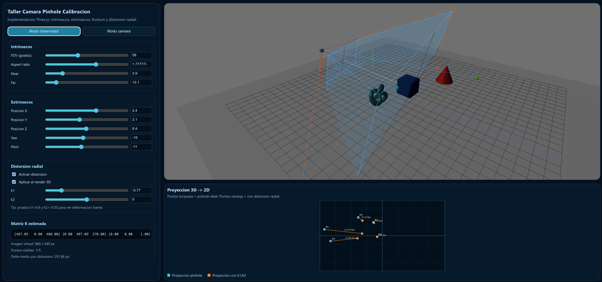
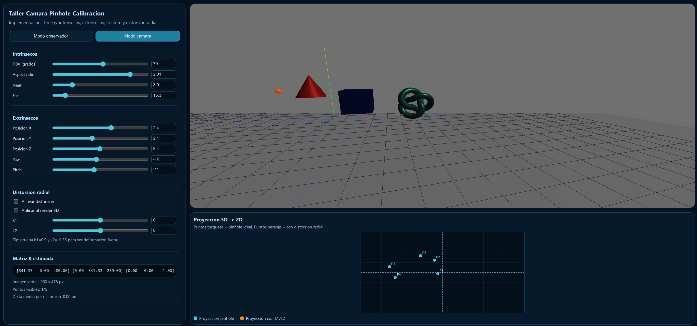

# Taller — Cámara Pinhole y Calibración

## Integrantes
- Juan David Buitrago Salazar
- Juan David Cardenas Galvis
- Jeronimo Bermudez Hernandez
- Nelson Ivan Castellanos Betancourt
- Juan Pablo Correa Sierra
- Juan Felipe Fajardo Garzón

**Fecha de entrega:**  27/02/2026

---

## Descripción

Este taller implementa el modelo matemático completo de la cámara pinhole: desde la proyección perspectiva básica hasta la calibración con patrón de ajedrez, corrección de distorsión y validación cuantitativa. Como bonus se añade visualización del frustum, un ejemplo de realidad aumentada y un pipeline de calibración estéreo con mapa de profundidad.

Todo el código está en notebooks de Python compatibles con **Google Colab**.

---

## Estructura del proyecto

```
semana_02_3_camara_pinhole_calibracion/
├── python/
│   ├── 01_pinhole_model.ipynb       # Modelo pinhole, matriz K, parámetros extrínsecos
│   ├── 02_calibration.ipynb         # Calibración, corrección de distorsión, validación
│   └── 03_bonus_ar_frustum.ipynb    # Bonus: AR, frustum, estéreo, profundidad
├── media/
│   ├── calibration_images/          # Imágenes sintéticas del tablero (15 vistas)
│   ├── stereo_images/               # Pares estéreo generados (izq / der)
│   ├── calibration_params.npz       # Parámetros K y dist guardados
│   └── *.png                        # Todos los resultados visuales
└── README.md
```

---

## Implementaciones

### 1 · Modelo Pinhole desde cero — `01_pinhole_model.ipynb`

Se implementan las ecuaciones de proyección perspectiva **sin usar OpenCV**:

```python
def project_pinhole_basic(points_3d: np.ndarray, f: float) -> np.ndarray:
    X, Y, Z = points_3d[:, 0], points_3d[:, 1], points_3d[:, 2]
    return np.stack([f * X / Z, f * Y / Z], axis=1)
```

Se proyecta un cubo 3D con tres distancias focales distintas (f = 1, 2, 5) para ver cómo la focal cambia el tamaño aparente del objeto.

| Proyección básica | Matriz intrínseca K |
|:-----------------:|:-------------------:|
|  |  |

**Matriz intrínseca K (3×3)**  
Agrupa focal y punto principal:

```
K = [ fx   0   cx ]
    [  0  fy   cy ]
    [  0   0    1 ]
```

Se experimentó con tres configuraciones: cámara simétrica, anamórfica (fx ≠ fy) y con punto principal descentrado.

**Parámetros extrínsecos [R|t]**  
Se implementaron matrices de rotación alrededor de los tres ejes y se simuló una cámara orbitando el cubo en cuatro ángulos (−20°, 0°, 20°, 40°).


---

### 2 · Calibración de cámara — `02_calibration.ipynb`

Se generaron **15 imágenes sintéticas** del tablero 9×6 usando `cv2.projectPoints` con distorsión radial simulada (k1 = −0.1, k2 = 0.03). Esto permite calibrar y verificar los resultados contra los valores reales conocidos.

**Pipeline de calibración:**
1. `cv2.findChessboardCorners()` + `cv2.cornerSubPix()` → esquinas sub-pixel
2. `cv2.calibrateCamera()` → estima K, dist, rvecs, tvecs
3. `cv2.undistort()` → imagen corregida
4. `cv2.projectPoints()` → error de reproyección por imagen

```python
rms, K, dist, rvecs, tvecs = cv2.calibrateCamera(
    obj_pts, img_pts, img_shape, None, None
)
```

| Corrección de distorsión | Error de reproyección |
|:------------------------:|:---------------------:|
|  |  |

El error de reproyección obtenido fue **< 0.5 px**, considerado de alta calidad.

---

### 3 · Bonus — AR, Frustum y Estéreo — `03_bonus_ar_frustum.ipynb`

#### Realidad Aumentada
Se detecta el tablero con `cv2.solvePnP()` para estimar la pose de la cámara y se proyectan ejes X/Y/Z sobre la imagen en tiempo real.



#### Frustum de cámara
Visualización 3D de la pirámide de visión (planos near/far) a partir de K.



#### Calibración estéreo + Mapa de profundidad (Bonus 1 y 2)
Se generan pares sintéticos izquierda/derecha con un baseline de 6 cm. Se calibra con `cv2.stereoCalibrate()`, se rectifica con `cv2.stereoRectify()` y se calcula la disparidad con `cv2.StereoSGBM`. La profundidad se obtiene con:

$$Z = \frac{f_x \cdot B}{d}$$



---
### Three.js (Bonus)

Se desarrollo una aplicacion con:

1. **PerspectiveCamera configurable** (`fov`, `aspect`, `near`, `far`).
2. **Parametros extrinsecos configurables** (`x`, `y`, `z`, `yaw`, `pitch`).
3. **Visualizacion de frustum** en modo observador usando `cameraHelper`.
4. **Rayo de proyeccion** desde la camara hacia puntos de referencia 3D.
5. **Funcion de conversion 3D -> 2D** en espacio de imagen virtual.
6. **Matriz intrinseca K estimada en tiempo real**:
   - `fx = fy = (h/2) / tan(fov/2)`
   - `cx = w/2`, `cy = h/2`
7. **Simulacion de distorsion radial**:
   - `x_d = x * (1 + k1*r^2 + k2*r^4)`
   - `y_d = y * (1 + k1*r^2 + k2*r^4)`
8. **Overlay de comparacion** entre proyeccion ideal y proyeccion distorsionada.
---

## Resultados visuales Three.js

**Vista de escena observador**


**Vista de cámara**


**GIFs**: uso de los controles para mostrar la interacción en tiempo real del flustrum y la proyección.

Parte 1:

Parte 2:


---

## Prompts utilizados

Se usó IA generativa como soporte para estructurar los scripts y resolver detalles de la API de OpenCV. Los prompts más relevantes fueron:

- *"Genera imágenes sintéticas de tablero de ajedrez con distorsión radial usando cv2.projectPoints"*
- *"¿Cómo renderizar correctamente el tablero para que findChessboardCorners lo detecte?"*
- *"Implementa el pipeline completo de calibración estéreo con cv2.stereoCalibrate y cv2.stereoRectify"*

Todo el código fue revisado, ajustado y comentado manualmente.

En Three.js, se usaron prompts como:
1. "Agrega visualizacion de frustum, rayos de proyeccion y overlay de puntos 3D proyectados a 2D".
2. "Simula distorsion radial ajustable con k1 y k2 y muestra comparacion visual contra proyeccion ideal en la escena 3d".

---

## Aprendizajes y dificultades

**Aprendizajes:**
- La distinción entre parámetros **intrínsecos** (propiedades ópticas del sensor) y **extrínsecos** (posición en el mundo) es la base de toda la geometría proyectiva de cámara.
- Un error de reproyección por debajo de 0.5 px indica una calibración de alta calidad; por encima de 1 px la calibración es cuestionable.
- La distorsión radial es más pronunciada en los bordes de la imagen y casi nula en el centro, donde está el punto principal.
- La rectificación estéreo alinea las filas epipolares de ambas cámaras, lo que reduce la búsqueda de correspondencias a 1D.

**Dificultades:**
- Lograr que `findChessboardCorners()` detectara el tablero sintético requirió ajustar la generación: renderizar un grid de vértices mayor que el patrón interior (n+2 × m+2) y centrarlo en el origen.
- La convención de ejes de OpenCV (Z hacia adelante, Y hacia abajo) es diferente a la convención matemática estándar y causó errores en la visualización de los ejes AR hasta corregirlo.
- Generar disparidad válida en imágenes sintéticas de tablero exigió ajustar los parámetros de `StereoSGBM` (numDisparities, blockSize) para evitar regiones vacías.

---

## Ejecución

Los notebooks se ejecutan secuencialmente:

1. `01_pinhole_model.ipynb` — sin dependencias previas
2. `02_calibration.ipynb` — genera `media/calibration_params.npz`
3. `03_bonus_ar_frustum.ipynb` — requiere que `02_calibration.ipynb` haya sido ejecutado

```bash
pip install opencv-python numpy matplotlib
```

Todos los resultados se guardan automáticamente en `media/`.

---

## Contribuciones del grupo

- **Juan David Buitrago Salazar:** Coordinación técnica del entregable, integración final y soporte en implementación.
- **Juan David Cardenas Galvis:** Desarrollo de componentes matemáticos y validación de resultados.
- **Jeronimo Bermudez Hernandez:** Implementación de funcionalidades y apoyo en integración.
- **Nelson Ivan Castellanos Betancourt:** Desarrollo de visualización y pruebas de comportamiento.
- **Juan Pablo Correa Sierra:** Implementación de componentes pendientes y soporte de integración.
- **Juan Felipe Fajardo Garzón:** Documentación de resultados y elaboración de evidencias.