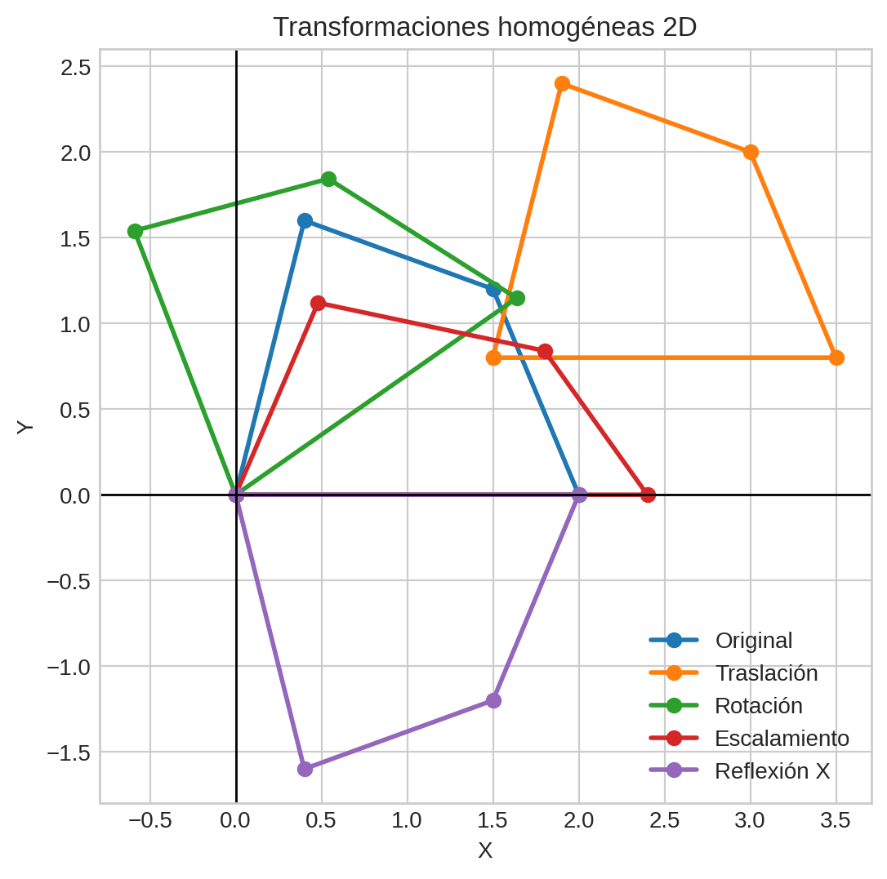
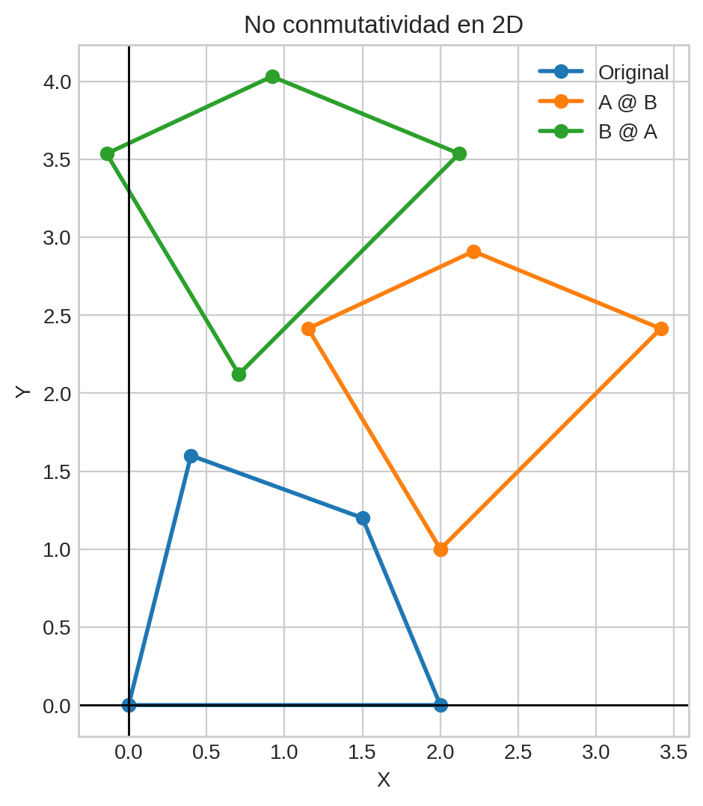
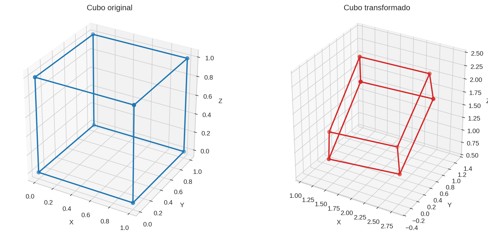
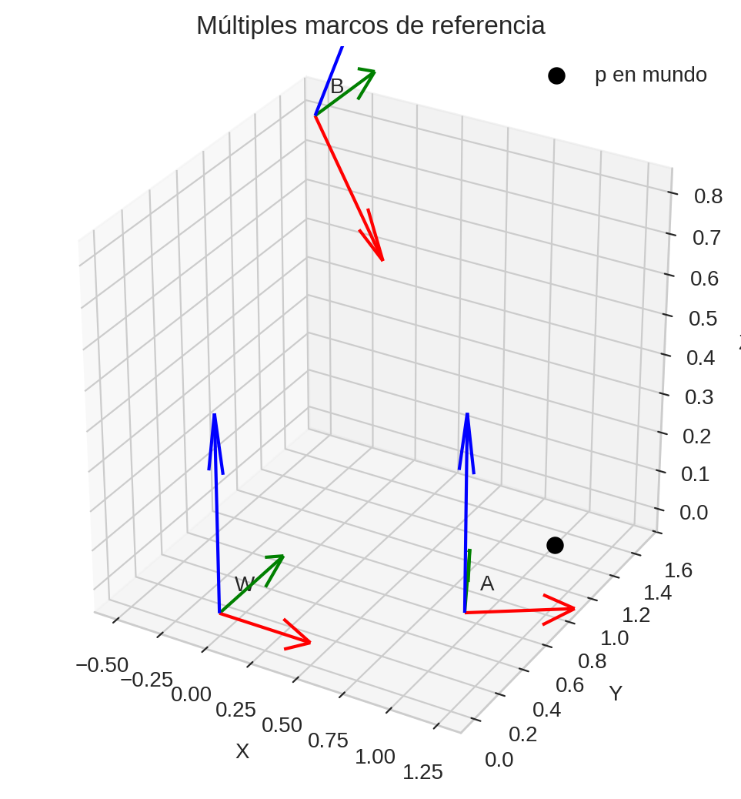
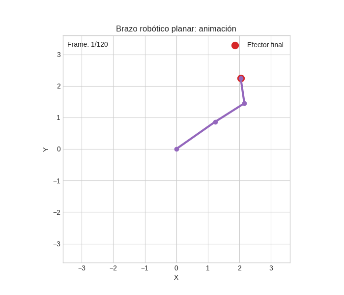

# Taller 2.4 - Transformaciones Homogéneas y Cambios de Base

## Integrantes

- Juan David Buitrago Salazar
- Juan David Cardenas Galvis
- Jeronimo Bermudez Hernandez
- Nelson Ivan Castellanos Betancourt
- Juan Pablo Correa Sierra
- Juan Felipe Fajardo Garzón

## Fecha de entrega

`2026-02-27`

---

## Descripción breve

En este taller se abordó el uso de transformaciones homogéneas para representar y componer movimientos en 2D y 3D, junto con cambios de base entre sistemas de referencia. El desarrollo se enfocó en consolidar fundamentos matemáticos clave para gráficos por computador y robótica, especialmente el manejo matricial de traslaciones, rotaciones, escalados, reflexiones e inversiones.

La implementación realizada en esta entrega corresponde al entorno Python, donde se construyeron funciones reutilizables para operar sobre puntos en coordenadas homogéneas y se generaron visualizaciones de cada etapa del taller. Adicionalmente, se verificaron propiedades importantes como la no conmutatividad de la composición y la consistencia de las transformaciones inversas.

Como aplicación final, se modeló un brazo robótico planar de tres eslabones para calcular cinemática directa y visualizar su comportamiento estático y animado, obteniendo la posición del efector final y registrando los resultados gráficos en la carpeta `media/`.

---

## Implementaciones

### Python

Se implementó el taller completo en Python usando `numpy`, `matplotlib`, `matplotlib.animation` y `pillow` para exportar resultados:

1. Coordenadas homogéneas 2D (`3x3`) con:
   - Traslación
   - Rotación
   - Escalamiento
   - Reflexión
2. Composición de transformaciones y verificación de orden de multiplicación.
3. Coordenadas homogéneas 3D (`4x4`) aplicadas a un cubo unitario.
4. Cambios de base entre marcos `A`, `B` y mundo `W`.
5. Transformaciones inversas con validación numérica de identidad.
6. Aplicación en robótica: cinemática directa de un manipulador planar de 3 GDL con animación.

### Unity

No implementado en esta entrega. La fase de implementación correspondiente al punto 2.4 en Unity queda a cargo de Juan Pablo Correa Sierra.

### Three.js / React Three Fiber

No implementado en esta entrega. La fase de implementación correspondiente al punto 2.4 en Three.js queda a cargo de Juan Pablo Correa Sierra.

---

## Resultados visuales

Los resultados de Python fueron exportados en la carpeta `media/`.

### Python - Implementación



En esta figura se tomó un polígono base en coordenadas cartesianas y se llevó a coordenadas homogéneas para aplicar, de forma controlada, traslación, rotación, escalamiento y reflexión con matrices `3x3`. Lo esperado era comprobar que cada operación altera la geometría según su definición teórica y que, al visualizar todas juntas, se distingue claramente el efecto de cada transformación sobre posición, orientación y proporciones.



Aquí se construyeron dos transformaciones (`A`: traslación y `B`: rotación) y se aplicaron en ambos órdenes (`A @ B` y `B @ A`). Se esperaba evidenciar la no conmutatividad de la multiplicación matricial en transformaciones afines, y efectivamente se observan dos configuraciones finales distintas para la misma figura inicial, confirmando la dependencia del orden.



Para esta evidencia se definió un cubo unitario y se aplicó una transformación homogénea compuesta por escalamiento, rotaciones en distintos ejes y traslación, todo en formato `4x4`. El resultado esperado era verificar que el objeto conserva su conectividad topológica mientras cambia su pose y dimensiones en el espacio 3D, lo cual se cumple al comparar las dos vistas.



En esta etapa se definieron tres marcos (`W`, `A` y `B`) y se transformó un punto entre sistemas de referencia por rutas equivalentes. La expectativa era demostrar coherencia entre el cálculo indirecto (pasando por mundo) y el cálculo directo (usando la matriz de cambio de base), además de visualizar ejes locales para interpretar correctamente orientación y posición relativas.


Esta imagen corresponde al modelo de un manipulador planar de 3 grados de libertad mediante encadenamiento de transformaciones homogéneas. Se esperaba obtener la posición del efector final a partir de longitudes y ángulos articulares dados, etiquetar cada articulación y verificar visualmente que la cadena cinemática coincide con el resultado numérico reportado.



La animación se generó variando de manera periódica los ángulos articulares para observar la respuesta dinámica del brazo. Lo esperado era comprobar continuidad del movimiento, estabilidad del cálculo frame a frame y comportamiento consistente del efector final durante toda la secuencia temporal.

### Unity - Implementación

Sin resultados visuales en esta entrega (pendiente de implementación).

### Three.js - Implementación

Sin resultados visuales en esta entrega (pendiente de implementación).

---

## Código relevante

### Python

Se seleccionaron estos snippets porque corresponden a la implementación efectivamente realizada en este taller (2.4) y concentran la base de transformación homogénea en 2D, 3D y su aplicación en robótica.

**Snippet 1 — Traslación y aplicación de transformación en 2D:**
Este bloque define una matriz homogénea `3x3` para traslación y la función general para aplicar cualquier transformación 2D a un conjunto de puntos. Se eligió porque es la puerta de entrada al taller: convierte geometría plana en un proceso matricial unificado, que luego se reutiliza para rotación, escalamiento, reflexión y composición.

```python
def translation_2d(tx: float, ty: float) -> np.ndarray:
    return np.array([[1.0, 0.0, tx],
                     [0.0, 1.0, ty],
                     [0.0, 0.0, 1.0]])

def apply_transform_2d(points: np.ndarray, transform: np.ndarray) -> np.ndarray:
    points_h = to_homogeneous_2d(points)
    transformed_h = (transform @ points_h.T).T
    return from_homogeneous_2d(transformed_h)
```

**Snippet 2 — Matriz de traslación homogénea en 3D:**
Este fragmento construye la forma estándar de una transformación de traslación en coordenadas homogéneas `4x4`. Es importante porque extiende el enfoque de 2D a 3D, habilitando el trabajo con poses espaciales, cambios de base y transformaciones compuestas sobre objetos tridimensionales.

```python
def translation_3d(tx: float, ty: float, tz: float) -> np.ndarray:
    return np.array([
        [1.0, 0.0, 0.0, tx],
        [0.0, 1.0, 0.0, ty],
        [0.0, 0.0, 1.0, tz],
        [0.0, 0.0, 0.0, 1.0]
    ])
```

**Snippet 3 — Cinemática directa de un manipulador planar:**
Este bloque encadena transformaciones homogéneas por articulación para calcular la pose final del efector y las posiciones intermedias de juntas. Se escogió por su valor integrador: demuestra cómo los conceptos geométricos del taller se aplican de manera directa a un problema clásico de robótica.

```python
def forward_kinematics_planar(joint_angles_rad: np.ndarray, link_lengths: np.ndarray) -> tuple[np.ndarray, np.ndarray]:
    T = np.eye(4)
    joint_positions = [np.array([0.0, 0.0, 0.0])]
    for theta, length in zip(joint_angles_rad, link_lengths):
        T = T @ (rotation_z(theta) @ translation_3d(length, 0.0, 0.0))
        joint_positions.append(T[:3, 3].copy())
    return T, np.vstack(joint_positions)
```

### Unity

No implementado en este taller 2.4 al momento de esta entrega; por tanto, no se incluyen snippets de código en este entorno.

### Three.js

No implementado en este taller 2.4 al momento de esta entrega; por tanto, no se incluyen snippets de código en este entorno.

---

## Resultados numéricos relevantes

- Composición 2D: `¿A @ B == B @ A? -> False`
- Validación de composición secuencial: `True`
- Cambios de base por dos rutas equivalentes: `True`
- Verificación inversa: `T @ T_inv ≈ I -> True`
- Recuperación de puntos tras aplicar transformación + inversa: `True`
- Posición del efector final (cinemática directa): `[2.7501, 1.8004, 0.0]`

---

## Prompts utilizados

Para documentar cómo podría reproducirse el notebook con apoyo de un LLM, se proponen los siguientes prompts (orientados a Python):

1. **Estructura general del notebook (Python):**

    "Actúa como experto en geometría proyectiva y robótica. Genera un notebook en Python llamado `taller_transformaciones_homogeneas.ipynb` con secciones: (1) coordenadas homogéneas 2D, (2) composición de transformaciones, (3) coordenadas homogéneas 3D, (4) cambios de base, (5) transformaciones inversas y (6) aplicación en robótica con cinemática directa. Usa `numpy` y `matplotlib`, incluye celdas bien separadas, funciones reutilizables, validaciones numéricas con `np.allclose` y exporta imágenes a una carpeta `../media` con nombres `python_*.png` y un GIF final para robótica." 

2. **Implementación de transformaciones 2D:**

    "Implementa funciones en Python para pasar puntos 2D a homogéneas y de vuelta, y define matrices `3x3` de traslación, rotación, escalamiento y reflexión. Aplica cada transformación a un polígono de prueba y grafica comparación original vs transformado con `matplotlib`, ejes cartesianos visibles, aspecto igual y leyenda." 

3. **Composición y no conmutatividad:**

    "Crea un ejemplo reproducible de no conmutatividad usando dos matrices de transformación 2D (`A` y `B`), calcula `A @ B` y `B @ A`, aplica ambas a la misma figura y muestra que los resultados difieren. Incluye impresión de `¿A @ B == B @ A?` y validación de composición secuencial equivalente." 

4. **Transformaciones homogéneas 3D y cubo:**

    "Define funciones de traslación, escalamiento, rotaciones en X/Y/Z y reflexión en 3D con matrices `4x4`. Crea un cubo unitario, aplica una transformación compuesta, dibuja cubo original y transformado en subplots 3D con las mismas proporciones y guarda la imagen." 

5. **Cambios de base en marcos múltiples:**

    "Modela tres sistemas de referencia (`W`, `A`, `B`), define `T_A_to_W` y `T_B_to_W`, transforma un punto desde `A` hacia `B` por dos métodos (vía mundo y directo con matriz de cambio de base), verifica que coinciden y visualiza los ejes de cada marco con `quiver` en 3D." 

6. **Transformaciones inversas y cinemática directa:**

    "Construye una transformación 3D compuesta `T`, calcula su inversa `T_inv`, verifica `T @ T_inv ≈ I` y recuperación de puntos. Luego implementa cinemática directa de un brazo planar de 3 eslabones usando transformaciones homogéneas, grafica articulaciones, reporta la posición del efector final y genera una animación GIF de 120 frames." 

Los prompts de Unity y Three.js quedan a cargo de los integrantes responsables de dichas implementaciones.

---

## Aprendizajes y dificultades

### Aprendizajes

Se reforzó la utilidad de la representación homogénea para unificar en una sola operación matricial transformaciones lineales y afines. También se consolidó el entendimiento de composición de transformaciones y su dependencia del orden, aspecto crítico tanto en modelado geométrico como en cinemática.

En 3D, el trabajo con marcos de referencia permitió comprender de forma práctica el cambio de base y la relación entre sistemas local y global. Finalmente, la aplicación en robótica mostró cómo encadenar transformaciones para obtener la pose del efector final de manera sistemática.

### Dificultades

El principal reto fue mantener consistencia conceptual entre convención matemática, orden de multiplicación y visualización de resultados. Se resolvió validando cada bloque con pruebas numéricas (`np.allclose`) y comparaciones visuales.

Otro punto exigente fue coordinar en una misma práctica temas de geometría proyectiva y robótica, por lo que se optó por una estructura modular de funciones para facilitar depuración y reutilización.

### Mejoras futuras

- Implementar la misma práctica en Unity con jerarquías de `GameObject` y matrices `Matrix4x4`.
- Implementar la versión en Three.js/React Three Fiber usando `THREE.Matrix4`.
- Extender la robótica a un modelo espacial 3D con orientación completa del efector final.
- Incorporar pruebas automatizadas para validar propiedades geométricas clave.

---

## Contribuciones del grupo

- **Juan David Buitrago Salazar:** asumió el punto 2.4 en Python y el punto 2.1 en Unity. En esta entrega, desarrolló integralmente la implementación de Python para transformaciones homogéneas y cambios de base, incluyendo funciones matriciales, verificaciones de consistencia, generación de gráficas y animación de cinemática directa.

- **Juan David Cardenas Galvis:** fue responsable del punto 2.3 en Python, contribuyendo al desarrollo del bloque de cámara pinhole y calibración desde un enfoque matemático-programático, con especial atención a la formulación de proyección y parámetros intrínsecos/extrínsecos.

- **Jeronimo Bermudez Hernandez:** tuvo a cargo el punto 2.1 en Three.js y el punto 2.1 en Python. Su aporte se centró en la implementación de fundamentos proyectivos en entorno web y en entorno científico, manteniendo coherencia conceptual entre visualización interactiva y validación numérica.

- **Nelson Ivan Castellanos Betancourt:** asumió los puntos 2.3 y 2.2 en Three.js. Su contribución se orientó a la construcción de escenas y lógica de visualización para trasladar los conceptos de cámara y proyección al contexto web 3D.

- **Juan Pablo Correa Sierra:** tiene asignado el punto 2.4 en Unity y el punto 2.4 en Three.js. En consecuencia, la implementación aún pendiente de este taller en ambos entornos queda bajo su responsabilidad directa de desarrollo y entrega.

- **Juan Felipe Fajardo Garzón:** estuvo encargado del punto 2.1 en Processing y del punto 2.2 en Unity, aportando en la construcción de escenas de proyección y en la experimentación de cambios de cámara en entornos de prototipado visual y motor de juego.

---

## Estructura del proyecto

```text
semana_02_4_transformaciones_homogeneas/
├── python/
│   ├── semana_02_4_transformaciones_homogeneas.md
│   └── taller_transformaciones_homogeneas.ipynb
├── media/
│   ├── python_2d_comparativa.png
│   ├── python_2d_escalamiento.png
│   ├── python_2d_no_conmutatividad.png
│   ├── python_2d_reflexion_x.png
│   ├── python_2d_rotacion.png
│   ├── python_2d_traslacion.png
│   ├── python_3d_cambios_base.png
│   ├── python_3d_cubo_transformado.png
│   ├── python_robotica_cinematica_directa.png
│   └── python_robotica_cinematica_directa.gif
├── 04_plantilla_readme_entregas_talleres.md
└── README.md
```

---

## Referencias

- Documentación oficial de NumPy: https://numpy.org/doc/
- Documentación oficial de Matplotlib: https://matplotlib.org/stable/contents.html
- Craig, J. J. *Introduction to Robotics: Mechanics and Control*.
- Murray, Li, Sastry. *A Mathematical Introduction to Robotic Manipulation*.

---

## Checklist de entrega

- [x] Carpeta con nombre `semana_02_4_transformaciones_homogeneas`
- [x] Código funcional en `python/`
- [x] Evidencias visuales de Python en `media/`
- [x] README completo y formal
- [ ] Implementación en Unity
- [ ] Implementación en Three.js
- [ ] Mínimo 2 capturas/GIFs para Unity y Three.js
