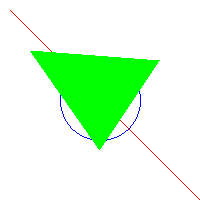

# Taller - Implementación de Z-Buffer y Depth Testing

## Integrantes

- Juan David Buitrago Salazar
- Juan David Cardenas Galvis
- Nicolás Rodríguez Piraban
- Camilo Andres Medina Sanchez
- Juan Felipe Fajardo Garzón

**Fecha de entrega:**  09/03/2026

## Descripción breve: 

El presenta taller tiene como objetivo la comprensión de los procesos de rasterización desarrollados de forma algoritmica desde python.

## Implementaciones

### Python
La implementación general del taller se desarrollo haciendo uso del lenguaje de programación python, haciendo uso de definiciones sencillas de algoritmos que permiten la rasterización.

**Algoritmo de bresenham**
Este es un método utilizado en gráficos por computador para dibujar una linea recta entre dos puntos en una cuadricula de pixeles, fue desarrollado en 1962, por Jack Bresenham.
Su principal ventaja es el uso de operaciones aritméticas muy básicas y sencillas (sumas y restas) evitando calculos tediosos o computacionalmente complejos.
El algoritmo recibe como parametros de entrada dos puntos 
$$(x_0, y_0) y (x_1, y_1) $$
y por métodos iterativos traza la linea recta entre ambos puntos.
El código completo de la implementación de este algoritmo se encuentra [acá.](#bresenham)

**Algoritmo midpoint circle**
Este método, como lo dice su nombre, busca dibujar un circulo en una cuadricula de pixeles, además, igual que el algoritmo de bresenham, solo hace uso de operaciones enteras sencillas. 
La ecuación matemática de un circulo es: 
$$x^2 + y^2 = r^2$$
No obstante, esta ecuación necesita un plano continuo y una imagen está formada por pixeles discretos.
A partir del uso de simetrias de un circulo, el algoritmo lo rastreriza completo sobre la imagen, el código se encuentra referenciado [acá.](#punto_medio)

**Rasterización triángulo**
El algoritmo utilizado para la generación del triángulo recibe tres puntos quie hacen referencia a los vertices del triángulo y busca unirlos haciendo uso del método scanline.
> El método scanline (línea de escaneo) es un algoritmo de renderizado y relleno de polígonos que procesa escenas 3D o formas 2D línea por línea (de arriba a abajo).

Antes de desarrollar el scanline, organiza los vetices con una función lambda, el código completo se encuentra [acá.](#triangulo)

## Resultados visuales

### Python

En esta práctica solo se tiene un resultado visual que hace referencia al uso de los tres algoritmos sobre un lienzo base. 

Como se logra identificar en la imagen, se desarrollan las aplicaciones de los tres algoritmos combinados en un solo lienzo.

## Código relevante

### Python
<a id="bresenham"></a>
*Bresenham*

```python
def bresenham(x0, y0, x1, y1):
    dx = abs(x1 - x0)
    dy = abs(y1 - y0)
    sx = 1 if x0 < x1 else -1
    sy = 1 if y0 < y1 else -1
    err = dx - dy

    while True:
        pixels[x0, y0] = (255, 0, 0)
        if x0 == x1 and y0 == y1:
            break
        e2 = 2 * err
        if e2 > -dy:
            err -= dy
        x0 += sx
        if e2 < dx:
            err += dx
        y0 += sy
```

<a id="punto_medio"></a>
*Midpoint*

```python
def midpoint_circle(x0, y0, radius):

    x = radius
    y = 0
    p = 1 - radius

    while x >= y:

        puntos = [
            (x, y), (y, x), (-x, y), (-y, x),
            (-x, -y), (-y, -x), (x, -y), (y, -x)
        ]

        for dx, dy in puntos:
            px = x0 + dx
            py = y0 + dy

            if 0 <= px < width and 0 <= py < height:
                pixels[px, py] = (0, 0, 255)

        y += 1

        if p <= 0:
            p = p + 2*y + 1
        else:
            x -= 1
            p = p + 2*y - 2*x + 1
```

<a id="triangulo"></a>
*Rasterización de triángulo*

```python
def fill_triangle(p1, p2, p3):

    pts = sorted([p1, p2, p3], key=lambda p: p[1])
    (x1, y1), (x2, y2), (x3, y3) = pts

    def interpolate(y0, y1, x0, x1):
        if y1 - y0 == 0:
            return []
        return [int(x0 + (x1-x0)*(y-y0)/(y1-y0)) for y in range(y0, y1)]

    x12 = interpolate(y1, y2, x1, x2)
    x23 = interpolate(y2, y3, x2, x3)
    x13 = interpolate(y1, y3, x1, x3)

    x_left = x12 + x23

    for y, xl, xr in zip(range(y1, y3), x13, x_left):

        for x in range(min(xl, xr), max(xl, xr)):

            if 0 <= x < width and 0 <= y < height:
                pixels[x, y] = (0, 255, 0)
```


## Prompts utilizados

Genera un Script en C# que permita comparar entre el buffer lineal y el no lineal aplicando un shader a un material

## Aprendizajes y dificultades

La principal dificultad fue la implementación y el uso de las variables en la creación del shader, puesto que algunas veces existían errores en la compilación debido al incoherencias dentro de estas variables

## Contribuciones del grupo
