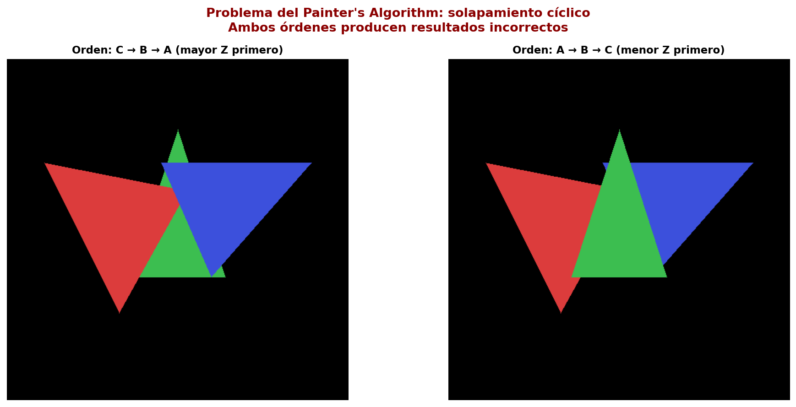
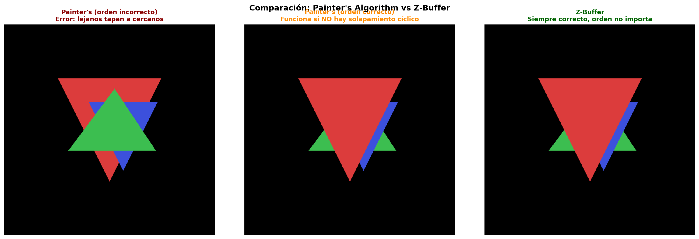
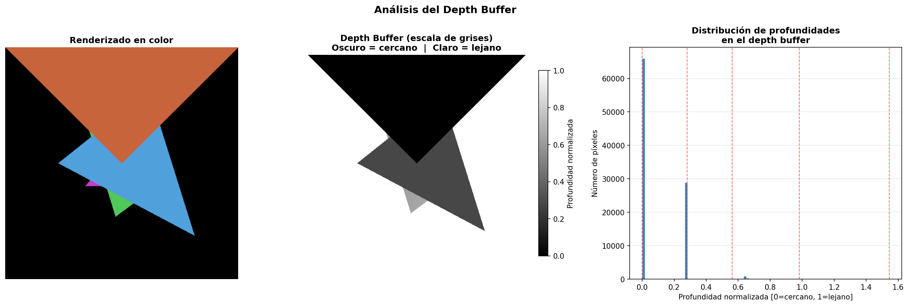
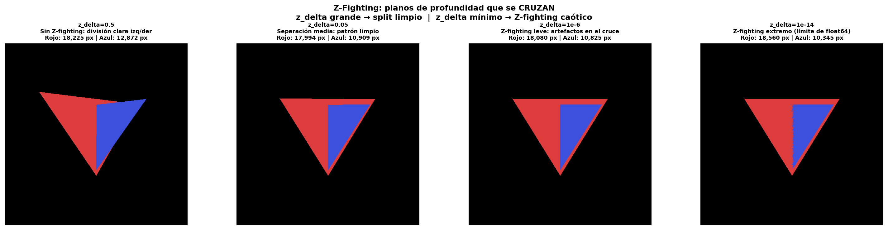
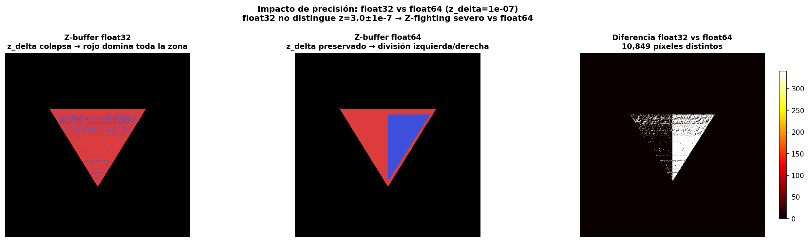

# Taller - Implementación de Z-Buffer y Depth Testing

## Integrantes

- Juan David Buitrago Salazar
- Juan David Cardenas Galvis
- Nicolás Rodríguez Piraban
- Camilo Andres Medina Sanchez
- Juan Felipe Fajardo Garzón

**Fecha de entrega:**  09/03/2026

## Descripción breve: 

Este taller busca explorar y entender el comportamiento del Z-buffer dentro del proceso de renderezado 3D, así como observar diferentes problemas que puede aparecer durante el uso de este

## Implementaciones

### Python

Se desarrollaron dos notebooks en Python usando únicamente `numpy`, `matplotlib` y `PIL`, sin librerías 3D externas, implementando el pipeline gráfico desde cero.

**Notebook 1 — Painter's Algorithm vs Z-Buffer:**
Se implementó una proyección perspectiva 3D→2D y un rasterizador de triángulos usando coordenadas baricéntricas (función de arista). Primero se renderizó la escena con el **Painter's Algorithm**, ordenando los triángulos por su Z promedio de mayor a menor. Se demostró su falla fundamental con una escena de solapamiento cíclico donde ningún orden de pintado produce una imagen correcta. Luego se implementó el **Z-buffer desde cero**: un arreglo `float64` inicializado en `+∞` donde, por cada píxel, se interpola la profundidad Z con las coordenadas baricéntricas y se actualiza solo si el nuevo fragmento es más cercano que el almacenado.

**Notebook 2 — Visualización del Depth Buffer y Precisión:**
Se creó una escena con cinco triángulos a distintas profundidades para visualizar el depth buffer normalizado en escala de grises y con diferentes colormaps (gray, viridis, jet). Se analizó la distribución no lineal de la precisión NDC según el rango near/far, cuantificando el error de reconstrucción con 24 bits. Se simuló **Z-fighting** con dos triángulos inclinados en sentido opuesto que se cruzan, mostrando la progresión de artefactos desde separaciones grandes hasta el límite de `float64`. Finalmente, se comparó `float32` vs `float64`: con `z_delta=1e-7` (por debajo del ULP de `float32` en z=3.0 ≈ 2.38e-7), el buffer de precisión simple colapsa ambas profundidades al mismo valor, produciendo miles de píxeles incorrectos respecto al resultado de `float64`.

### Unity:

Inicialmente se creó una escena con 2 cubos y 3 esferas solapadas (misma forma, coordenadas y escala) en 2 puntos diferentes de la misma, a estos objetos se le añadió un shader personalizado que les da un aspecto brillante para visualizar su profundidad en la escena, este brillo se encuentra configurado en función de los planos near y far de la cámara, por lo que cambiar las características de estos incide directamente en el "brillo" de los objetos que poseen el material con el shader; se implementaron sliders en el UI con el fin de modificar los planos más fácilmente.

Posteriormente, se añadió rotación a la cámara (usando un slider) con el fin de observar el z-fighting que ocurre cuando hay 2 objetos solapados.

Finalmente, con el fin de comparar el buffer lineal con el no lineal, se creó un material diferente que usa el mismo shader que antes, pero con un buffer no linel, esta material se agregó a uno de los 2 cubos solapados, por lo que en escena quedó un cubo usando buffer lineal y el otro haciendo uso del buffer no lineal; el comportamiento de estos se mantuvo, sin embargo, el cubo con el nuevo matrial perdió ese "brillo" blanco

### Three.js

Se implementó una escena 3D básica con una cámara de tipo PerspectiveCamara.
Se añadieron 5 cubos en diferentes posiciones en el eje Z para observar cómo
el pipeline de renderizado determina qué fragmentos son visibles.

## Resultados visuales

### Python

El siguiente resultado muestra el fallo del Painter's Algorithm con solapamiento cíclico. Ambos órdenes de pintado (de mayor Z a menor Z y viceversa) producen imágenes incorrectas, ya que no existe ningún orden global válido para triángulos que se solapan cíclicamente.



La comparación lado a lado evidencia la diferencia clave entre métodos. El Painter en orden incorrecto tapa objetos cercanos con lejanos; el Painter correcto funciona para esta escena simple; el Z-buffer produce siempre el resultado correcto independientemente del orden de renderizado.



La visualización del depth buffer muestra el renderizado en color junto con el buffer de profundidad en escala de grises (oscuro = cercano, claro = lejano) y el histograma de distribución de profundidades con marcadores para cada triángulo de la escena.



La simulación de Z-fighting con planos cruzados muestra la progresión de artefactos: con `z_delta=0.5` hay una división limpia izquierda/derecha; al reducir el delta el patrón se vuelve cada vez más caótico hasta que con `z_delta=1e-14` el Z-fighting es extremo (límite de `float64`).



La comparación de precisión entre `float32` y `float64` demuestra que con `z_delta=1e-7` (inferior al ULP de `float32` en z=3.0), el buffer de 32 bits no distingue las dos profundidades y el primer triángulo pintado (rojo) domina toda la zona. El `float64` sí preserva la diferencia, produciendo la división correcta izquierda/derecha. El mapa de diferencias muestra los miles de píxeles que divergen entre ambas precisiones.



### Unity:

En la siguiente animación se puede observar como los objetos que hacen uso del shader se ven influenciados por el far plane de la cámara, cuanto mayor sea el valor de este plano, más intenso será el "brillo" que desprenden los objetos


Ahora, con ayuda de los controles de rotación se puede evidenciar el z-fighting entre los 2 cubos solapados, esto ocurre porque el motor no sabe de cual objeto debe renderizar la cara, dando como resultado ese "parpadeo" que representa el solapamiento entre objetos.

Como solución a este problema se puede generar una ligera diferencia entre las posiciones de los objetos, del orden de 0.00001, de esta forma las caras no van a estar solapadas y no va a ocurrir este problema


Finalmente, le agregamos el nuevo material al otro cubo solapado, en la siguiente animación se ve claramente la diferencia entre materiales, el material "lineal" posee ese brillo blanco, mientras que el material "no lineal" representa la profundidad con una escala de grises; ambos materiales son sensibles a los cambios en los planos de la cámara


### Three.js


Esta imágen muestra la escena 3D creada. La escena está compuesta por 5 cubos de
diferentes colores y un sistema de ejes como referencia.


Este GIF muestra como, al desactivar el Z-Buffer, la visualización de los objetos
cambia, mostrando como se dibujan los objetos en el orden en que se establece en
el código, dibujando elementos que no se deberían ver al estar detras de otros.

## Código relevante

### Python

El siguiente fragmento es el núcleo del Z-buffer: para cada píxel dentro del triángulo se interpolan las coordenadas baricéntricas, se calcula la profundidad Z del fragmento y se compara con el valor almacenado, actualizando solo si es más cercano.

```python
lam0 = w0 / area
lam1 = w1 / area
lam2 = w2 / area

z_interp = lam0 * z0 + lam1 * z1 + lam2 * z2

if z_interp < depth_buffer[y, x]:
    depth_buffer[y, x] = z_interp
    color_buffer[y, x] = color
```

El siguiente fragmento normaliza el depth buffer al rango `[0, 1]` para su visualización, asignando blanco (`1.0`) a los píxeles sin geometría (valor `+∞`).

```python
def normalize_depth_buffer(depth_buffer):
    db_vis = depth_buffer.copy()
    valid_mask = np.isfinite(db_vis)
    z_min = db_vis[valid_mask].min()
    z_max = db_vis[valid_mask].max()
    db_vis[valid_mask] = (db_vis[valid_mask] - z_min) / (z_max - z_min + 1e-10)
    db_vis[~valid_mask] = 1.0  # fondo sin geometría → blanco
    return db_vis
```

### Unity:

El siguiente fragmento de código de encarga de intercambiar entre el modo "lineal" y el "no lineal" de los materiales, de esta forma para uno se aplica el shader dado (el que contiene brillo) o el de escala de grises

```cs
half4 frag(Varyings IN) : SV_Target {
    float depth;

    if (_UseLinear > 0.5) {
        depth = IN.positionCS.w / _ProjectionParams.z;
    }
    else {
        depth = UNITY_Z_0_FAR_FROM_CLIPSPACE(IN.positionCS.z);
    }

    return float4(depth, depth, depth, 1.0);
}
```

### Three.js

```js
const depthMaterial = new THREE.ShaderMaterial({
  vertexShader: `
    void main() {
      gl_Position = projectionMatrix *
                    modelViewMatrix *
                    vec4(position, 1.0);
    }
  `,
  fragmentShader: `
    void main() {
      float depth = gl_FragCoord.z;
      depth = pow(depth, 20.0); // exagera diferencias
      vec3 color = vec3(1.0, 0.4, 0.2);
      gl_FragColor = vec4(color * depth, 1.0);
    }
  `,
  depthTest: true,
  depthWrite: true
});
```

Este fragmento de código es el que se encarga de crear el depth material para aplicarlo
a los objetos de la escena.

## Prompts utilizados

**Python:**
- Simula Z-fighting entre dos triángulos con planos de profundidad cruzados y compara el resultado usando float32 vs float64, mostrando cómo la pérdida de precisión produce artefactos visuales

**Unity:**
Genera un Script en C# que permita comparar entre el buffer lineal y el no lineal aplicando un shader a un material

## Aprendizajes y dificultades

**Python:**
La principal dificultad fue lograr que el Z-fighting fuera visualmente evidente. Con triángulos paralelos el resultado siempre era determinista, por lo que fue necesario usar planos cruzados (inclinados en sentido opuesto) para que la zona de ambigüedad fuera real. Además, demostrar la diferencia entre `float32` y `float64` requirió ajustar `z_delta` por debajo del ULP de `float32` en el valor de z usado, de lo contrario ambas precisiones producían resultados idénticos.

**Unity:**
La principal dificultad fue la implementación y el uso de las variables en la creación del shader, puesto que algunas veces existían errores en la compilación debido al incoherencias dentro de estas variables

## Contribuciones del grupo
