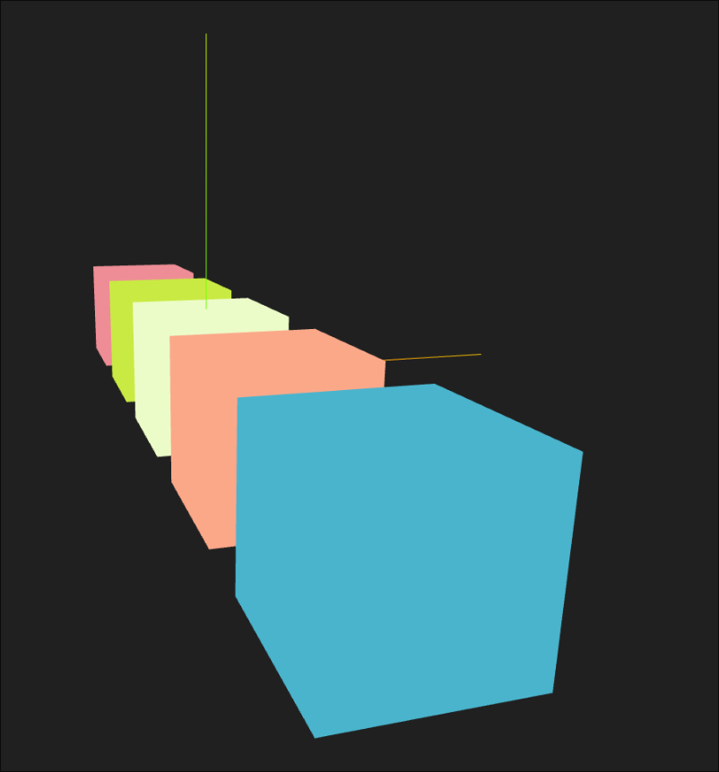
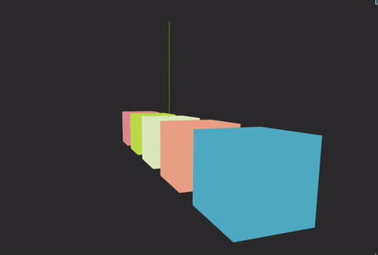

# Taller - Implementación de Z-Buffer y Depth Testing

## Integrantes

- Juan David Buitrago Salazar
- Juan David Cardenas Galvis
- Nicolás Rodríguez Piraban
- Camilo Andres Medina Sanchez
- Juan Felipe Fajardo Garzón

**Fecha de entrega:**  09/03/2026

## Descripción breve: 

Este taller busca explorar y entender el comportamiento del Z-buffer dentro del proceso de renderezado 3D, así como observar diferentes problemas que puede aparecer durante el uso de este

## Implementaciones

### Python

### Unity:

Inicialmente se creó una escena con 2 cubos y 3 esferas solapadas (misma forma, coordenadas y escala) en 2 puntos diferentes de la misma, a estos objetos se le añadió un shader personalizado que les da un aspecto brillante para visualizar su profundidad en la escena, este brillo se encuentra configurado en función de los planos near y far de la cámara, por lo que cambiar las características de estos incide directamente en el "brillo" de los objetos que poseen el material con el shader; se implementaron sliders en el UI con el fin de modificar los planos más fácilmente.

Posteriormente, se añadió rotación a la cámara (usando un slider) con el fin de observar el z-fighting que ocurre cuando hay 2 objetos solapados.

Finalmente, con el fin de comparar el buffer lineal con el no lineal, se creó un material diferente que usa el mismo shader que antes, pero con un buffer no linel, esta material se agregó a uno de los 2 cubos solapados, por lo que en escena quedó un cubo usando buffer lineal y el otro haciendo uso del buffer no lineal; el comportamiento de estos se mantuvo, sin embargo, el cubo con el nuevo matrial perdió ese "brillo" blanco

### Three.js

Se implementó una escena 3D básica con una cámara de tipo PerspectiveCamara.
Se añadieron 5 cubos en diferentes posiciones en el eje Z para observar cómo
el pipeline de renderizado determina qué fragmentos son visibles.

## Resultados visuales

### Python

### Unity:

En la siguiente animación se puede observar como los objetos que hacen uso del shader se ven influenciados por el far plane de la cámara, cuanto mayor sea el valor de este plano, más intenso será el "brillo" que desprenden los objetos


Ahora, con ayuda de los controles de rotación se puede evidenciar el z-fighting entre los 2 cubos solapados, esto ocurre porque el motor no sabe de cual objeto debe renderizar la cara, dando como resultado ese "parpadeo" que representa el solapamiento entre objetos.

Como solución a este problema se puede generar una ligera diferencia entre las posiciones de los objetos, del orden de 0.00001, de esta forma las caras no van a estar solapadas y no va a ocurrir este problema


Finalmente, le agregamos el nuevo material al otro cubo solapado, en la siguiente animación se ve claramente la diferencia entre materiales, el material "lineal" posee ese brillo blanco, mientras que el material "no lineal" representa la profundidad con una escala de grises; ambos materiales son sensibles a los cambios en los planos de la cámara


### Three.js



Esta imágen muestra la escena 3D creada. La escena está compuesta por 5 cubos de
diferentes colores y un sistema de ejes como referencia.



Este GIF muestra como, al desactivar el Z-Buffer, la visualización de los objetos
cambia, mostrando como se dibujan los objetos en el orden en que se establece en
el código, dibujando elementos que no se deberían ver al estar detras de otros.

## Código relevante

### Python

### Unity:

El siguiente fragmento de código de encarga de intercambiar entre el modo "lineal" y el "no lineal" de los materiales, de esta forma para uno se aplica el shader dado (el que contiene brillo) o el de escala de grises

```cs
half4 frag(Varyings IN) : SV_Target {
    float depth;

    if (_UseLinear > 0.5) {
        depth = IN.positionCS.w / _ProjectionParams.z;
    }
    else {
        depth = UNITY_Z_0_FAR_FROM_CLIPSPACE(IN.positionCS.z);
    }

    return float4(depth, depth, depth, 1.0);
}
```

### Three.js

```js
const depthMaterial = new THREE.ShaderMaterial({
  vertexShader: `
    void main() {
      gl_Position = projectionMatrix *
                    modelViewMatrix *
                    vec4(position, 1.0);
    }
  `,
  fragmentShader: `
    void main() {
      float depth = gl_FragCoord.z;
      depth = pow(depth, 20.0); // exagera diferencias
      vec3 color = vec3(1.0, 0.4, 0.2);
      gl_FragColor = vec4(color * depth, 1.0);
    }
  `,
  depthTest: true,
  depthWrite: true
});
```

Este fragmento de código es el que se encarga de crear el depth material para aplicarlo
a los objetos de la escena.

## Prompts utilizados

Genera un Script en C# que permita comparar entre el buffer lineal y el no lineal aplicando un shader a un material

## Aprendizajes y dificultades

La principal dificultad fue la implementación y el uso de las variables en la creación del shader, puesto que algunas veces existían errores en la compilación debido al incoherencias dentro de estas variables

## Contribuciones del grupo
