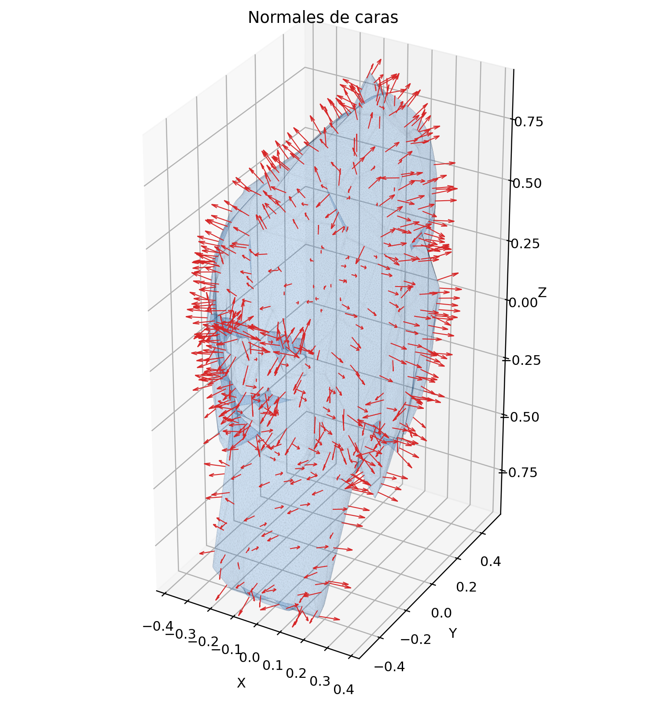
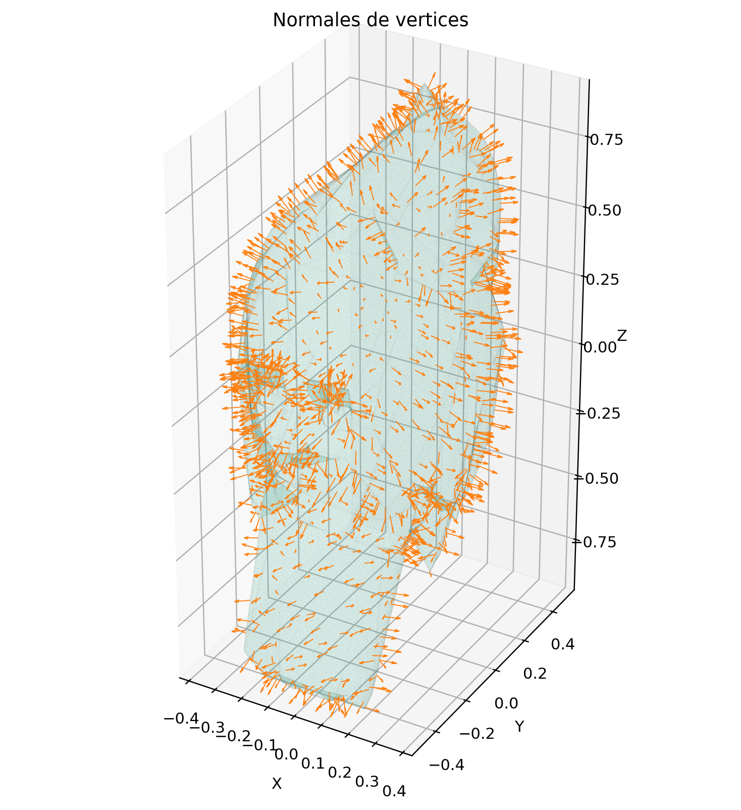
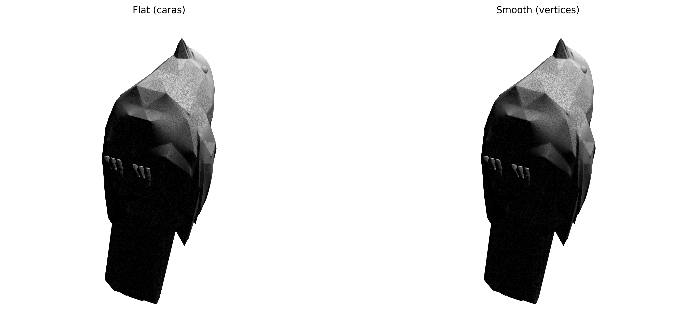
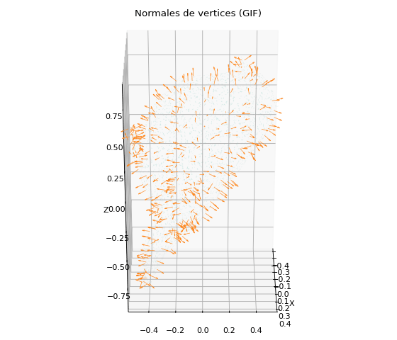
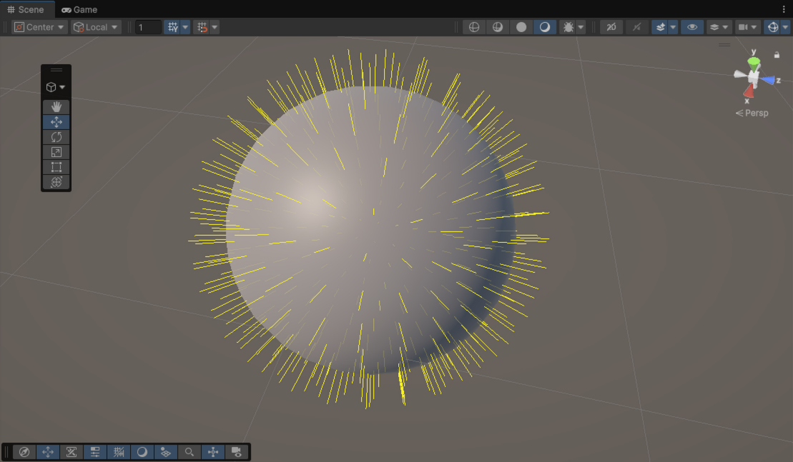
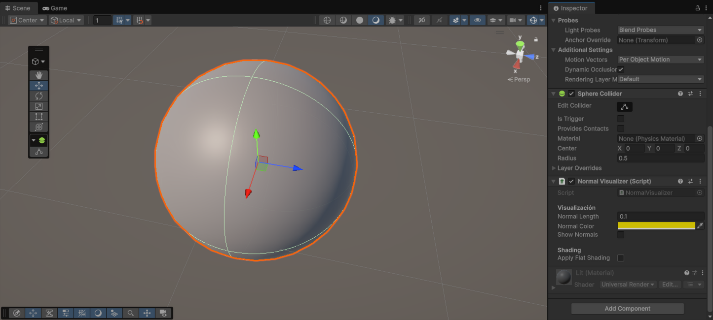
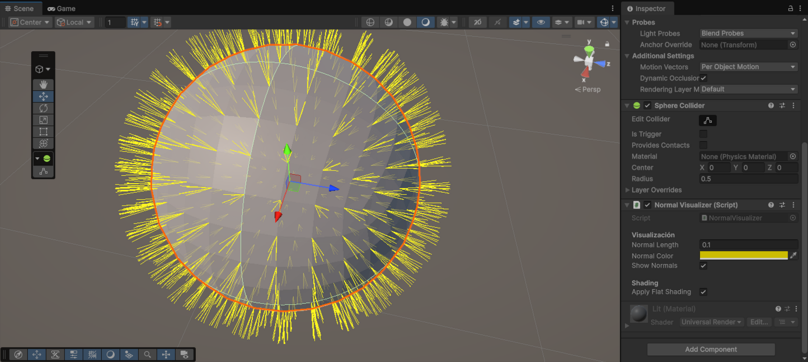
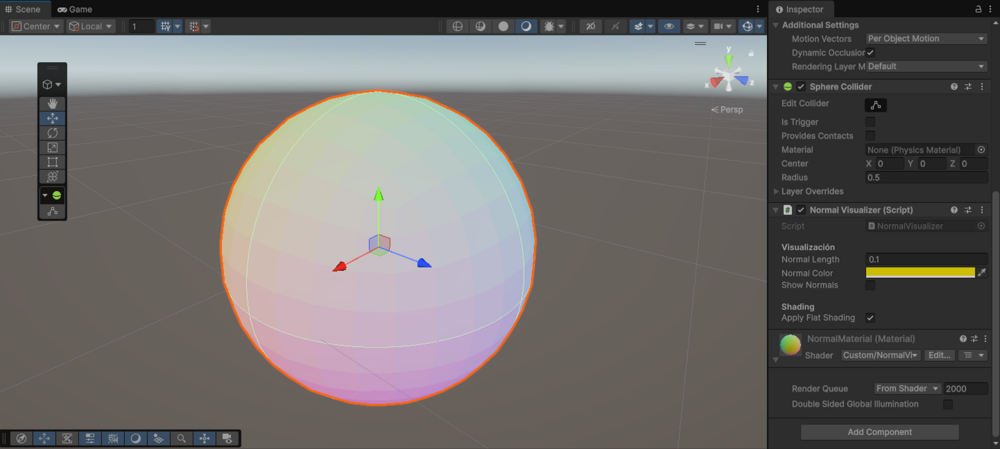

# Taller - Cálculo y Visualización de Normales

## Integrantes

- Juan David Buitrago Salazar
- Juan David Cardenas Galvis
- Juan Felipe Fajardo Garzon
- Camilo Andres Medina Sanchez
- Nicolas Rodriguez Piraban

## Fecha de entrega

`2026-03-08`

---

## Descripción breve

En este taller se abordó el cálculo y la visualización de normales en superficies 3D,
con énfasis en su papel dentro de la iluminación y del sombreado geométrico. El trabajo
permitió estudiar la diferencia entre normales por cara y normales por vértice,
verificar su orientación y comparar el comportamiento visual de los enfoques flat
shading y smooth shading.

La implementación desarrollada en este repositorio se realizó en Python, Unity y
Three.js, tomando como referencia un modelo 3D en formato GLTF y escenas de prueba para
comparar distintas formas de cálculo, inspección y uso de normales. En Python se
calcularon manualmente las normales, se contrastaron con las generadas por `trimesh` y
se produjeron visualizaciones para validar su magnitud y orientación. En Unity se
construyó una escena para inspeccionar normales sobre una malla, alternar entre flat y
smooth shading, y representar la dirección normal mediante un shader basado en color.
En Three.js se integró una escena con un cubo y una esfera para evidenciar el papel de
las normales tanto en la respuesta a la iluminación como en la codificación cromática de
la superficie según su orientación.

---

## Implementaciones

### Python

La implementación en Python se desarrolló en el notebook
`python/calculo_visualizacion_normales.ipynb`, utilizando `numpy`, `trimesh` y
`matplotlib`. El flujo de trabajo parte de la carga del modelo
`low_poly_geometric_songbird_parus_major/scene.gltf`, luego triangula la malla cuando es
necesario y calcula las normales de cara mediante producto cruz entre aristas del
triángulo.

Posteriormente, las normales de vértice se obtienen a partir del promedio de las
normales de las caras adyacentes. El notebook compara los resultados manuales con
`mesh.face_normals` y `mesh.vertex_normals`, evalúa magnitud unitaria, detecta normales
invertidas y genera una comparación visual entre flat shading y smooth shading. Como
resultado, se obtuvo una validación cuantitativa y visual del comportamiento geométrico
de las normales sobre el modelo utilizado.

### Unity

La implementación en Unity se desarrolló en el proyecto `unity/normals_study`. En la
escena principal se trabajó con una esfera a la que se le añadió el script
`NormalVisualizer.cs`, encargado de clonar la malla, acceder a sus vértices, triángulos
y normales, y ofrecer una visualización directa mediante Gizmos.

Además de dibujar las normales en tiempo de edición, el script permite alternar entre
smooth shading y flat shading. Para producir el sombreado plano se reconstruye la malla
duplicando vértices por triángulo, lo que evita compartir normales entre caras. Como
complemento, se creó el shader `NormalVisualization.shader`, que transforma la dirección
de la normal desde el rango `[-1, 1]` al rango de color `[0, 1]`, permitiendo inspección
visual inmediata de la orientación de la superficie.

### Three.js

En Three.js se implementó una escena 3D con dos elementos, un cubo y una esfera. Para
el cubo se calcularon los vectores normales y se utilizó una fuente de iluminación en la
escena para observar cómo intervienen estas normales en la iluminación del objeto. Para
la esfera se creó un material que utiliza la dirección de los vectores normales para
asignar un color a cada punto de la superficie.

---

## Resultados visuales

### Python



Visualización de normales de cara sobre el modelo 3D. Las flechas permiten comprobar la
dirección general de las normales calculadas manualmente para cada triángulo.



Visualización de normales de vértice obtenidas a partir del promedio de las caras
adyacentes. La distribución es más suave y continua que en el caso por cara.



Comparación lado a lado entre flat shading y smooth shading. La imagen evidencia cómo el
uso de una normal por cara resalta facetas, mientras que el promedio por vértice genera
transiciones de iluminación más suaves.



Animación del modelo con visualización semitransparente, útil para inspeccionar la
orientación espacial de las normales y la densidad del muestreo sobre la malla.

### Unity



Visualización de normales con Gizmos sobre la esfera de la escena. Esta evidencia
muestra el uso del script `NormalVisualizer` para dibujar líneas en la dirección de cada
normal almacenada en la malla.



Resultado del modelo bajo smooth shading. La iluminación se distribuye de forma continua
gracias al uso compartido de normales entre vértices vecinos.



Resultado del modelo bajo flat shading. Al duplicar vértices por triángulo, cada cara
conserva una normal independiente y se hacen visibles las facetas de la geometría.



Visualización de normales mediante shader. El color codifica la dirección de la normal
en espacio de mundo, facilitando la detección de cambios de orientación sobre la
superficie.

### Three.js


Esta imagen muestra el cubo creado para la escena 3D. Se calcularon los vectores
normales en las esquinas del cubo, representados con líneas rojas para evidenciar su
dirección.


Este GIF muestra cómo la dirección de la luz afecta al color del cubo, iluminando solo
algunas caras de acuerdo con la orientación de sus normales.


Esta imagen muestra el segundo objeto de la escena, una esfera con un material que
colorea la superficie según la dirección de sus vectores normales.

---

## Código relevante

### Python

```python
def normalize_rows(v):
    n = np.linalg.norm(v, axis=1, keepdims=True)
    n[n == 0] = 1
    return v / n

def face_normals_manual(vertices, faces):
    tri = vertices[faces]
    v1 = tri[:, 1] - tri[:, 0]
    v2 = tri[:, 2] - tri[:, 0]
    normals = np.cross(v1, v2)
    return normalize_rows(normals)

def vertex_normals_from_faces(vertices, faces, face_normals):
    v_normals = np.zeros_like(vertices, dtype=float)
    for i, face in enumerate(faces):
        v_normals[face] += face_normals[i]
    return normalize_rows(v_normals)
```

Este fragmento resume el núcleo de la implementación en Python: primero se calculan las
normales por cara usando el producto cruz y luego se construyen las normales por
vértice mediante acumulación y normalización de las caras adyacentes.

### Unity

```csharp
void ApplyFlat()
{
    Vector3[] newVerts = new Vector3[originalTriangles.Length];
    int[] newTris = new int[originalTriangles.Length];

    for (int i = 0; i < originalTriangles.Length; i++)
    {
        newVerts[i] = originalVertices[originalTriangles[i]];
        newTris[i] = i;
    }

    workingMesh.Clear();
    workingMesh.vertices = newVerts;
    workingMesh.triangles = newTris;
    workingMesh.RecalculateNormals();
}

void OnDrawGizmos()
{
    if (!showNormals) return;

    Mesh m = GetComponent<MeshFilter>().sharedMesh;
    Vector3[] vertices = m.vertices;
    Vector3[] normals = m.normals;

    for (int i = 0; i < vertices.Length; i++)
    {
        Vector3 worldPos = transform.TransformPoint(vertices[i]);
        Vector3 worldNormal = transform.TransformDirection(normals[i]);
        Gizmos.DrawLine(worldPos, worldPos + worldNormal * normalLength);
    }
}
```

En Unity, este fragmento muestra dos componentes esenciales del taller: la generación
de flat shading al separar vértices por triángulo y la visualización de las normales en
escena mediante Gizmos.

### Three.js

```jsx
for (let i = 0; i < position.count; i += 3) {
  const a = new THREE.Vector3().fromBufferAttribute(position, i)
  const b = new THREE.Vector3().fromBufferAttribute(position, i + 1)
  const c = new THREE.Vector3().fromBufferAttribute(position, i + 2)

  const cb = new THREE.Vector3().subVectors(c, b)
  const ab = new THREE.Vector3().subVectors(a, b)
  const normal = new THREE.Vector3().crossVectors(cb, ab).normalize()

  for (let j = 0; j < 3; j++) {
    normals[(i + j) * 3 + 0] = normal.x
    normals[(i + j) * 3 + 1] = normal.y
    normals[(i + j) * 3 + 2] = normal.z
  }
}
```

Este fragmento corresponde al cálculo de normales realizado en la implementación de
Three.js para asignar una normal consistente a cada triángulo de la geometría.

---

## Prompts utilizados

Los siguientes prompts representan consultas que se emplearon como apoyo durante
el desarrollo del taller, especialmente para orientar la implementación, validar
conceptos y estructurar algunas partes de la solución en los distintos entornos:

```text
Crea un notebook en Python para calcular y visualizar normales de una malla 3D cargada
desde un archivo GLTF usando trimesh, numpy y matplotlib. Necesito: calcular normales de
caras con producto cruz, calcular normales de vértices promediando caras adyacentes,
comparar los resultados con mesh.face_normals y mesh.vertex_normals, verificar magnitud
unitaria, detectar normales invertidas y generar imágenes de las normales como flechas
sobre el modelo.
```

```text
Genera en Python una comparación visual entre flat shading y smooth shading para una
malla triangulada. Usa una dirección de luz fija, calcula la intensidad por cara y por
vértice, renderiza ambas versiones lado a lado con matplotlib y explica brevemente la
diferencia visual entre facetas marcadas y transiciones suaves.
```

```text
Ayúdame a crear un script en Unity C# para visualizar normales de una malla. El script
debe clonar el mesh original, dibujar normales con Gizmos, permitir alternar entre
smooth shading y flat shading desde el Inspector, y reconstruir la geometría duplicando
vértices por triángulo cuando se active flat shading.
```

```text
Escribe un shader básico para Unity que visualice las normales de una superficie como
color. La normal debe transformarse a espacio de mundo y mapearse del rango [-1, 1] al
rango [0, 1] para que cada componente RGB represente la dirección de la normal.
```

```text
Genera una escena en Three.js con un cubo y una esfera para estudiar normales. En el
cubo quiero calcular manualmente las normales por triángulo y visualizar cómo afectan la
iluminación; en la esfera quiero un material o shader que coloree la superficie según la
dirección de la normal. Incluye controles básicos de cámara y una luz direccional.
```

```text
Redacta un README académico para un taller de gráficos por computador sobre cálculo y
visualización de normales. Debe incluir descripción breve, implementaciones en Python,
Unity y Three.js, resultados visuales, código relevante, prompts utilizados,
aprendizajes, dificultades, contribuciones grupales y referencias, con tono formal y
basado en evidencia técnica.
```

---

## Aprendizajes y dificultades

### Aprendizajes

Este taller permitió reforzar la relación entre geometría y sombreado en gráficos 3D.
Fue especialmente valioso comprobar que una normal no es solo un vector auxiliar, sino
un dato fundamental para la iluminación, la lectura visual de la forma y la depuración
de mallas. También quedó más claro por qué el flat shading enfatiza la estructura
poligonal, mientras que el smooth shading busca continuidad visual entre caras vecinas.

Desde la práctica, el ejercicio ayudó a consolidar el uso de herramientas distintas para
un mismo concepto. En Python se privilegió el análisis numérico y la validación
geométrica; en Unity, la inspección interactiva y la visualización en tiempo real. Esa
complementariedad permitió entender el problema tanto desde la formulación matemática
como desde su efecto perceptual en una escena renderizada.

### Dificultades

Uno de los puntos más delicados fue verificar que las normales calculadas manualmente
tuvieran orientación coherente y magnitud unitaria. No basta con obtener el producto
cruz: también es necesario revisar el orden de los vértices, contrastar los resultados
con una referencia confiable y corregir casos invertidos cuando la orientación no apunta
hacia el exterior de la superficie.

En Unity, la principal dificultad consistió en diferenciar claramente el comportamiento
entre smooth y flat shading sin alterar de manera destructiva la malla original. La
solución consistió en clonar la geometría, conservar sus datos base y reconstruir la
malla cuando se requiere shading plano, lo que hizo posible alternar entre ambas
representaciones de forma controlada.

### Mejoras futuras

Como trabajo futuro, sería valioso extender la validación a modelos con topologías más
complejas, incorporar visualización interactiva de normales de cara y de vértice en el
notebook, y añadir en Unity una interfaz simple para activar materiales, escalas de
visualización y modos de depuración sin depender únicamente del inspector.

---

## Contribuciones grupales

El desarrollo de los talleres de la Semana 03 se consolidó mediante aportes
complementarios de todos los integrantes del equipo. En particular, para este bloque de
trabajo cada integrante contribuyó desde distintos entornos y subtemas de la serie:

- Juan David Buitrago Salazar realizó aportes en el Taller 3.3, tanto en la
  implementación en Unity como en la implementación en Python.
- Juan David Cardenas Galvis contribuyó al desarrollo del Taller 3.2 en Python.
- Juan Felipe Fajardo Garzon participó en el Taller 3.2 en Unity y en el Taller 3.4 en
  Three.js.
- Camilo Andres Medina Sanchez realizó aportes en el Taller 3.1 en Python y en el
  Taller 3.4 en Unity.
- Nicolas Rodriguez Piraban contribuyó en Three.js a los Talleres 3.2 y 3.3.

---

## Estructura del proyecto

```text
semana_03_3_calculo_visualizacion_normales/
├── python/
│   └── calculo_visualizacion_normales.ipynb
├── unity/
│   └── normals_study/
├── threejs/
├── media/
└── README.md
```

---

## Referencias

- Documentación de trimesh: https://trimesh.org/
- Documentación de Unity sobre Mesh y normales: https://docs.unity3d.com/ScriptReference/Mesh.html
- Manual de shaders en Unity: https://docs.unity3d.com/Manual/Shaders.html
- Documentación de Three.js: https://threejs.org/docs/
- "Low Poly Geometric Songbird Parus major" (https://skfb.ly/pH8OT) by algorin94 is licensed under Creative Commons Attribution-NonCommercial (http://creativecommons.org/licenses/by-nc/4.0/).
