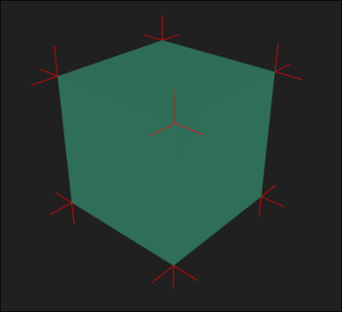
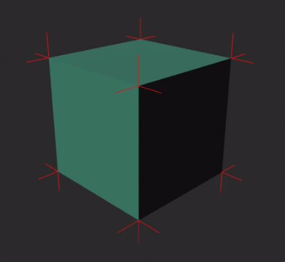
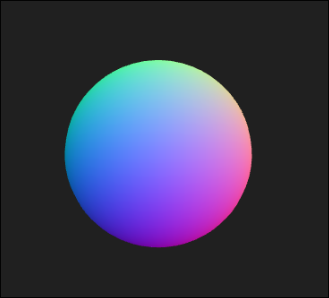

# Taller - Cálculo y Visualización de Normales

## Integrantes

- Juan David Buitrago Salazar
- Juan David Cardenas Galvis
- Nicolás Rodríguez Piraban
- Camilo Andres Medina Sanchezy
- Juan Felipe Fajardo Garzón

**Fecha de entrega:**  09/03/2026

## Descripción breve

## Implementaciones

### Python

### Unity

### Three.js

Se implementó una escena 3D con dos elementos, un cubo y una esfera. Para el cubo se
calcularon los vectores normales y se utilizó una fuente de iluminación en la escena
para observar como se utilizan las normales en la iluminación del objeto. Para la
esfera, se creo un material que utliza la dirección de los vectores normales para
asignar un color a ese punto del material.

## Resultados visuales

### Python

### Unity

### Three.js



Esta imágen muestra el cubo creado para la escena 3D. Se calcularon los vectores
normales en las esquinas del cubo, que son las lineas rojas que se observan.



Este GIF muestra como la dirección de la luz afecta al color del cubo, iluminando
solo algunas caras del cubo yno toda la figura.



Esta imágen muestra el segundo objeto de la escena. Esta tiene un material distinto.
Los colores que se muestran dependen de la dirección de los vectores normales calculados
de la esfera.

## Código relevante

### Python

### Unity

### Three.js

```jsx
for (let i = 0; i < position.count; i += 3) {
    const a = new THREE.Vector3().fromBufferAttribute(position, i)
    const b = new THREE.Vector3().fromBufferAttribute(position, i + 1)
    const c = new THREE.Vector3().fromBufferAttribute(position, i + 2)

    const cb = new THREE.Vector3().subVectors(c, b)
    const ab = new THREE.Vector3().subVectors(a, b)
    const normal = new THREE.Vector3().crossVectors(cb, ab).normalize()

    for (let j = 0; j < 3; j++) {
      normals[(i + j) * 3 + 0] = normal.x
      normals[(i + j) * 3 + 1] = normal.y
      normals[(i + j) * 3 + 2] = normal.z
    }
  } 
```

Este fragmento de código es el que se encarga de calcular las normales de las
figuras.

## Aprendizajes y dificultades

## Contribuciones del grupo
