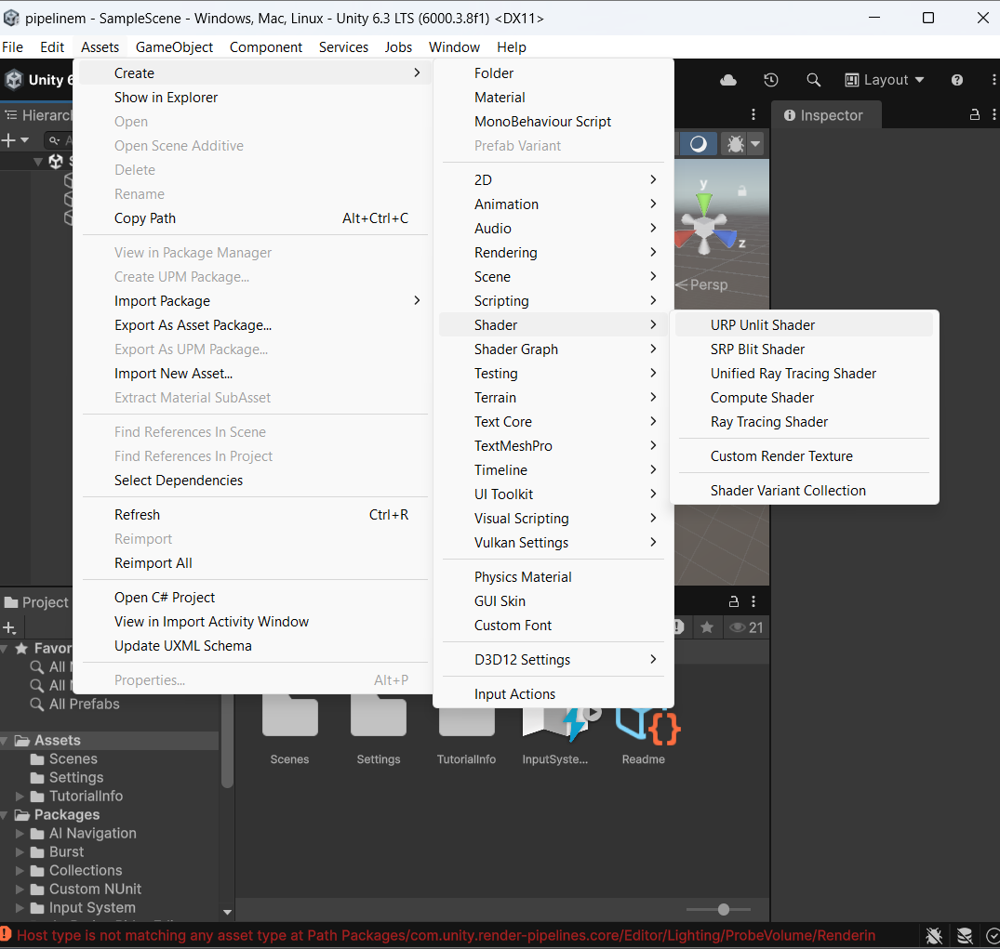
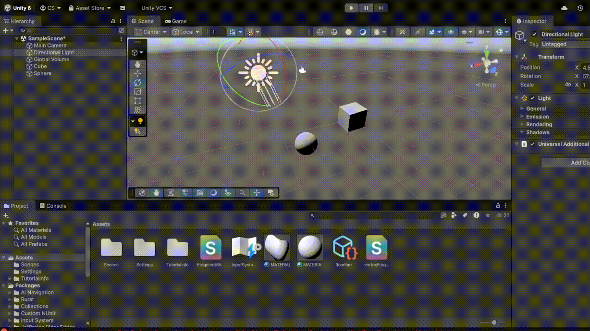

# Taller - Etapas del Pipeline Programable
## Integrantes
- Juan David Buitrago Salazar
- Juan David Cardenas Galvis
- Nicolás Rodríguez Piraban
- Camilo Andres Medina Sanchez
- Juan Felipe Fajardo Garzón

**Fecha de entrega:**  09/03/2026

## Descripción breve: 

En este taller se buscaba comprender el funcionamiento de las diferentes etapas de pipeline, y con base en esto, crear shaders con código personalizado

## Implementaciones: 

### Unity:

En primera instancia se solicita un vertex shader que aplique transformaciones personalizadas a un objeto 3d.
Para esto se debe crear un shadow y asignarlo a un material, a continuación [se referencian la creación de estos objetos y el resultado final de la aplicación sobre un objeto 3d](#vertex_shader). Además, se ve el código del [shader.](#vertex_shader_code)

Ahora bien, al aplicar el Fragment Shader, los objetos de la escena presentan los siguientes cambios visuales y de comportamiento:

1. El color del objeto se calcula por píxel

    Antes, el objeto simplemente mostraba la textura multiplicada por un color base.
    Ahora, cada píxel del objeto calcula su color en función de la iluminación de la escena.
    Esto significa que el objeto ya no tiene un color plano, sino que su apariencia depende de la orientación de la superficie respecto a la luz.

2. El objeto responde a la iluminación de la escena

    Las superficies que apuntan hacia la luz se ven más iluminadas.
    Las superficies inclinadas respecto a la luz reciben menos iluminación.
    Las superficies opuestas a la luz se ven más oscuras.
    Esto produce un sombreado que da mayor percepción de volumen al objeto.

3. La textura ahora se combina con la iluminación

    La textura del objeto sigue siendo visible, pero ahora su color se modula según la intensidad de la luz.
    Esto genera que: La textura se vea más brillante en las zonas iluminadas.
    La textura se vea más oscura en las zonas en sombra.

4. El objeto cambia de apariencia si se mueve la luz

    Si se cambia la posición o dirección de la luz en la escena, el sombreado del objeto cambia dinámicamente.
    Esto demuestra que el color final se calcula en tiempo real usando la dirección de la luz y la normal de la superficie.

Los siguiente numerales, se pueden ver en la siguiente [animación.](#fragment_shader)


### Three.js:

Inicialmente se creó y configuró la escena dentro de Three.Js, inicializando también la cámara y el renderizador; posteriormete se creó una geometría de esfera y un shader personalizado haciendo uso de los fragmentos de código proporcionados en el taller (vertex shader para geometría y fragment shader para apariencia), para luego aplicarlos a una malla y añadir el objeto a nuestra escena, iniciando de esta forma la animación.

Una vez hecha la "base" se procedió a modificar el código del shader con el fin de aplicar los efectos avanzados a la malla (Fresnel effect, Rim lighting, Procedural noise, Animaciones con uniforms y Post-processing).


## Resultados visuales:


### Unity:
<a id="vertex_shader"></a>
*Creación de una sombra para aplicar las transformaciones definidas sobre el objeto 3d a crear*



*Aplicación de un material que tenga asociado un shadow personalizado*


<a id="fragment_shader"></a>

*Aplicación de un fragment shader*



### Three.js

Usando el código dado en el taller se obtiene la siguiente animación, donde se aprecia que la geomatría de la esfera "ondula" en su contorno, por su parte, el color va variando en todas las escalas del arcoiris hasta cubrir toda el área de la esfera (en este caso solo se aprecia una parte de la misma)


Aplicando ruido procedural al código de vertex shader se evidencia como esa ondulación se vuelve practicamente aleatoria, modificando de gran manera la estructura de la esfera


Haciendo uso de uniform para modificar la estructura de la esfera se ve como se genera una animación que si bien afecta notablemente a la forma, sigue un patron sinusoidal, es decir, no es errática como el ruido procedural


Dejando de lado los vertex shaders tenemos el efecto fresnel, el cual se aplica sobre el fragment shader, este le da ese ligero brillo en los bordes del objeto (característico de cristales y agua); se usó el color azul para simular una masa de agua


Finalmente tenemos la animación generada al aplicar varios efectos juntos (Ruido procedural, animación con uniform, Efecto fresnel y viñetado) sobre la esfera


Se evidencia una ondulación que combina aleatoriedad con un patrón definido, y por parte del color, se combinan las tonalidades originales con el brillo del efecto fresnel


## Código relevante: 


### Unity:
<a id="vertex_shader_code"></a>

```
{
    Properties
    {
        [MainColor] _BaseColor("Base Color", Color) = (1, 1, 1, 1)
        [MainTexture] _BaseMap("Base Map", 2D) = "white" {}
    }

    SubShader
    {
        Tags { "RenderType" = "Opaque" "RenderPipeline" = "UniversalPipeline" }

        Pass
        {
            HLSLPROGRAM

            #pragma vertex vert
            #pragma fragment frag

            #include "Packages/com.unity.render-pipelines.universal/ShaderLibrary/Core.hlsl"

            struct Attributes
            {
                float4 positionOS : POSITION;
                float3 normalOS : NORMAL;
                float2 uv : TEXCOORD0;
            };

            struct Varyings
            {
                float4 positionHCS : SV_POSITION;
                float3 normalWS : TEXCOORD1;
                float2 uv : TEXCOORD0;
            };

            TEXTURE2D(_BaseMap);
            SAMPLER(sampler_BaseMap);

            CBUFFER_START(UnityPerMaterial)
                half4 _BaseColor;
                float4 _BaseMap_ST;
            CBUFFER_END

            Varyings vert(Attributes IN)
            {
                Varyings OUT;

                float3 pos = IN.positionOS.xyz;

                float wave = sin(_Time.y + pos.x * 5.0) * 0.2;
                pos.y += wave;

                float3 worldPos = TransformObjectToWorld(pos);
                float3 viewPos = TransformWorldToView(worldPos);
                float4 clipPos = TransformWorldToHClip(worldPos);

                OUT.positionHCS = clipPos;

                OUT.normalWS = TransformObjectToWorldNormal(IN.normalOS);

                OUT.uv = TRANSFORM_TEX(IN.uv, _BaseMap);

                return OUT;
            }

            half4 frag(Varyings IN) : SV_Target
            {
                float3 normal = normalize(IN.normalWS);

                float3 lightDir = normalize(_MainLightPosition.xyz);

                float NdotL = max(0, dot(normal, lightDir));

                half4 texColor = SAMPLE_TEXTURE2D(_BaseMap, sampler_BaseMap, IN.uv) * _BaseColor;

                float3 diffuse = texColor.rgb * NdotL;

                return half4(diffuse, 1);
            }
            ENDHLSL
        }
    }
}
```

<a id="fragment_shader_code"></a>

```
Shader "Custom/FragmentShader"
{
    Properties
    {
        [MainColor] _BaseColor("Base Color", Color) = (1, 1, 1, 1)
        [MainTexture] _BaseMap("Base Map", 2D) = "white" {}
    }

    SubShader
    {
        Tags { "RenderType" = "Opaque" "RenderPipeline" = "UniversalPipeline" }

        Pass
        {
            HLSLPROGRAM

            #pragma vertex vert
            #pragma fragment frag

            #include "Packages/com.unity.render-pipelines.universal/ShaderLibrary/Core.hlsl"

            struct Attributes
            {
                float4 positionOS : POSITION;
                float3 normalOS : NORMAL;
                float2 uv : TEXCOORD0;
            };

            struct Varyings
            {
                float4 positionHCS : SV_POSITION;
                float3 normalWS : TEXCOORD1;
                float2 uv : TEXCOORD0;
            };

            TEXTURE2D(_BaseMap);
            SAMPLER(sampler_BaseMap);

            CBUFFER_START(UnityPerMaterial)
                half4 _BaseColor;
                float4 _BaseMap_ST;
            CBUFFER_END

            Varyings vert(Attributes IN)
            {
                Varyings OUT;

                float3 worldPos = TransformObjectToWorld(IN.positionOS.xyz);
                float3 viewPos = TransformWorldToView(worldPos);
                float4 clipPos = TransformWorldToHClip(worldPos);

                OUT.positionHCS = clipPos;

                OUT.normalWS = TransformObjectToWorldNormal(IN.normalOS);

                OUT.uv = TRANSFORM_TEX(IN.uv, _BaseMap);

                return OUT;
            }

            half4 frag(Varyings IN) : SV_Target
            {
                float3 normal = normalize(IN.normalWS);

                float3 lightDir = normalize(_MainLightPosition.xyz);

                float NdotL = max(0, dot(normal, lightDir));

                half4 texColor = SAMPLE_TEXTURE2D(_BaseMap, sampler_BaseMap, IN.uv) * _BaseColor;

                float3 finalColor = texColor.rgb * NdotL;

                return half4(finalColor, 1);
            }

            ENDHLSL
        }
    }
}
```


### Three.js:


El siguiente fragmenta de código se encarga de generar el rudio procedural, para posteriomente ser aplicado a la forma del objeto

```glsl
float hash(float n) { return fract(sin(n) * 43758.5453123); }
float noise(vec3 x) {
    vec3 p = floor(x);
    vec3 f = fract(x);
    f = f*f*(3.0-2.0*f);
    float n = p.x + p.y*57.0 + 113.0*p.z;
    return mix(mix(mix(hash(n+0.0), hash(n+1.0),f.x),
            mix(hash(n+57.0), hash(n+58.0),f.x),f.y),
            mix(mix(hash(n+113.0),hash(n+114.0),f.x),
            mix(hash(n+170.0),hash(n+171.0),f.x),f.y),f.z);
}
```

Continuando con el vertex shader tenemos la aplicación de todos los efectos, de ello se encarga el siguiente fragmento de código que calcula la posición de los vértices luego de aplicarle ruido y la animación con uniforms

```glsl
// Procedural Noise
float noiseVal = noise(vec3(position.x * 2.0, position.y * 2.0, time));
vec3 pos = position + normal * noiseVal * 0.4;

// Animacion con uniforms
float distortion = sin(position.y * 3.0 + time) * 0.2;
pos = pos + normal * distortion;


// Deformación con onda (original)
// vec3 pos = position;
// pos.z += sin(pos.x * 5.0 + time) * 0.1;

gl_Position = projectionMatrix * modelViewMatrix * vec4(pos, 1.0);
```

Ahora tenemos el código dentro del fragment shader, el cual calcular el color de cada pixel en la superficie de la esfera, aquí se aplican los efectos como Fresnel Effect y Rim Lighting

```glsl
// Fresnel Effect
vec3 viewDir = vec3(0.0, 0.0, 1.0);
float fresnel = pow(1.0 - dot(vNormal, viewDir), 2.0);

// Rim Lighting
vec3 baseColor = vec3(vUv.x, 0.5, vUv.y);
vec3 color = mix(baseColor, vec3(1.0), fresnel);
// Viñetado
float v = smoothstep(0.7, 0.2, distance(vUv, vec2(0.5)));

// Shader de color Original
// vec3 color = vec3(vUv, 0.5);
// color *= dot(vNormal, vec3(0, 0, 1)) * 0.5 + 0.5;


gl_FragColor = vec4(color*v, 1.0);
```


## Prompts Utilizados

Crea una función en GLSL que genere ruido procedural para aplicarlo al vertexShader de un objeto en ThreeJs 

## Aprendizajes y dificultades: 

La principal dificultad fue modificar el código de los shaders, puesto que este se encuentra en lenguaje GLSL el cual es nuevo para la mayoría del grupo, y por ello es necesario aprender el funcionamiento básico de este lenguaje con el objetivo de generar scripts con sentido

El utilizar este lenguaje permite entender mejor el funcionamiento de los shaders, y como estos se pueden aplicar tanto a la forma como a la apariencia de un objeto


## Contribuciones del grupo

