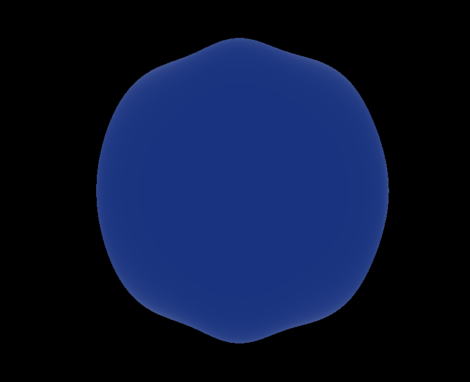

# Taller - Proyecciones 3D: Cómo ve una Cámara Virtual
## Integrantes
- Juan David Buitrago Salazar
- Juan David Cardenas Galvis
- Nicolás Rodríguez Piraban
- Camilo Andres Medina Sanchez
- Juan Felipe Fajardo Garzón

**Fecha de entrega:**  09/03/2026

## Descripción breve: 

## Implementaciones: 

### Unity:

### Three.js

## Resultados visuales:

### Unity:

### Three.js
Esfera con shaders proporcionados

Ruido Procedural

Animación con uniform

Efecto Fresnel

Varios efectos juntos (Ruido procedural, Efecto fresnel, viñetado y rim lightning)

## Código relevante: 

### Unity

### Three.js

## Aprendizajes y dificultades: 

## Contribuciones del grupo

