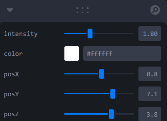
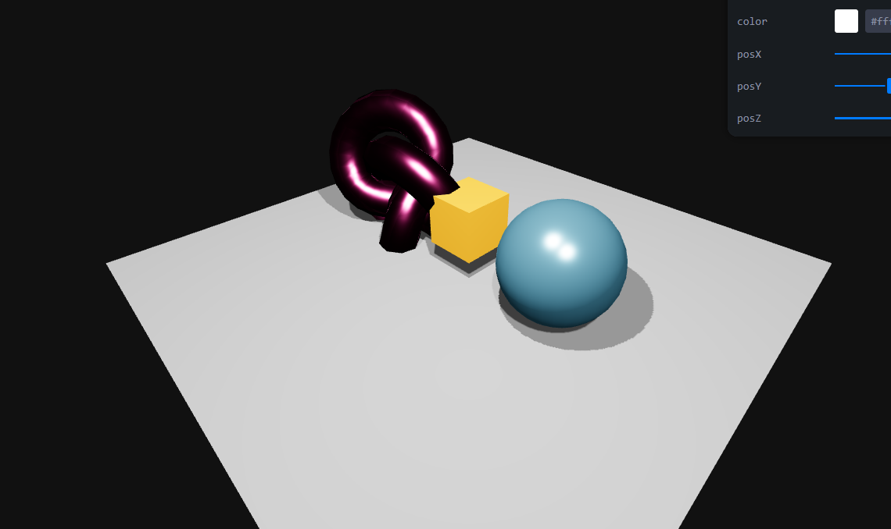
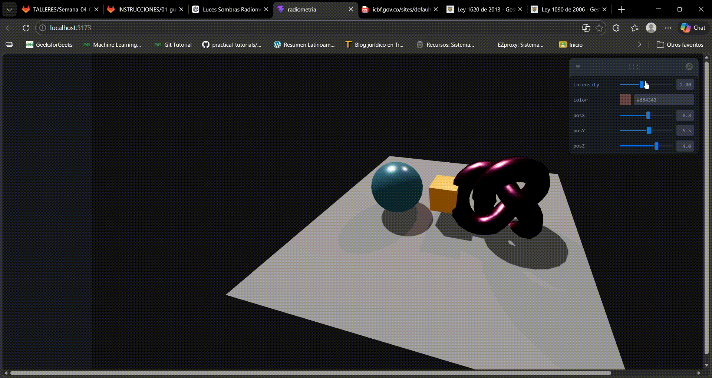

# Taller - Taller Luces Sombras Radiometria

## Integrantes

- Juan David Buitrago Salazar
- Juan David Cardenas Galvis
- Nicolás Rodríguez Piraban
- Camilo Andres Medina Sanchez
- Juan Felipe Fajardo Garzón

**Fecha de entrega:**  28/03/2026

## Descripción breve: 

En el presente taller se pretende la generación de una interfaz de controles sencillas que permita cambiar entre: 
- Intensidad de la luz
- Color de la luz
- Posiciones x,y,z de la luz 
Esto por medio de tres objetos diferentes con materiales asociados diferentes

## Implementaciones

La implementación que se desarrolla es planteada haciendo uso de threejs con react y javascript. 

Se crea un plano y sobre este se agrega un cubo, una esfera y ub toroide, cada uno con un material diferente haciendo uso de MeshStandard Material. 

- Plano creado con material color gra, se indica que este recibira las sombras haciendo uso de receiveShadow
- Cubo creado con material color orange y se indica que hará castShadow
- Esfera creado con material color skyblue y se indica que hará castShadow
- Cubo creado con material color hotpink y se indica que hará castShadow

Además, se indica a cada uno de los objetos las propiedades metalness y roughness esto con el fin de ver como se comporta las sombras según el tipo de material.

El bonus planteado para el presente taller fue la generación de un menú de opciones que permitiera plantear el color de la luz, la posición en x,y y z y la intensidad, esto haciendo uso de leva.

## Resultados visuales

Menú con leva para cambiar las propiedades de la luz


Objetos ubicados sobre el plano


Gif que incluye una simulación de como funciona el menú de leva y los cambios que se ven



## Código relevante

### Threejs

```javascript
import { Canvas } from "@react-three/fiber";
import { OrbitControls } from "@react-three/drei";
import { useControls } from "leva";

function Lights() {
  const { intensity, color, posX, posY, posZ } = useControls({
    intensity: { value: 2, min: 0, max: 5 },
    color: "#ffffff",
    posX: { value: 2, min: -10, max: 10 },
    posY: { value: 5, min: 0, max: 10 },
    posZ: { value: 2, min: -10, max: 10 },
  });

  return (
    <>
      {/* Luz ambiental */}
      <ambientLight intensity={0.3} />

      {/* Luz direccional */}
      <directionalLight
        position={[5, 10, 5]}
        intensity={1}
        castShadow
        shadow-mapSize-width={1024}
        shadow-mapSize-height={1024}
      />

      {/* Luz puntual interactiva */}
      <pointLight
        position={[posX, posY, posZ]}
        intensity={intensity}
        color={color}
        castShadow
      />
    </>
  );
}

export default function App() {
  return (
    <Canvas
      shadows
      camera={{ position: [5, 5, 5] }}
      style={{ width: "100vw", height: "100vh" }}
    >
      {/* Fondo */}
      <color attach="background" args={["#111"]} />

      {/* Luces */}
      <Lights />

      {/* Plano */}
      <mesh rotation={[-Math.PI / 2, 0, 0]} receiveShadow>
        <planeGeometry args={[10, 10]} />
        <meshStandardMaterial color="gray" />
      </mesh>

      {/* Cubo */}
      <mesh position={[0, 1, 0]} castShadow>
        <boxGeometry />
        <meshStandardMaterial
          color="orange"
          metalness={0.3}
          roughness={0.4}
        />
      </mesh>

      {/* Esfera */}
      <mesh position={[2, 1, 0]} castShadow>
        <sphereGeometry />
        <meshStandardMaterial
          color="skyblue"
          metalness={0.8}
          roughness={0.2}
        />
      </mesh>

      {/* Torus */}
      <mesh position={[-2, 1, 0]} castShadow>
        <torusKnotGeometry />
        <meshPhysicalMaterial
          color="hotpink"
          metalness={1}
          roughness={0.2}
          clearcoat={1}
        />
      </mesh>

      {/* Controles */}
      <OrbitControls />
    </Canvas>
  );
}
```

## Prompts utilizados
Durante el desarrollo del taller se utilizaron diferentes prompts para guiar la implementación técnica y resolver errores:

```
“Cómo implementar luces <ambientLight>, <pointLight> y <directionalLight> en Three.js”
“Cómo habilitar sombras en React Three Fiber”
“Cómo usar Leva para crear controles interactivos en React”
“Errores de dependencias con React Three Fiber y cómo solucionarlos”
“Compatibilidad entre versiones de Three.js, React y Drei”
```


## Aprendizajes y dificultades

Aprendizajes
- Se entendió la relación entre materiales y luz:
- Se evidenció cómo las sombras dependen de: la posición de la luz, la geometría de los objetos, la configuración de sombras (castShadow, receiveShadow)
- Se aprendió a usar Leva para crear interfaces interactivas que permiten modificar parámetros en tiempo real.


## Contribuciones del grupo
