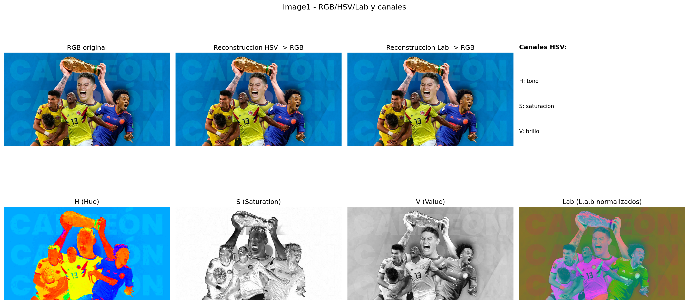
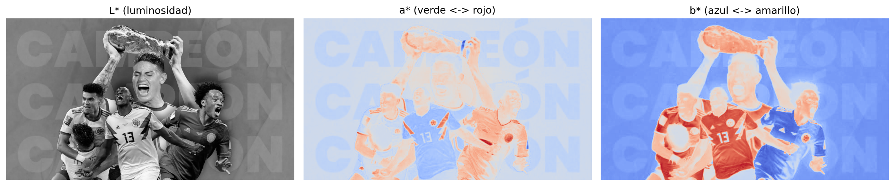
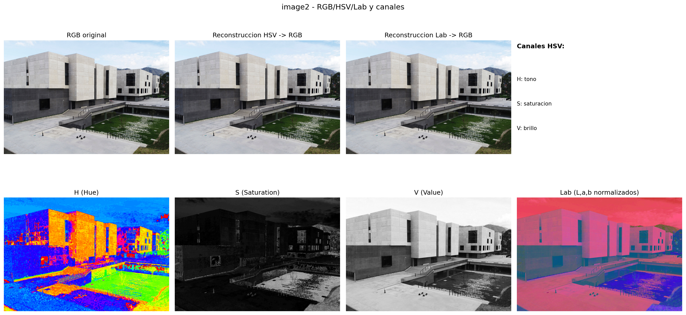
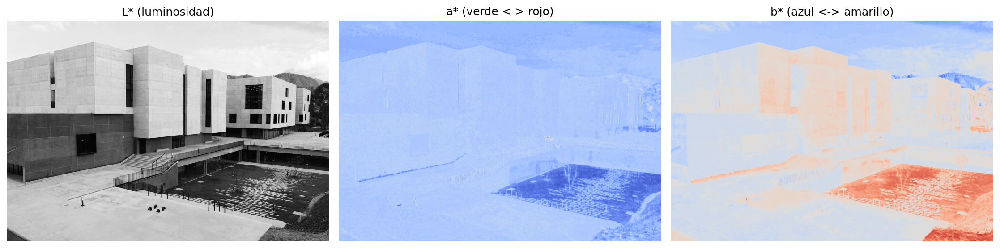
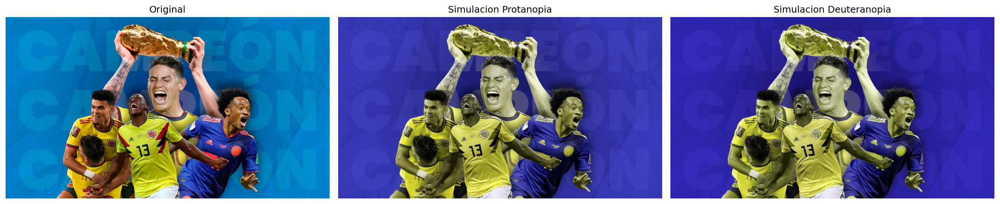
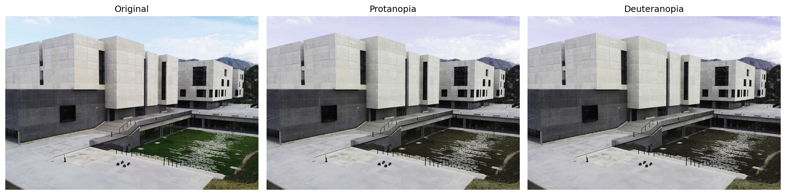
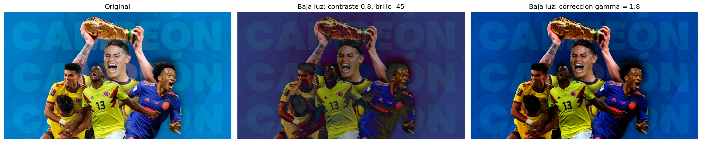
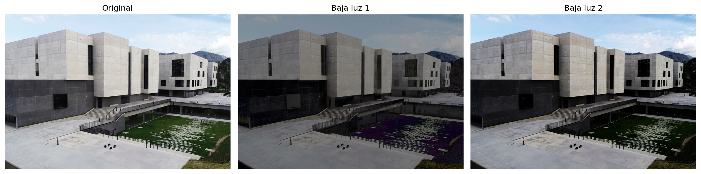
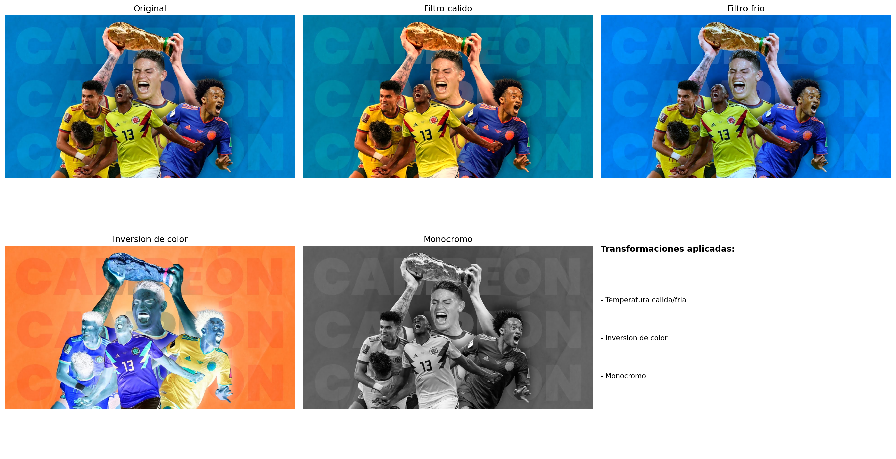
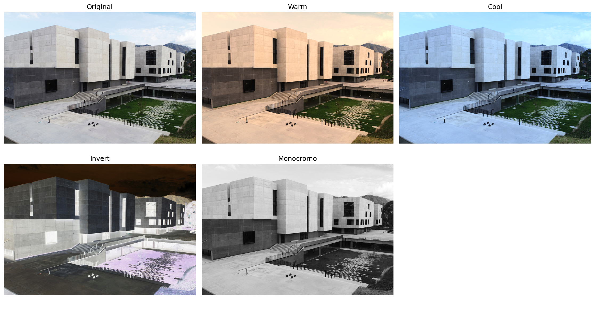

# Taller Modelos Color Percepcion

## Información General

**Título del Taller:** Explorando el Color: Percepción Humana y Modelos Computacionales

## Nombre del Estudiante
- Juan David Buitrago Salazar
- Juan David Cardenas Galvis
- Nicolás Rodríguez Piraban
- Camilo Andres Medina Sanchez
- Juan Felipe Fajardo Garzón
**Fecha de Entrega:** 27 de Marzo de 2026

---

## Descripción General

Este taller investiga la **percepción del color desde el punto de vista humano y computacional**, implementando transformaciones y simulaciones de espacios de color para comprender cómo distintos modelos afectan la interpretación visual.

### Objetivo

Comprender cómo los distintos espacios de color (RGB, HSV, CIE Lab) afectan la representación y percepción visual, y cómo pueden aplicarse transformaciones para simular condiciones específicas como daltonismo y ambientes de baja iluminación.

---

## Implementaciones Realizadas

### 1. Conversión de Espacios de Color

Se implementó la conversión entre espacios de color principales:

- **RGB → HSV**: Espacio cilíndrico basado en Hue (tono), Saturation (saturación) y Value (brillo)
- **RGB → CIE Lab**: Espacio perceptualmente uniforme donde L* representa luminosidad y a*/b* representan las dimensiones cromáticas (verde-rojo, azul-amarillo)

**Importancia Perceptual:**
- **HSV** es intuitivo para edición manual de colores (ajustar solo el tonomatiz es fácil)
- **Lab** es más cercano a la percepción humana real, útil para procesamiento de imagen profesional

#### Ejemplo de Código:

```python
# Conversión RGB -> HSV
img_hsv = cv2.cvtColor(img_rgb, cv2.COLOR_RGB2HSV)

# Conversión RGB -> Lab
img_lab = color.rgb2lab(img_rgb / 255.0)

# Separar canales para visualizar
h, s, v = cv2.split(img_hsv)
l, a, b = img_lab[:, :, 0], img_lab[:, :, 1], img_lab[:, :, 2]
```

#### Resultados Visuales:

- **Separación de Canales HSV**: 
  - Canal H (Hue): Visualizado con colormap HSV, muestra la variación de tonos en la imagen
  - Canal S (Saturation): En escala de grises, zonasa más claras = más saturadas
  - Canal V (Value): En escala de grises, zonas claras = más brillantes

- **Separación de Canales Lab**:
  - Canal L* (Luminosidad): Similar a una imagen en escala de grises
  - Canal a* (Verde-Rojo): Codifica desde verde (oscuro) hasta rojo (claro)
  - Canal b* (Azul-Amarillo): Codifica desde azul (oscuro) hasta amarillo (claro)

**Imágenes de Referencia:**
-  - Imagen 1
-  - Detalle canales Lab Imagen 1
-  - Imagen 2
-  - Detalle canales Lab Imagen 2

---

### 2. Simulación de Daltonismo

Se implementaron matrices de transformación para simular los tipos principales de daltonismo:

#### Protanopía (Daltonismo Rojo-Verde, Ausencia de fotorreceptores L)

Afecta la percepción de tonos rojos y pueden aparecer amarillentos o azulados.

```python
PROTANOPIA_MAT = np.array([
    [0.567, 0.433, 0.000],
    [0.558, 0.442, 0.000],
    [0.000, 0.242, 0.758]
], dtype=np.float32)

img_prot = apply_color_matrix(img_rgb, PROTANOPIA_MAT)
```

#### Deuteranopía (Daltonismo Rojo-Verde, Ausencia de fotorreceptores M)

Similara la protanopía pero con patrón diferente de desaturación.

```python
DEUTERANOPIA_MAT = np.array([
    [0.625, 0.375, 0.000],
    [0.700, 0.300, 0.000],
    [0.000, 0.300, 0.700]
], dtype=np.float32)

img_deut = apply_color_matrix(img_rgb, DEUTERANOPIA_MAT)
```

**Observación Importante:**
En la imagen de fútbol, los colores amarillo, azul y rojo se transforman significativamente en ambas simulaciones, dificultando la distinción entre equipos para una persona con daltonismo.

**Imágenes de Referencia:**
-  - Imagen 1
-  - Imagen 2

---

### 3. Simulación de Baja Luz

Se implementaron dos técnicas para simular condiciones de poca iluminación:

#### Ajuste Directo de Brillo y Contraste

```python
def adjust_brightness_contrast(img_rgb, alpha=1.0, beta=0.0):
    # alpha: factor de contraste
    # beta: ajuste de brillo (en escala 0-255)
    out = cv2.convertScaleAbs(img_rgb, alpha=alpha, beta=beta)
    return out

# Ejemplo: reducir brillo y contraste
img_low_light = adjust_brightness_contrast(img_rgb, alpha=0.8, beta=-45)
```

#### Corrección Gamma

```python
def gamma_correction(img_rgb, gamma=1.0):
    # gamma > 1.0: aclara imagen (para baja luz)
    # gamma < 1.0: oscurece imagen
    img = img_rgb.astype(np.float32) / 255.0
    corrected = np.power(img, gamma)
    return np.clip(corrected * 255, 0, 255).astype(np.uint8)

# Simular baja luz
img_low_light_gamma = gamma_correction(img_rgb, gamma=1.8)
```

**Efecto Perceptual:**
- Pérdida de detalles en sombras
- Colores menos saturados
- Mayor ruido visual

**Imágenes de Referencia:**
-  - Imagen 1
-  - Imagen 2

---

### 4. Transformaciones Personalizadas

Se implementaron 4 transformaciones de propósito general:

#### 4.1 Filtro Cálido (Warm Filter)

Aumenta tonos rojos, reduce tonos azules. Simula iluminación al atardecer.

```python
def warm_filter(img_rgb, strength=0.15):
    img = img_rgb.astype(np.float32) / 255.0
    img[:, :, 0] = np.clip(img[:, :, 0] * (1.0 + strength), 0.0, 1.0)
    img[:, :, 2] = np.clip(img[:, :, 2] * (1.0 - strength * 0.8), 0.0, 1.0)
    return (img * 255).astype(np.uint8)
```

#### 4.2 Filtro Frío (Cool Filter)

Aumenta tonos azules, reduce tonos rojos. Simula iluminación nocturna o fluorescente.

```python
def cool_filter(img_rgb, strength=0.15):
    img = img_rgb.astype(np.float32) / 255.0
    img[:, :, 2] = np.clip(img[:, :, 2] * (1.0 + strength), 0.0, 1.0)
    img[:, :, 0] = np.clip(img[:, :, 0] * (1.0 - strength * 0.8), 0.0, 1.0)
    return (img * 255).astype(np.uint8)
```

#### 4.3 Inversion de Color (Negativo Fotográfico)

```python
def invert_filter(img_rgb):
    return 255 - img_rgb
```

#### 4.4 Monocromo (Escala de Grises)

```python
def monochrome_filter(img_rgb):
    gray = cv2.cvtColor(img_rgb, cv2.COLOR_RGB2GRAY)
    return cv2.cvtColor(gray, cv2.COLOR_GRAY2RGB)
```

**Imágenes de Referencia:**
-  - Imagen 1
-  - Imagen 2

---

### 5. Bonus: Alternador Dinámico (Dynamic Mode Switcher)

Se implementó una función que permite alternar entre cualquiera de los modos/simulaciones disponibles:

```python
def apply_mode(img_rgb, mode: str) -> np.ndarray:
    mode = mode.lower().strip()
    
    if mode == 'original':
        return img_rgb
    if mode == 'hsv_rgb':
        hsv = cv2.cvtColor(img_rgb, cv2.COLOR_RGB2HSV)
        return cv2.cvtColor(hsv, cv2.COLOR_HSV2RGB)
    if mode == 'lab_rgb':
        lab = color.rgb2lab(img_rgb / 255.0)
        return np.clip(color.lab2rgb(lab) * 255, 0, 255).astype(np.uint8)
    if mode == 'protanopia':
        return apply_color_matrix(img_rgb, PROTANOPIA_MAT)
    if mode == 'deuteranopia':
        return apply_color_matrix(img_rgb, DEUTERANOPIA_MAT)
    if mode == 'baja_luz':
        return adjust_brightness_contrast(img_rgb, alpha=0.8, beta=-45)
    if mode == 'invert':
        return invert_filter(img_rgb)
    if mode == 'monocromo':
        return monochrome_filter(img_rgb)
    if mode == 'warm':
        return warm_filter(img_rgb, strength=0.2)
    if mode == 'cool':
        return cool_filter(img_rgb, strength=0.2)
    
    raise ValueError(f'Modo no soportado: {mode}')

# Uso
resultado = apply_mode(img_rgb, 'protanopia')
```

**Modos Disponibles:**
- `original`: Imagen sin modificaciones
- `hsv_rgb`: Conversión RGB → HSV → RGB
- `lab_rgb`: Conversión RGB → Lab → RGB
- `protanopia`: Simulación protanopía
- `deuteranopia`: Simulación deuteranopia
- `baja_luz`: Simulación baja iluminación
- `warm`: Filtro cálido
- `cool`: Filtro frío
- `invert`: Negativo fotográfico
- `monocromo`: Escala de grises

**Evidencias del Bonus (alternador):**
-  - Imagen 1
-  - Imagen 2

---

## Resultados Visuales Generados

### Estructura de la Carpeta `media/`

```
media/
├── image1.jpg                      # Original
├── image1_conversion_canales.png   # RGB/HSV/Lab y canales
├── image1_lab_canales.png          # Detalle canales Lab
├── image1_daltonismo.png           # Protanopía + Deuteranopia
├── image1_baja_luz.png             # Baja luz (2 métodos)
├── image1_transformaciones.png     # Warm, Cool, Invert, Monocromo
├── image2.jpg                      # Original
├── image2_conversion_canales.png   # RGB/HSV/Lab y canales
├── image2_lab_canales.png          # Detalle canales Lab
├── image2_daltonismo.png           # Protanopía + Deuteranopia
├── image2_baja_luz.png             # Baja luz (2 métodos)
├── image2_transformaciones.png     # Warm, Cool, Invert, Monocromo
├── image1_switcher.png             # Bonus: alternador (grid de modos)
└── image2_switcher.png             # Bonus: alternador (grid de modos)
```

### Análisis Visual por Imagen

#### Imagen 1 (Fútbol - Taza del Mundo)
Imagen colorida con fondo azul intenso, uniforme amarillo y rojo. 
- **Conversión HSV**: El canal H muestra claramente la distribución de tonos (azul/amarillo dominantes)
- **Conversión Lab**: El canal L* muestra la copa dorada muy brillante; a*/b* revelan las transiciones cromáticas nítidas
- **Daltonismo**: Pérdida crítica de distinción entre azul y amarillo en protanopía; los rojos se transforman a tonos verde-ocre
- **Baja Luz**: Pérdida de saturación en uniforme; detalles faciales menos visibles
- **Transformaciones**: Filtro cálido intensifica amarillos; filtro frío domina tonos azules

#### Imagen 2 (Arquitectura Moderna)
Imagen arquitectónica con predominancia de blanco/gris y detalles verde/agua.
- **Conversión HSV**: El canal S muy bajo (imagen poco saturada); V muestra buen rango dinámico
- **Conversión Lab**: Valores L* altos (imagen clara); a*/b* con variaciones sutiles
- **Daltonismo**: Cambios menores (menos colores saturados); el verde se desatura ligeramente
- **Baja Luz**: Efecto dramático; las zonas oscuras (agua) tienden a negro; grises pierden definición
- **Transformaciones**: Filtro cálido confunde bloques blancos con tonos cálidos; monocromo preserva bien la estructura

---

## Estructura del Código

### Directorios Principales

```
semana_04_2_modelos_color_percepcion/
├── python/
│   └── taller_modelos_color_percepcion.ipynb
├── media/
│   └── [14 imágenes PNG generadas + originales]
└── README.md
```

### Flujo de Ejecución del Notebook

1. **Importación de Librerías** → OpenCV, NumPy, Matplotlib, Scikit-image
2. **Detección Automática de Rutas** → Busca imágenes en `images/` o `media/`
3. **Carga de Imagen Base** → Lee RGB y calcula color promedio (demo perceptual)
4. **Conversiones y Canales** → RGB→HSV→Lab con visualización individual
5. **Simulaciones de Daltonismo** → Protanopía + Deuteranopia
6. **Simulaciones de Baja Luz** → Dos enfoques (Brillo/Contraste + Gamma)
7. **Transformaciones Personalizadas** → Warm, Cool, Invert, Monocromo
8. **Demostración del Alternador** → Mostrar 4 modos principales
9. **Procesamiento por Lote** → Generar todas las evidencias para ambas imágenes

---

## Herramientas Utilizadas

| Herramienta | Versión | Propósito |
|-----------|---------|----------|
| **OpenCV (cv2)** | Última | Conversiones de color, procesamiento de imagen |
| **NumPy** | Última | Operaciones matriciales, transformaciones lineales |
| **Matplotlib** | Última | Visualización y guardado de figuras PNG |
| **Scikit-image** | Última | Conversión Lab, funciones de color avanzadas |
| **Python** | 3.10+ | Lenguaje base |
| **Jupyter/Colab** | Última | Entorno de ejecución |

---

## Prompts Utilizados

- Ayudame a generar una imagen con daltonismo, con la misma estructura del código que seguimos
- Cual es la mejor forma de ver los diferentes canales de una imagen

---

## Aprendizajes y Dificultades

### Aprendizajes Principales

1. **Percepción vs. Representación:** El espacio RGB no es perceptualmente uniforme (la percepción no es lineal). Espacios como Lab son más cercanos a cómo ven los humanos.

2. **Daltonismo es Complejo:** No es solo "ver en blanco/negro". Hay múltiples tipos (protanopía, deuteranopia, tritanopía) con impactos muy distintos. Las matrices de transformación son aproximaciones lineales simplificadas.

3. **Importancia de la Calibración:** Un mismo factor (p.ej., `alpha=0.8` en brillo) tiene impactos perceptuales distintos según el rango dinámico original de la imagen.

4. **Canales Individuales Revelan Estructura:** Separar HSV enseña que imágenes complejas pueden descomponerse en componentes perceptuales independientes, útil para análisis y edición selectiva.

5. **La Baja Luz Afecta Saturación + Luminosidad:** No solo es "todo más oscuro"; también hay pérdida de saturación cromática, crucial para diseño en contextos de baja iluminación.

### Dificultades Encontradas

1. **Compatibilidad Jupyter/Colab:** Rutas relativas funcionan diferente. Solución: función `resolve_input_dirs()` que busca múltiples rutas.

2. **Normalización de Valores:** OpenCV usa [0,179] para H (no 0-360), NumPy espera [0,1] para Lab. Requerí conversiones explícitas y documentación clara.

3. **Matrices de Simulación No Perfectas:** Las matrices lineales son aproximaciones. Daltonismo real es más complejo (no-lineal, interacción neuronal). Pero son suficientemente buenas para demostración educativa.

4. **Visualización de Lab:** Lab tiene coordenadas negativas (a*, b*). Para visualizar, hubo que normalizar a [0,1] usando min/max, lo que puede distorsionar interpenetración de diferencias cromáticas reales.

5. **Rendimiento:** Procesamiento por lote de 2 imágenes × 6 tipos de transformación = 12 figuras. Jpeg guardar cada figura añade latencia. Solución: usar DPI 150 en lugar de 300, aceptar pequeña pérdida de calidad.

### Reflexión Final

Este taller fue muy educativo en entender que **la percepción del color es más que RGB binario**. Las simulaciones de daltonismo abrieron los ojos sobre accesibilidad en diseño digital. La capacidad de alternar dinámicamente entre modos abre posibilidades para herramientas de edición/visualización accesibles.

---

## Contribuciones grupales

- **Juan David Cardenas Galvis**: lideró la arquitectura del notebook, implementó el pipeline completo de conversiones, segmentación HSV, manipulación de color, color grading, paletas con K-means, análisis de histogramas y consolidación de resultados en `media/`.
- **Juan David Buitrago Salazar**: apoyó la validación visual de resultados por bloque, revisión de consistencia en figuras comparativas y ajuste de presentación técnica.
- **Nicolás Rodríguez Piraban**: contribuyó en revisión metodológica de rangos de color y depuración conceptual de la sección de segmentación y análisis cromático.
- **Camilo Andres Medina Sanchez**: apoyó la organización de evidencias, verificación de exportación de archivos y control de trazabilidad entre celdas y salidas.
- **Juan Felipe Fajardo Garzón**: colaboró en revisión final de documentación, estructura del README y chequeo de coherencia entre objetivos y resultados del taller.

