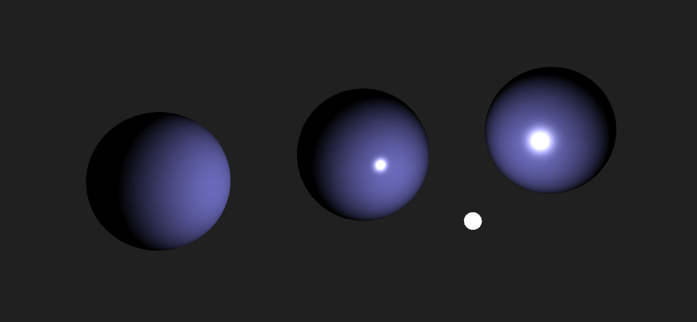
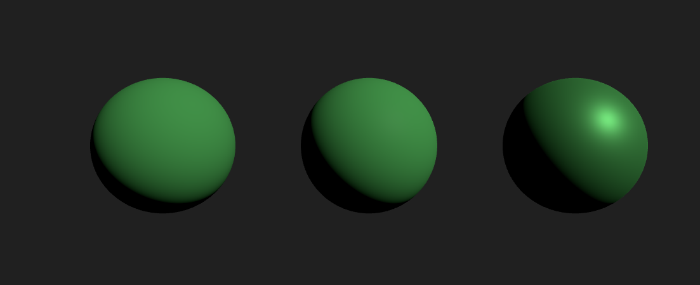
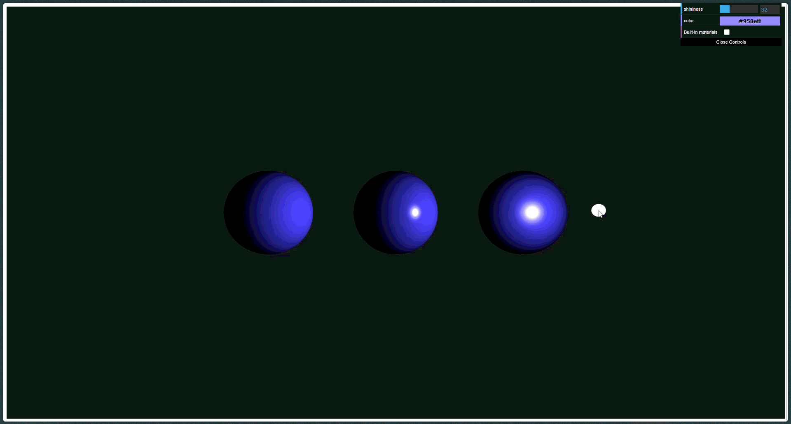

# Modelos de Reflexión: Lambert, Phong y PBR
## Nombre del Estudiante
- Juan David Buitrago Salazar
- Juan David Cardenas Galvis
- Nicolás Rodríguez Piraban
- Camilo Andres Medina Sanchez
- Juan Felipe Fajardo Garzón

## Fecha de Entrega
`2026-03-28`

---

## Descripción Breve

Este taller se enfoca en shader materials personalizados para efectos de refracción e iluminación en modelos 3D con Three.js y React Three Fiber, comparando Lambert en el fragment shader con Phong/Blinn-Phong y evaluando el impacto de distintos materiales en los renders. Se exponen uniforms como la dirección de la luz y la dirección de la vista, y se incorporan controles con dat.GUI para ajustar parámetros en tiempo real.

---

## Implementaciones

### Three.js / React Three Fiber
En este taller, se crean 3 diferentes esferas a las cuales es posible aplicar diferentes ShaderMaterials personalizados (Lambert, Phong y Blinn-Phong). Se pasan uniforms como lightDir y viewDir y se integran controles con dat.GUI para variar parámetros en tiempo real, permitiendo ver cómo cambian los renders.

---

## Resultados visuales


Se muestra la escena creada. La escena contiene 3 esferas, cada una con un material diferente. De izquiera a derecha los materiales son Lambert, Phong y Blinn-Phong. Se observa como la lambert no es muy reflectiva, sin embargo, si interactua con la luz. Tanto phong y blinn-phong son más reflectivas, sin embargo, con un mismo parametro de shininess se muestra que la blinn-phong es un poco más reflectiva.


Ahora se muestra al misma escena, esta vez con los materiales built-in de threejs, que son lambert, phong y standart. Comparados con los anteriores, lambert es el más similar, el de phong se muestra menos reflectivo que el implementado y el standart tiene una textura unica respecto a las demás, no tan reflectiva pero tampoco opaca.


Por último se muestra como se puede interactuar con la escena. Se muestra, además de las esferas de la escena una pequeña esfera blanca. Esta es la fuente de luz usada en la escena, esta se puede arrastrar a travez de la escena para ver como afecta a la iluminación de los objetos. En la esquina superior derecha se encuentra una pequeña interfaz que se usa para modificar 3 parámetros: shininess (para phong y blinn-phong), el color de las esferas y un toggle para usar los materiales personalizados o los built-in.

---

## Código relevante

Los siguientes fragmentos de códigos muestra cómo se realizó la implementación de los materiales:

```javascript
// Lambert ( LambertShaderMaterial )
import * as THREE from 'three';
export const LambertMaterial = new THREE.ShaderMaterial({
  uniforms: {
    lightPosition: { value: light.position },
    color: { value: new THREE.Color(0xaaaaaa) }
  },
  vertexShader: `varying vec3 vNormal; varying vec3 vPosition; void main() { vNormal = normalize(mat3(modelMatrix) * normal); vPosition = (modelMatrix * vec4(position, 1.0)).xyz; gl_Position = projectionMatrix * viewMatrix * vec4(vPosition, 1.0); }`,
  fragmentShader: `uniform vec3 lightPosition; uniform vec3 color; varying vec3 vNormal; varying vec3 vPosition; void main() { vec3 N = normalize(vNormal); vec3 L = normalize(lightPosition - vPosition); float diffuse = max(dot(N, L), 0.0); vec3 finalColor = color * diffuse; gl_FragColor = vec4(finalColor, 1.0); }`,
});
```

```javascript
// Blinn-Phong (BlinnMaterial)
import * as THREE from 'three';
export const BlinnMaterial = new THREE.ShaderMaterial({
  uniforms: {
    lightPosition: { value: light.position },
    viewPosition: { value: camera.position },
    color: { value: new THREE.Color(0xaaaaaa) },
    shininess: { value: 32.0 }
  },
  vertexShader: `varying vec3 vNormal; varying vec3 vPosition; void main() { vNormal = normalize(mat3(modelMatrix) * normal); vPosition = (modelMatrix * vec4(position, 1.0)).xyz; gl_Position = projectionMatrix * viewMatrix * vec4(vPosition, 1.0); }`,
  fragmentShader: `uniform vec3 lightDir; uniform vec3 viewDir; uniform float shininess; uniform vec3 baseColor; varying vec3 vN; void main() { vec3 N = normalize(vN); vec3 L = normalize(-lightDir); vec3 V = normalize(viewDir); vec3 H = normalize(L + V); float diff = max(dot(N, L), 0.0); float spec = pow(max(dot(N, H), 0.0), shininess); gl_FragColor = vec4(baseColor * diff + vec3(1.0) * spec, 1.0); }`,
});
```

```javascript
// Phong (PhongMaterial)
import * as THREE from 'three';
export const PhongMaterial = new THREE.ShaderMaterial({
  uniforms: {
    lightPosition: { value: light.position },
    viewPosition: { value: camera.position },
    color: { value: new THREE.Color(0xaaaaaa) },
    shininess: { value: 32.0 }
  },
  vertexShader: `varying vec3 vNormal; varying vec3 vPosition; void main() { vNormal = normalize(mat3(modelMatrix) * normal); vPosition = (modelMatrix * vec4(position, 1.0)).xyz; gl_Position = projectionMatrix * viewMatrix * vec4(vPosition, 1.0); }`,
  fragmentShader: `uniform vec3 lightDir; uniform vec3 viewDir; uniform float shininess; uniform vec3 diffColor; uniform vec3 specColor; varying vec3 vN; void main() { vec3 N = normalize(vN); vec3 L = normalize(-lightDir); vec3 V = normalize(viewDir); vec3 R = reflect(-L, N); float diff = max(dot(N, L), 0.0); float spec = pow(max(dot(V, R), 0.0), shininess); gl_FragColor = vec4(diffColor * diff + specColor * spec, 1.0); }`,
});
```

## Prompts utilizados

Ejemplos de prompts usados para guiar el desarrollo:

```txt
"Escribe un ShaderMaterial en GLSL que implemente Lambert en el fragment shader y reciba lightDir y viewDir como uniforms"

"Conecta dat.GUI para controlar la dirección de la luz y otros parámetros en tiempo real"
```

---

## Aprendizajes y dificultades

Con este taller se comprendió el fundamento matemático y practico detrás de la implementación de diferentes formas de iluminación de geometrias, además de como la geometría afecta la interacción con la fuente de luz. Una dificultad que surgío fue la interacción entre las propiedades de los materiales y la GUI. Solucionar esto fue simple, dado que cada textura convierte la entrada en sus propios parámetros, solo es necesario cambiar esta propiedad cada vez que se actualiza el slider. Por último, algo que estaría bien agregar sería un indicador de que textura se está mostrando actualmente en cada objeto, e incluso cambiar la textura individualmente para realizar comparaciones entre materiales específicos. 

---

## Contribuciones grupales (si aplica)

- Nicolás Rodríguez Piraban: realizó la escena y la UI, integrando Three.js/React Three Fiber y configurando las interacciones de la fuente de luz.
- Juan David Buitrago Salazar: implementó LambertShaderMaterial. Integró dat.GUI para controles en tiempo real de la dirección de la luz, la dirección de la vista y shininess.
- Juan David Cardenas Galvis: implementó PhongMaterial y BlinnMaterial, afinó la iluminación con shininess y las direcciones de luz y vista, y apoyó en la visualización de resultados.
- Camilo Andres Medina Sanchez: trabajó en la gestión de uniforms y la lógica de iluminación, y apoyó en la documentación y en la configuración de prompts.
- Juan Felipe Fajardo Garzón: lideró la documentación del README y consolidó los hallazgos, aportes y prompts utilizados.

---

## Estructura del proyecto

```
semana_04_3_modelos_reflexion_pbr /
├── threejs/         # Código Three.js/React 
├── media/           # Imágenes, videos, GIFs
└── README.md        # Este archivo
```
