# Taller Conversión y Manipulación de Espacios de Color

## Integrantes del grupo

- Juan David Buitrago Salazar
- Juan David Cardenas Galvis
- Nicolás Rodríguez Piraban
- Camilo Andres Medina Sanchez
- Juan Felipe Fajardo Garzón

## Fecha de entrega

26-03-2026

---

## Descripción breve

En este taller se desarrolló un flujo completo de trabajo en Python para estudiar la conversión y manipulación de espacios de color aplicados a procesamiento de imágenes. Se partió de una imagen base en RGB y se realizaron conversiones a HSV, HSL/HLS, LAB, YCrCb y escala de grises, además de la visualización por canales para analizar el comportamiento de cada componente de color y sus rangos.

Con base en esas conversiones, se implementaron tareas de análisis y edición: segmentación por color en HSV, ajustes de saturación y matiz, modificaciones de luminosidad en LAB, balance de blancos, color grading con curvas LUT y filtros estilizados, extracción de paletas dominantes con K-means y estudio de histogramas (RGB/HSV, CLAHE y histogram matching). Como resultado, se exportó una colección completa de evidencias visuales en la carpeta media, incluyendo imágenes comparativas y resúmenes por etapa.

---

## Implementaciones

### Python

Se implementó la totalidad del taller en Python usando principalmente NumPy, OpenCV, Matplotlib y scikit-image. El notebook contiene siete bloques funcionales:

1. Conversión entre espacios de color y visualización de canales.
2. Visualización 3D de la distribución cromática en RGB y representación cilíndrica aproximada de HSV.
3. Segmentación por color (azul, verde y rojo) en HSV con limpieza morfológica (apertura/cierre).
4. Manipulación de color (saturación, rotación de matiz, luminancia LAB, ecualización y balance de blancos).
5. Color grading (LUT/curvas, tonos cálidos y fríos, ajuste selectivo de verdes, estilo Instagram).
6. Extracción y aplicación de paletas dominantes por K-means y generación de armonías.
7. Análisis de histogramas y técnicas de realce (CLAHE y histogram matching).

No se utilizaron Unity, Three.js ni Processing en este taller.

---

## Resultados visuales

Todos los resultados mostrados a continuación se encuentran en la carpeta media y fueron generados en la implementación Python.

### 1) Imagen base e insumos

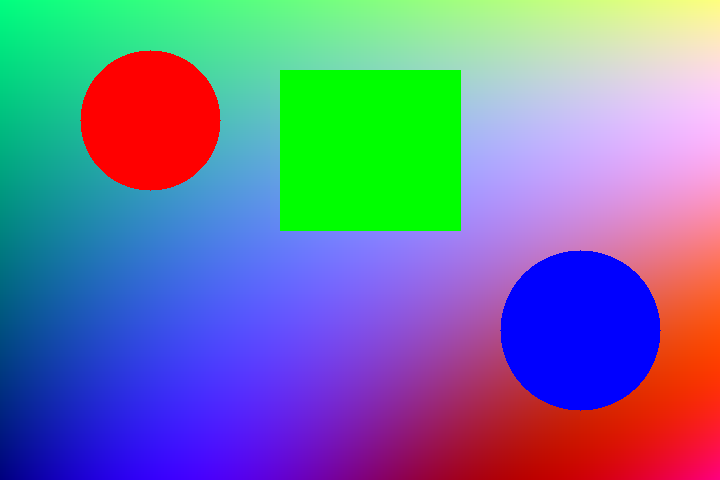

Input Image (Imagen 1).


Imagen de entrada usada para ejecutar el taller: gradiente cromático con figuras geométricas primarias (círculo rojo, cuadrado verde y círculo azul), ideal para validar conversiones, segmentación y cambios de color.

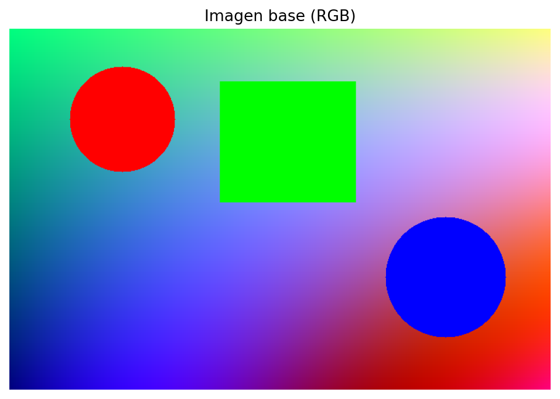

Base Image Preview (Imagen 2).


Vista previa de la imagen base renderizada con Matplotlib para verificar escala, composición y correcto cargado en el pipeline.

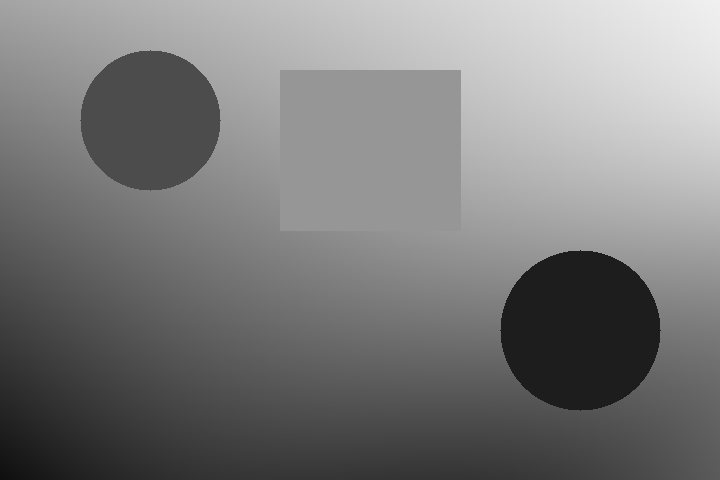

Gray Image (Imagen 3).


Conversión directa de la imagen base a escala de grises, utilizada como referencia para operaciones de luminancia y ecualización.

### 2) Conversión entre espacios de color

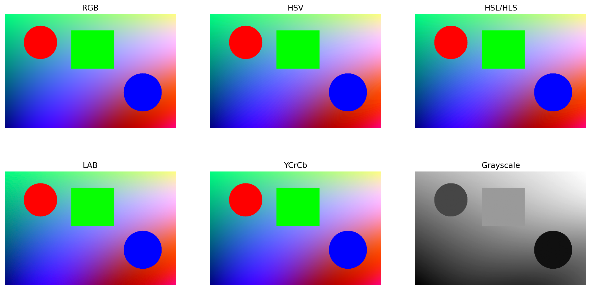

Conversion Overview (Imagen 4).


Comparativa general de conversiones RGB, HSV, HSL/HLS, LAB, YCrCb y Grayscale; permite observar diferencias perceptuales y de representación en cada espacio.

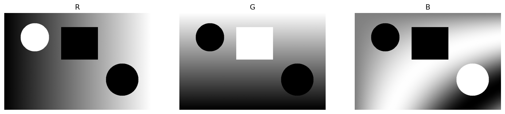

Channels RGB (Imagen 5).


Descomposición por canales R, G y B; evidencia la contribución individual de cada canal en figuras y fondo.

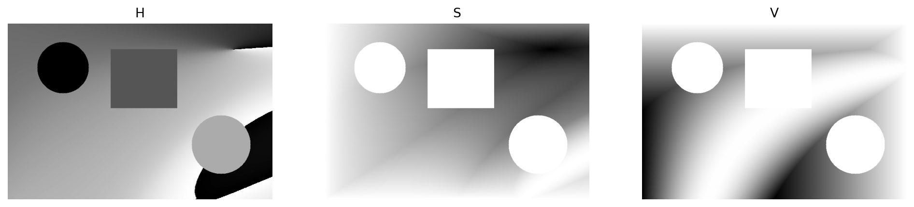

Channels HSV (Imagen 6).


Descomposición HSV (H, S, V); se aprecia separación entre matiz, saturación y brillo para facilitar segmentación por color.

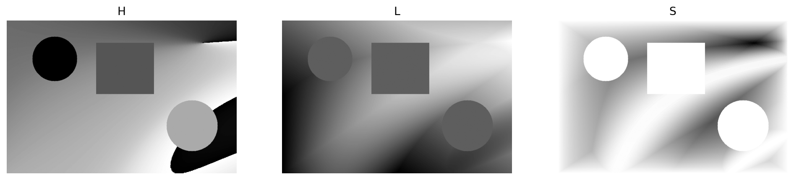

Channels HSL (Imagen 7).


Descomposición HSL/HLS (H, L, S); muestra cómo el canal de luminosidad distribuye intensidad de forma distinta a HSV.

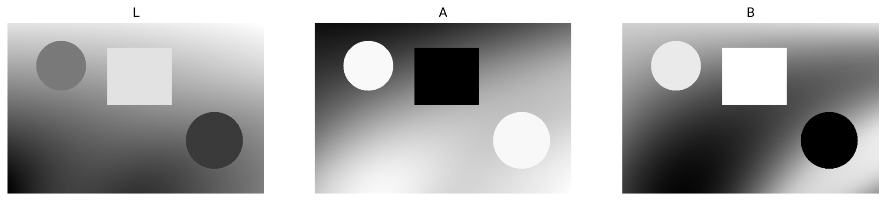

Channels LAB (Imagen 8).


Canales LAB (L, A, B); útil para separar luminancia de crominancia y realizar ajustes perceptualmente estables.

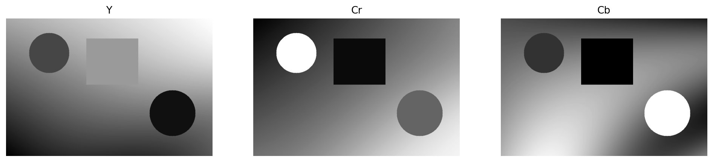

Channels YCrCb (Imagen 9).


Canales YCrCb (Y, Cr, Cb); destaca la separación entre luminancia y componentes cromáticas roja/azul.

### 3) Visualización de espacios de color

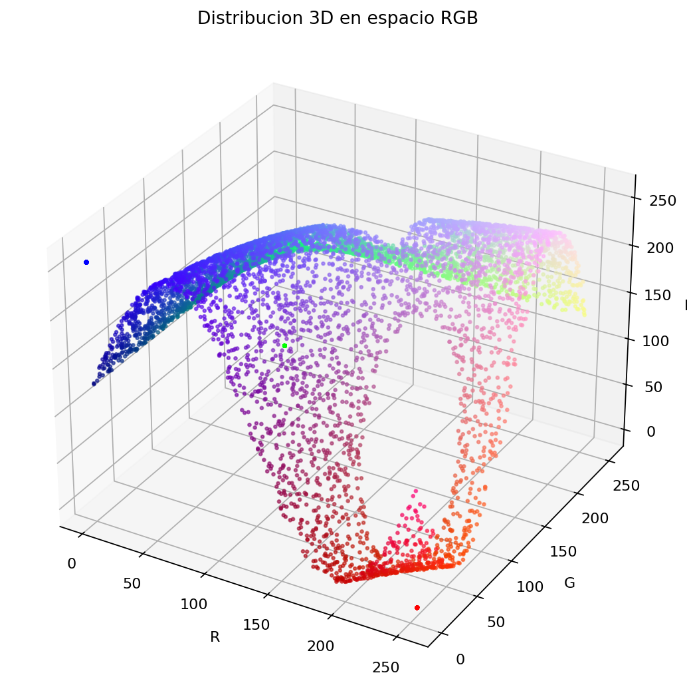

RGB 3D Scatter (Imagen 10).


Nube de puntos en 3D del espacio RGB con muestreo de píxeles; describe la distribución real de colores presentes en la imagen.

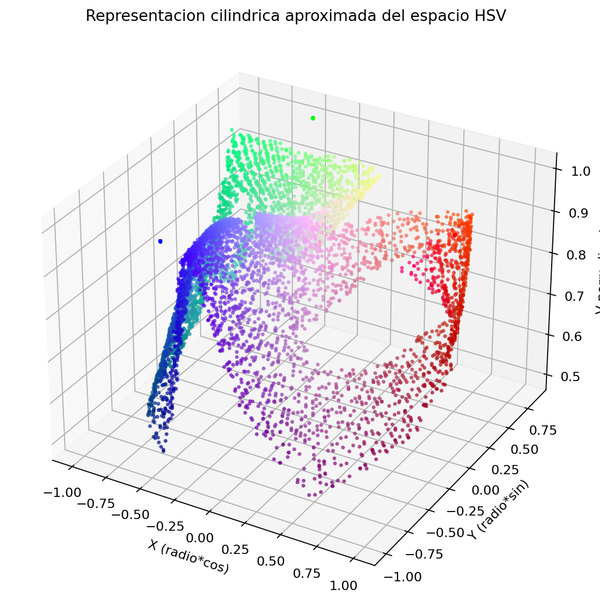

HSV Cylindrical Scatter (Imagen 11).


Representación cilíndrica aproximada de HSV (ángulo=H, radio=S, eje vertical=V), útil para interpretar tono y saturación de forma geométrica.

### 4) Segmentación por color en HSV

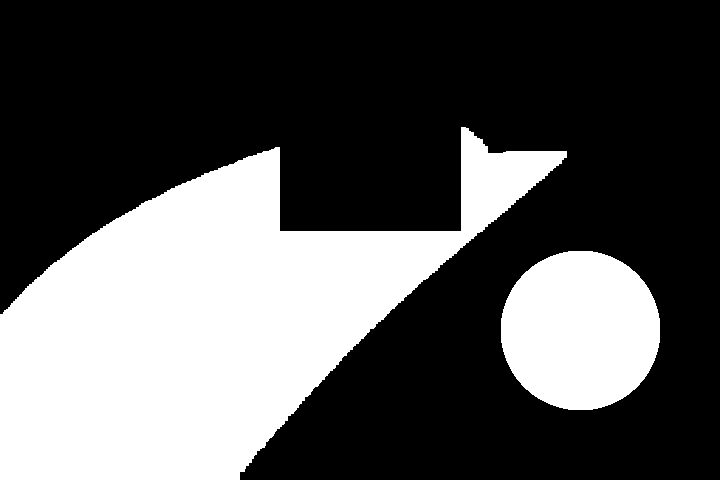

Mask Blue (Imagen 12).


Máscara binaria del rango azul en HSV tras limpieza morfológica; blanco indica píxeles detectados como azules.

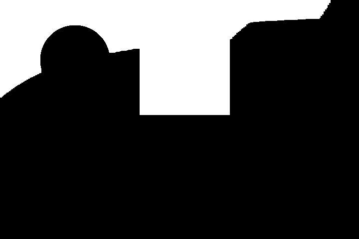

Mask Green (Imagen 13).


Máscara binaria del rango verde, afinada para retener principalmente el cuadrado verde y reducir ruido de fondo.

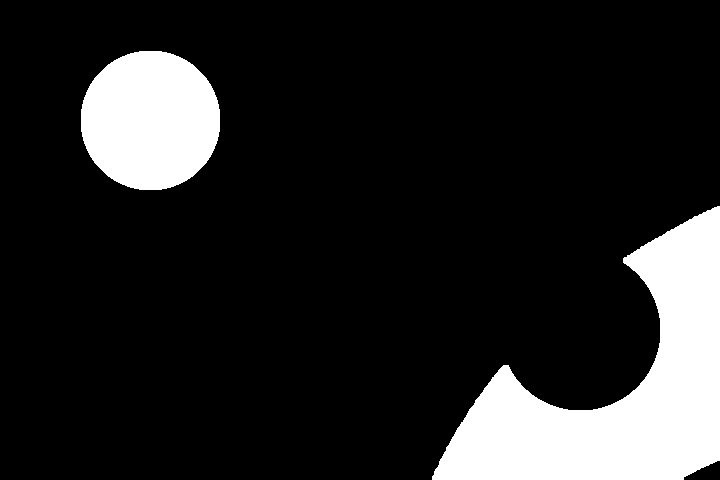

Mask Red (Imagen 14).


Máscara binaria del rango rojo combinando dos intervalos de matiz (inicio y final del círculo HSV), necesaria por la naturaleza circular del canal H.

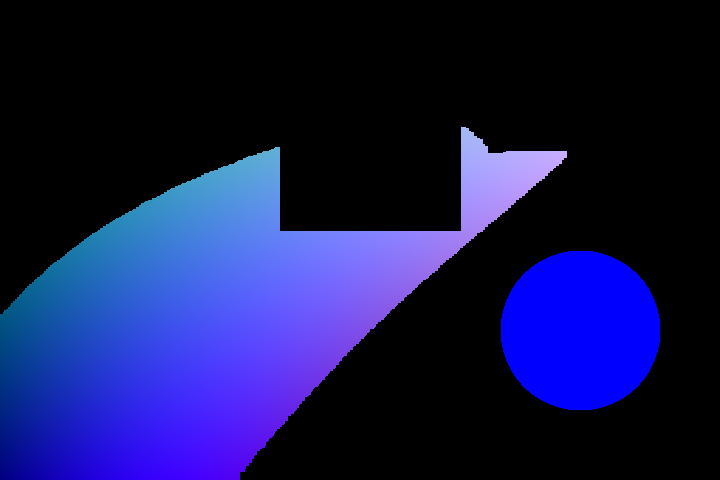

Objects Blue (Imagen 15).


Extracción de objetos azules aplicando la máscara azul sobre la imagen RGB original.

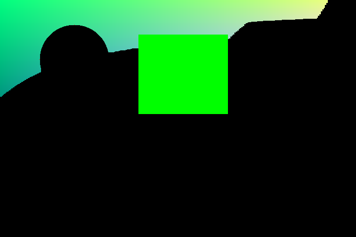

Objects Green (Imagen 16).


Extracción de objetos verdes a partir de su máscara HSV y operación bitwise.

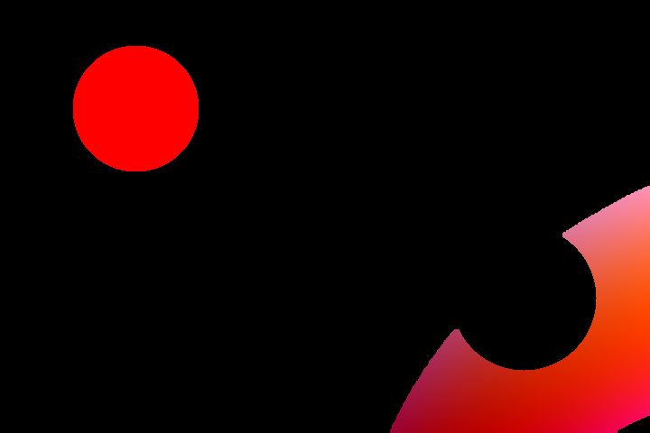

Objects Red (Imagen 17).


Extracción de objetos rojos resultante de la unión de máscaras en dos rangos de matiz.

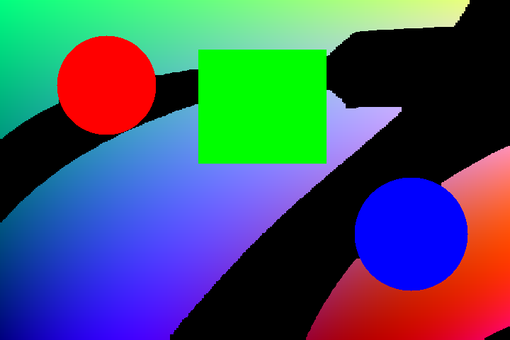

Objects Combined (Imagen 18).


Combinación de detecciones azul, verde y rojo en una sola imagen segmentada.

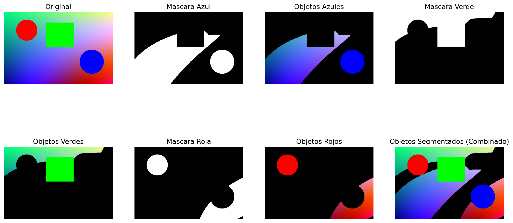

Segmentation Summary (Imagen 19).


Resumen visual de todo el proceso de segmentación: original, máscaras por color, objetos por color y resultado combinado.

### 5) Manipulación de color

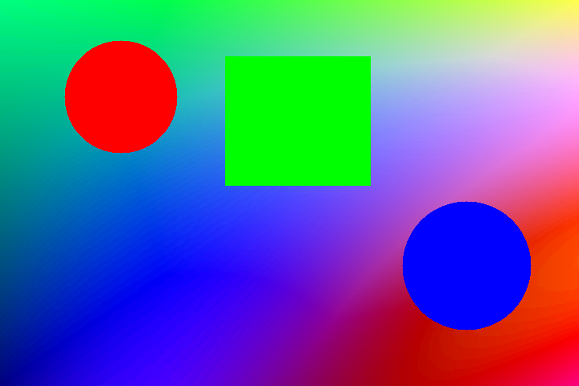

Manip Saturation Up (Imagen 20).


Aumento global de saturación en HSV (factor 1.4), intensificando colores sin modificar de forma directa la luminancia.

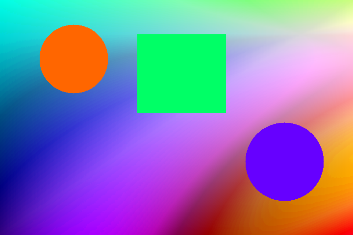

Manip Hue Rotated (Imagen 21).


Rotación de matiz +25 grados en HSV; desplaza tonos cromáticos manteniendo estructura de la escena.

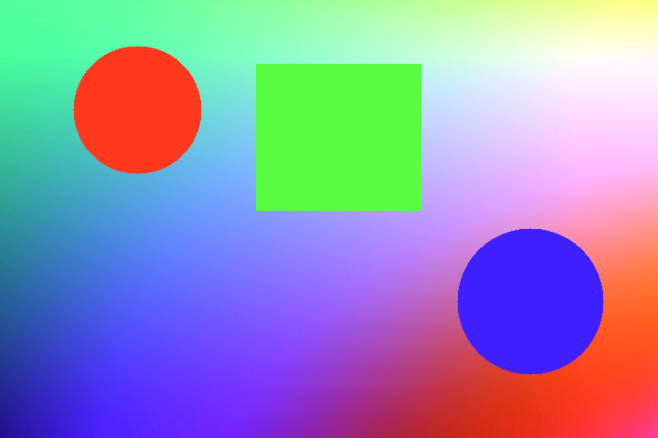

Manip LAB Luminance (Imagen 22).


Ajuste de luminosidad sobre canal L en LAB, incrementando brillo de manera más perceptual que en RGB.

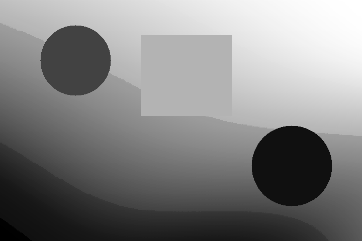

Manip Hist Equalized Gray (Imagen 23).


Ecualización de histograma en escala de grises para reforzar contraste local/global en intensidades.

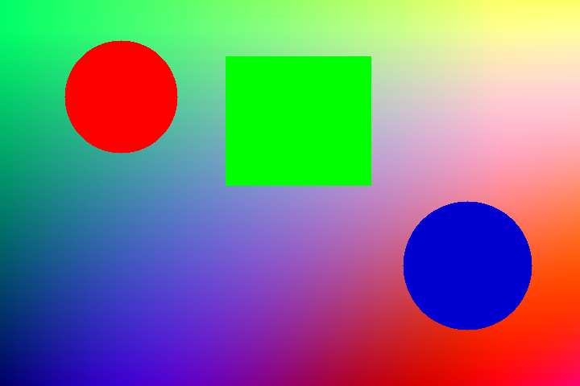

Manip White Balance (Imagen 24).


Balance de blancos basado en Gray-World, compensando dominantes cromáticas mediante escalado por canal.

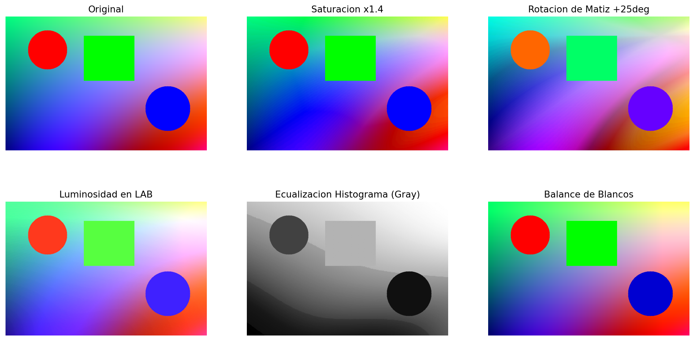

Manipulation Summary (Imagen 25).


Resumen comparativo de todas las manipulaciones de color aplicadas en esta etapa.

### 6) Color grading

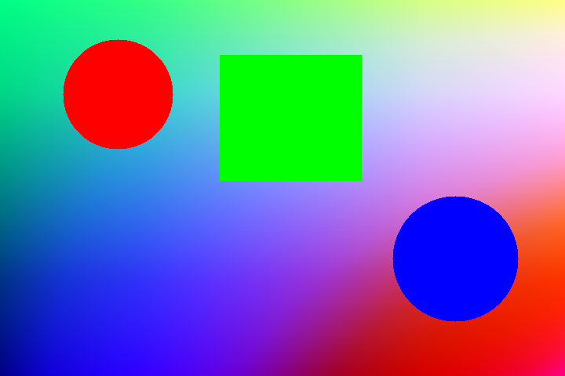

Grading LUT Curves (Imagen 26).


Aplicación de curvas LUT para re-mapear tonalidades y contraste en los tres canales de color.

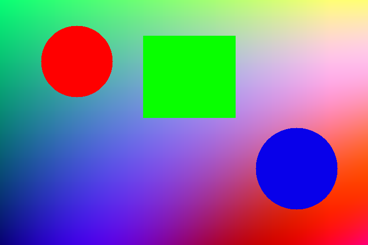

Grading Warm Tone (Imagen 27).


Gradación cálida reforzando rojos y atenuando azules para una estética de temperatura alta.

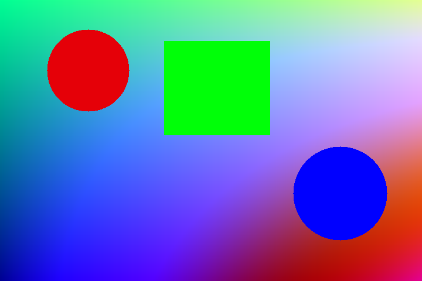

Grading Cool Tone (Imagen 28).


Gradación fría incrementando componente azul y moderando roja para un look de temperatura baja.

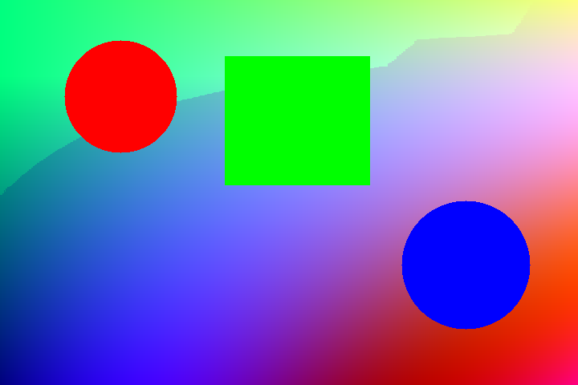

Grading Selective Color (Imagen 29).


Ajuste selectivo de verdes usando máscara HSV para intervenir un rango cromático específico.

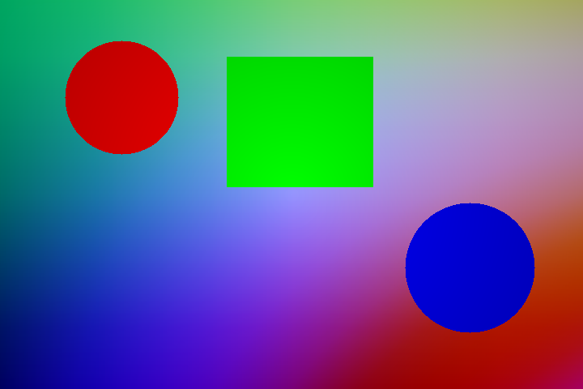

Grading Instagram Style (Imagen 30).


Filtro estilo Instagram/vintage combinando curva tonal suave y viñeteado radial.

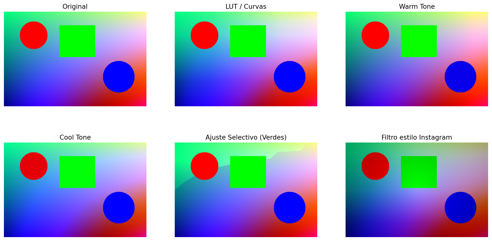

Grading Summary (Imagen 31).


Composición resumen de resultados de color grading frente a la imagen original.

### 7) Paletas y armonías cromáticas

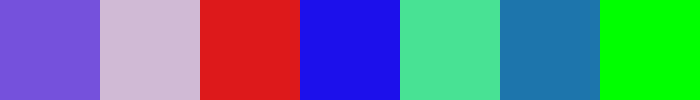

Palette Dominant Colors (Imagen 32).


Paleta dominante (7 colores) extraída por K-means, ordenada por frecuencia de aparición en la imagen.

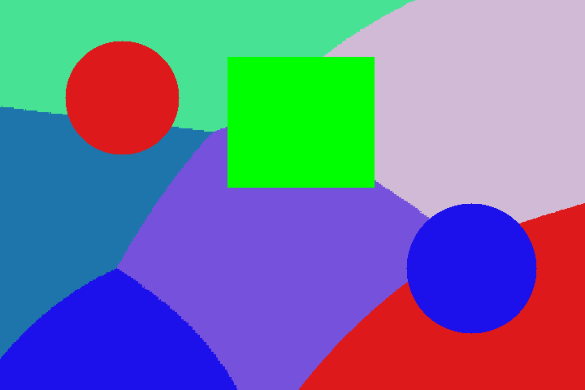

Palette Applied Quantized (Imagen 33).


Imagen cuantizada usando centros de clúster de K-means para reducir variedad cromática conservando estructura.

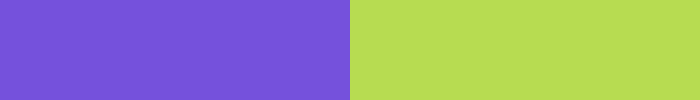

Palette Complementary (Imagen 34).


Armonía complementaria construida desde el color dominante y su opuesto en matiz.

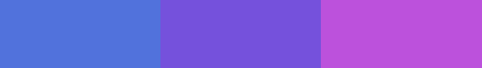

Palette Analogous (Imagen 35).


Armonía análoga basada en desplazamientos pequeños de matiz alrededor del color dominante.

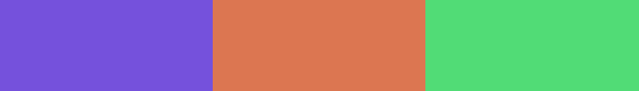

Palette Triadic (Imagen 36).


Armonía triádica generada con separación angular de matiz para alto contraste cromático balanceado.

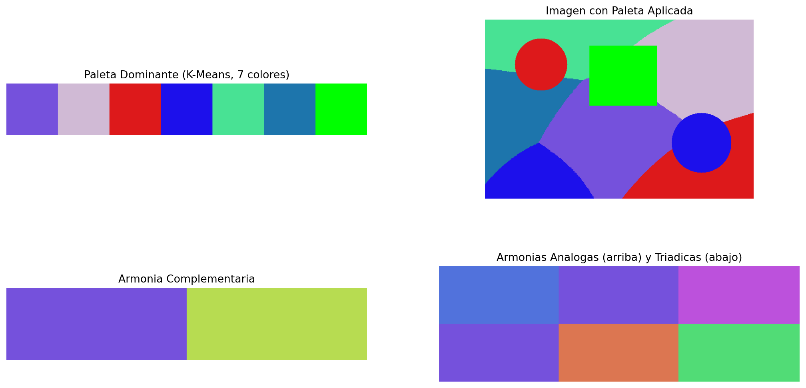

Palette Summary (Imagen 37).


Resumen de paletas: dominante, cuantización aplicada y bloques de armonías complementaria/análoga/triádica.

### 8) Histogramas y realce

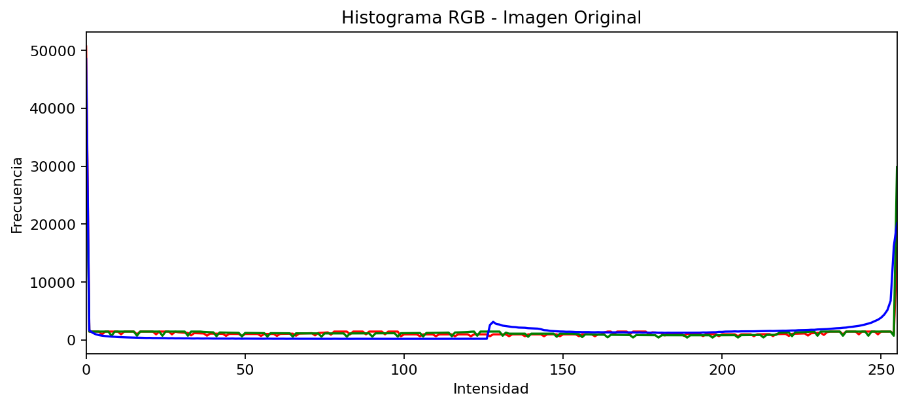

Histogram RGB (Imagen 38).


Histograma por canales RGB de la imagen original, útil para identificar distribución de intensidades y picos por color.

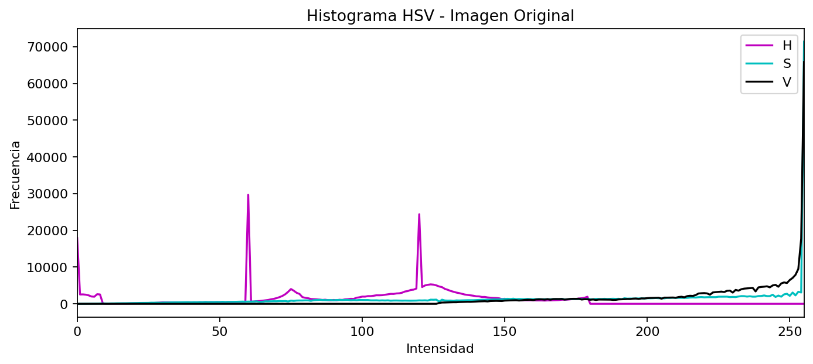

Histogram HSV (Imagen 39).


Histograma de canales HSV (H, S, V) para analizar comportamiento de matiz, saturación y valor.

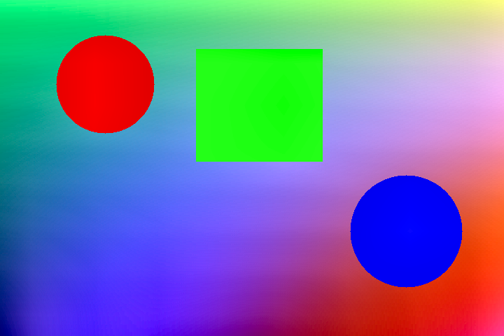

Histogram CLAHE (Imagen 40).


Resultado de CLAHE aplicado sobre luminancia (canal L en LAB), mejorando contraste local sin sobreexposición global.


Histogram Matching (Imagen 41).


Resultado de histogram matching, ajustando la imagen original hacia la distribución tonal de una referencia cálida.

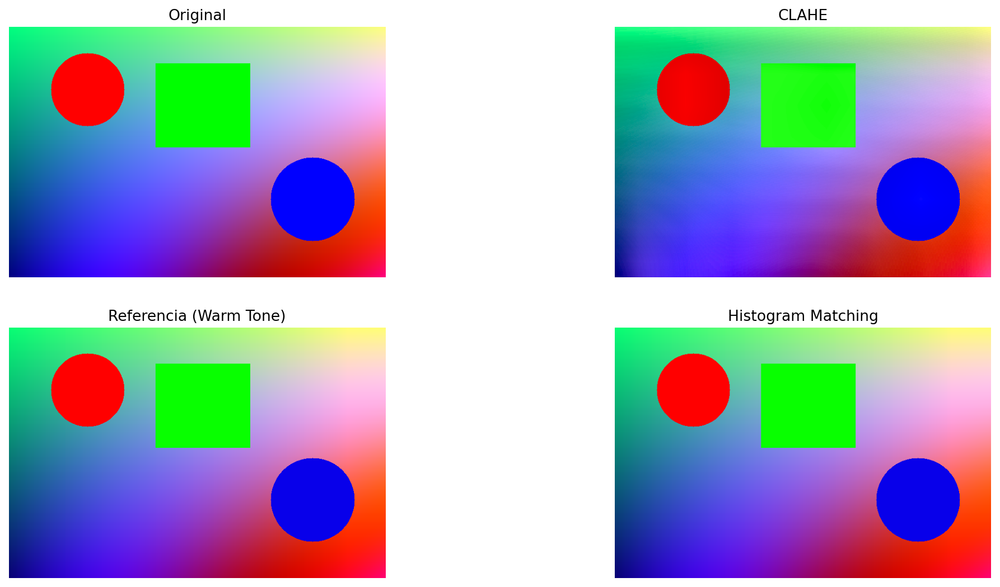

Histogram Summary (Imagen 42).


Comparativa final entre original, CLAHE, referencia warm tone y salida de matching de histogramas.

---

## Código relevante

Los siguientes fragmentos fueron tomados y sintetizados del notebook de Python porque concentran las decisiones técnicas centrales del taller.

### 1) Conversión a múltiples espacios de color

```python
hsv_image = cv2.cvtColor(image_rgb, cv2.COLOR_RGB2HSV)
hsl_image = cv2.cvtColor(image_rgb, cv2.COLOR_RGB2HLS)
lab_image = cv2.cvtColor(image_rgb, cv2.COLOR_RGB2LAB)
ycrcb_image = cv2.cvtColor(image_rgb, cv2.COLOR_RGB2YCrCb)
gray_image = cv2.cvtColor(image_rgb, cv2.COLOR_RGB2GRAY)
```

Qué hace: convierte la misma imagen base a los espacios exigidos por la guía.
Por qué se escogió: es el núcleo del taller; habilita todas las etapas posteriores (segmentación, manipulación y análisis).

### 2) Segmentación por rangos HSV y limpieza morfológica

```python
mask_blue = cv2.inRange(seg_hsv, lower_blue, upper_blue)
mask_green = cv2.inRange(seg_hsv, lower_green, upper_green)
mask_red = cv2.inRange(seg_hsv, lower_red_1, upper_red_1) | cv2.inRange(seg_hsv, lower_red_2, upper_red_2)

kernel = np.ones((5, 5), np.uint8)
def clean_mask(mask: np.ndarray) -> np.ndarray:
  opened = cv2.morphologyEx(mask, cv2.MORPH_OPEN, kernel)
  closed = cv2.morphologyEx(opened, cv2.MORPH_CLOSE, kernel)
  return closed
```

Qué hace: detecta colores por umbrales en HSV y reduce ruido con apertura/cierre.
Por qué se escogió: muestra una solución robusta de segmentación cromática realista, más allá de umbrales simples.

### 3) Manipulación de saturación y matiz

```python
def adjust_saturation(image_rgb: np.ndarray, factor: float) -> np.ndarray:
  hsv = cv2.cvtColor(image_rgb, cv2.COLOR_RGB2HSV).astype(np.float32)
  hsv[..., 1] = np.clip(hsv[..., 1] * factor, 0, 255)
  return cv2.cvtColor(hsv.astype(np.uint8), cv2.COLOR_HSV2RGB)

def rotate_hue(image_rgb: np.ndarray, degrees: float) -> np.ndarray:
  shift = int(round(degrees / 2.0))
  hsv = cv2.cvtColor(image_rgb, cv2.COLOR_RGB2HSV)
  hsv[..., 0] = (hsv[..., 0].astype(np.int16) + shift) % 180
  return cv2.cvtColor(hsv, cv2.COLOR_HSV2RGB)
```

Qué hace: controla saturación y rotación tonal en HSV con límites válidos para OpenCV.
Por qué se escogió: demuestra manipulación cromática controlada en un espacio más intuitivo que RGB.

### 4) Color grading con LUT y filtro estilizado

```python
def apply_channel_lut(image_rgb: np.ndarray, x_points: np.ndarray, y_points: np.ndarray) -> np.ndarray:
  lookup_table = np.interp(np.arange(256), x_points, y_points).astype(np.uint8)
  return cv2.LUT(image_rgb, lookup_table)

def instagram_style_filter(image_rgb: np.ndarray) -> np.ndarray:
  curve_x = np.array([0, 40, 128, 220, 255], dtype=np.float32)
  curve_y = np.array([0, 30, 150, 235, 255], dtype=np.float32)
  curved = apply_channel_lut(image_rgb, curve_x, curve_y)
  # ... calculo de viñeteado radial ...
  return filtered
```

Qué hace: aplica remapeo tonal por tabla LUT e incorpora estética tipo vintage.
Por qué se escogió: ejemplifica edición creativa de color, uno de los objetivos prácticos del taller.

### 5) Extracción de paleta dominante con K-means

```python
def extract_palette_kmeans(image_rgb: np.ndarray, k: int = 7):
  pixels = image_rgb.reshape(-1, 3).astype(np.float32)
  criteria = (cv2.TERM_CRITERIA_EPS + cv2.TERM_CRITERIA_MAX_ITER, 40, 0.2)
  _compactness, labels, centers = cv2.kmeans(
    pixels, k, None, criteria, 8, cv2.KMEANS_PP_CENTERS
  )
  return centers.astype(np.uint8), labels.flatten()
```

Qué hace: agrupa píxeles por similitud cromática y obtiene colores representativos.
Por qué se escogió: conecta teoría de color con análisis cuantitativo y síntesis de paletas.

### 6) CLAHE + Histogram Matching

```python
lab_for_clahe = cv2.cvtColor(image_rgb, cv2.COLOR_RGB2LAB)
l_channel, a_channel, b_channel = cv2.split(lab_for_clahe)
clahe = cv2.createCLAHE(clipLimit=2.0, tileGridSize=(8, 8))
l_clahe = clahe.apply(l_channel)
clahe_image = cv2.cvtColor(cv2.merge((l_clahe, a_channel, b_channel)), cv2.COLOR_LAB2RGB)

matched_image = exposure.match_histograms(image_rgb, warm_tone_image, channel_axis=-1)
```

Qué hace: mejora contraste local y adapta distribución tonal a una imagen de referencia.
Por qué se escogió: cubre el bloque de análisis radiométrico y comparación de distribuciones de intensidad.

---

## Prompts utilizados


1. "Genera un notebook en Python con OpenCV y Matplotlib que cargue una imagen RGB y la convierta a HSV, HLS, LAB, YCrCb y escala de grises, mostrando una cuadrícula comparativa."
2. "Escribe una función reusable para visualizar canales individuales de una imagen multicanal y exportar la figura en carpeta media con prefijo python_."
3. "Dame código para segmentar azul, verde y rojo en HSV (OpenCV), incluyendo doble rango para rojo y limpieza morfológica con apertura y cierre."
4. "Implementa en Python funciones para aumentar saturación, rotar matiz en grados, ajustar luminosidad en LAB y hacer balance de blancos con método Gray-World."
5. "Crea un módulo de color grading con LUT por interpolación, warm tone, cool tone, ajuste selectivo de verdes y filtro estilo Instagram con viñeteado suave."
6. "Extrae colores dominantes con K-means (k=7), ordénalos por frecuencia, genera paletas complementaria/análoga/triádica y aplica cuantización de color a la imagen."
7. "Grafica histogramas RGB y HSV, aplica CLAHE sobre canal L de LAB y realiza histogram matching usando scikit-image con una imagen referencia cálida."
8. "Construye una visualización 3D de píxeles en espacio RGB y otra representación cilíndrica aproximada de HSV usando muestreo aleatorio de píxeles."
9. "Escribe una celda final que liste automáticamente todos los archivos exportados en media para verificar que el pipeline guardó todos los resultados."

---

## Aprendizajes y dificultades

### Aprendizajes

Se reforzó la diferencia conceptual y práctica entre espacios orientados a dispositivos (RGB) y espacios más útiles para tareas específicas de visión por computador (HSV para segmentación, LAB para luminancia perceptual, YCrCb para separar componentes cromáticas). También se afianzó el uso de transformaciones de color como base para pipelines de edición, análisis radiométrico y extracción de información visual.

Además, se consolidó la construcción de flujos reproducibles de análisis en notebook: funciones modulares, exportación sistemática de resultados y visualizaciones comparativas para interpretar mejor los efectos de cada técnica.

### Dificultades

Una dificultad importante fue ajustar umbrales de segmentación para obtener máscaras limpias y coherentes en presencia de gradientes de fondo. Se resolvió combinando rangos HSV bien definidos y operaciones morfológicas para eliminar ruido y cerrar regiones.

Otra dificultad fue mantener un balance entre realce visual y preservación de color natural al aplicar grading y ajustes de histograma. Se abordó calibrando parámetros (factores de escala, curvas y límites) y validando visualmente cada salida frente a la imagen original.

### Mejoras futuras

Como mejora, se puede incorporar evaluación cuantitativa de calidad (SSIM, métricas de contraste local, desviación cromática) para complementar la inspección visual. También sería útil extender el taller a imágenes reales más variadas y automatizar selección de umbrales con estrategias adaptativas o aprendizaje automático.

---

## Contribuciones grupales

- Juan David Buitrago Salazar: lideró la arquitectura del notebook, implementó el pipeline completo de conversiones, segmentación HSV, manipulación de color, color grading, paletas con K-means, análisis de histogramas y consolidación de resultados en media.
- Juan David Cardenas Galvis: apoyó la validación visual de resultados por bloque, revisión de consistencia en figuras comparativas y ajuste de presentación técnica.
- Nicolás Rodríguez Piraban: contribuyó en revisión metodológica de rangos de color y depuración conceptual de la sección de segmentación y análisis cromático.
- Camilo Andres Medina Sanchez: apoyó la organización de evidencias, verificación de exportación de archivos y control de trazabilidad entre celdas y salidas.
- Juan Felipe Fajardo Garzón: colaboró en revisión final de documentación, estructura del README y chequeo de coherencia entre objetivos y resultados del taller.

---

## Estructura del proyecto

```
semana_04_4_conversion_espacios_color/
├── python/
│   ├── conversion_espacios_color.ipynb
│   └── semana_04_4_conversion_espacios_color.md
├── media/
│   └── python_*.png
└── 04_plantilla_readme_entregas_talleres.md
```

---

## Referencias

- OpenCV Documentation: https://docs.opencv.org/
- scikit-image Documentation: https://scikit-image.org/docs/stable/
- Matplotlib Documentation: https://matplotlib.org/stable/
- NumPy Documentation: https://numpy.org/doc/

---

## Checklist de entrega

- [x] Carpeta del taller creada y organizada
- [x] Implementación funcional en Python
- [x] Resultados visuales incluidos desde media
- [x] README con secciones completas solicitadas
- [x] Snippets de código extraídos del notebook
- [x] Contribuciones grupales documentadas

---
