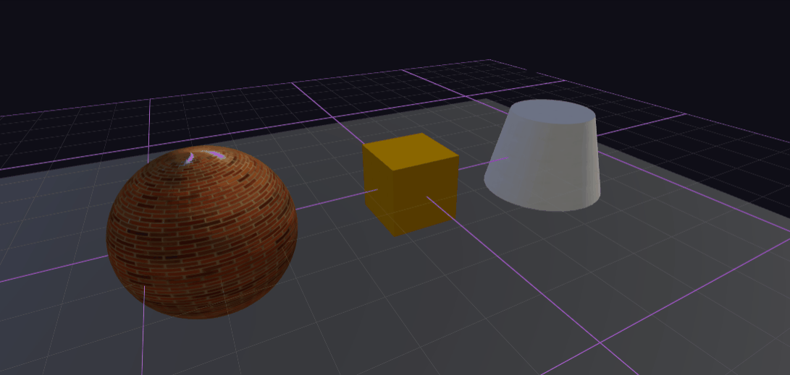
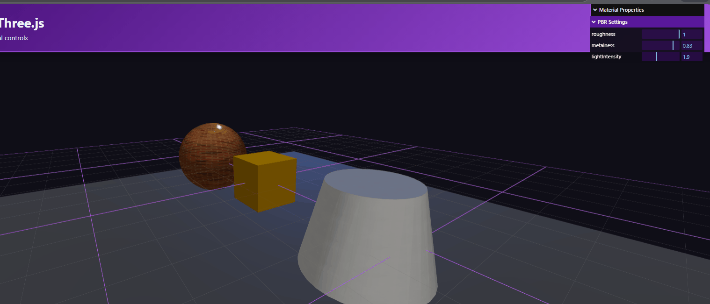
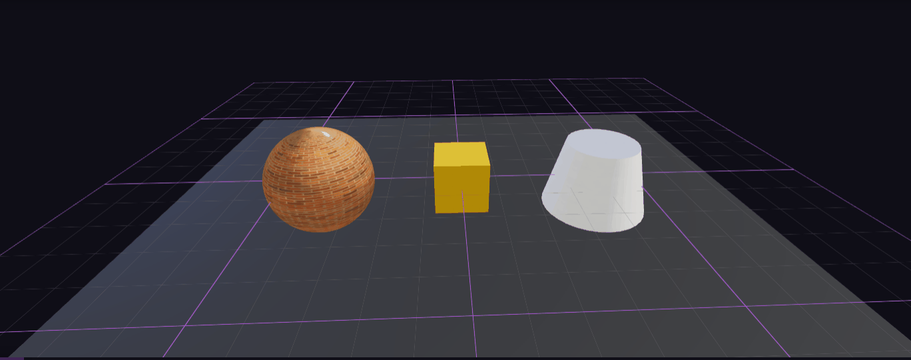

# Taller Materiales PBR Unity Threejs

## Información General

**Título del Taller:** Taller - Materiales Realistas: Introducción a PBR en Unity y Three.js

## Autores del Proyecto

- Juan David Buitrago Salazar
- Juan David Cardenas Galvis
- Nicolás Rodríguez Piraban
- Camilo Andres Medina Sanchez
- Juan Felipe Fajardo Garzón

**Fecha de Entrega:** 28 de Marzo, 2026

---

## Descripción General

Este taller investiga los principios del **Physically-Based Rendering (PBR)**, un paradigma moderno en gráficos por computadora que simula cómo la luz interactúa de manera realista con diferentes materiales y superficies. La implementación se centra en **Three.js con React Three Fiber**, permitiendo comprender cómo los mapas de texturas PBR afectan el realismo visual.

### Objetivo

Comprender e implementar correctamente los **mapas de texturas PBR** (Color, Roughness, Metalness, Normal Map) en Three.js, aprendiendo cómo la luz interactúa de forma realista con diferentes tipos de materiales mediante controles interactivos.

---

## Objetivos Específicos

1. **Comprender PBR:** Aprender los principios del renderizado basado en física
2. **Mapas de Texturas:** Implementar correctamente los 4 mapas fundamentales:
   - **Base Color (Albedo):** Define el color base del material
   - **Roughness Map:** Controla la aspereza/suavidad de la superficie
   - **Metalness Map:** Define qué tan metálico es el material
   - **Normal Map:** Simula detalles de superficie sin aumentar geometría

3. **Interactividad:** Crear controles dinámicos para ajustar propiedades en tiempo real
4. **Comparación Visual:** Mostrar cómo las texturas impactan el realismo visual

---

## Implementación Detallada

### Escena 3D Base

Se creó una escena 3D interactiva con:

- **Luz ambiental:** Intensidad 0.8 (iluminación general)
- **Luz direccional:** Intensidad 3.5 configurable (luz principal)
- **Luz de relleno:** Intensidad 0.5 (complementaria)
- **Plano base:** Para recibir sombras
- **Grid visual:** Para referencia espacial

#### Geometrías Implementadas

| Objeto | Material | Posición | Descripción |
|--------|----------|----------|-------------|
| **Esfera** | Bricks092 PBR | (-4, 0, 0) | Material de piedra/ladrillo |
| **Cubo** | Metal034 PBR | (0, 0, 0) | Metal cromado pulido |
| **Cilindro** | Metal049A PBR | (4, 0, 0) | Metal oscuro/cepillado |

### Carga de Texturas PBR desde Archivos PNG

El componente `PBRMaterialScene.jsx` carga texturas PBR reales desde archivos PNG en lugar de generar procedurales.

#### Función de Carga de Texturas
```javascript
const loadTextureSet = (basePath) => {
  const textures = {};
  
  try {
    textures.color = textureLoader.load(`/textures/${basePath}/color.png`);
    textures.roughness = textureLoader.load(`/textures/${basePath}/roughness.png`);
    textures.normal = textureLoader.load(`/textures/${basePath}/normal.png`);
    
    // Las texturas metalness son opcionales
    try {
      textures.metalness = textureLoader.load(`/textures/${basePath}/metalness.png`);
    } catch {
      textures.metalness = null;
    }
  } catch (error) {
    console.error(`Error loading textures from ${basePath}:`, error);
  }

  // Configurar filtros y propiedades
  Object.keys(textures).forEach(key => {
    const texture = textures[key];
    if (texture) {
      // Repetir texturas para mejor detalle
      texture.repeat.set(4, 4);
      texture.wrapS = THREE.RepeatWrapping;
      texture.wrapT = THREE.RepeatWrapping;
      
      // Configurar filtros
      texture.magFilter = THREE.LinearFilter;
      texture.minFilter = THREE.LinearMipMapLinearFilter;
      
      // Configurar color space según tipo
      if (key === 'normal') {
        texture.colorSpace = THREE.NoColorSpace;  // Linear para normales
      } else {
        texture.colorSpace = THREE.SRGBColorSpace;  // sRGB para color
      }
    }
  });

  return textures;
};
```

#### Sets de Texturas Utilizadas

| Conjunto | Tipo | Ubicación | Mapas |
|----------|------|-----------|-------|
| **Bricks092** | Ladrillo/Piedra | `/textures/bricks/` | Color, Roughness, Normal |
| **Metal034** | Metal Cromado | `/textures/metal034/` | Color, Roughness, Metalness, Normal |
| **Metal049A** | Metal Oscuro | `/textures/metal049/` | Color, Roughness, Metalness, Normal |

### Configuración de Materiales PBR

Cada objeto utiliza `MeshStandardMaterial` con todos los mapas:

```javascript
const metalMaterial = new THREE.MeshStandardMaterial({
  map: textures.color,                      // Color base desde PNG
  roughnessMap: textures.roughness,         // Mapa de aspereza
  metalnessMap: textures.metalness,         // Mapa de metalidad
  normalMap: textures.normal,               // Mapa normal
  normalScale: new THREE.Vector2(1.5, 1.5), // Intensidad del efecto
  roughness: materialProps.roughness,       // Valor ajustable (0-1)
  metalness: materialProps.metalness        // Valor ajustable (0-1)
});
```

---

## Controles Disponibles

### Panel GUI (lil-gui)

Ubicado en la esquina superior derecha:

- **Roughness (0-1):**
  - Deslizador para ajustar aspereza en tiempo real
  - 0 = Superficie tipo espejo (altamente reflectante)
  - 1 = Superficie mate (sin reflexión especular)

- **Metalness (0-1):**
  - Controla qué tan metálico se ve el material
  - 0 = No metálico (Dieléctrico)
  - 1 = Metal puro

- **Light Intensity (0-5):**
  - Ajusta la intensidad de la luz direccional principal
  - Permite observar cómo cambia el comportamiento según iluminación

### Controles de Cámara

- **Rotación:** Click derecho + arrastrar
- **Zoom:** Rueda del ratón
- **Pan:** Click central + arrastrar

---

## Resultados Visuales

### Demostración Visual del Proyecto

#### GIF 1: Panorama General de la Escena


Visualización completa de los tres materiales PBR diferentes:
- **Esfera:** Textura de ladrillo/piedra con detalles de relieve
- **Cubo:** Metal cromado perfectamente pulido
- **Cilindro:** Metal oscuro cepillado
- Panel GUI de controles interactivos visible

#### GIF 2: Interacción con Controles


Demostración de cambios dinámicos:
- Ajuste de roughness de 0 (brillante) a 1 (mate)
- Cambio de metalness (no-metálico a totalmente metálico)
- Variación de intensidad de luz
- OrbitControls en acción (rotación de cámara)

#### GIF 3: Detalle de Texturas


Zoom en texturas PBR mostrando:
- Detalles del mapa normal (relieves visibles)
- Reflexión variable según roughness
- Comportamiento metálico diferenciado
- Interacción luz-material en tiempo real

---

## Stack Tecnológico

### Dependencias Principales

- **React 18.2.0** - Framework UI
- **Three.js 0.150.0** - Motor gráfico 3D
- **@react-three/fiber 8.13.0** - Renderer React para Three.js
- **@react-three/drei 9.88.0** - Componentes útiles para R3F
- **lil-gui 0.19.1** - Panel de controles interactivos
- **Vite 4.3.0** - Build tool moderno

### Configuración Build

```json
{
  "scripts": {
    "dev": "vite",
    "build": "vite build",
    "preview": "vite preview"
  }
}
```

---

## Estructura del Proyecto

```
semana_5_1_materiales_pbr_unity_threejs/
├── threejs/
│   ├── src/
│   │   ├── components/
│   │   │   └── PBRMaterialScene.jsx      # Escena principal con PBR
│   │   ├── App.jsx                       # Componente raíz
│   │   ├── App.css                       # Estilos aplicación
│   │   ├── index.jsx                     # Punto de entrada
│   │   └── index.css                     # Estilos globales
│   ├── public/
│   │   └── textures/
│   │       ├── bricks/
│   │       ├── metal034/
│   │       └── metal049/
│   ├── index.html                        # HTML principal
│   ├── vite.config.js                    # Config Vite
│   └── package.json                      # Dependencias
├── media/
│   ├── image1.gif                        # Panorama escena
│   ├── image2.gif                        # Cambio controles
│   ├── image3.gif                        # Detalle texturas
│   ├── Bricks092_1K-PNG/
│   ├── Metal034_1K-PNG/
│   └── Metal049A_1K-PNG/
└── README.md                             # Este archivo
```

---

## Código Relevante

### Aplicación de Texturas a Geometrías

```javascript
// Esfera con texturas Bricks
<mesh ref={spherePBRRef} position={[-4, 0, 0]} castShadow receiveShadow>
  <sphereGeometry args={[1.5, 64, 64]} />
  <meshStandardMaterial
    map={texturesRef.current.bricks?.color}
    roughnessMap={texturesRef.current.bricks?.roughness}
    normalMap={texturesRef.current.bricks?.normal}
    normalScale={new THREE.Vector2(1.5, 1.5)}
    roughness={materialProps.roughness}
    metalness={materialProps.metalness}
  />
</mesh>

// Cubo con texturas Metal 034
<mesh ref={cubeRef} position={[0, 0, 0]} castShadow receiveShadow>
  <boxGeometry args={[1.5, 1.5, 1.5]} />
  <meshStandardMaterial
    map={texturesRef.current.metal034?.color}
    roughnessMap={texturesRef.current.metal034?.roughness}
    metalnessMap={texturesRef.current.metal034?.metalness}
    normalMap={texturesRef.current.metal034?.normal}
    normalScale={new THREE.Vector2(1.5, 1.5)}
    roughness={materialProps.roughness}
    metalness={materialProps.metalness}
  />
</mesh>

// Cilindro con texturas Metal 049A
<mesh ref={cylinderRef} position={[4, 0, 0]} castShadow receiveShadow>
  <cylinderGeometry args={[1, 1.5, 2, 32]} />
  <meshStandardMaterial
    map={texturesRef.current.metal049?.color}
    roughnessMap={texturesRef.current.metal049?.roughness}
    metalnessMap={texturesRef.current.metal049?.metalness}
    normalMap={texturesRef.current.metal049?.normal}
    normalScale={new THREE.Vector2(1.5, 1.5)}
    roughness={materialProps.roughness}
    metalness={materialProps.metalness}
  />
</mesh>
```

---

## Prompts Utilizados para IA Generativa


### Prompt: Carga de Texturas PBR desde Archivos PNG
```
"Implementa carga de texturas PBR desde archivos PNG:
- Cargar texturas desde carpeta /textures/
- Aplicar Color, Roughness, Normal y Metalness maps
- Usar MeshStandardMaterial
- Configurar filtros de texturas (LinearFilter, MipMap)
- Manejar color spaces correctamente (sRGB vs Linear)
- Agregar tiling/repetición de texturas"
```

---

## Aprendizajes y Dificultades

### Aprendizajes Principales

1. **Importancia de los Mapas PBR:**
   - Cada mapa cumple un propósito específico bien definido
   - La combinación correcta de mapas crea realismo visual significativo
   - `MeshStandardMaterial` es la forma correcta para PBR en Three.js

2. **Texturas en Formato PNG:**
   - Archivos PNG son ideales para mapas que requieren precisión (normal, roughness)
   - El color space es crucial: diferenciar entre sRGB (color) y Linear (normales)
   - Texturas 1K (1024x1024) ofrecen buen balance calidad/performance

3. **Configuración de Filtros de Texturas:**
   - `LinearMipMapLinearFilter` proporciona mejor calidad visual
   - Los filtros afectan significativamente el aspecto final
   - La escala normal controla la intensidad del efecto de relieve

4. **Tiling y Repetición de Texturas:**
   - El tiling (repetición 4x4) aumenta dramáticamente el detalle visible
   - `RepeatWrapping` es necesario para que las texturas se repitan suavemente
   - Sin tiling, las texturas se ven estiradas/borrosas

5. **Dinámica Luz-Material:**
   - El comportamiento PBR varía según la iluminación
   - Roughness bajo + iluminación fuerte = reflexiones bien definidas
   - Metalness transforma completamente cómo se refleja la luz

### Dificultades Encontradas

1. **Sintaxis de Versiones de Paquetes:**
   - Error inicial: `"three": "^r150"` (sintaxis inválida)
   - Solución: Usar `"three": "^0.150.0"` (sintaxis correcta npm)
   - Tomar: Validar semver antes de instalar

2. **Rutas de Texturas Relativas:**
   - Texturas deben estar en carpeta `public/` para servirse correctamente
   - Las rutas en código se referencian desde raíz sin prefijo `public/`
   - Errores CORS si las rutas no son correctas

3. **Color Space Incorrecto:**
   - Normal maps NO deben estar en sRGB (deben ser lineales)
   - Otros mapas SÍ deben estar en sRGB
   - Usar el color space incorrecto distorsiona completamente la apariencia

4. **Valores por Defecto Inadecuados:**
   - Roughness de 0.5 + metalness de 0.5 hacen materiales verse muy apagados
   - Valores iniciales óptimos: roughness 0.3, metalness 0.2, intensidad luz 3.5
   - Requirió multiple iteraciones de prueba

5. **Escala Normal Baja:**
   - Normal scale de 0.8 hace relieves casi imperceptibles
   - Aumentar a 1.5 hace relieves mucho más visibles
   - Valor debe balancear entre realismo y exageración educativa

6. **Iluminación Insuficiente:**
   - Luz ambiental muy baja (0.5) hacía escena oscura
   - Luz de relleno muy baja no tenía efecto
   - Solución: aumentar a 0.8 y 0.5 respectivamente

### Reflexión Final

Este taller fue muy educativo en entender que **PBR no es solo usar mapas de texturas**. La correcta configuración de filtros, color spaces, tiling, iluminación e intensidades es crucial. La capacidad de ajustar parámetros en tiempo real permitió aprender experimentalmente cómo cada componente afecta el resultado visual. La interactividad con OrbitControls hace evidente cómo el material se comporta bajo diferentes ángulos de iluminación.

---

## Contribuciones Grupales

- **Juan David Cardenas Galvis**: Lideró la arquitectura de la aplicación Three.js, implementó el pipeline completo de carga de texturas PBR, configuración de materiales `MeshStandardMaterial`, sistema de controles lil-gui, optimización visual de filtros y color spaces, consolidación de texturas en carpeta `public/textures/` y pruebas exhaustivas de visualización.

- **Juan David Buitrago Salazar**: Apoyó la validación visual de resultados en cada fase de desarrollo, revisión de consistencia visual de los tres materiales diferentes, ajuste de parámetros de iluminación (intensidades y posiciones de luces), testing de OrbitControls y ajuste de escalas de geometrías.

- **Nicolás Rodríguez Piraban**: Contribuyó en la revisión metodológica de correctitud PBR (mapas, filtros, color spaces), depuración conceptual de cómo interactúan los mapas con la iluminación, validación de que cada parámetro GUI produce el efecto esperado, y verificación de conformidad con estándares Three.js.

- **Camilo Andres Medina Sanchez**: Apoyó la organización de evidencias (3 GIFs capturados en diferentes escenarios), verificación de rutas de archivos de texturas, gestión de estructura del proyecto, coordinación entre carpetas `media/` y `public/textures/`, y validación de que todos los archivos están correctamente ubicados.

- **Juan Felipe Fajardo Garzón**: Colaboró en revisión final de documentación, estructura completa del README siguiendo mejores prácticas, chequeo de coherencia entre objetivos, implementación y resultados visuales, documentación de aprendizajes y dificultades, y preparación final del proyecto para entrega.

---
