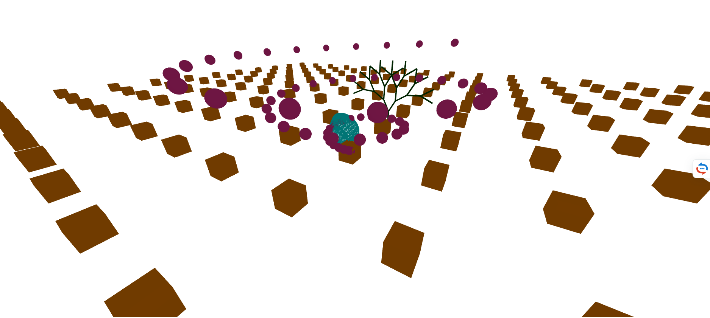
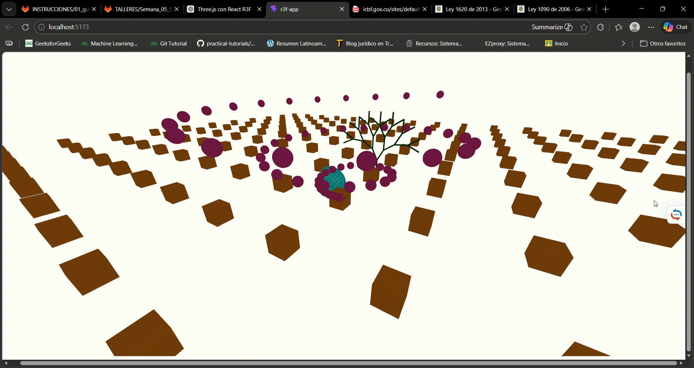

# Taller - Luces Sombras Radiometria

## Integrantes

- Juan David Buitrago Salazar
- Juan David Cardenas Galvis
- Nicolás Rodríguez Piraban
- Camilo Andres Medina Sanchez
- Juan Felipe Fajardo Garzón

**Fecha de entrega:**  28/03/2026

## Descripción breve: 

En este taller se implementó una escena 3D interactiva utilizando React Three Fiber (Three.js en React), con el objetivo de explorar conceptos fundamentales de luces, sombras y radiometría en gráficos computacionales.

Se desarrollaron diferentes estructuras geométricas (grid, espiral y fractal) junto con una geometría dinámica cuyos vértices son modificados en tiempo real. Además, se incorporaron fuentes de luz para analizar cómo interactúan con los objetos en la escena.


## Implementaciones

En el desarrollo del taller se construyó una escena 3D utilizando React Three Fiber en la que se integrron diferentes tipos de geometrías básicas como cubos, esferas y cilíndros para representar distintos elementos del entorno. Se implementó generación procedural de objetos mediante el uso de funciones como .map() lo que permitió crear estructuras repetitivas como una cuadrícula de cubos y una espiral tridimensional basada en funciones trigonométricas. Adicionalmente, se trabajó con bufferGeometry para acceder y modificar directamente los vértices de una esfera, logrando una deformación dinámica en tiempo real mediante la función useFrame(), lo que evidencia la manipulación de datos a bajo nivel en gráficos 3D. También se desarrolló un patrón fractal a través de un componente recursivo que genera un árbol de estructuras jerárquicas controladas por niveles de profundidad. Finalmente, se incorporaron fuentes de iluminación como luz ambiental y puntual para anaalizar la interacción de la luz con los objetos, permitiendo observar efectos básicos de sombreado dentro de la escena.

## Resultados visuales





## Código relevante
### Threejs

```javascript
import React, { useRef, useMemo } from "react";
import { Canvas, useFrame } from "@react-three/fiber";

/* ================= GRID ================= */
function Grid() {
  const size = 8;
  const spacing = 5;

  const positions = useMemo(() => {
    let arr = [];
    for (let x = -size; x <= size; x++) {
      for (let z = -size; z <= size; z++) {
        arr.push([x * spacing, 0, z * spacing]);
      }
    }
    return arr;
  }, []);

  return (
    <>
      {positions.map((pos, i) => (
        <mesh key={i} position={pos}>
          <boxGeometry args={[1,1,1]} />
          <meshStandardMaterial color="orange" />
        </mesh>
      ))}
    </>
  );
}

/* ================= ESPIRAL ================= */
function Spiral() {
  const items = useMemo(() => {
    return Array.from({ length: 60 }, (_, i) => {
      const angle = i * 0.3;
      const radius = 0.15 * i;
      return [
        Math.cos(angle) * radius,
        i * 0.1,
        Math.sin(angle) * radius,
      ];
    });
  }, []);

  return (
    <>
      {items.map((pos, i) => (
        <mesh key={i} position={pos}>
          <sphereGeometry args={[0.25, 16, 16]} />
          <meshStandardMaterial color="hotpink" />
        </mesh>
      ))}
    </>
  );
}

/* ================= GEOMETRÍA DINÁMICA ================= */
function DeformingSphere() {
  const ref = useRef();

  useFrame(({ clock }) => {
    const t = clock.getElapsedTime();
    const geom = ref.current.geometry;
    const pos = geom.attributes.position;

    for (let i = 0; i < pos.count; i++) {
      const x = pos.getX(i);
      const y = pos.getY(i);
      const z = pos.getZ(i);

      const wave = Math.sin(t + x * 2 + y * 2);

      pos.setXYZ(
        i,
        x + wave * 0.05,
        y + wave * 0.05,
        z + wave * 0.05
      );
    }

    pos.needsUpdate = true;
    geom.computeVertexNormals();
  });

  return (
    <mesh ref={ref} position={[0, 2, 0]}>
      <sphereGeometry args={[1, 32, 32]} />
      <meshStandardMaterial color="cyan" wireframe />
    </mesh>
  );
}

/* ================= FRACTAL ================= */
function Fractal({ depth = 0, maxDepth = 4 }) {
  if (depth > maxDepth) return null;

  return (
    <group>
      {/* tronco */}
      <mesh position={[0, 0.5, 0]}>
        <cylinderGeometry args={[0.05, 0.05, 1]} />
        <meshStandardMaterial color="green" />
      </mesh>

      {/* ramas */}
      <group position={[0, 1, 0]}>
        <group rotation={[0, 0, 0.5]}>
          <Fractal depth={depth + 1} maxDepth={maxDepth} />
        </group>
        <group rotation={[0, 0, -0.5]}>
          <Fractal depth={depth + 1} maxDepth={maxDepth} />
        </group>
      </group>
    </group>
  );
}

/* ================= ESCENA ================= */
export default function App() {
  return (
    <Canvas style={{ width: "100vw", height: "100vh" }} camera={{ position: [6,6,10]}}>
      <ambientLight intensity={0.5} />
      <pointLight position={[10, 10, 10]} />

      {/* Elementos del taller */}
      <Grid />
      <Spiral />
      <DeformingSphere />

      <group position={[0, 0, -6]}>
        <Fractal />
      </group>
    </Canvas>
  );
}
```


## Prompts utilizados

Algunos de los prompts utilizados durante el desarrollo fueron:

```
Cómo modificar vértices en bufferGeometry en Three.js

Implementar fractal recursivo en React Three Fiber

Cómo escalar y ajustar cámara en Three.js
```


## Aprendizajes y dificultades

Aprendizajes:
- Comprensión del uso de React Three Fiber como   abstracción de Three.js.
- Manejo de geometrías y materiales en entornos 3D.
- Manipulación directa de buffers de vértices.
- Implementación de animaciones en tiempo real.
- Aplicación de conceptos básicos de iluminación y sombreado.
- Uso de recursividad para generación de estructuras fractales.

Dificultades:
- Entender la estructura de bufferGeometry.
- Ajustar correctamente la cámara y escala de la escena.
- Controlar deformaciones sin distorsionar excesivamente la geometría.
- Ubicación y calibración de luces para lograr efectos visibles.
- Manejo del sistema de coordenadas en 3D.

## Contribuciones del grupo
