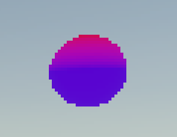
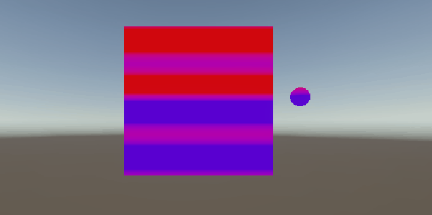

# Taller - Sombras Personalizadas: Primeros Shaders en Unity y Three.js

## Nombres:

- Juan David Buitrago Salazar
- Juan David Cardenas Galvis
- Nicolás Rodríguez Piraban
- Camilo Andres Medina Sanchez
- Juan Felipe Fajardo Garzón

## Fecha de entrega: 

2026/03/28

## Descripción breve:
En este taller se exploró la creación de shaders personalizados en Unity, enfocándose en dos implementaciones principales: un gradiente vertical que cambia el color del objeto según la posición de sus vértices, y un efecto de ondulación temporal que anima los colores utilizando la variable _Time.

## Implementaciones:

### Unity:
Se creó un shader personalizado (Shader_Custom_1.shader) que implementa un gradiente vertical, donde los objetos cambian de color desde un color inferior hasta uno superior según su posición en el eje Y. Posteriormente se añadió un efecto de ondulación temporal que utiliza una función sinusoidal combinada con el tiempo, creando una animación suave que hace que los colores "fluctúen" ligeramente mientras mantienen su gradiente base.

## Resultados visuales:

### Unity:
El shader genera un efecto de gradiente en objetos 3D, donde la parte inferior tiene un color (configurable) y la parte superior otro color, con una transición suave entre ambos. 




Al agregar el efecto de ondulación, los colores del gradiente se animan sutilmente en un patrón de onda que se desplaza con el tiempo.




## Código relevante:
El shader utiliza la posición del vértice en el espacio del mundo para calcular el factor de interpolación del gradiente. La función `saturate()` normaliza la posición Y entre 0 y 1, y `lerp()` mezcla los colores según ese factor. Para la ondulación, se combina `sin()` con `_Time.y` y la posición Y:

```glsl
// Normalizar la posición Y entre 0 y 1
float t = saturate(IN.positionWS.y);

// Efecto de ondulación con el tiempo
float wave = sin(_Time.y * _WaveSpeed + IN.positionWS.y * 2.0);
float waveOffset = wave * _WaveIntensity;

// Interpolación lineal entre color inferior y superior
half4 gradientColor = lerp(_BottomColor, _TopColor, saturate(t + waveOffset));
```

## Prompts utilizados:

"Hola, eres un desarrollador especializado en la creacion de shaders en unity con lenguaje GLSL y archivos HLSL; quiero que leas el archivo shader_custom_1.shader, en el implementa una funcionalidad que cambie el color del objeto según la posicion del vertice, estilo gradiente vertical"

## Aprendizajes y dificultades:

Este taller fue fundamental para comprender cómo funcionan los shaders en Unity, especialmente la pipeline de vertex y fragment shaders. Aprendí a pasar datos desde el vertex shader al fragment shader usando estructuras y a utilizar funciones como `lerp()` y `saturate()` para manipular colores. La principal dificultad fue entender cómo la posición del objeto en el espacio del mundo (positionWS) se relaciona con los vértices y cómo la variable _Time permite crear animaciones suaves sin necesidad de scripts adicionales.

## Estructura del taller

```
semana_5_3_shaders_basicos_unity_threejs/
├── unity/
├── media/ 
└── README.md
```