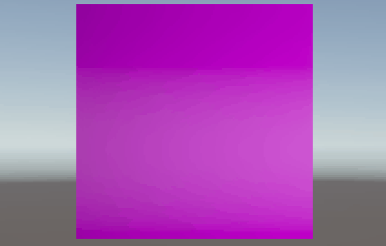
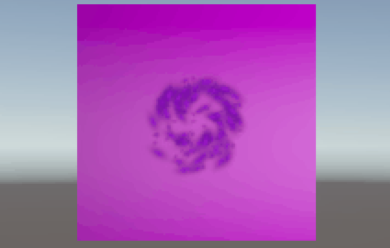

# Taller - Texturizado Creativo: Materiales Dinámicos con Shaders y Datos

## Nombres:

- Juan David Buitrago Salazar
- Juan David Cardenas Galvis
- Nicolás Rodríguez Piraban
- Camilo Andres Medina Sanchez
- Juan Felipe Fajardo Garzón

## Fecha de entrega: 

2026/03/28

## Descripción breve:
En este taller se desarrolló un shader de fuego con color morado dinámico en Unity, implementando variaciones basadas en tiempo. El shader combina múltiples mapas (base, normal y emissive) y utiliza distorsión UV para crear el efecto de fluidez característico de las llamas.

Además de lo anterior mencionado, se implementaron mútiples sistemas de partículas con el fin de simular el efecto de un portal y combinar esto con el shader del fuego

## Implementaciones:

### Unity:
Se creó el archivo `Fire_shader.shader` que implementa un shader de fuego con las siguientes características: color morado dinámico que oscila usando funciones sinusoidales con el tiempo, distorsión UV que combina noise y ondas para simular el movimiento ascendente de las llamas, combinación de tres mapas de textura (base, normal y emissive). Se incluyen propiedades configurables como `_PurpleIntensity`, `_TimeSpeed`, `_DistortionStrength` y `_EmissiveIntensity` para controlar el efecto.

Por otra parte, se hizo uso de una combinación de múltiples sistemas de partículas, las cuales giran y varían su tamaño según su tiempo de vida; esto con el objetivo de generar un efecto portal sobre el plano que contiene el shader del fuego.

## Resultados visuales:

### Unity:

El shader genera un efecto de fuego de color morado que se mueve y oscila constantemente. La distorsión UV crea patrones ondulantes que suben verticalmente, simulando llamas. El color varía entre múltiples tonos morados según el tiempo, y los mapas normal y emissive añaden profundidad y emisión de luz al efecto.




Los diferentes sistemas de partículas combinados y sincronizados generan el efecto de "energía" girando alrededor de un portal, esto se consigue reduciendo el tamaño de la partícula a medida que pasa su tiempo de vida; además, la distorsión de la malla y el color morado terminan de generar el efecto deseado que se presenta a continuación 



## Código relevante:
El shader utiliza una función de noise suavizado para crear la distorsión UV, combinándola con ondas sinusoidales. El color morado dinámico se calcula interpolando entre tres tonos (oscuro, base y brillante) según factores de tiempo:

```glsl
// Distorsión UV para simular fluidez
float noiseVal = smoothNoise(IN.uv * 3.0, time * _DistortionSpeed);
float waveX = sin(IN.uv.y * 10.0 + time * 2.0) * _DistortionStrength;
float waveY = cos(IN.uv.x * 8.0 + time * 1.5) * _DistortionStrength * 0.5;

// Mover UVs hacia arriba (como fuego)
distortedUV.x += waveX + (noiseVal - 0.5) * _DistortionStrength;
distortedUV.y += waveY + time * 0.2;

// Color morado dinámico
float timeFactor = sin(time * 2.0) * 0.5 + 0.5;
float dynamicFactor = timeFactor * 0.4 + mouseEffect * 0.3 + audioEffect * 0.3;
float3 dynamicPurple = lerp(deepPurple, brightPurple, dynamicFactor);
```

Para el sistema de partículas la implementación se realizó directamente en el constructor de Unity

## Prompts utilizados:
"Hola, eres un desarrollador especializado en la creación de shaders en unity con lenguaje GLSL y archivos HLSL; quiero que leas el archivo shader_instructions.md, con base en estas instrucciones quiero que modifiques el archivo fire_shader.shader para implementar lo indicado"

## Aprendizajes y dificultades:
Este taller profundizó en el uso de múltiples mapas de textura en un mismo shader, aprendí a combinar base map, normal map y emissive map para crear efectos más complejos. También entendí cómo la distorsión UV puede transformar una textura estática en algo en movimiento. La principal dificultad fue lograr que la distorsión se moviera en dirección ascendente (como fuego real) sin que el patrón se repitiera, además, por otra parte, el sincronizar mútiples sistemas de partículas para generar un efecto deseado requiere de bastante atención.