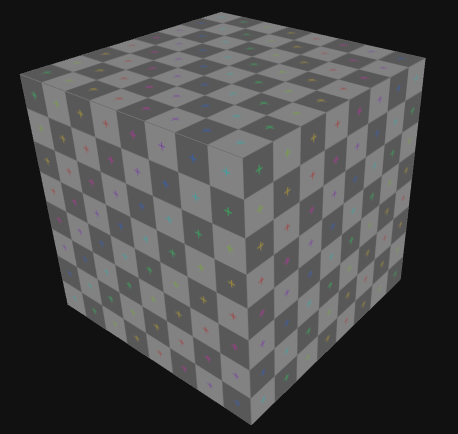
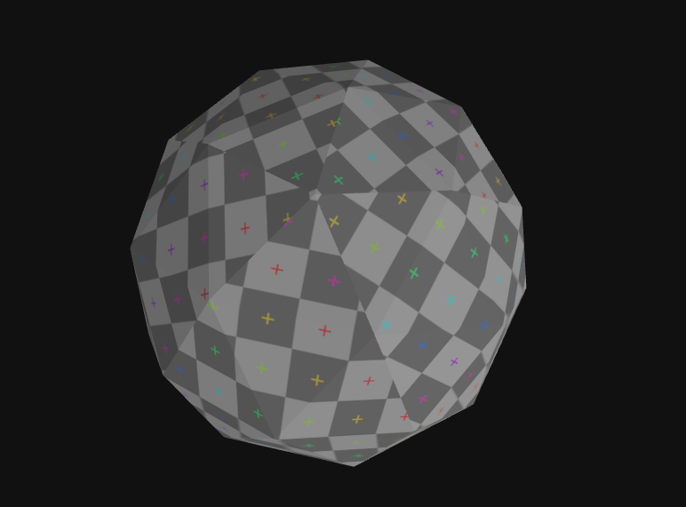
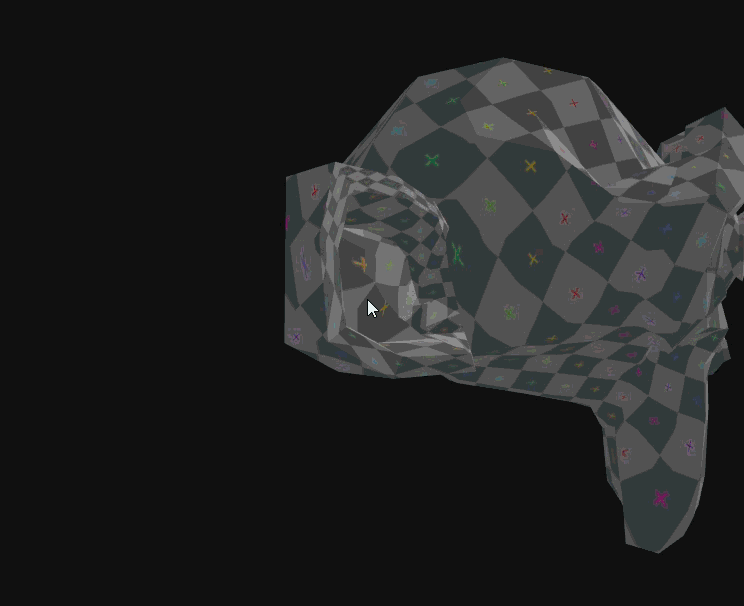

# UV Mapping: Texturas que Encajan
## Nombre del Estudiante 
- Juan David Buitrago Salazar
- Juan David Cardenas Galvis
- Nicolás Rodríguez Piraban
- Camilo Andres Medina Sanchez
- Juan Felipe Fajardo Garzón

## Fecha de Entrega
`2026-03-28`

---

## Descripción Breve

Este taller aborda el mapeo UV aplicado a modelos 3D en Three.js y React Three Fiber, con el objetivo de entender cómo las coordenadas UV proyectan las texturas sobre la geometría y cómo ajustarlas para lograr resultados más fieles a la malla.

---

## Implementaciones

### Three.js / React Three Fiber
En este proyecto se carga un modelo GLTF/OBJ usando useLoader, se aplica una textura 2D mediante TextureLoader y MeshStandardMaterial, y se observa cómo la textura interactúa con las 3 diferentes geometrias (cubo, icosphere, suzanne). Se utiliza una textura uv de prueba y configuraciones de geometría para notar diferencias.

---

## Resultados visuales



Se utilizó una textura generada por blender para aplicarla sobre diferentes objetos. Primero, la más simple, un cubo. Se observa como se ajusta perfectamente y no parece haber ningún tipo de deformación en la superficie de la geometría.



Este otro caso es un icosaedro, donde se evidencia como en algunos vertices de la geometria la textura parece cortarse, sin embargo, no se presenta ningún tipo de transformación.

.

Por último, este gif muestra una interacción con la última geometria usada, en este caso, la mesh llamada suzanne en el software blender. Se aprecia como, para una geometria compleja, la textura parece escalarse, pareciendo más pequeña en algunas partes y más grande en otras.

---

## Código relevante

```javascript
loader.load(
  "figures.glb",
  (gltf) => {
    model = gltf.scene;

    model.traverse((child) => {
      if (child.isMesh) {
        child.material = new THREE.MeshStandardMaterial({
          map: texture,
        });
      }
    });
  },
);
```

Este fragmento de código es simple, y es la forma en como se cargo el modelo y como se aplicó la textura usada.

---
## Prompts utilizados

Durante el desarrollo se emplearon prompts orientados a generar código y entender mejor el mapeo UV para este taller.

```
"Crea un script en threejs que cargue modelos en formato .glb y les aplique una textura en formato .png"

"Explica como puedo modificar la forma en que se aplica la textura al objeto"
```

---
## Aprendizajes y dificultades

Este taller ayudó a la comprensión de como se cargan texturas sobre objetos 3D, además de ver como la geometría del objeto puede afectar a la textura. Una de las dificultades encontradas en este taller fue la creación de la textura. Para solucionar esto se uso Blender, el cual cuenta con una forma bastante sencilla de crear una textura UV de prueba que se uso para aplicarla en el código. Para el futuro, estaría bien poder cambiar entre varias texturas para ver como varían con cada geometria usada.

---

## Contribuciones grupales (si aplica)

Si el taller fue realizado en grupo, describe exactamente lo que cada participante aportó:

- Nicolás Rodríguez Piraban: creación de texturas y objetos en Blender; diseño de UV maps para la escena y exportación a GLTF/GLB para Three.js.
- Juan David Buitrago Salazar: organización y montaje de la escena en Three.js; configuración de iluminación y cámaras para pruebas de UV mapping.
- Juan David Cardenas Galvis: aplicación de texturas a los objetos y refinamiento de UV mapping; verificación visual de estiramientos y tiling.
- Camilo Andres Medina Sanchez: documentación del proceso y desarrollo de prompts y realización del README.
- Juan Felipe Fajardo Garzón: Añadió diferentes modos de visualización para comparar UV maps entre las geometrías.

Si fue individual, indica: "Taller realizado de forma individual."

---

## Estructura del proyecto

```
semana_05_5_uv_mapping_texturas/
├── threejs/         # Código Three.js/React 
├── media/           # Imágenes, videos, GIFs
└── README.md        # Este archivo
```
