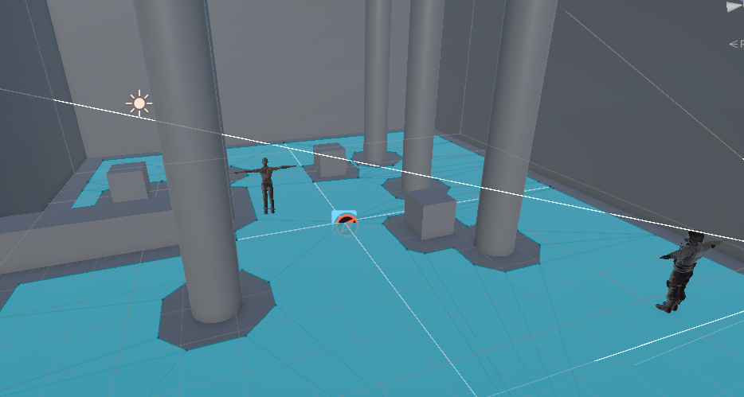
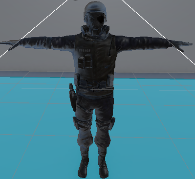
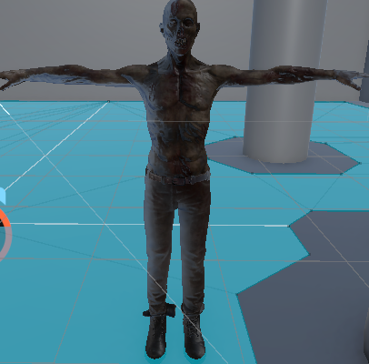
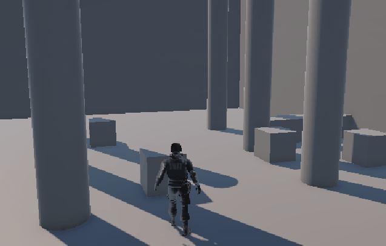
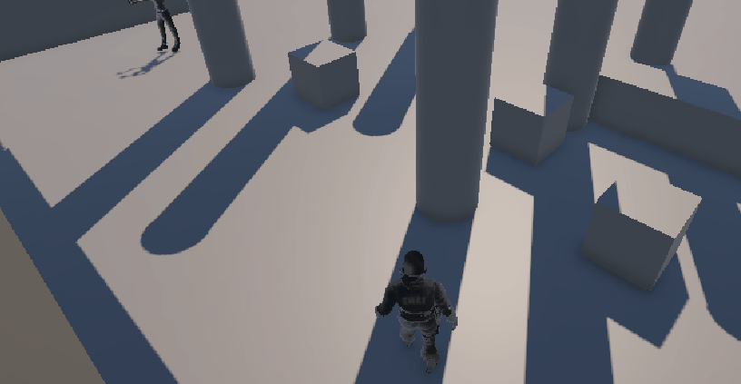
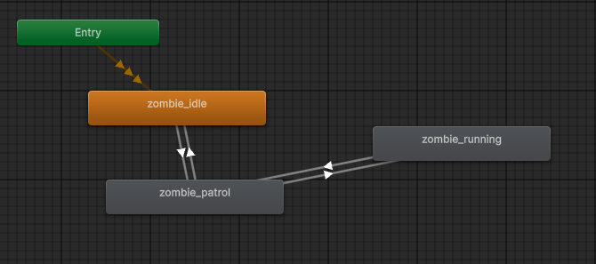
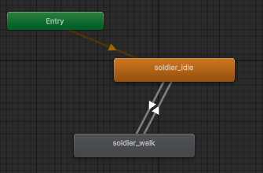

# Taller - Animación con IA en Unity para Personajes Autónomos
## Nombre: 

- Juan David Buitrago Salazar
- Juan David Cardenas Galvis
- Nicolás Rodríguez Piraban
- Camilo Andres Medina Sanchez
- Juan Felipe Fajardo Garzón

## Fecha de entrega: 15/04/2026

## Descripción breve:
En este taller se implementó un sistema de movimiento para un personaje jugador junto con una inteligencia artificial para un enemigo zombi utilizando NavMesh en Unity. El jugador puede moverse por el escenario mientras el zombie patrulla waypoints y persigue al jugador cuando se acerca a su radio de detección.

Además de lo anterior se implementaron animaciones basadas en la velocidad del agente, con el fin de tener multiples movimientos acordes con la rapidéz a la que se desplaza

## Implementaciones:

### Unity:

Inicialmente se creó un escenario simple compuesto de 5 planos, uno para el suelo y los otros 4 representando paredes, luego se agregaron obstáculos para dificultar el movimiento del NPC y del jugador; estos obstáculos son columnas y cajas

Una vez hecho el escenario, se creó un NavMesh para delimitar los espacios "caminables" (el suelo) y los "no caminables" (cajas, columnas y paredes), de esta forma se restringue el tránsito de los agentes únicamente por las áreas establecidas 



Luego se procedió a cargar los modelos de el enemigo (zombie) y el jugador (Militar), además de algunas animaciones para estos personajes





Se creó un script de movimiento para el jugador (`player_movement.cs`) que utiliza CharacterController para el desplazamiento, aplicando gravedad simple y rotación basada en la cámara. El movimiento se captura mediante las teclas WASD, y la velocidad se pasa al animator para controlar las animaciones de movimiento. El jugador posee una cámara "over the shoulder" para facilitar su control

Posteriormente, se implementó un sistema de IA con máquina de estados para el zombie (`zombie_patrol.cs`) utilizando NavMesh. El zombie cuenta con tres estados: Idle (espera de 2 segundos), Patrol (recorre waypoints definidos) y Chase (persigue al jugador). La transición entre estados se maneja mediante distancias: detección a 5 unidades, pierde al jugador a 7 unidades. De igual forma que para el jugador, las animaciones se controlan con la variable ```Speed```.


## Resultados visuales:

### Unity:
Se puede observar al personaje del jugador que se mueve por el escenario con animaciones idle y caminar



Por otra parte se observa como el zombie patrulla waypoints automáticamente evitando los obstáculos en su camino. 

Cuando el jugador se acerca, el zombie cambia a estado de persecución con una animación de correr.



A continuación se presenta una prueba de mayor duración sobre el funcionamiento del programa


## Código relevante:


El sistema de IA del enemigo utiliza una máquina de estados simple con transición basada en distancia al jugador.
```cs
void Update() {
        switch (currentState) {
            case AIState.Idle:
                HandleIdleState();
                break;
            case AIState.Patrol:
                HandlePatrolState();
                break;
            case AIState.Chase:
                HandleChaseState();
                break;
        }

        float currentSpeed = agent.velocity.magnitude;
        animator.SetFloat("Speed", currentSpeed);

    }
```

Luego se tiene cada una de las funciones que manjean los estados en los que puede estar el agente, a continuación se presenta el estado de patrol, donde recorre los waypoints y en caso de encontrarse cerca al jugador entra en estado de chase

```cs
void HandlePatrolState() {
    // Si llega al punto de patrulla, va al siguiente
    if (!agent.pathPending && agent.remainingDistance < 0.5f) {
        currentWaypointIndex = (currentWaypointIndex + 1) % waypoints.Length;
        if (waypoints.Length > 0) {
            agent.SetDestination(waypoints[currentWaypointIndex].position);
            agent.speed = 0.5f; // Camina lento
        }
    }
    if (PlayerDistance() < detectionRadius) {
        currentState = AIState.Chase;
    }
}
```

En el estado de chase se pone como destino del enemigo la posición actual del jugador, y si el jugador logra salir del loseRadius, el zombie vuelve al estado de patrol

```cs
void HandleChaseState() {
    agent.SetDestination(player.position);
    agent.speed = 2f; // Corre más rápido
    if (PlayerDistance() > loseRadius) {
        currentState = AIState.Patrol;
    }
}
```

En cada uno de estos estados se cambia la velocidad del enemigo para desencadenar la animación correspondiente 

Por otro lado para el movimiento del jugador se usa character controller, se obtiene los movimientos horizontales y verticales

```cs
float moverHorizontal = Input.GetAxis("Horizontal");
float moverVertical = Input.GetAxis("Vertical");
```

Finalmente se realiza el movimiento del jugador luego de otros procesamientos posteriores relacionado con la cámara

```cs
controller.Move(movimiento * velocidad * Time.deltaTime);
```

Para el control de la cámara "over the shoulder" se hizo uso del paquete cinemachine y se configuró directamente desde el editor de unity, dentro del código se implementó el siguiente fragmento para que el personaje siempre mire hacia donde apunta la cámara

```cs
// Rotar el personaje hacia la dirección de la cámara (solo en el eje Y)
transform.rotation = Quaternion.Euler(0, camara.eulerAngles.y, 0);

// Calcular la dirección basada en hacia dónde mira el jugador
Vector3 movimiento = transform.right * moverHorizontal + transform.forward * moverVertical;
```

A continuación se presentan los animator encargados de controlar las transiciones entre animaciones, tanto del jugador, como del enemigo





## Diagrama FSM implementado

```text
       ┌──────────┐
       │   IDLE   │◄──────────┐
       └─────┬────┘           │
             │                │
       Iniciar Patrullaje     Sin movimiento por 2s
        luego de 2 s          |                
             ▼                │
       ┌──────────┐           │
       │ PATRULLA │───────────┤
       └─────┬────┘           │
             │                │
       Jugador detectado      Jugador perdido
       (dist < 5m)            (dist > 7m)
             │                │
             ▼                │
       ┌──────────┐           │
       │PERSEGUIR │───────────┘
       └──────────┘
```

## Prompts utilizados:
Como hago un control basico de mi personaje con el wasd

Como hago una cámara "over the shoulder" 

## Aprendizajes y dificultades:
Este taller permitió entender cómo funcionan las máquinas de estados finitas (FSM) aplicadas a personajes controlados por IA en Unity. El uso de NavMeshAgent simplifica enormemente el cálculo de rutas y movimiento de personajes no jugables. La principal dificultad fue configurar correctamente los radios de detección y las velocidades para que el comportamiento del zombie se sienta natural.

## Nota
Al momento de subir los archivos relacionados al taller a github, se presentaron inconvenientes con el tamaño de archivos específicos .fbx (modelos de los personajes), para solucionar este contratiempo se hizo uso de git LFS (Large File System), lo que implicó utilizar un archivo adicional .gitattributes