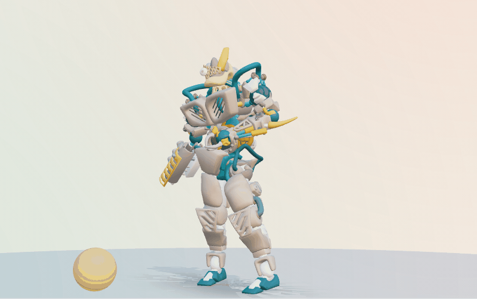
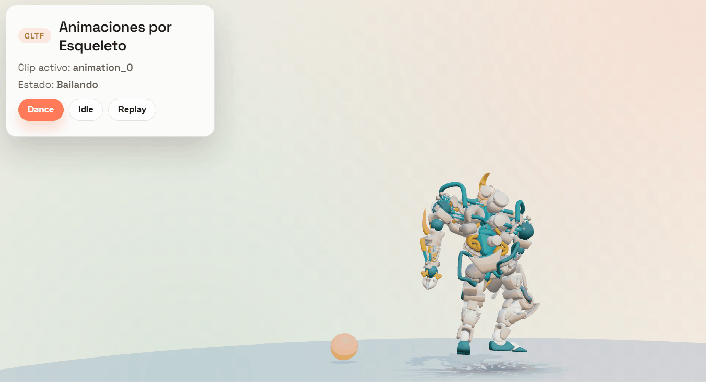
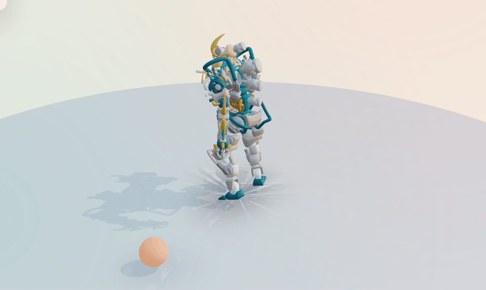

# Taller Animaciones Esqueleto Fbx Gltf

## Informacion General

**Titulo del Taller:** Taller - Animaciones por Esqueleto: Importando y Reproduciendo Animaciones

## Autores del Proyecto

- Juan David Buitrago Salazar
- Juan David Cardenas Galvis
- Nicolás Rodríguez Piraban
- Camilo Andres Medina Sanchez
- Juan Felipe Fajardo Garzón

**Fecha de Entrega:** 12 de abril, 2026

---

## Descripcion General

Este taller explora animaciones basadas en huesos (esqueleto) y su integracion en escenas interactivas con Three.js y React Three Fiber. Se cargo un modelo en formato GLTF/GLB, se controlaron los clips de animacion con `useAnimations`, y se agrego un marcador sincronizado como bonus.

### Objetivo

Comprender como importar animaciones esqueleto, reproducirlas y controlarlas desde la escena para generar interacciones visuales.

---

## Objetivos Especificos

1. **Importacion de modelos:** Cargar modelos GLTF/GLB con animaciones.
2. **Control de animaciones:** Reproducir, pausar y cambiar estados con `useAnimations`.
3. **Interactividad:** Cambiar estados con botones y teclado.
4. **Bonus:** Sincronizar un evento visual (bola) con el avance del clip.

---

## Implementacion Detallada

### Escena 3D Base

Se construyo una escena con:

- **Canvas** con sombras y camara orbitable.
- **Luz ambiental** para base de iluminacion.
- **Luz direccional** con sombras para volumen.
- **Plano circular** para referencia del suelo.
- **Environment** para iluminacion global.

### Carga de Modelo GLTF

Se utiliza `useGLTF()` para cargar el modelo desde `public/models/`.

- Modelo actual: `BrainStem.gltf` (con `BrainStem0.bin`).
- Alternativa animada: `rumba_dancing.glb` (Mixamo).

### Control de Animaciones

Se usa `useAnimations()` para obtener acciones y controlar estados:

- **Dance:** reproduce el clip con `fadeIn`.
- **Idle:** pausa el clip en el primer frame.
- **Replay:** reinicia el clip.

### Bonus: Marcador Sincronizado

La bola se mueve en un circulo sincronizada con el progreso del clip. Si el modelo no tiene animaciones, se usa un loop de tiempo para mantener el efecto visual.

---

## Controles Disponibles

- **Botones UI:** Dance, Idle, Replay.
- **Teclado:**
  - `1` = Dance
  - `2` = Idle
  - `R` = Replay
- **Camara:** OrbitControls con pan, zoom y rotacion.

---

## Resultados Visuales

### GIF 1: Vista general


### GIF 2: Interaccion con controles


### GIF 3: Marcador sincronizado


---

## Stack Tecnologico

- **React 18.2.0**
- **Three.js 0.164.1**
- **@react-three/fiber 8.16.8**
- **@react-three/drei 9.107.0**
- **Vite 5.2.0**

---

## Estructura del Proyecto

```
semana_6_2_animaciones_esqueleto_fbx_gltf/
├── threejs/
│   ├── src/
│   │   ├── components/
│   │   │   ├── AnimatedCharacter.jsx
│   │   │   └── DanceMarker.jsx
│   │   ├── App.jsx
│   │   └── styles.css
│   ├── public/
│   │   └── models/
│   │       ├── BrainStem.gltf
│   │       ├── BrainStem0.bin
│   │       └── rumba_dancing.glb
│   ├── index.html
│   ├── vite.config.js
│   └── package.json
├── media/
│   ├── image1.gif
│   ├── image2.gif
│   └── image3.gif
└── README.md
```

---

## Codigo Relevante

### Carga y control de clips

```jsx
import { useAnimations, useGLTF } from '@react-three/drei';

const MODEL_URL = '/models/BrainStem.gltf';

const { scene, animations } = useGLTF(MODEL_URL);
const { actions } = useAnimations(animations, group);

useEffect(() => {
  Object.values(actions).forEach((action) => action.stop());
  const action = actions[activeClip];
  if (!action) return;
  action.reset().fadeIn(0.2).play();
  return () => action.fadeOut(0.2);
}, [actions, activeClip, mode]);
```

### Sincronizacion del marcador

```jsx
const action = actions?.[activeClip];
const duration = action?.getClip()?.duration ?? 0;
const progress = duration ? (action.time % duration) / duration : 0;

ref.current.position.x = Math.cos(progress * Math.PI * 2) * 1.4;
ref.current.position.z = Math.sin(progress * Math.PI * 2) * 1.4;
```

---

## Prompts Utilizados

- "Hacer la camara orbitable y ajustar el zoom."
- "Sincronizar la bola con el progreso de la animacion."

---

## Aprendizajes y Dificultades

### Aprendizajes

1. **Pipeline de animacion:** `useAnimations` permite controlar clips con precision.
2. **Normalizacion de escala:** ajustar el modelo al origen mejora el encuadre.
3. **Eventos sincronizados:** es posible mover elementos externos en funcion del clip.

### Dificultades

1. **Conversion FBX a GLB:** requiere herramienta externa (FBX2glTF).
2. **Modelo sin animaciones:** `BrainStem.gltf` no incluye clips, por eso la sincronizacion real de la bola no es posible y se usa un loop temporal.

---

## Contribuciones

- **Juan David Buitrago Salazar:** Implementacion de carga de modelos y normalizacion de escala.
- **Juan David Cardenas Galvis:** Control de clips con `useAnimations` y estados de animacion.
- **Nicolás Rodríguez Piraban:** Integracion del bonus de sincronizacion del marcador con el progreso.
- **Camilo Andres Medina Sanchez:** Ajustes de camara, luces y layout visual.
- **Juan Felipe Fajardo Garzón:** Documentacion final y organizacion de evidencias en media/.
