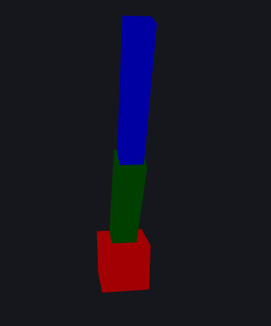
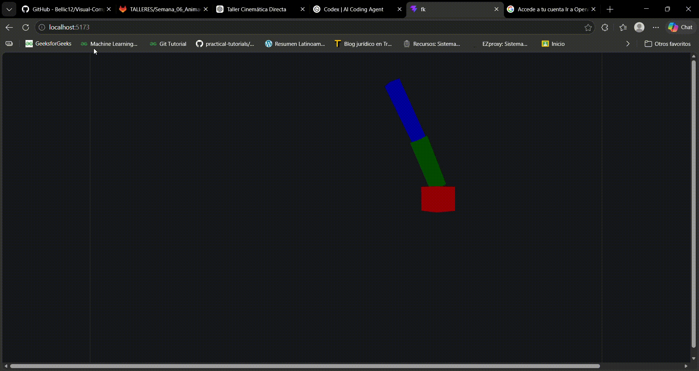

# Taller 3 - Cinemática directa fk

## Nombre: 

- Juan David Buitrago Salazar
- Juan David Cardenas Galvis
- Nicolás Rodríguez Piraban
- Camilo Andres Medina Sanchez
- Juan Felipe Fajardo Garzón

## Fecha de entrega: 15/04/2026

## Descripción breve:

Este taller tiene como objetivo aplicar los conceptos de cinemática directa (Forward Kinematics) mediante la construcción y animación de un brazo robótico utilizando Three.js.

Se implementó una estructura jerárquica de segmentos (articulaciones), donde cada rotación afecta a los elementos hijos, permitiendo simular el comportamiento de un brazo robótico real.


---

## Implementaciones

### Threejs

La implementación del brazo robótico se basa en el concepto de **cinemática directa (Forward Kinematics)**, donde la posición final de un sistema articulado se obtiene a partir de las rotaciones de cada una de sus partes.


El brazo fue construido utilizando una estructura jerárquica de objetos (`group`), donde cada elemento es hijo del anterior. De esta manera se pueden articular los objetos para que su movimiento sea como una articulación real.

``` Base → Brazo1 → Brazo2 ```

- `group`: representa una articulación o punto de rotación
- `mesh`: representa la parte visible del brazo (geometría)

Cada segmento del brazo está compuesto por un `group` para rotar y un `mesh` para visualizar.

Para la creación de cada uno de los elementos del brazo, se hace uso de un useRef, como se [detalla a continuación](#Creacion_de_elementos_con_useref).

Además, para el movimiento del brazo se hace uso de funciones matemáticas trigonométicas, como la función seno. Esto se puede profundizar [acá](#Movimientos)

La declaración del árbol se hace en un archivo aparte con el fin de hacer que en el archivo main, se englobe dentro de un canvas el objeto RobotArm y tener el código segmentado en diferentes archivos con el fin de tener una mejor organización.

## Resultados Visuales

En la siguiente imágen y gif se puede evidenciar el movimiento del brazo creado a partir de tres cubos de diferentes dimensiones.

Además, haciendo drag se puede visualizar y rotar el brazo





## Código relevante

<a id="Creacion_de_elementos_con_useref"></a>
Creación de los objetos del brazo.

```javascript
const base = useRef();
const joint1 = useRef();
const joint2 = useRef();
```

<a id="Movimientos"></a>
Definición de los movimientos del brazo.

```javascript
useFrame(({ clock }) => {
    const t = clock.elapsedTime;

    if (base.current && joint1.current && joint2.current) {
      base.current.rotation.y = Math.sin(t) * 0.5;
      joint1.current.rotation.z = Math.sin(t * 1.5) * 0.5;
      joint2.current.rotation.z = Math.sin(t * 2) * 0.5;
    }
  });
```

## Aprendizajes y dificultades

### Aprendizajes
- Comprensión de la cinemática directa
- Uso de jerarquías en sistemas 3D
- Aplicación de transformaciones encadenadas
- Uso de React Three Fiber para animación
### Dificultades
- Entender cómo las transformaciones afectan a los hijos
- Ajustar correctamente los puntos de rotación
- Resolver errores relacionados con hooks y dependencias

## Prompts utilizados

Durante el desarrollo del taller se utilizaron herramientas de inteligencia artificial para apoyar la implementación. Algunos de los prompts utilizados fueron:

- "How to implement forward kinematics in React Three Fiber"
- "Example of hierarchical transformations in Three.js using groups"
- "How to animate rotations using useFrame in React Three Fiber"
- "Robot arm animation with multiple joints three.js"
- "How to structure a robotic arm using parent-child relationships in three.js"
- "Common errors in React Three Fiber invalid hook call solution"

Estos prompts permitieron comprender mejor la estructura jerárquica, la animación en tiempo real y la correcta implementación de la cinemática directa.