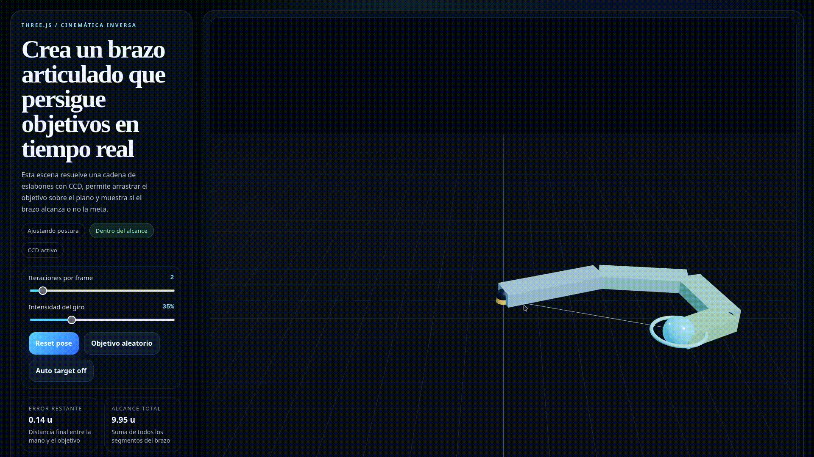
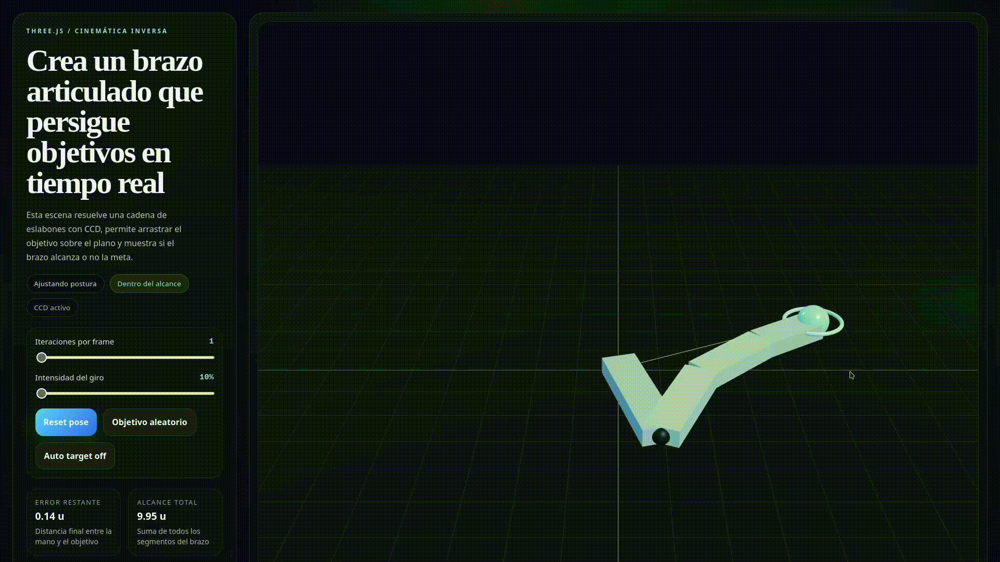
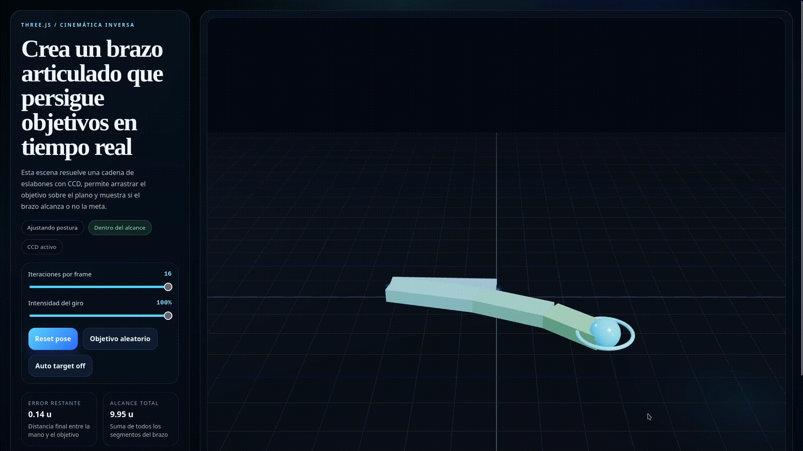

# Taller Cinematica Inversa IK

## Integrantes

- Juan David Buitrago Salazar
- Juan David Cardenas Galvis
- Juan Felipe Fajardo Garzon
- Camilo Andres Medina Sanchez
- Nicolas Rodriguez Piraban

## Fecha de entrega

2026-04-14

---

## Descripcion breve

Este taller desarrolla una implementacion de cinematica inversa (IK) aplicada a una cadena articulada en una escena 3D interactiva. El objetivo tecnico fue lograr que el efector final de un brazo de varios eslabones se aproximara de forma estable a una posicion objetivo dinamica mediante el algoritmo CCD (Cyclic Coordinate Descent).

La solucion se implemento en Three.js con React y contempla interaccion directa con el objetivo sobre el plano de trabajo, parametrizacion del solver en tiempo real y visualizacion de metricas de convergencia. Adicionalmente, se incorporo una linea guia entre la base del brazo y el objetivo para apoyar la verificacion visual del comportamiento del sistema.

---

## Implementaciones

### Three.js

La entrega del sub-taller 6.4 se implemento en `threejs/` con una arquitectura modular para separar escena, solver y logica de interaccion.

Componentes implementados:

- Escena base con camara, iluminacion y referencias espaciales.
- Cadena jerarquica de 4 segmentos articulados.
- Objetivo esferico arrastrable mediante raycasting sobre plano XZ.
- Solver IK CCD con control de iteraciones, influencia y limite de paso angular.
- Interfaz de control para ajuste de parametros en vivo.
- Panel de metricas para error restante, alcance, distancia y estado del solver.
- Linea guia base -> objetivo con actualizacion por frame.

Archivos principales:

- `threejs/src/ik/useThreeIkScene.js`
- `threejs/src/ik/ikSolver.js`
- `threejs/src/ik/sceneObjects.js`
- `threejs/src/App.jsx`

---

## Resultados visuales

### Three.js - Evidencia 1 (arrastre manual)



El efector final sigue el desplazamiento del objetivo cuando la esfera se mueve manualmente sobre el plano.

### Three.js - Evidencia 2 (ajuste de parametros IK)



Se observa la diferencia de convergencia al variar iteraciones por frame e intensidad de correccion.

### Three.js - Evidencia 3 (objetivo automatico)



El solver responde a un objetivo en movimiento continuo y mantiene la aproximacion del efector final.

---

## Codigo relevante

### Solver CCD (extracto)

```js
const currentAngle = Math.atan2(toEndZ, toEndX)
const targetAngle = Math.atan2(toTargetZ, toTargetX)
const step = shortestAngleDelta(currentAngle, targetAngle) * influence
const limitedStep = clamp(step, -maxStep, maxStep)

joint.rotation.y -= limitedStep
```

### Actualizacion de linea guia (extracto)

```js
guidePositions[0] = basePosition.x
guidePositions[1] = basePosition.y + 0.05
guidePositions[2] = basePosition.z
guidePositions[3] = targetPosition.x
guidePositions[4] = targetPosition.y + 0.05
guidePositions[5] = targetPosition.z
positionAttribute.needsUpdate = true
```

---

## Prompts utilizados

1. "Implementa un solver CCD para un brazo articulado en Three.js con objetivo arrastrable"
2. "Corrige el movimiento del brazo que parece alejarse del objetivo"
3. "Refactoriza el codigo en modulos pequenos y con nombres claros"
4. "Arregla la linea guia para que se actualice al mover el objetivo"

---

## Aprendizajes y dificultades

### Aprendizajes

- Se consolido la diferencia conceptual entre cinematica directa (FK) y cinematica inversa (IK).
- Se comprendio el flujo de correccion iterativa de CCD desde el efector final hacia la base.
- Se reforzo el uso de jerarquias de transformacion y raycasting para interaccion 3D.
- Se evidencio la relacion entre estabilidad del solver y parametros numericos (`iterations`, `influence`, `maxStep`).

### Dificultades

- Ajustar signo y magnitud de rotacion para evitar trayectorias divergentes.
- Encontrar un balance entre rapidez de convergencia y suavidad visual.
- Garantizar actualizacion grafica consistente de la linea guia en cada frame.

### Mejoras futuras

- Implementar FABRIK para comparacion formal frente a CCD.
- Incluir limites angulares por articulacion.
- Agregar modo conmutado FK/IK para analisis comparativo.

---

## Contribuciones grupales

Juan David Buitrago Salazar aporto en la definicion del enfoque tecnico de la semana, participo en el ajuste de criterios de calidad para las implementaciones en Unity y Three.js y colaboro en la depuracion de comportamiento de las escenas interactivas, incluyendo validaciones visuales y correcciones funcionales.

Juan David Cardenas Galvis contribuyo en la construccion y verificacion de componentes clave para las practicas de animacion y cinematica, apoyando la integracion de logica de interaccion, el ajuste de parametros de estabilidad y la revision tecnica de resultados en diferentes ejercicios de la semana.

Juan Felipe Fajardo Garzon realizo aportes en el desarrollo de las escenas base y en la validacion de funcionamiento en entorno Unity, colaborando en pruebas de ejecucion, ajuste de comportamientos y soporte en la consolidacion de criterios de entrega para el bloque de talleres.

Camilo Andres Medina Sanchez participo de manera activa en la implementacion y refinamiento de ejercicios en Unity y Three.js, con aportes en estructura de proyecto, depuracion de errores de movimiento y ajuste de configuraciones para lograr resultados visuales consistentes.

Nicolas Rodriguez Piraban contribuyo en la implementacion tecnica de escenas interactivas, en el analisis de convergencia de los sistemas de movimiento y en la revision cruzada de resultados, fortaleciendo la calidad final del conjunto de talleres desarrollados durante la semana.

En esta entrega particular se documenta el sub-taller 6.4, manteniendo coherencia con el trabajo colaborativo realizado en todo el bloque de la Semana 06.

---

## Estructura del proyecto

```text
semana_06_4_cinematica_inversa_ik/
├── threejs/
├── media/
├── semana_06_4_cinematica_inversa_ik.md
└── README.md
```

---

## Referencias

- Three.js documentation: https://threejs.org/docs/
- Vite documentation: https://vite.dev/
- CCD IK overview: https://www.ryanjuckett.com/cyclic-coordinate-descent-in-2d/

---

## Checklist de entrega

- [x] Carpeta con nombre `semana_06_4_cinematica_inversa_ik`
- [x] Implementacion funcional en `threejs/`
- [x] Evidencias visuales en `media/` (minimo 2)
- [x] README completo con secciones requeridas
- [x] Integrantes y aportes grupales documentados
- [x] Commits descriptivos en ingles
