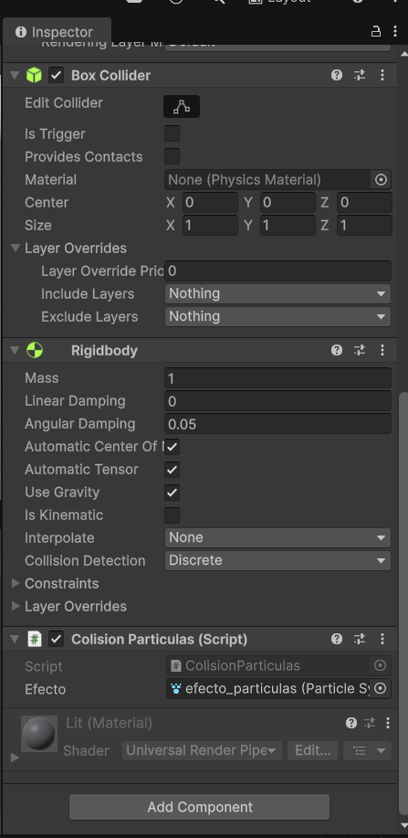

# Taller 5 - Colisiones y particulas

## Nombre: 

- Juan David Buitrago Salazar
- Juan David Cardenas Galvis
- Nicolás Rodríguez Piraban
- Camilo Andres Medina Sanchez
- Juan Felipe Fajardo Garzón

## Fecha de entrega: 15/04/2026

## Descripción breve

Este taller tiene como objetivo implementar un sistema básico de detección de colisiones en Unity utilizando componentes físicos como Rigidbody y Colliders. Además, se integra un sistema de partículas que se activa en el punto exacto de impacto entre objetos, permitiendo visualizar de manera interactiva los eventos de colisión dentro de la escena.

## Implementaciones

### Unity

Se desarrolló una escena básica en Unity donde:

- Se creó un Plane como superficie.
- Se añadio un cubo con el fin de simular la caída
- Se implementó un Particle System configurado manualmente para que cuando el cubo colisione con el plano, se active un efecto visual de impacto.
- Se desarrolló un script en C# para activar el sistema de partículas en el punto de impacto.

*Flujo de ejecución*

```
1. Objeto cae por gravedad (Rigidbody)
   ↓
2. Colisiona con otro objeto
   ↓
3. OnCollisionEnter() se ejecuta
   ↓
4. Se obtiene el punto de contacto (collision.contacts[0].point)
   ↓
5. Se posiciona el ParticleSystem en ese punto
   ↓
6. Se activa el efecto (Play())
   ↓
7. Se visualiza la explosión de partículas
```

Cuando un objeto con Rigidbody colisiona con otro objeto en la escena:

Unity detecta el evento mediante OnCollisionEnter.
Se obtiene el punto exacto de contacto (collision.contacts[0].point).
El sistema de partículas se posiciona en ese punto.
Se activa el efecto visual (Play()), simulando un impacto.

Las colisiones no solo sirven para efectos visuales. También se pueden utilizar para activar:

Sonidos (AudioSource)
Animaciones (Animator)
Cambios de luz (Light)
Eventos de juego (score, daño, triggers)

Esto permite crear experiencias más dinámicas e interactivas en videojuegos.

## Resultados visuales

El presente gif muestra el proceso de caida de un cubo con un Rigidbody, el cual al colisionar con el plano, activa un sistema de partículas en el punto de impacto, simulando un efecto visual de colisión.

%20_DX11_%202026-04-15%2015-00-43.GIF)

La presente imagen permite ver el proceso de configuración del cubo, asociandole el script en c# que pewrmite ver el efecto de colisiópn con chispas al momento de colisionar con el plano. 


## Código relevante

Script de colisión y partículas
```c#
using UnityEngine;

public class ColisionParticulas : MonoBehaviour
{
    public ParticleSystem efecto;

    private void OnCollisionEnter(Collision collision)
    {
        if (efecto != null)
        {
            efecto.transform.position = collision.contacts[0].point;
            efecto.Play();
        }
    }
}

```


## Prompts utilizados

Se utilizaron herramientas de IA generativa para:

Generar la estructura del README.
Explicar el funcionamiento del sistema de colisiones en Unity.
Refinar el código del script en C#.

Ejemplo de prompt usado:

"Genera un script en Unity C# que active un sistema de partículas en el punto de colisión entre dos objetos."


## Aprendizajes y dificultades
### Aprendizajes
- Uso de Rigidbody y Colliders para físicas básicas.
- Manejo de eventos de colisión en Unity (OnCollisionEnter).
- Integración de Particle Systems con lógica de programación.
- Importancia de posicionar correctamente efectos visuales.
### Dificultades
- Ajustar correctamente la posición del sistema de partículas.
- Configurar parámetros del Particle System para que el efecto sea visible.
- Entender la diferencia entre OnCollisionEnter y OnTriggerEnter.
