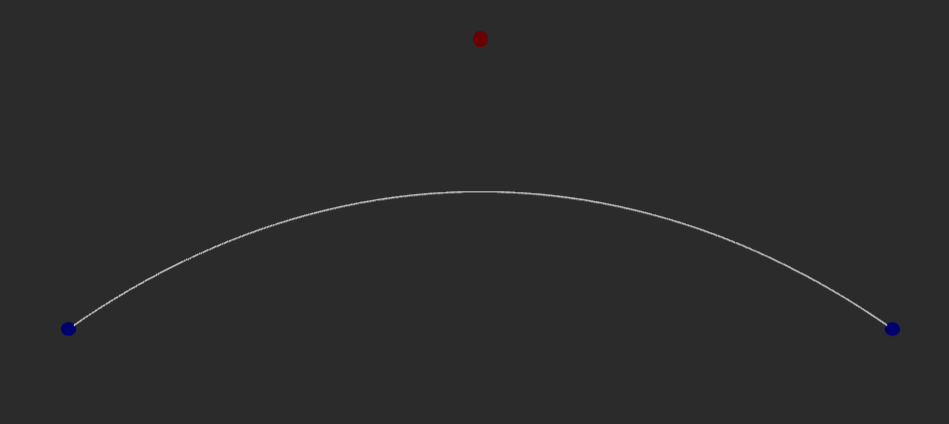
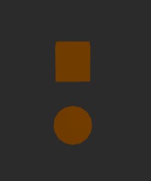
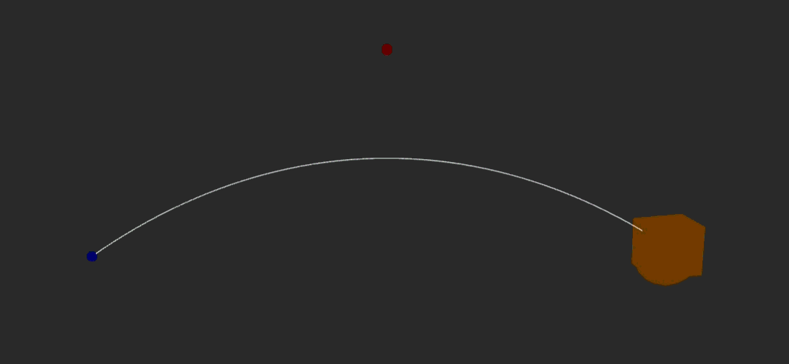

#  Interpolación de Movimiento: Suavizando Animaciones en Tiempo Real

## Nombres

- Juan David Buitrago Salazar
- Juan David Cardenas Galvis
- Nicolás Rodríguez Piraban
- Camilo Andres Medina Sanchez
- Juan Felipe Fajardo Garzón

## Fecha de Entrega

`2026-04-15`

---

## Descripción Breve

Implementar técnicas de interpolación de movimiento (lineal y curva de Bézier) y animaciones 
de objetos en Three.js utilizando React Three Fiber.

---

## Implementaciones

### Three.js

Se creó una escena 3D utilizando React Three Fiber que demuestra tres tipos de interpolación:

1. **Interpolación Lineal (lerp)**: Un objeto (esfera naranja) se mueve linealmente entre 
   dos puntos, oscilando de un lado a otro.

2. **Interpolación con Curva de Bézier**: Un cubo sigue una trayectoria curva cuadrática 
   definida por un punto de control, interpolando su posición a lo largo de la curva.

3. **Interpolación de Rotación (slerp)**: Los objetos interpolan su rotación usando 
   cuaterniones para una transición suave entre orientaciones.

La escena incluye adicionalmente:
- Esfera azul en el punto de inicio (-3, 0, 0)
- Esfera azul en el punto final (3, 0, 0)
- Esfera roja en el punto de control (0, 2, 0)
- Línea blanca que muestra la trayectoria de la curva de Bézier
- Controles de cámara (OrbitControls)

---

## Resultados visuales

### Three.js - Implementación



Esta imagen muestra los tres puntos utilizados para la curva de Bézier: el punto de inicio (esfera azul en -3, 0, 0), el punto de control (esfera roja en 0, 2, 0), y el punto final (esfera azul en 3, 0, 0). La línea blanca representa la curva de Bézier cuadrática generada.



Esta imagen muestra los objetos animados en la escena: un cubo naranja y una esfera naranja.



Este gif muestra la animación en acción. La esfera naranja se mueve en línea recta (interpolación lineal), mientras que el cubo naranja sigue la curva de Bézier, demostrando la diferencia entre ambos tipos de interpolación. La animación es continua y oscilante, invirtiendo dirección al alcanzar los extremos.

---

## Código relevante

### Ejemplo de código Three.js (React Three Fiber)

```jsx
// Interpolación lineal
const x = THREE.MathUtils.lerp(start.x, end.x, next);
const y = THREE.MathUtils.lerp(start.y, end.y, next);
const z = THREE.MathUtils.lerp(start.z, end.z, next);

// Curva de Bézier
const curve = new THREE.QuadraticBezierCurve3(start, control, end);
const point = curve.getPoint(next);

// Interpolación de rotación con cuaterniones
qCurrent.current.slerpQuaternions(qStart.current, qEnd.current, next);
```

Este código demuestra cómo aplicar interpolación lineal, interpolación en curva de Bézier, 
e interpolación de cuaterniones (slerp) para animaciones suaves en Three.js.

### Componente principal

```jsx
function Scene() {
  const boxRef = useRef();
  const sphRef = useRef();
  const [t, setT] = useState(0);

  const start = new THREE.Vector3(-3, 0, 0);
  const end = new THREE.Vector3(3, 0, 0);
  const control = new THREE.Vector3(0, 2, 0);

  const curve = useMemo(() => {
    return new THREE.QuadraticBezierCurve3(start, control, end);
  }, []);

  useFrame((_, delta) => {
    // Actualizar posición y rotación en cada frame
  });
}
```

---

## Prompts utilizados

Three.js:

```
Crea una aplicación en React con Three.js (React Three Fiber) que demuestre 
interpolación de movimiento. Incluye:
1. Un objeto que use interpolación lineal (lerp) entre dos puntos
2. Un objeto que siga una curva de Bézier cuadrática
3. Animación continua que oscile entre los puntos
4. Visualización de la curva y los puntos de control
5. Interpolación de rotación usando slerp de cuaterniones
```

---

## Aprendizajes y dificultades

En este taller aprendí los conceptos de interpolación lineal (lerp) y cómo utilizar las curvas de Bézier para crear trayectorias más complejas.

La parte más desafiante fue implementar la interpolación de cuaterniones (slerp) para la rotación, ya que requiere entender cómo funcionan los cuaterniones para evitar problemas de interpolación. También fue complejo manejar las animaciones dentro de useFrame, sincronizando correctamente los tres tipos de interpolación (lineal, bezier y slerp) para que ambos objetos se movieran de forma fluida y continua.

Una mejora a futuro sería agregar puntos interactivos (usando dat.GUI o leva) que permitan mover los puntos de control y observar cómo afecta esto la trayectoria de la curva de Bézier en tiempo real. Con respecto a lo demás estoy satisfecho con el resultado obtenido. La animación funciona correctamente y se pueden observar claramente los diferentes tipos de interpolación.
