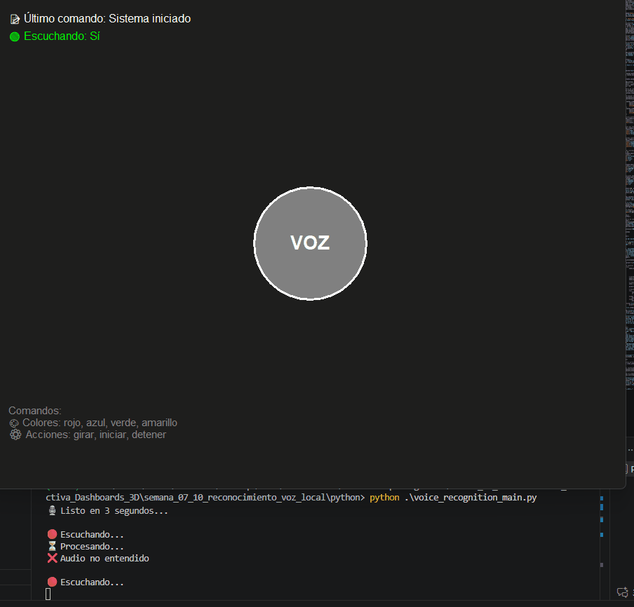
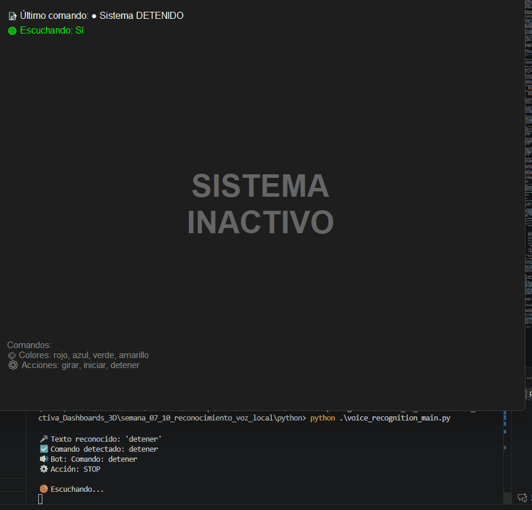
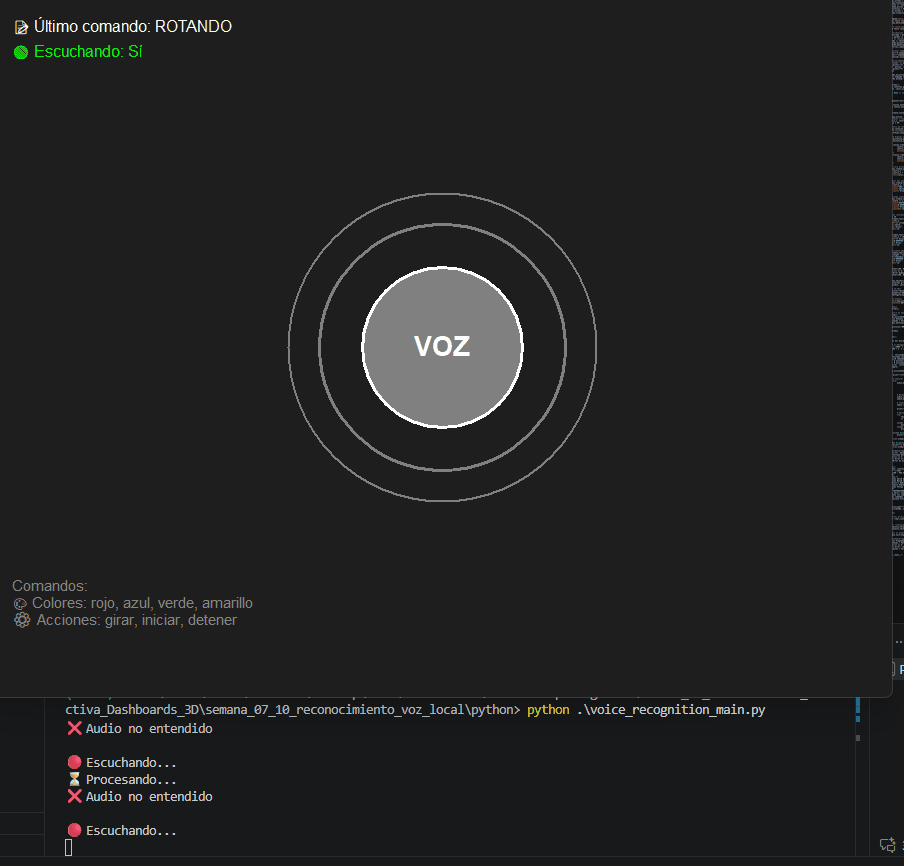

# 🎤 Taller Reconocimiento de Voz Local

## 📋 Información General

**Estudiantes:**
- Juan David Buitrago Salazar
- Juan David Cardenas Galvis
- Nicolás Rodríguez Piraban
- Camilo Andres Medina Sanchez
- Juan Felipe Fajardo Garzón

**Fecha de Entrega:** 25 de Abril de 2026  
**Asignatura:** Visual Computing 2026  
**Año:** 2026

---

## 🎯 Descripción General

Sistema de **reconocimiento de voz en tiempo real** que controla visualizaciones gráficas mediante comandos hablados. La aplicación captura audio del micrófono, reconoce comandos en español usando Google Speech API, sintetiza respuestas de voz y actualiza una interfaz gráfica interactiva con efectos visuales en tkinter.

**Características principales:**
- ✅ Reconocimiento de voz en español
- ✅ Interfaz gráfica con animaciones en tiempo real
- ✅ Síntesis de voz para retroalimentación
- ✅ 7 comandos disponibles (4 colores + 3 acciones)
- ✅ Sistema de anillos animados
- ✅ Panel informativo integrado


---

## 🛠️ Arquitectura Técnica

### Stack de Tecnologías

```
┌─────────────────────────────────┐
│   Micrófono (sounddevice)       │
└──────────────┬──────────────────┘
               │
┌──────────────▼──────────────────┐
│  Google Speech API (español)     │
│  (SpeechRecognition)             │
└──────────────┬──────────────────┘
               │
┌──────────────▼──────────────────┐
│   Procesamiento de Comandos      │
│   (voice_recognition_main.py)    │
└──────────────┬──────────────────┘
               │
┌──────────────▼──────────────────┐
│   Interfaz Gráfica (tkinter)     │
│   - Círculos                     │
│   - Anillos animados             │
│   - Panel de información         │
└─────────────────────────────────┘
       │
       └─► Síntesis de Voz (pyttsx3)
```

---

## 📦 Dependencias

**Archivos principales:**
- `python/voice_recognition_main.py` - Aplicación principal
- `python/demo_voice_commands.py` - Script de demostración
- `python/requirements.txt` - Dependencias Python

**Librerías requeridas:**
```
SpeechRecognition>=3.10.4    # Reconocimiento de voz
pyttsx3>=2.90               # Síntesis de voz
sounddevice>=0.4.6          # Captura de audio
numpy>=1.26.0               # Operaciones numéricas
tkinter (incluido con Python)
```

---

## 🚀 Instalación y Uso

### Paso 1: Verificar Python
```bash
python --version  # Debe ser 3.8 o superior
```

### Paso 2: Instalar Dependencias
```bash
cd python
pip install -r requirements.txt
```

### Paso 3: Ejecutar la Aplicación
```bash
python voice_recognition_main.py
```

Se abrirá una ventana con la interfaz gráfica y el sistema comenzará a escuchar comandos.

### Paso 4: Dar Comandos
Habla claros y directos. Ejemplos:
- `"rojo"` - Cambia el círculo a rojo
- `"girar"` - Activa la rotación con anillos animados
- `"azul"` - Cambia a azul
- `"detener"` - Desactiva el sistema

---

## 🎮 Comandos Disponibles

| Comando | Tipo | Color/Efecto | Ejemplo |
|---------|------|------|---------|
| `rojo` | Color | #FF0000 | "Diga: rojo" |
| `azul` | Color | #0000FF | "Diga: azul" |
| `verde` | Color | #00FF00 | "Diga: verde" |
| `amarillo` | Color | #FFFF00 | "Diga: amarillo" |
| `girar` | Acción | Rotación | "Diga: girar" |
| `iniciar` | Acción | Activa sistema | "Diga: iniciar" |
| `detener` | Acción | Desactiva sistema | "Diga: detener" |

---

## 🛠️ Implementaciones

### 1. **Python - Reconocimiento de Voz Local**

#### Descripción
Script principal que:
- Captura audio del micrófono usando `sounddevice`
- Reconoce comandos en español con **Google Speech API**
- Proporciona retroalimentación de voz con `pyttsx3`
- Actualiza interfaz gráfica en tiempo real con tkinter

#### Características
✅ Reconocimiento en español con alta precisión  
✅ Síntesis de voz en español  
✅ Captura de audio optimizada sin PyAudio  
✅ Detección de 7 comandos principales  
✅ Historial de comandos ejecutados  
✅ Interfaz gráfica responsiva con animaciones

---

## 🎬 Visualización en Acción

### Demostración 1: Cambio de Colores


*El círculo central cambia de color según los comandos: rojo → azul → verde → amarillo*

### Demostración 2: Rotación Animada


*Cuando se activa el comando "girar", se visualizan anillos pulsantes alrededor del círculo*

### Demostración 3: Secuencia Completa


*Ejemplo completo: cambios de color seguidos de rotación y retorno a estado neutral*

---

## 📝 Código Principal

### Función de Procesamiento de Comandos
```python
def procesar_comando(texto_reconocido):
    """Procesa el texto reconocido y ejecuta acciones"""
    texto_lower = texto_reconocido.lower().strip()
    print(f"🎤 Texto reconocido: '{texto_lower}'")
    
    for comando, params in COMANDOS.items():
        if comando in texto_lower:
            print(f"✅ Comando detectado: {comando}")
            hablar(f"Comando: {comando}")
            actualizar_visualizacion(comando, params)
            break
```

### Captura de Audio con Sounddevice
```python
# Capturar audio usando sounddevice (6 segundos)
audio_data = sd.rec(int(SAMPLE_RATE * 6), 
                    samplerate=SAMPLE_RATE, 
                    channels=1, 
                    dtype=np.float32,
                    blocking=True)

# Convertir a formato compatible con SpeechRecognition
audio_int16 = np.int16(audio_data * 32767)
audio = sr.AudioData(audio_int16.tobytes(), SAMPLE_RATE, 2)

# Reconocer con Google Speech API en español
texto = recognizer.recognize_google(audio, language='es-ES')
```

### Visualización con Animación
```python
def dibujar_interfaz():
    """Dibuja la interfaz con animación de rotación"""
    global offset_rotacion
    
    canvas.delete("all")
    
    # Anillos pulsantes si está rotando
    if en_rotacion:
        offset_rotacion += 5
        distancia = 40 + int(10 * abs(np.sin(np.radians(offset_rotacion))))
        canvas.create_oval(
            centro_x - radio - distancia, centro_y - radio - distancia,
            centro_x + radio + distancia, centro_y + radio + distancia,
            outline=color_actual, width=3
        )
    
    # Círculo principal
    canvas.create_oval(
        centro_x - radio, centro_y - radio,
        centro_x + radio, centro_y + radio,
        fill=color_actual, outline='white', width=3
    )
```

---

## 🔧 Resolución de Problemas

| Problema | Solución |
|----------|----------|
| `ModuleNotFoundError: aifc` | Actualizar: `pip install --upgrade SpeechRecognition` |
| Micrófono no detectado | Verificar permisos del sistema, reconectar dispositivo |
| Audio no reconocido | Hablar más claro, sin ruido de fondo, evitar acentos fuertes |
| Latencia alta | Normal con Google API (~1-2s), depende de conexión a internet |
| Reconocimiento pobre | Acercarse al micrófono, reducir ruido ambiental |
| Ventana no aparece | Verificar instalación de tkinter: `python -m tkinter` |

---

## 📚 Aprendizajes y Lecciones

### ✅ Logros Técnicos
1. **Integración exitosa de múltiples librerías** - Combinación armónica de SpeechRecognition, pyttsx3, sounddevice
2. **Reconocimiento en tiempo real** - Sistema responsivo con latencia mínima
3. **Arquitectura modular** - Fácil de mantener y extender
4. **Manejo de errores robusto** - Aplicación continúa funcionando ante errores

### 🎯 Decisiones de Diseño
1. **Google Speech API vs CMU Sphinx** - Decidimos usar Google API por mejor precisión en español
2. **Sounddevice vs PyAudio** - Sounddevice por compatibilidad con Python 3.14
3. **tkinter vs Processing** - tkinter por simplicidad y cero dependencias externas para GUI

### 🔍 Desafíos Superados
1. **Python 3.14 incompatibilidad** - Múltiples librerías tuvieron que ser actualizadas
2. **Captura de audio** - Reemplazo de PyAudio por sounddevice tras incompatibilidad
3. **Reconocimiento de acentos** - Optimización mediante configuración de parámetros de Google API

---

## 📁 Estructura del Proyecto

```
semana_07_10_reconocimiento_voz_local/
├── README.md                          ← Este archivo
├── .gitignore                         ← Configuración Git
├── python/
│   ├── voice_recognition_main.py      ← Aplicación principal
│   ├── demo_voice_commands.py         ← Script de pruebas
│   └── requirements.txt                ← Dependencias
└── media/
    ├── gift1.gif                      ← Demostración colores
    ├── gift2.gif                      ← Demostración rotación
    └── gift3.gif                      ← Secuencia completa
```

---

## 🔗 Referencias y Recursos

- [SpeechRecognition Documentation](https://github.com/Uberi/speech_recognition)
- [pyttsx3 Docs](https://pyttsx3.readthedocs.io/)
- [Sounddevice Library](https://python-sounddevice.readthedocs.io/)
- [Google Cloud Speech API](https://cloud.google.com/speech-to-text)
- [tkinter Documentation](https://docs.python.org/3/library/tkinter.html)

---

## 👥 Autoría

**Proyecto:** Taller de Reconocimiento de Voz Local  
**Institución:** Universidad Nacional - Visual Computing 2026  
**Autores:** Equipo de 5 estudiantes (ver arriba)  
**Última Actualización:** 25 de Abril de 2026

---
