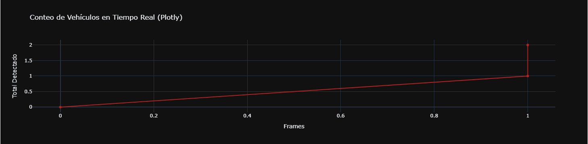

# Taller - Visualización de Datos en Tiempo Real: Gráficas en Movimiento
## Nombres: 

- Juan David Buitrago Salazar
- Juan David Cardenas Galvis
- Nicolás Rodríguez Piraban
- Camilo Andres Medina Sanchez
- Juan Felipe Fajardo Garzón

## Fecha de entrega: 25/04/2026

## Descripción breve:
Este taller implementó un sistema de visualización de datos en tiempo real utilizando YOLOv8 para detección de vehículos en video y Plotly para graficar el conteo acumulado de vehículos a medida que se procesan los frames. El objetivo fue combinar detección de objetos con actualización dinámica de gráficas.

## Implementaciones:

### Python:
Se utilizó el modelo YOLOv8n (nano) para detectar vehículos en un video de prueba. Se configuró OpenCV para leer el video frame por frame y aplicar tracking con IDs únicos por objeto. Se filtraron las clases relevantes para vehículos (car=2, motorcycle=3, bus=5, truck=7). Se implementó una línea de conteo en el 60% de la altura del frame; cuando el centro de un vehículo detectado cruza esta línea y no ha sido contado antes, se agrega al conteo total. Se utilizó Plotly con FigureWidget para actualizar la gráfica en tiempo real conforme se detectan nuevos vehículos, mostrando el historial de conteo (frames vs total detectado).

## Resultados visuales:

La aplicación posee dos elementos: la primera es una ventana de video con los vehículos detectados (bounding boxes azules), la línea de conteo (línea amarilla), y el contador total de vehículos.


Junto a lo anterior, una gráfica de Plotly se actualiza en tiempo real mostrando la curva de crecimiento del conteo de vehículos a lo largo de los frames del video.



A continuación se presentan ambos elementos al mismo tiempo


## Código relevante:

El corazón del sistema es el loop de procesamiento de frames con detección YOLO y actualización de la gráfica. Se utiliza `model.track()` para obtener IDs persistentes de los vehículos, se verifica si el centro del vehículo cruza la línea de conteo, y se actualiza la figura de Plotly dentro del contexto de `batch_update` para mantener el rendimiento:

```python
# Detección de YOLO, solo va a detectar vehículos (clases 2, 3, 5, 7 corresponden a carros, motos, buses y camiones)
results = model.track(frame, persist=True, classes=[2, 3, 5, 7], verbose=False)

# Extraemos los IDs y las coordenadas de las cajas para el conteo
if results[0].boxes.id is not None:
    ids = results[0].boxes.id.cpu().numpy().astype(int)
    boxes = results[0].boxes.xyxy.cpu().numpy()

    for box, obj_id in zip(boxes, ids):
        x1, y1, x2, y2 = map(int, box)
        cy = int((box[1] + box[3]) / 2)

        cv2.rectangle(frame, (x1, y1), (x2, y2), (255, 0, 0), 2) # Dibujar las bounding boxes del vehículo detectado
        
        # Lógica de conteo
        if obj_id not in already_counted and abs(cy - line_y) < 15: # Si el centro del vehículo está cerca de la línea de conteo y si no ha sido contado antes

            # Agregar el ID del vehículo al set y a la lista de contados
            already_counted.add(obj_id)
            vehiculos_contados.append(obj_id)
            
            # Actualizar los datos del conteo
            history_x.append(frame_idx)
            history_y.append(len(already_counted))
            
            # Actualización del gráfico de Plotly
            with fig.batch_update():
                fig.data[0].x = history_x
                fig.data[0].y = history_y
```

## Prompts utilizados:
No se hizo uso de IA generativa

## Aprendizajes y dificultades:
Este taller fue muy útil para aprender a integrar modelos de detección de objetos en tiempo real con bibliotecas de visualización interactiva. Aprendimos que Plotly permite actualizaciones eficientes usando `FigureWidget` y `batch_update` sin necesidad de recrear la figura completa. La principal dificultad fue ajustar el tamaño del video y los parámetros de detección para obtener un rendimiento aceptable en tiempo real, ya que YOLO en notebooks puede ser lento si no se optimiza la resolución de entrada.