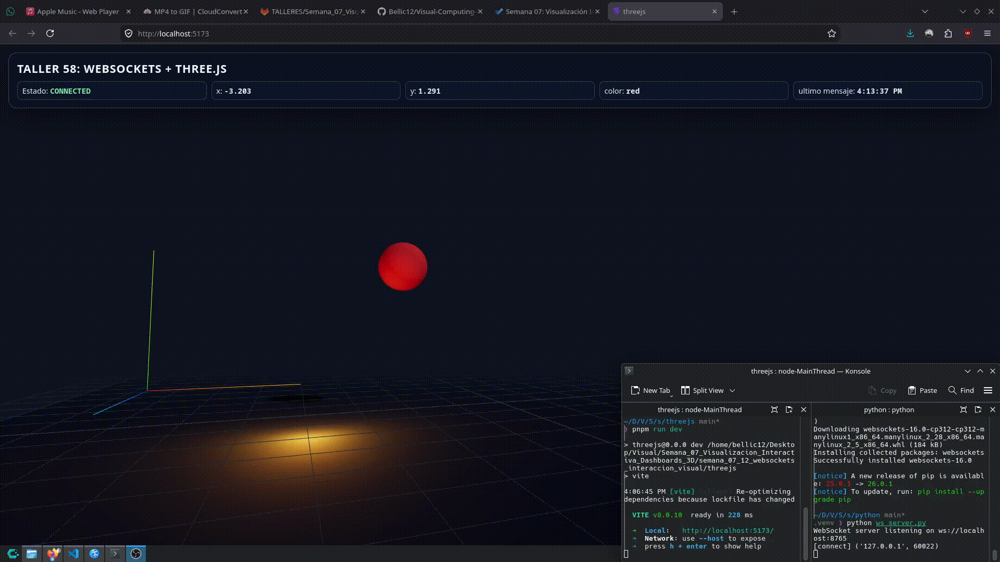

# Taller 7.12 - WebSockets e Interacción Visual en Tiempo Real

## Integrantes

- Juan David Buitrago Salazar
- Juan David Cárdenas Galvis
- Juan Felipe Fajardo Garzón
- Camilo Andrés Medina Sánchez
- Nicolás Rodríguez Pirabán

## Fecha de entrega

25 de abril de 2026

---

## Descripción breve

Este taller tuvo como propósito estudiar e implementar un flujo de comunicación en tiempo real mediante WebSockets, integrando un servidor de datos en Python con una escena 3D interactiva construida en Three.js y React Three Fiber. El enfoque central fue validar cómo un sistema visual puede reaccionar continuamente a eventos emitidos por un backend asincrónico, superando el modelo tradicional de solicitudes HTTP puntuales.

En la implementación desarrollada, el servidor genera y transmite periódicamente mensajes JSON con coordenadas espaciales y atributos de color. El cliente web consume estos mensajes, interpreta los datos y actualiza en tiempo real la posición y la apariencia de un objeto 3D en la escena. Esta arquitectura permitió verificar conceptos fundamentales de sincronización, latencia perceptual y diseño de visualizaciones reactivas orientadas a datos dinámicos.

Adicionalmente, se diseñó una interfaz de monitoreo (HUD) para exponer el estado de conexión, los valores numéricos recibidos y la marca temporal del último mensaje. Con ello, el resultado final no solo cumple el objetivo técnico de la comunicación en tiempo real, sino que también incorpora criterios de trazabilidad y observabilidad útiles para pruebas y depuración.

---

## Objetivos técnicos alcanzados

- Implementar un servidor WebSocket asincrónico en Python con emisión periódica de datos cada 0.5 segundos.
- Diseñar un contrato de mensaje JSON para transmisión de estado visual (`x`, `y`, `color`, `timestamp`).
- Conectar un cliente web con React + React Three Fiber al servidor WebSocket.
- Actualizar la escena 3D en tiempo real según los datos recibidos.
- Aplicar interpolación para suavizar la transición de movimiento y color en el objeto 3D.
- Incorporar un mecanismo de reconexión automática en el cliente ante desconexiones del socket.
- Presentar indicadores de estado de red y última actualización de datos en la interfaz.

---

## Implementaciones

### Python (Servidor WebSocket)

Se implementó un servidor basado en `asyncio` y `websockets` que publica mensajes JSON de forma continua con una frecuencia de 2 Hz (cada 0.5 segundos). Cada paquete incluye coordenadas aleatorias (`x`, `y`), una categoría de color (`red`, `green`, `blue`) y una marca de tiempo en UTC (`timestamp`).

Aspectos técnicos principales:

- Arquitectura asincrónica no bloqueante con `websockets.serve`.
- Bucle de emisión continuo por cliente conectado.
- Serialización estructurada de datos con `json.dumps`.
- Registro de eventos de conexión y desconexión para trazabilidad en consola.

Archivo principal:

- `python/ws_server.py`

Dependencias:

- `python/requirements.txt`

### Three.js / React Three Fiber (Cliente visual)

Se reemplazó la plantilla inicial por una aplicación de visualización reactiva en 3D. El cliente abre un canal WebSocket contra `ws://localhost:8765`, deserializa los mensajes entrantes y actualiza una esfera en escena con cambios de posición y color.

Aspectos técnicos principales:

- Renderizado 3D con `@react-three/fiber` y controles de cámara con `@react-three/drei`.
- Estado reactivo de conexión y datos en tiempo real mediante `useState` y `useEffect`.
- Interpolación de transformaciones y color con `THREE.MathUtils.lerp` y `Color.lerp` para transición suave.
- Reconexión automática del socket para robustez operativa.
- HUD informativo con estado de conexión, valores de entrada y última recepción.

Archivos principales:

- `threejs/src/App.jsx`
- `threejs/src/App.css`
- `threejs/src/index.css`

---

## Resultados y comportamiento observado

- El sistema mantiene transmisión continua de datos desde Python hacia el cliente web.
- La esfera 3D responde en tiempo real a variaciones en posición y color.
- Se observan transiciones suaves sin saltos abruptos, mejorando legibilidad visual.
- Ante caídas de conexión, el cliente intenta reconectar automáticamente sin reinicio manual.
- El panel HUD permite verificar de forma inmediata la salud del canal y la vigencia de los datos.

---

## Evidencias visuales

### 1) Pantallazo de la interfaz reactiva



La imagen muestra el estado estático de la aplicación Three.js en ejecución, incluyendo la escena 3D y el panel de telemetría (HUD) con estado de conexión, coordenadas `x` y `y`, color activo y registro temporal del último mensaje recibido. Esta evidencia confirma la integración visual del cliente, la correcta composición de la interfaz y la exposición de variables de observabilidad en tiempo real.

### 2) Flujo completo en tiempo real (terminal + interfaz)


El GIF documenta el funcionamiento integral del sistema: en una esquina se observan las terminales ejecutando `pnpm run dev` y `python ws_server.py`, mientras que el resto de la pantalla presenta la escena interactiva donde la esfera se desplaza y cambia de color de acuerdo con los mensajes emitidos por el servidor WebSocket. Esta evidencia valida, de forma sincronizada, la comunicación backend-frontend, la conectividad del canal WebSocket y la actualización dinámica de la visualización.

---

## Código relevante

### Fragmento representativo del servidor WebSocket (Python)

```python
import asyncio
import json
import random
import websockets

async def handler(websocket):
    while True:
        payload = {
            "x": round(random.uniform(-4.5, 4.5), 3),
            "y": round(random.uniform(-2.5, 2.5), 3),
            "color": random.choice(["red", "green", "blue"]),
        }
        await websocket.send(json.dumps(payload))
        await asyncio.sleep(0.5)
```

### Fragmento representativo del cliente visual (React Three Fiber)

```javascript
socket.onmessage = (event) => {
  const payload = JSON.parse(event.data)
  setLiveData({
    x: Number(payload.x) || 0,
    y: Number(payload.y) || 0,
    color: payload.color || 'blue',
  })
}
```

### Interpolación para transición suave en Three.js

```javascript
meshRef.current.position.x = THREE.MathUtils.lerp(
  meshRef.current.position.x,
  target.x,
  Math.min(1, delta * 3),
)

meshRef.current.material.color.lerp(targetColor, Math.min(1, delta * 5))
```

---

## Prompts utilizados

Durante el proceso se emplearon prompts de apoyo para diseño, implementación, depuración y documentación. Ejemplos representativos:

```text
"Implementa un servidor WebSocket en Python con asyncio que emita un JSON cada 0.5 segundos con x, y y color."

"Crea un cliente en React Three Fiber que se conecte a ws://localhost:8765 y actualice en tiempo real la posición y color de una esfera."

"Agrega reconexión automática al WebSocket del cliente cuando la conexión se cierre de forma inesperada."

"Sugiere una estrategia de interpolación en Three.js para evitar saltos bruscos al actualizar posición y color con datos en streaming."

"Redacta una sección técnica de resultados que describa observabilidad, estabilidad de conexión y comportamiento en tiempo real."

"Diseña una sección de evidencias visuales con placeholders y especificaciones de captura para GIF y PNG."
```

---

## Aprendizajes y dificultades

### Aprendizajes

La práctica consolidó la comprensión de WebSockets como mecanismo de baja latencia para transmisión continua de estado, así como su integración con arquitecturas de visualización 3D reactivas. También permitió profundizar en diseño de contratos de datos simples pero efectivos para sincronización visual.

A nivel de frontend, se reforzó el uso de React Three Fiber para enlazar eventos externos con transformaciones de escena, además de buenas prácticas de resiliencia de red (reconexión automática) y observabilidad mediante paneles de estado.

### Dificultades

Uno de los retos principales fue lograr fluidez visual ante datos discretos emitidos a intervalos fijos, evitando movimientos abruptos. Esto se abordó mediante interpolación temporal tanto en posición como en color. Otro punto crítico fue manejar estados de conexión de forma robusta para que la experiencia no dependiera de una sesión única estable.

### Mejoras futuras

- Incorporar múltiples objetos/agentes simultáneos en la escena con IDs únicos por mensaje.
- Definir esquema formal de mensajes (versionado y validación).
- Medir latencia extremo a extremo y frame time para análisis de rendimiento.
- Integrar un panel de control externo para modificar parámetros del servidor en tiempo real.

---

## Aportes del equipo

El desarrollo del taller se ejecutó de manera colaborativa en todas sus etapas: diseño de la arquitectura, implementación de componentes, pruebas funcionales, depuración y documentación técnica. Todos los integrantes participaron activamente en el proceso integral, aportando de forma constante en decisiones técnicas y validación de resultados.

Dentro de ese trabajo colectivo, se reconocen contribuciones especialmente significativas en ciertos laboratorios por parte de cada integrante:

- **Juan David Buitrago Salazar**
  - 7.3 (Unity/Three.js)
  - 7.9 (Python)
  - 7.12 (Three.js)

- **Juan David Cárdenas Galvis**
  - 7.1 (Unity/Three.js)
  - 7.7 (Python)
  - 7.10 (Python)

- **Juan Felipe Fajardo Garzón**
  - 7.2 (Python)
  - 7.6 (Unity/Three.js)
  - 7.11 (Python)

- **Camilo Andrés Medina Sánchez**
  - 7.4 (Python)
  - 7.8 (Unity/Three.js)
  - 7.12 (Python)

- **Nicolás Rodríguez Pirabán**
  - 7.4 (Unity/Three.js)
  - 7.5 (Python)

---

## Estructura del proyecto

```text
semana_07_12_websockets_interaccion_visual/
├── python/
│   ├── requirements.txt
│   └── ws_server.py
├── threejs/
│   ├── src/
│   │   ├── App.jsx
│   │   ├── App.css
│   │   └── index.css
│   └── package.json
├── media/                # Evidencias visuales 
└── README.md
```

---

## Ejecución del proyecto

### 1) Servidor Python

```bash
cd python
pip install -r requirements.txt
python ws_server.py
```

### 2) Cliente Three.js

```bash
cd threejs
pnpm install
pnpm dev
```

---

## Referencias

- Python `websockets` documentation: https://websockets.readthedocs.io/
- Python `asyncio` documentation: https://docs.python.org/3/library/asyncio.html
- React Three Fiber documentation: https://docs.pmnd.rs/react-three-fiber/
- Three.js documentation: https://threejs.org/docs/
- MDN Web Docs - The WebSocket API: https://developer.mozilla.org/en-US/docs/Web/API/WebSocket

---

## Checklist de entrega

- [x] Implementación funcional de servidor WebSocket en Python
- [x] Cliente Three.js conectado y reactivo en tiempo real
- [x] Código organizado por entorno (`python/`, `threejs/`)
- [x] README técnico y estructurado
- [x] Evidencias visuales generadas en `media/`
- [x] Referencias de imágenes/GIF reemplazadas por archivos reales