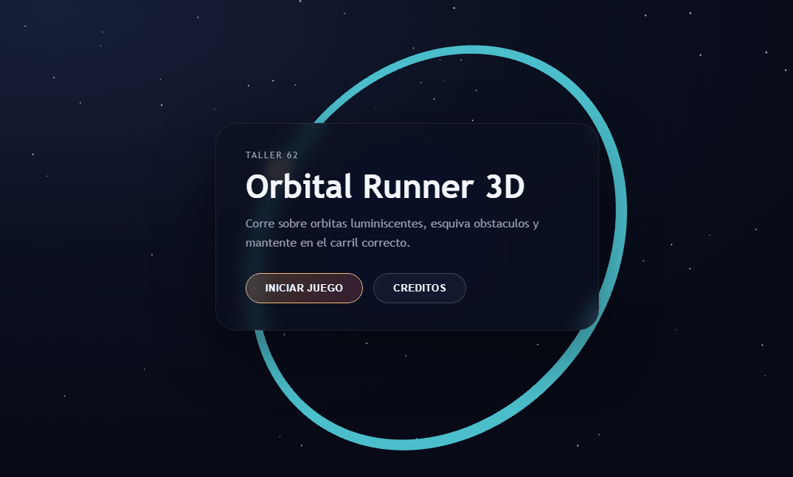
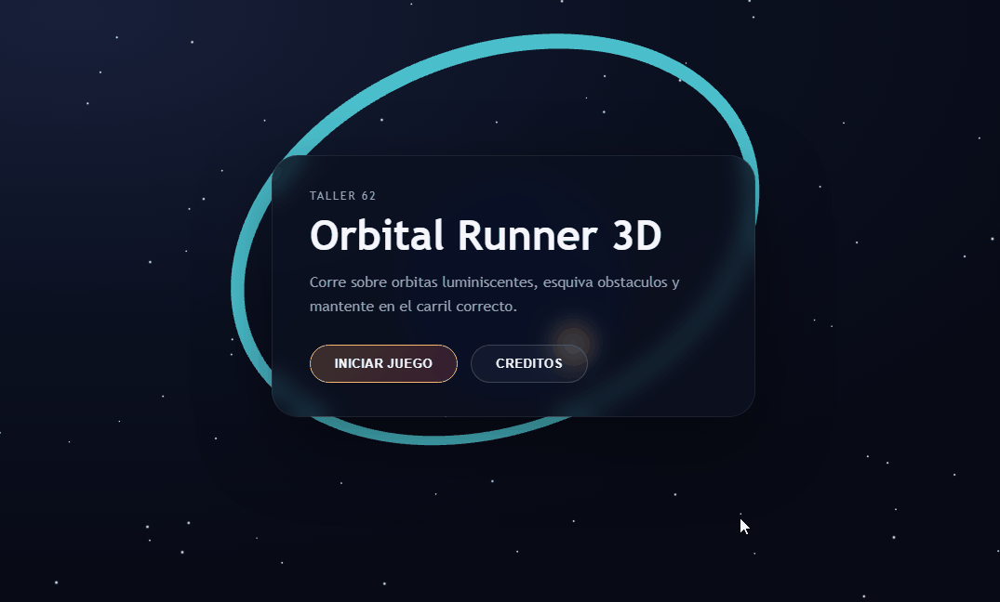
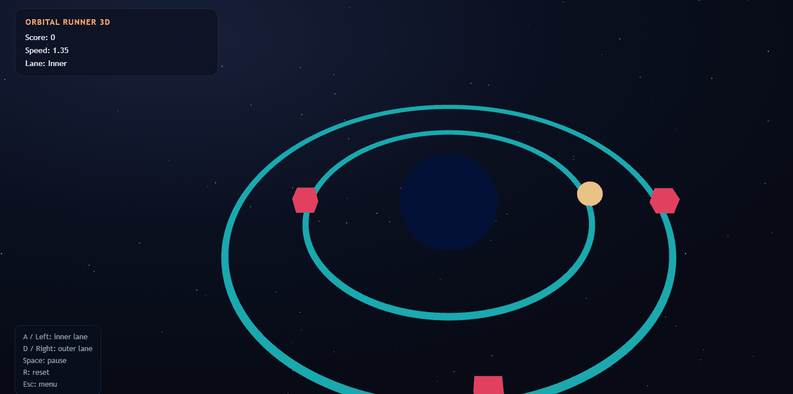

# Taller - Arquitectura de Juego, Escenas y Navegación en Unity y Three.js
## Nombre: 

- Juan David Buitrago Salazar
- Juan David Cardenas Galvis
- Nicolas Rodriguez Piraban
- Camilo Andres Medina Sanchez
- Juan Felipe Fajardo Garzon

## Fecha de entrega: 25/04/2026

## Descripción breve:
En este taller se construyó una arquitectura escalable con múltiples escenas en React, integrando renderizado 3D con Three.js. El proyecto final es Orbital Runner 3D, un runner espacial en el que el jugador cambia entre dos órbitas para esquivar obstáculos y acumular puntaje.

## Implementaciones:

### Three.js + React:

Se organizó el proyecto en tres escenas separadas: Menú, Juego y Créditos. La navegación entre escenas se realiza con React Router. Cada escena tiene su propio Canvas 3D y una capa UI que guía al usuario.

- **Menú:** Planeta central con anillo orbital, estrellas y botones de inicio/créditos.
- **Juego:** Dos órbitas (inner/outer), obstáculos en movimiento, puntaje y velocidad progresiva.
- **Créditos:** Escena 3D con icosaedro wireframe y datos del equipo.

## Resultados visuales:

### Three.js + React:
Se puede observar la escena principal del Menú, que cuenta con una vista tridimensional del planeta y permite al usuario navegar hacia el juego o los créditos.



Una vez iniciado el juego, el jugador se mueve entre las órbitas para esquivar los obstáculos. La velocidad y la dificultad aumentan progresivamente con el tiempo.



Finalmente, se presenta la escena de Créditos, la cual despliega los nombres de los desarrolladores frente a un modelo de icosaedro animado.



## Código relevante:

La navegación por escenas se maneja con React Router desde `App.jsx`, permitiendo aislar la lógica y la renderización de cada estado del juego:

```jsx
import { Routes, Route } from "react-router-dom";
import Menu from "./components/Menu";
import Juego from "./components/Juego";
import Creditos from "./components/Creditos";

function App() {
  return (
    <Routes>
      <Route path="/" element={<Menu />} />
      <Route path="/juego" element={<Juego />} />
      <Route path="/creditos" element={<Creditos />} />
    </Routes>
  );
}
```

En el juego, la lógica de obstáculos avanza por ángulo y detecta colisiones verificando en qué carril (lane) se encuentra el jugador:

```jsx
setObstacles((prev) => {
  let hit = false;
  let passed = 0;
  const next = [];

  for (const obs of prev) {
    const nextAngle = obs.angle - speedRef.current * delta;
    if (nextAngle < -0.5) {
      passed += 1;
      continue;
    }

    if (!hit && obs.lane === lane && Math.abs(nextAngle) < 0.14) {
      hit = true;
    }

    next.push({ ...obs, angle: nextAngle });
  }

  if (passed > 0) onScore(passed);
  if (hit) onGameOver();
  return next;
});
```

## Diagrama de Escenas implementado

```text
                  ┌──────────┐
                  │   MENÚ   │
                  └─────┬────┘
                        │
            ┌───────────┴───────────┐
            ▼                       ▼
    Botón 'Iniciar'          Botón 'Créditos'
            │                       │
      ┌─────▼────┐            ┌─────▼────┐
      │  JUEGO   │            │ CRÉDITOS │
      └─────┬────┘            └─────┬────┘
            │                       │
        Game Over             Botón 'Volver'
            │                       │
            └───────────┬───────────┘
                        ▼
                  ┌──────────┐
                  │   MENÚ   │
                  └──────────┘
```

## Prompts utilizados:
- Genera una escena 3D para menu con un planeta y un anillo orbital.
- Crear juego runner 3D con dos carriles y obstaculos en React Three Fiber.
- Disenar una pantalla de creditos con fondo 3D y boton de retorno.

## Aprendizajes y dificultades:
Este taller reforzó la organización del código por escenas y la navegación con rutas. La principal dificultad fue sincronizar la lógica de obstáculos con el renderizado continuo sin afectar el rendimiento.

## Nota
Las capturas y GIFs deben guardarse en la carpeta media/ con nombres en minúsculas y sin espacios.
