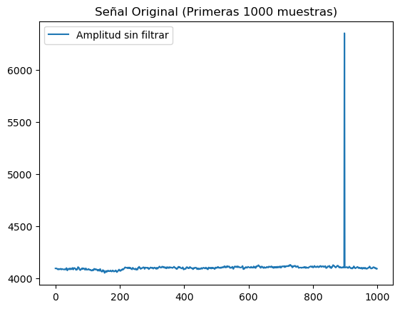
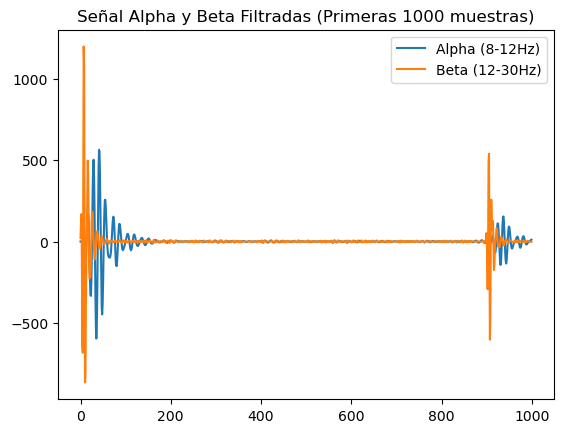
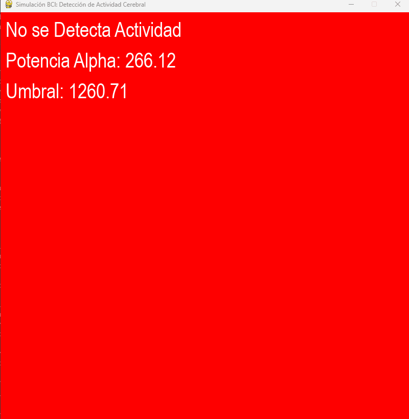

# Taller - BCI Simulado: Señales Mentales Artificiales para Control Visual
## Nombres:

- Juan David Buitrago Salazar
- Juan David Cardenas Galvis
- Nicolás Rodríguez Piraban
- Camilo Andres Medina Sanchez
- Juan Felipe Fajardo Garzón

## Fecha de entrega: 25/04/2026

## Descripción breve:
Este taller implementó una simulación de interfaz cerebro-computadora (BCI) utilizando el dataset EEG Eye State de UCI. El objetivo fue procesar señales de EEG en tiempo real, aplicar filtros para aislar frecuencias Alpha, calcular la potencia de la señal y visualizar la detección de actividad cerebral mediante una interfaz gráfica.

## Implementaciones:

### Python:

Se utilizó el dataset EEG Eye State de UCI con 14 canales EEG y 14980 muestras. Se implementó un filtro Butterworth pasa-banda para aislar la banda Alpha (8-12Hz) y Beta (12-30Hz). Se calculó la potencia de la señal Alpha usando ventanas móviles de 64 muestras. Se definió un umbral dinámico (promedio + desviación estándar de la potencia). Finalmente, se creó una simulación en pygame que cambia el color de fondo (verde/rojo) según la detección de actividad cerebral comparando la potencia Alpha contra el umbral.

## Resultados visuales:

Inicialmente se tiene la gráfica de amplitud vs tiempo original (sin filtro ni procesamiento)



Luego de aplicar el centrado en 0 y el filtro pasa banda para Alpha y Beta se obtiene la siguiente gráfica de amplitud vs tiempo



Finalmente, la ventana de pygame muestra el estado de detección de actividad cerebral para las muestras del dataset. Cuando la potencia Alpha supera el umbral, el fondo se vuelve verde indicando "Actividad Detectada". Cuando está por debajo, el fondo es rojo indicando "No se Detecta Actividad". La pantalla también muestra en tiempo real los valores de potencia Alpha y el umbral configurado.



## Código relevante:
El código central es el procesamiento de la señal EEG y el filtro pasa-banda. Primero se diseña el filtro Butterworth con las frecuencias de corte normalizadas, luego se aplica a la señal original para obtener la banda Alpha.
```python
def filtro_butter(lowcut, highcut, fs, order=5):
    nyq = 0.5 * fs
    low = lowcut / nyq
    high = highcut / nyq
    b, a = butter(order, [low, high], btype='band')
    return b, a

def aplicar_filtro(data, lowcut, highcut, fs, order=5):
    b, a = filtro_butter(lowcut, highcut, fs, order=order)
    return lfilter(b, a, data)
```

La detección de actividad se basa en calcular la potencia con ventanas móviles y compararla contra un umbral estadístico:

En este fragmento se presenta la función que calcula el vector de potencias para la señal filtrada
```python
def potencia(signal, window_size=64):
    return np.sqrt(np.convolve(signal**2, np.ones(window_size)/window_size, mode='same'))

alpha_power = potencia(alpha_signal)
umbral = np.mean(alpha_power) + np.std(alpha_power)
```

Dentro del loop de la simulación se recorre el arreglo calculado y se compara con el umbral

```python
if alpha_power[i] > umbral:  # Recorremos el arreglo de potencia Alpha 
        estado_cerebro = True
    else:
        estado_cerebro = False
    
    # Cambiamos el color de fondo según el estado del cerebro
    if estado_cerebro:
        screen.fill((0, 255, 0))  # Verde si se detecta actividad
        estado = "Actividad Detectada"
    else:
        screen.fill((255, 0, 0))  # Rojo si no se detecta actividad
        estado = "No se Detecta Actividad"
```

## Prompts utilizados:

Como puedo utilizar scipy.signal para realizar un filtro pasa banda en una señal BCI 

## Aprendizajes y dificultades:
Este sirvió para comprender cómo se procesan señales biológicas reales. Aprendí que las señales EEG requieren filtros pasa-banda para aislar bandas específicas de frecuencia (Alpha, Beta, Theta) que tienen significados fisiológicos distintos. La dificultad principal fue ajustar la velocidad de simulación y el tamaño de las ventanas para que la detección se pudiera visualizar de manera fluida.