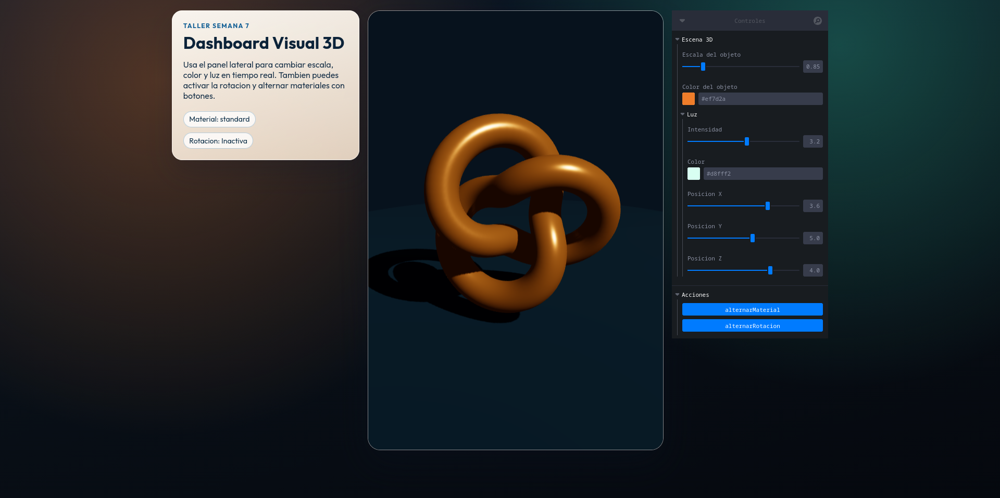
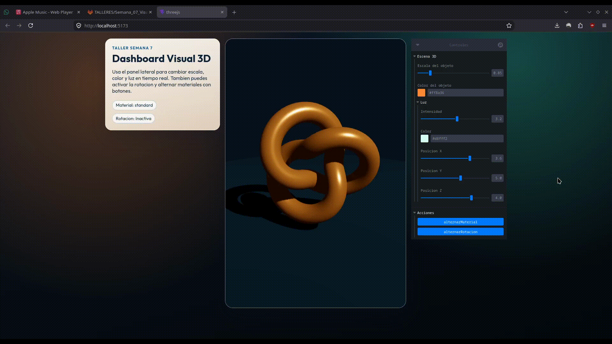
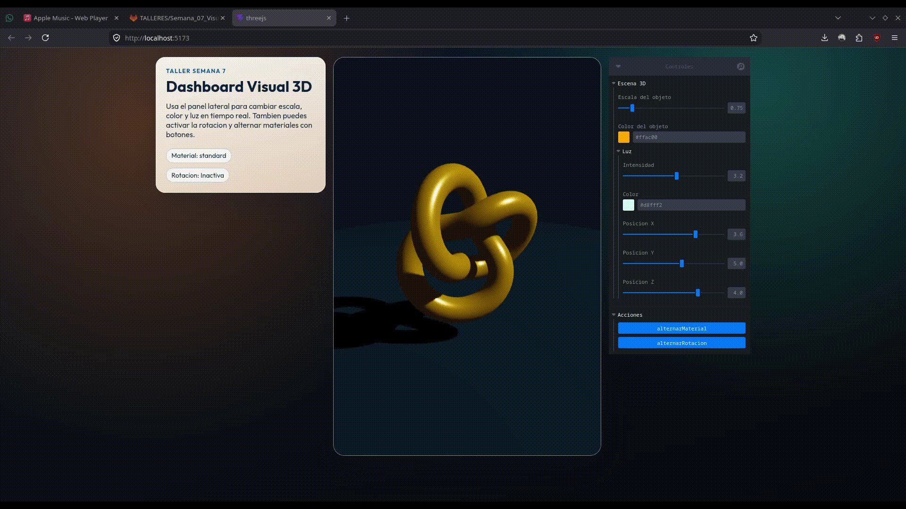
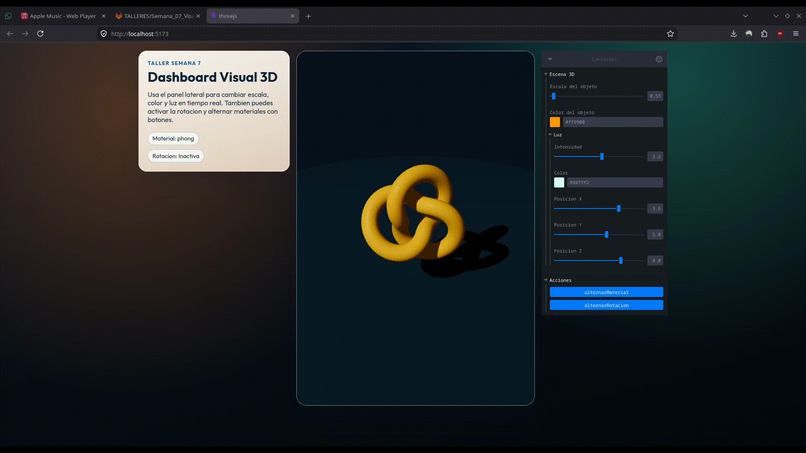

# Taller Dashboards Visuales 3D: Sliders y Botones

## Equipo de trabajo

- Juan David Buitrago Salazar
- Juan David Cárdenas Galvis
- Juan Felipe Fajardo Garzón
- Camilo Andrés Medina Sánchez
- Nicolás Rodríguez Pirabán

## Fecha de entrega

25 de abril de 2026

---

## Descripcion breve

Este taller tuvo como objetivo disenar e implementar una interfaz grafica 3D interactiva capaz de conectar entradas de usuario con modificaciones visuales en tiempo real dentro de una escena renderizada. En particular, se trabajo el acoplamiento entre controles de panel (sliders y botones) y atributos de objetos 3D, con enfasis en transformaciones, materiales y parametros de iluminacion.

La implementacion realizada en este repositorio se desarrolla en JavaScript con React Three Fiber (Three.js) y Leva, utilizando una escena con un objeto principal tipo torus knot, controles de escala y color, alternancia de materiales y activacion de rotacion automatica. Adicionalmente, se incorpora un bloque de control de luz direccional (intensidad, color y posicion espacial), lo que permite evaluar visualmente la relacion entre interfaz y comportamiento tridimensional.

Desde una perspectiva de ingenieria, el resultado consolida una arquitectura modular basada en componentes de React, integrando renderizado en `Canvas`, estado reactivo para acciones de usuario y actualizacion por cuadro con `useFrame` para animacion continua. El tablero final cumple la consigna de control en vivo de la escena y mantiene una estructura mantenible para extensiones futuras.

---

## Objetivos tecnicos alcanzados

1. Implementar una escena 3D navegable con camara orbital.
2. Vincular sliders a propiedades geometricas y de material del objeto principal.
3. Integrar botones de accion para cambio de material y encendido/apagado de rotacion automatica.
4. Incorporar controles avanzados de iluminacion como componente bonus del taller.
5. Organizar una interfaz de dashboard con separacion entre vista 3D, panel descriptivo y panel de controles.

---

## Implementaciones

### Three.js / React Three Fiber

Se construyo una aplicacion React con Vite que utiliza `@react-three/fiber` para renderizado, `@react-three/drei` para controles de camara y utilidades, y `leva` para el panel de control interactivo.

Funcionalidades implementadas:

- Objeto 3D principal: `TorusKnot` con sombras habilitadas.
- Slider de escala (`scale`) con rango continuo.
- Selector de color del material (`material.color`).
- Boton para alternar entre `meshStandardMaterial` y `meshPhongMaterial`.
- Boton para activar o desactivar rotacion automatica por cuadro.
- Panel de luz (bonus):
  - Intensidad de luz direccional.
  - Color de luz.
  - Posicion de luz en ejes X, Y, Z.
- Camara interactiva con `OrbitControls` y amortiguacion (`enableDamping`).

Notas de alcance:

- La entrega se trabajo exclusivamente con Three.js dentro de la carpeta `threejs/`.
- La carpeta `media/` contiene las evidencias visuales finales del funcionamiento.

---

## Resultados visuales

Las evidencias visuales ya fueron capturadas y se incluyen en la carpeta `media/`. A continuacion se documenta cada archivo con su ubicacion, contenido tecnico y lectura funcional dentro del taller.

### Evidencia 1: Vista general del dashboard

La imagen muestra la composicion general del dashboard, con el panel descriptivo a la izquierda, la escena 3D al centro y el panel de controles a la derecha, evidenciando la organizacion espacial final de la interfaz.



### Evidencia 2: Control de escala y color en tiempo real

El GIF muestra la respuesta inmediata del objeto 3D al modificar la escala y el color desde el panel, confirmando la actualizacion reactiva de la escena sin recarga.



### Evidencia 3: Alternancia de materiales y rotacion automatica

El GIF evidencia el cambio entre materiales y la activacion de la rotacion automatica, mostrando como la luz y el movimiento alteran la lectura visual del modelo.



### Evidencia 4: Sensibilidad de la iluminacion direccional (bonus)

El GIF muestra el efecto de modificar la intensidad, el color y la posicion de la luz direccional, permitiendo observar variaciones claras en sombras, contraste y volumen del objeto.



---

## Codigo relevante

### Snippet 1: Controles de escena con Leva

```jsx
const { scale, color, lightIntensity, lightColor, lightX, lightY, lightZ } =
  useControls('Escena 3D', {
    scale: { value: 1, min: 0.5, max: 2.6, step: 0.05 },
    color: { value: '#ef7d2a' },
    Luz: folder({
      lightIntensity: { value: 2.1, min: 0, max: 6, step: 0.1 },
      lightColor: { value: '#d8fff2' },
      lightX: { value: 3, min: -8, max: 8, step: 0.1 },
      lightY: { value: 5, min: -2, max: 10, step: 0.1 },
      lightZ: { value: 4, min: -8, max: 8, step: 0.1 },
    }),
  })
```

### Snippet 2: Botones de accion para material y rotacion

```jsx
useControls('Acciones', {
  alternarMaterial: button(() => {
    setMaterialType((current) =>
      current === 'standard' ? 'phong' : 'standard',
    )
  }),
  alternarRotacion: button(() => {
    setAutoRotate((current) => !current)
  }),
})
```

### Snippet 3: Animacion controlada por cuadro

```jsx
useFrame((_, delta) => {
  if (!meshRef.current || !autoRotate) return
  meshRef.current.rotation.y += delta * 1.1
  meshRef.current.rotation.x += delta * 0.45
})
```

---

## Prompts utilizados

A continuacion se listan prompts representativos utilizados durante el desarrollo, depuracion y documentacion del proyecto:

1. "Implementa una escena en React Three Fiber con un objeto 3D y un panel Leva para controlar escala y color en tiempo real."
2. "Agrega botones para alternar materiales entre meshStandardMaterial y meshPhongMaterial, manteniendo estado en React."
3. "Configura una luz direccional editable con sliders para intensidad, color y posicion XYZ."
4. "Reestructura el layout para que el panel de controles quede al lado del viewport 3D y no debajo."
5. "Mejora el contraste del bloque descriptivo para cumplir criterios de legibilidad en interfaz grafica."
6. "Genera una descripcion tecnica academica del proyecto para incluir en README, con objetivos, arquitectura y resultados."
7. "Documenta evidencias visuales ya capturadas, explicando el contenido tecnico de cada imagen o GIF."
8. "Redacta una seccion de aprendizajes, dificultades y mejoras futuras con tono formal y academico."

---

## Aprendizajes y dificultades

### Aprendizajes

Este taller permitio consolidar la integracion entre interfaz de usuario y escena 3D en un flujo reactivo. Se reforzo el uso de React Three Fiber como capa de abstraccion para Three.js, asi como el valor de Leva para prototipado rapido de dashboards de control visual. Tambien se afianzo la comprension de materiales y luz en terminos de percepcion de forma, volumen y profundidad.

Adicionalmente, se fortalecieron criterios de diseno de interfaz orientados a usabilidad, especialmente en contraste de color, legibilidad tipografica y distribucion espacial de paneles de informacion y control.

### Dificultades

Una dificultad inicial fue equilibrar la disposicion de la UI para evitar solapamientos o jerarquias ambiguas entre el viewport 3D y el panel de controles. Se resolvio mediante una grilla de layout con separacion explicita entre bloque descriptivo, visor y contenedor de controles.

Otra complejidad fue obtener un balance visual adecuado entre iluminacion, sombreado y color del objeto cuando el usuario modifica parametros extremos. Esto se abordo ajustando rangos de sliders y valores iniciales de luz para garantizar estabilidad perceptual de la escena.

---

## Aportes del equipo

El desarrollo del taller se realizo de forma colaborativa y sostenida en todas sus etapas: analisis de requerimientos, construccion de componentes, ajustes de interfaz, validacion funcional y documentacion tecnica. Todos los integrantes participaron activamente en el proceso integral, aportando decisiones de implementacion y criterios de mejora continua.

En ese marco colaborativo, cada integrante aporto de manera relevante al resultado final del taller:

- **Juan David Buitrago Salazar**: participacion continua en la construccion y refinamiento de la escena interactiva.
- **Juan David Cárdenas Galvis**: aporte en integracion de controles, validacion funcional y ajustes de interfaz.
- **Juan Felipe Fajardo Garzón**: apoyo en estructuracion de la experiencia visual y pruebas de comportamiento.
- **Camilo Andrés Medina Sánchez**: colaboracion en la definicion de la composicion final y en la documentacion tecnica.
- **Nicolás Rodríguez Pirabán**: contribucion al ajuste visual general y a la verificacion del comportamiento de la escena.

---

## Estructura del proyecto

```text
semana_07_3_dashboards_visuales_3d_sliders_botones/
├── media/                                   # Evidencias visuales
├── threejs/                                 # Implementacion React + Three.js
│   ├── src/
│   │   ├── App.jsx
│   │   ├── App.css
│   │   └── index.css
│   └── package.json
├── 04_plantilla_readme_entregas_talleres.md
├── semana_07_3_dashboards_visuales_3d_sliders_botones.md
└── README.md
```

---

## Requisitos de ejecucion (Three.js)

```bash
cd threejs
pnpm install
pnpm run dev
```

Scripts disponibles:

- `pnpm run dev`: entorno local de desarrollo.
- `pnpm run build`: compilacion de produccion.
- `pnpm run lint`: analisis estatico de codigo.
- `pnpm run preview`: previsualizacion de build.

---

## Referencias

- Documentacion oficial de Three.js: https://threejs.org/docs/
- Documentacion de React Three Fiber: https://docs.pmnd.rs/react-three-fiber/
- Documentacion de Drei: https://github.com/pmndrs/drei
- Documentacion de Leva: https://github.com/pmndrs/leva
- Guia oficial de Vite: https://vite.dev/

---

## Checklist de entrega

- [x] Carpeta del taller creada con estructura base.
- [x] Implementacion funcional en `threejs/`.
- [x] README tecnico, formal y estructurado.
- [x] Seccion de prompts documentada.
- [x] Seccion de aportes del equipo con enfoque colaborativo.
- [x] Evidencias visuales incorporadas en `media/`.
