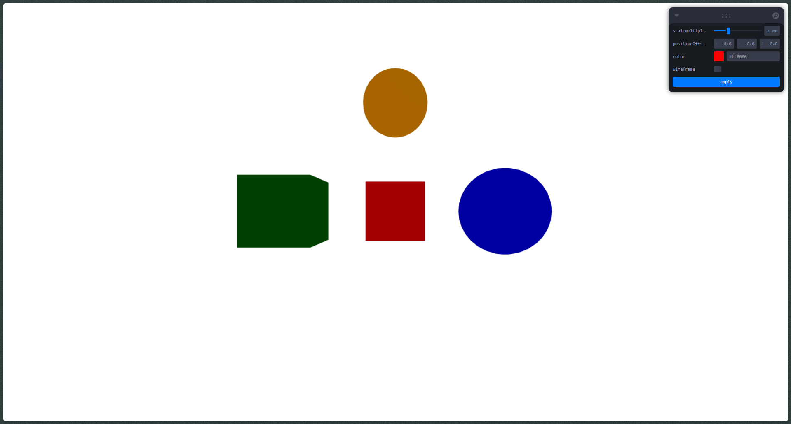
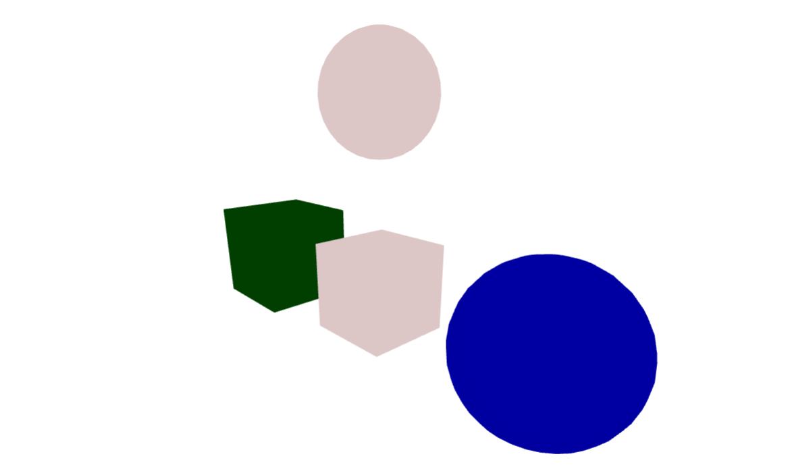
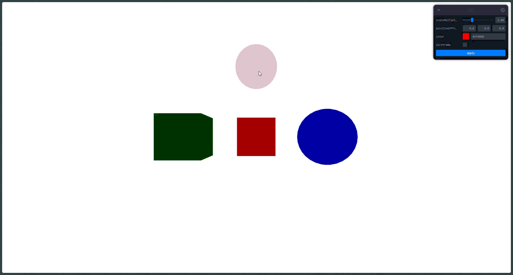

# Escenas Paramétricas: Creación de Objetos desde Datos

## Nombres

- Juan David Buitrago Salazar
- Juan David Cardenas Galvis
- Nicolas Rodriguez Piraban
- Camilo Andres Medina Sanchez
- Juan Felipe Fajardo Garzón

## Fecha de Entrega

`2026-04-25`

---

## Descripción Breve

Implementar la generación de objetos 3D de manera programada a partir de listas de datos estructurados, entendiendo cómo crear geometría en tiempo real mediante código, utilizando bucles, estructuras condicionales y renderizando las escenas generadas.

---

## Implementaciones

### Three.js

Se creó una escena 3D que genera objetos paramétricos a partir de un array de datos:

1. **Generación desde Datos**: Los objetos se crean a partir de un array estructurado (`objectsData`) que contiene:
   - `id`: Identificador único
   - `position`: Coordenadas [x, y, z]
   - `scale`: Escala del objeto
   - `color`: Color del material
   - `type`: Tipo de geometría ("box" o "sphere")

2. **Renderizado con map()**: Se utiliza el método `map()` para iterar sobre el array de datos y crear cada objeto 3D de manera programada.

3. **Geometría Condicional**: Se usan estructuras condicionales (`obj.type === "box"`) para seleccionar el tipo de geometría a renderizar.

4. **Transformaciones Paramétricas**: El panel de control (Leva) permite modificar dinámicamente:
   - `scaleMultiplier`: Factor de escala (0.2x a 3x)
   - `positionOffset`: Desplazamiento en X, Y, Z
   - `color`: Color del material
   - `wireframe`: Modo wireframe

5. **Aplicación de Cambios**: Botón "Apply" que aplica las transformaciones a los objetos seleccionados.

---

## Resultados visuales

### Three.js - Implementación



La imagen muestra la escena generada con objetos 3D paramétricos creados a partir de un array de datos.



La imagen muestra la selección de objetos.



Este gif muestra la interacción con el panel de control (Leva) y cómo se aplican las transformaciones a los objetos paramétricamente con el uso del panel de leva.

---

## Código relevante

### Ejemplo de código Three.js (React Three Fiber)

```jsx
// Array de datos para generar objetos
const objectsData = [
  { id: 1, position: [0, 0, 0],  scale: 1,   color: "red",    type: "box" },
  { id: 2, position: [2, 0, 0],  scale: 0.8, color: "blue",   type: "sphere" },
  { id: 3, position: [-2, 0, 0], scale: 1.2, color: "green",  type: "box" },
  { id: 4, position: [0, 2, 0],  scale: 0.6, color: "orange", type: "sphere" },
];

// Renderizado con map()
{objects.map((obj) => (
  <mesh key={obj.id}>
    {obj.type === "box" ? <boxGeometry /> : <sphereGeometry />}
    <meshStandardMaterial color={obj.color} />
  </mesh>
))}
```

Este código demuestra cómo generar objetos 3D desde un array de datos utilizando `map()` y condicionales para la geometría.

### Controles con Leva

```jsx
const [controls, setControls] = useControls(() => ({
  scaleMultiplier: { value: 1, min: 0.2, max: 3 },
  positionOffset: { value: { x: 0, y: 0, z: 0 }, step: 0.1 },
  color: "#ff0000",
  wireframe: false,
  apply: button((get) => {
    // Aplicar transformaciones a objetos seleccionados
  }),
}));
```

Este código integra Leva para controlar los parámetros dinámicamente desde la interfaz.

---

## Prompts utilizados

Three.js:

```
Crea una Script en React con Three.js (React Three Fiber) que genere 
objetos 3D desde un array de datos. Incluye:
1. Un array con varios objetos (posición, escala, color, tipo)
2. Uso de map() para renderizar los objetos
3. Condicionales para seleccionar geometría (box/sphere)
4. Panel de control (leva) para transformar objetos seleccionados
5. Botón para aplicar las transformaciones
```

---

## Aprendizajes y dificultades

En este taller aprendí a generar objetos 3D de manera programada utilizando arrays de datos y el método `map()`. Aprendí también a usar estructuras condicionales para renderizar diferentes tipos de geometría y a integrar Leva para controlar parámetros en tiempo real.

La parte más desafiante fue sincronizar el estado de los objetos con los controles de Leva, especialmente porque se necesita mantener una referencia (`useRef`) para obtener los valores actuales dentro del callback del botón Apply. También fue complejo manejar el renderizado condicional de las transformaciones, aplicando el offset de posición y la escala solo a los objetos seleccionados.

Una mejora a futuro sería agregar la posibilidad de crear nuevos objetos directamente desde el panel de control, eliminar objetos seleccionados, y guardar/cargar la configuración de la escena desde un archivo externo.