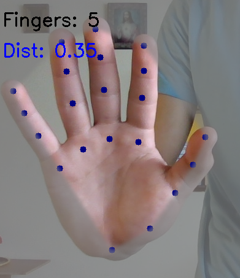
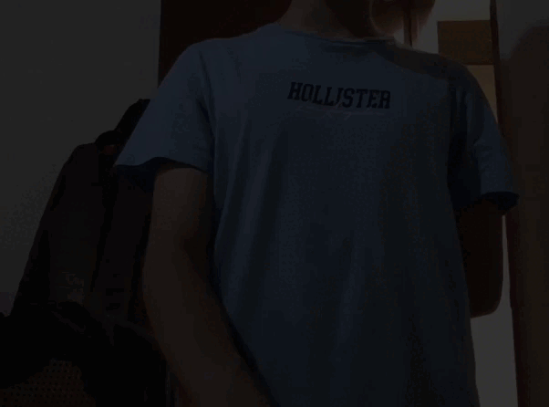
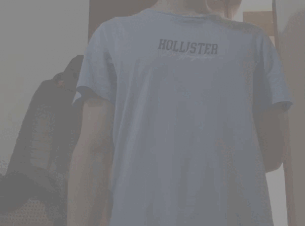

# Gestos con Cámara Web: Control Visual con MediaPipe

## Nombres

- Juan David Buitrago Salazar
- Juan David Cardenas Galvis
- Nicolás Rodríguez Piraban
- Camilo Andres Medina Sanchez
- Juan Felipe Fajardo Garzón

## Fecha de Entrega

`2026-04-25`

---

## Descripción Breve

Implementar un sistema de control visual usando la webcam y MediaPipe para detectar gestos de manos y ejecutar acciones en tiempo real, explorando interfaces naturales sin hardware adicional.

---

## Implementaciones

### Python

Se creó un sistema de detección de gestos que incluye:

1. **Detección de Manos**: Utiliza MediaPipe Hands para detectar landmarks de manos en tiempo real desde la webcam.

2. **Conteo de Dedos**: Función `count_fingers()` que determina cuántos dedos están extendidos:
   - Índice, medio, anular, meñique: comparación Y de la punta vs base
   - Pulgar: comparación X de la punta vs articulación

3. **Distancia entre Dedos**: Calcula la distancia euclidiana entre el pulgar y el dedo índice para detectar gestos de "pinch".

4. **Acciones Visuales**:
   - **Cambio de fondo**: Según el número de dedos extendidos
     - 1 dedo: fondo negro
     - 2 dedos: fondo gris
     - 3 dedos: fondo blanco
   - **Crear cubo**: Mano abierta (5 dedos) activa un cubo en pantalla
   - **Mover cubo**: Pinch (dedo índice + pulgar cerca) permite arrastrar el cubo
   - **Eliminar cubo**: 0 dedos dentro del cubo lo elimina

5. **Efecto de Silueta**: Genera una mask de la mano y la superpone en el video.

---

## Resultados visuales

### Python - Implementación



Esta imagen muestra los landmarks de la mano detectados por MediaPipe. Los puntos se dibujan en la imagen y se genera una máscara convexa de la mano.



Este gif demuestra el cambio de color de fondo basado en el número de dedos extendidos.



Este gif demuestra la interacción con el cubo: aparece con 5 dedos, se arrastra con pinch (índice + pulgar), y se elimina con 0 dedos.

---

## Código relevante

### Ejemplo de código Python (OpenCV + MediaPipe)

```python
# Detección de dedos extendidos
def count_fingers(hand_landmarks):
    fingers = []

    # Índice, medio, anular, meñique
    tips = [8, 12, 16, 20]
    bases = [6, 10, 14, 18]

    for tip, base in zip(tips, bases):
        if hand_landmarks[tip].y < hand_landmarks[base].y:
            fingers.append(1)

    # Pulgar (caso especial → eje X)
    if hand_landmarks[4].x > hand_landmarks[3].x:
        fingers.append(1)

    return sum(fingers)

# Cálculo de distancia entre dedos
def distance(p1, p2):
    return math.sqrt(
        (p1.x - p2.x)**2 +
        (p1.y - p2.y)**2
    )
```

Este código detecta dedos extendidos midiendo la posición de los landmarks y calcula la distancia entre dedos.

### Bucle principal

```python
while True:
    ret, frame = cap.read()
    rgb_frame = cv2.cvtColor(frame, cv2.COLOR_BGR2RGB)

    # MediaPipe detecta manos
    mp_image = mp.Image(image_format=mp.ImageFormat.SRGB, data=rgb_frame)
    result = detector.detect(mp_image)

    if result.hand_landmarks:
        for hand in result.hand_landmarks:
            count = count_fingers(hand)

            # Cambiar fondo según dedos
            if count == 1:
                color = (0, 0, 0)
            elif count == 2:
                color = (128, 128, 128)
            elif count == 3:
                color = (255, 255, 255)

            # Detectar pinch
            dist = distance(hand[4], hand[8])
            pinch = dist < 0.08

            # Crear cubo con mano abierta
            if count == 5:
                cube_active = True
```

Este código es el bucle principal que procesa el video, detecta gestos y ejecuta acciones visuales.

---

## Prompts utilizados

Python:

```
Crea una aplicación en Python con OpenCV y MediaPipe que:
1. Active la webcam y capture video en tiempo real
2. Detecte manos utilizando MediaPipe Hands
3. Cuente el número de dedos extendidos
4. Mida la distancia entre el dedo índice y el pulgar
5. Cambie el color de fondo según el número de dedos
6. Cree un objeto visual (cubo) que se pueda mover con gestos de pinch
7. Elimine el cubo con un gesto específico
```

---

## Aprendizajes y dificultades

En este taller aprendí a integrar MediaPipe con OpenCV para crear aplicaciones de visión por computadora en tiempo real. Aprendí cómo funcionan los landmarks de las manos y cómo detectar gestos simples como dedos extendidos y el gesto de "pinch".

La parte más desafiante fue calibrar el umbral de distancia para el gesto de pinch (`dist < 0.08`), ya que depende de la distancia de la cámara y el tamaño de la mano. También fue complejo implementar el arrastre suave del cubo con interpolación lineal para evitar movimientos bruscos.

Una mejora a futuro sería agregar más gestos interactivos, como control de volumen o brillo, o un juego completo donde se controlen elementos con la mano. También podría mejorar el efecto de silueta usando segmentación de MediaPipe en lugar de convex hull.