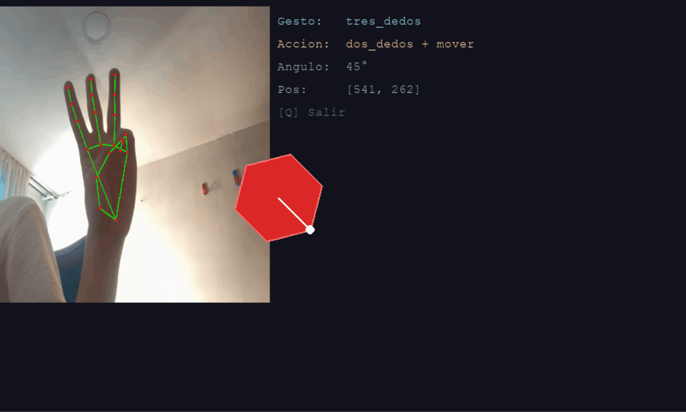

# Taller - Interfaces Multimodales Voz + Gestos

## Nombres: 

- Juan David Buitrago Salazar
- Juan David Cardenas Galvis
- Nicolás Rodríguez Piraban
- Camilo Andres Medina Sanchez
- Juan Felipe Fajardo Garzón

## Fecha de entrega: 25/04/2026

## Descripción breve:
En este taller se implementó un sistema de interacción multimodal en tiempo real que fusiona el reconocimiento de gestos manuales con comandos de voz. El objetivo principal es interactuar con una interfaz visual geométrica (un polígono) usando la combinación estricta de una postura específica de la mano detectada mediante la cámara y una palabra pronunciada al micrófono. 

Para lograr esto, se utilizaron técnicas de programación concurrente (hilos) para separar el procesamiento de la cámara y el micrófono, permitiendo que la interfaz gráfica permanezca fluida y reactiva en todo momento.

## Implementaciones:

### Python:

El núcleo del proyecto fue desarrollado en Python, estructurando el código (`main_multimodal.py`) en tres módulos principales y un motor de renderizado:

1. **Módulo de Gestos:** Se utilizó la nueva y moderna API `MediaPipe Tasks Vision` (específicamente `HandLandmarker`) para detectar la posición de los 21 puntos de la mano (*landmarks*). A partir de la posición relativa de las puntas de los dedos con respecto a sus articulaciones, se programó una clasificación manual para detectar gestos como la "mano abierta", "puño", "dos dedos" y "tres dedos". Además, se dibujó el esqueleto de la mano de forma customizada utilizando OpenCV (`cv2`).

2. **Módulo de Voz:** Utiliza `sounddevice` para grabar fragmentos de audio continuo de 2.5 segundos, y `speech_recognition` (conectado a la API de Google) para transcribir el audio a texto. Para mejorar la eficiencia del sistema, se agregó un mecanismo de normalización que busca sinónimos (ej: "rotar" o "girar") dentro del texto transcrito. También incluye validadores de volumen para detectar si el micrófono está captando ruido.

3. **Motor Multimodal:** Implementa una lógica de máquina de estados y variables globales (con protección mediante `threading.Lock`) donde la acción final se ejecuta **únicamente** si se detecta un comando de voz mientras un gesto de mano es mantenido. Se agregó un *buffer* o memoria de 2 segundos para el gesto, contrarrestando el retraso natural de las peticiones a la API de voz de Google.

4. **Interfaz Reactiva:** Construida con `pygame`, dibuja un polígono dinámico que reacciona a los comandos modificando su color, rotación y posición en pantalla de acuerdo con los gestos dictados. Además, muestra una retransmisión de la cámara y un HUD que indica el estado actual del sistema.

## Resultados visuales:

A continuación se observa el funcionamiento del sistema detectando en tiempo real los gestos y reaccionando a los comandos de voz de forma simultánea.

### Cambiar Color y Movimiento
Se demuestra cómo la figura reacciona a la combinación de "Mano Abierta" + "Cambiar" o un color, y cómo se mueve al usar "Dos dedos" + "Mover":


### Rotación y Reset
Interacciones más avanzadas mostrando la rotación del polígono con el indicador visual al usar "Dos dedos" + "Rotar", y el reseteo del sistema con "Tres dedos" + "Reset":


### Interfaz Multimodal Completa
Vista completa de la interacción fluida entre los diferentes comandos a través de la interfaz de Pygame:




## Código relevante:

La inicialización de la API de MediaPipe y el dibujado manual del esqueleto de la mano se realiza dentro del hilo de la cámara:

```python
# Configurar la nueva API de MediaPipe Tasks
base_options = mp_python.BaseOptions(model_asset_path=MODEL_PATH)
options = vision.HandLandmarkerOptions(base_options=base_options, num_hands=1)
detector = vision.HandLandmarker.create_from_options(options)

# Procesar con la nueva API
mp_image = mp.Image(image_format=mp.ImageFormat.SRGB, data=frame_rgb)
detection_result = detector.detect(mp_image)

if detection_result.hand_landmarks:
    for hand_landmarks in detection_result.hand_landmarks:
        # Dibujar landmarks manualmente y conexiones
        h, w, _ = frame_ann.shape
        puntos = [(int(lm.x * w), int(lm.y * h)) for lm in hand_landmarks]
        for c in HAND_CONNECTIONS:
            cv2.line(frame_ann, puntos[c[0]], puntos[c[1]], (0, 255, 0), 2)
```

La lógica de clasificación de los gestos se basa en matemáticas simples comprobando la altura en Y de las puntas de los dedos comparadas con las articulaciones inferiores, y evaluando la posición X para el pulgar:

```python
# Pulgar
dedos = [hand_landmarks[4].x < hand_landmarks[3].x]
# Índice, medio, anular, meñique
for p in [8, 12, 16, 20]:
    dedos.append(hand_landmarks[p].y < hand_landmarks[p-2].y)

total = sum(dedos)
if total == 5:
    gesto = "mano_abierta"
elif total == 0:
    gesto = "puno"
elif total == 2 and dedos[1] and dedos[2]:
    gesto = "dos_dedos"
```

En cuanto al módulo de voz, se usa `sounddevice` para grabar el array de bytes y pasarlo a `SpeechRecognition`, lo cual elimina dependencias rotas de PyAudio en versiones modernas de Python:

```python
grabacion = sd.rec(int(duracion * fs), samplerate=fs, channels=1, dtype='int16')
sd.wait()

# Validar micrófono mudo
volumen = np.abs(grabacion).mean()
if volumen < 50:
    print(f"🔇 Micrófono muy bajo o silenciado")
    
audio = sr.AudioData(grabacion.tobytes(), fs, 2)
texto = reconocedor.recognize_google(audio, language="es-ES")
cmd = normalizar_voz(texto)
```

Por último, el motor de fusión multimodal usa el `estado_global` con `Lock` de concurrencia y un buffer de retención temporal para evitar problemas de sincronía por la latencia de la API de Google:

```python
with lock:
    if gesto != "ninguno":
        estado_global["gesto_actual"] = gesto
        estado_global["tiempo_gesto"] = time.time()
    else:
        # Mantener el gesto vivo por 2 segundos para dar tiempo a la voz
        if time.time() - estado_global.get("tiempo_gesto", 0) > 2.0:
            estado_global["gesto_actual"] = "ninguno"
```

## Prompts utilizados:
- "¿Cómo instalo y soluciono los problemas de dependencias (PyAudio / MediaPipe) en Python 3.14?"
- "¿Cómo refactorizo el código para utilizar la nueva API MediaPipe Tasks Vision en lugar de `mp.solutions`?"
- "¿Cómo soluciono el problema de latencia/lag entre el reconocimiento del gesto y el tiempo de respuesta de la API de voz?"
- "¿Cómo agregar una indicación visual (puntero/línea) a una figura geométrica generada con Pygame para que se note la rotación?"

## Aprendizajes y dificultades:
Este taller permitió comprender los grandes desafíos de sincronizar múltiples sensores humanos (cámara y micrófono) en un entorno de concurrencia. La mayor dificultad técnica radicó en el ecosistema de Python y las librerías obsoletas; la dependencia inicial de `PyAudio` fue muy problemática de instalar en Windows modernos, lo cual se resolvió reemplazándola por `sounddevice`. Asimismo, la arquitectura legada de `mp.solutions` de MediaPipe fallaba, forzándonos a migrar a la nueva API `Tasks Vision`. 

A nivel de diseño de interacción, el aprendizaje principal fue el manejo de la **latencia multimodal**: dado que el reconocimiento de gestos es instantáneo (local) pero el de voz demora 1-2 segundos en llegar desde el servidor de Google, tuvimos que implementar una pequeña "memoria" o *buffer* de gesto. Esto permite que el sistema recuerde la intención del usuario y la una con el comando de voz de forma natural, mejorando drásticamente la usabilidad del sistema.
