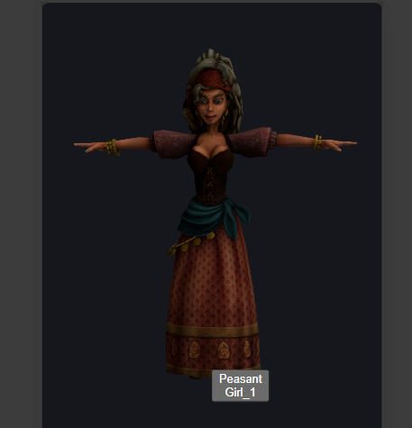
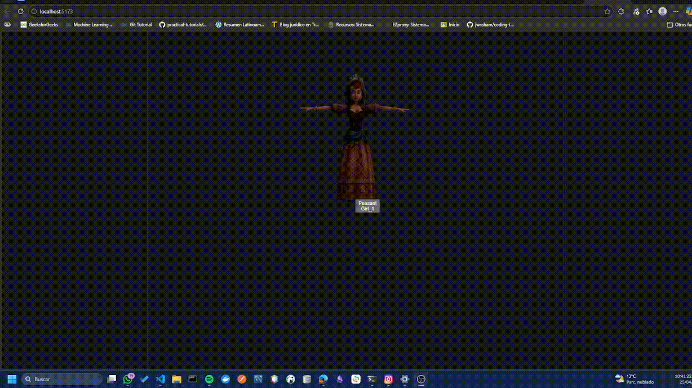
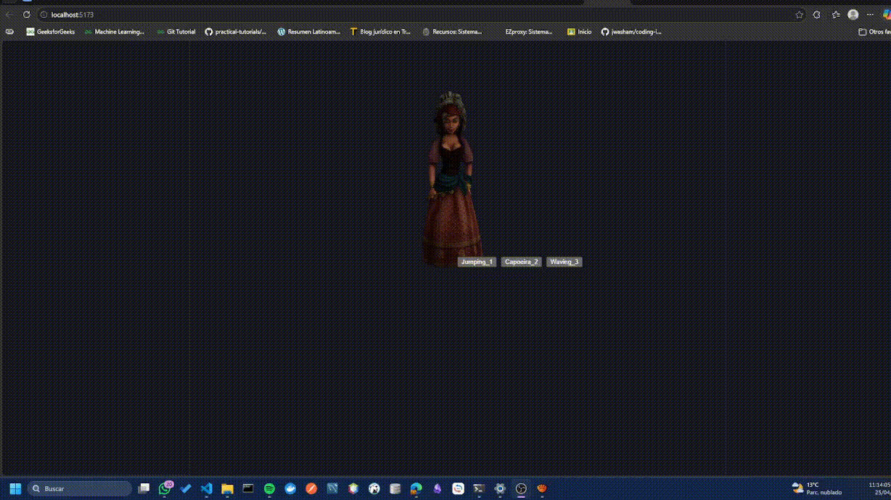
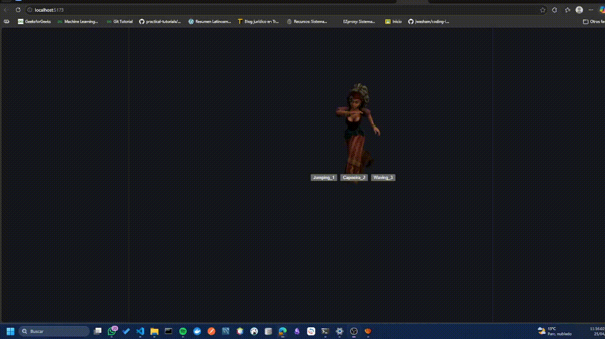
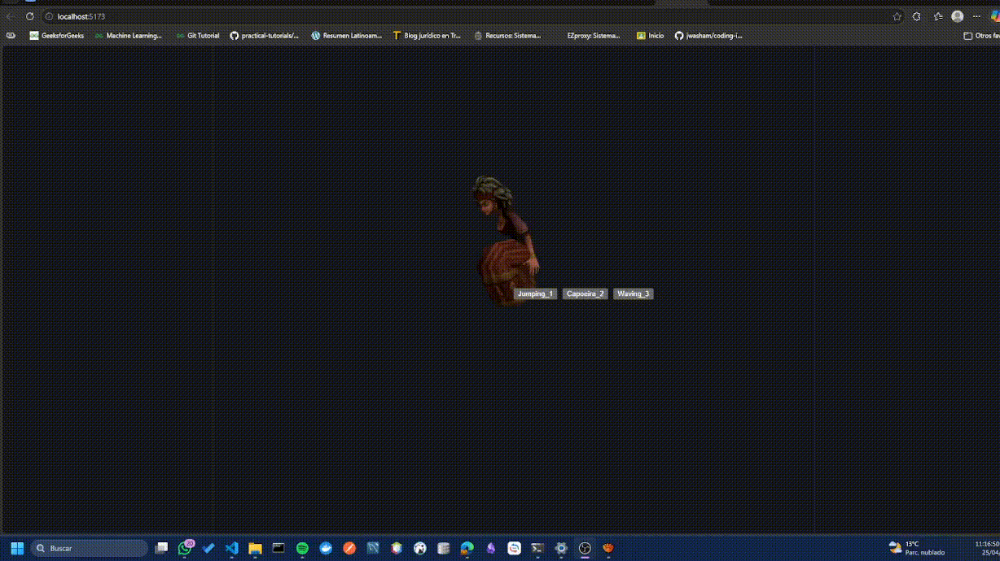

# Motion design interactivo eventos

## Nombres:

- Juan David Buitrago Salazar
- Juan David Cardenas Galvis
- Nicolás Rodríguez Piraban
- Camilo Andres Medina Sanchez
- Juan Felipe Fajardo Garzón

## Fecha de entrega: 25/04/2026

## Descripción breve:

En este taller se pretende trasponer un modelo exportado desde Mixamo en formato jbx haciendo un merge a glb para poder tener los modelos unificados. 
Se pretende generar un menu simple de botones para poder cambiar entre animaciones.

## Implementaciones: 

### Threejs: 

La implementación se desarrolló utilizando Three.js a través de React Three Fiber, lo cual permite integrar renderizado 3D dentro de aplicaciones React de forma declarativa.

Se utilizaron las siguientes herramientas:

@react-three/fiber → renderizado 3D en React
@react-three/drei → utilidades (carga GLTF, animaciones, controles)

El modelo final en formato .glb fue generado previamente en [convert3d](https://convert3d.org/fbx-to-glb), donde se unificaron múltiples animaciones provenientes de archivos .FBX.

## Resultados visuales:

El personaje que se animo descargado en Mixamo fue el siguiente


A continuación, se muestran las animaciones que están asociadas al personaje
*Saludo*

*Capoeira*

*Salto*


## Código relevante:
Este componente define un personaje 3D interactivo en una escena de React Three Fiber, cargando un modelo en formato `.glb` junto con sus animaciones y gestionándolas mediante el hook `useAnimations`. Permite reproducir y cambiar animaciones de forma dinámica con transiciones suaves (`fadeIn` y `fadeOut`), respondiendo a eventos del usuario como clics, movimiento del puntero y pulsaciones de teclado. Además, integra una interfaz de botones que facilita la selección manual de animaciones, logrando una interacción fluida y controlada del modelo dentro del entorno 3D.

```javascript
import { useRef, useEffect, useState } from "react";
import { useGLTF, useAnimations } from "@react-three/drei";
import HtmlButtons from "./HtmlButtons";

export default function Character() {
  const group = useRef();

  const { scene, animations } = useGLTF("/models/character.glb");
  const { actions, names } = useAnimations(animations, group);

  const [currentAction, setCurrentAction] = useState(null);

  // Función para reproducir animaciones con transición
  const playAction = (name) => {
    if (!actions[name]) return;

    if (currentAction && actions[currentAction]) {
      actions[currentAction].fadeOut(0.3);
    }

    actions[name].reset().fadeIn(0.3).play();
    setCurrentAction(name);
  };

  // Evento teclado
  useEffect(() => {
    const handleKey = (e) => {
      if (e.key === "r") playAction("Run");
      if (e.key === "j") playAction("Jump");
    };

    window.addEventListener("keydown", handleKey);
    return () => window.removeEventListener("keydown", handleKey);
  }, [actions, currentAction]);

  return (
    <group
      ref={group}
      onClick={() => playAction("Wave")}
      onPointerOver={() => playAction("Idle")}
    >
      <primitive object={scene} scale={1.5} />
      <HtmlButtons playAction={playAction} names={names} />
    </group>
  );
}
```

## Prompts utilizados:

“Cómo cargar un modelo .glb con animaciones en React Three Fiber usando useGLTF y useAnimations”
“Cómo reproducir y cambiar animaciones en Three.js con transiciones (fadeIn, fadeOut)”
“Cómo integrar eventos de usuario (click, hover, teclado) en React Three Fiber”
“Cómo crear botones HTML dentro de una escena 3D con @react-three/drei (Html)”
“Cómo unificar múltiples animaciones .FBX en un solo .glb”
“Por qué las animaciones no se reproducen en Three.js (debug de AnimationClip)”

## Aprendizajes y dificultades:

Durante el desarrollo del taller se comprendió el flujo completo de trabajo para integrar modelos 3D animados en aplicaciones web, desde la descarga de animaciones en Mixamo hasta su visualización en React Three Fiber. Se aprendió a utilizar hooks especializados como useGLTF y useAnimations, así como a gestionar transiciones entre animaciones para lograr una interacción más fluida.

Una de las principales dificultades fue la correcta unificación de animaciones en un solo archivo .glb, ya que herramientas de conversión automática no siempre preservan adecuadamente los clips de animación. Esto generó problemas como animaciones inexistentes o con duración incorrecta. También se presentaron retos en la identificación de nombres de animaciones y en la sincronización de eventos con su reproducción.