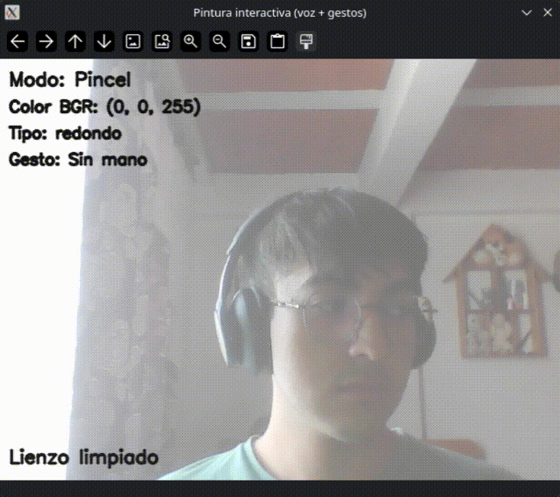
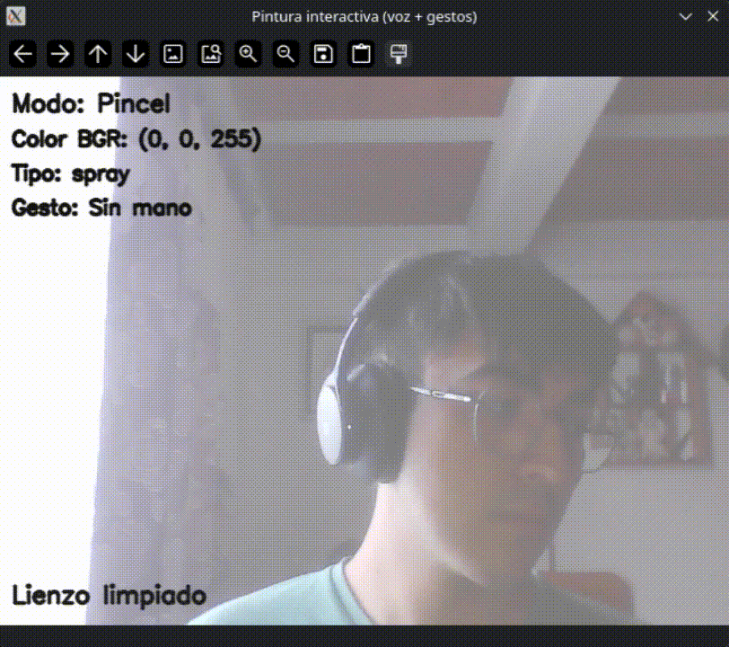
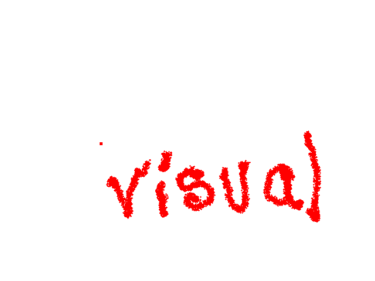

# Taller 7.9 - Obras Interactivas: Pintando con Voz y Gestos

## Integrantes

- Juan David Buitrago Salazar
- Juan David Cárdenas Galvis
- Juan Felipe Fajardo Garzón
- Camilo Andrés Medina Sánchez
- Nicolás Rodríguez Pirabán

## Fecha de entrega

25 de abril de 2026

---

## Descripción general

Este taller desarrolla una obra digital interactiva controlada mediante dos canales de interacción natural: gestos de mano y comandos de voz. La implementación en Python integra visión por computador en tiempo real con reconocimiento de voz para transformar la cámara y el micrófono en interfaces expresivas de creación gráfica.

Desde el punto de vista técnico, la solución combina `MediaPipe Hands` para estimación de landmarks de mano, `OpenCV` para captura de video y renderizado del lienzo, y `SpeechRecognition` para interpretar órdenes en español relacionadas con color, modo de trazo y acciones del sistema (limpiar y guardar). El resultado es un sistema multimodal que permite dibujar por pinza (índice-pulgar), alternar pinceles por gesto de mano abierta y modificar parámetros mediante voz, con retroalimentación visual en tiempo real.

---

## Objetivo del taller

Construir una experiencia de pintura interactiva en la que el usuario pueda:

- Dibujar sin mouse, usando la posición de la mano como entrada principal.
- Cambiar color y modo de herramienta mediante comandos de voz.
- Alternar dinámicamente el tipo de pincel por gesto.
- Guardar la obra final en formato de imagen dentro de la carpeta del proyecto.

---

## Implementación realizada (Python)

### Tecnologías y librerías

- `opencv-python` / `opencv-contrib-python`: captura, visualización y composición de imagen en tiempo real.
- `mediapipe`: detección de mano y extracción de landmarks para interpretación gestual.
- `numpy`: operaciones numéricas para cálculo geométrico y generación de efectos de trazo.
- `SpeechRecognition`: reconocimiento de comandos de voz en español (`es-ES`).
- `PyAudio`: backend de captura de audio para uso de micrófono.

### Lógica funcional del sistema

1. Se inicializa la cámara y se crea un lienzo blanco del mismo tamaño del frame.
2. Se analiza la mano detectada para identificar:
   - **Pinza (índice + pulgar):** activa el modo de dibujo continuo.
   - **Mano abierta:** pausa el dibujo y rota el tipo de pincel.
3. Un hilo en segundo plano escucha comandos de voz y los envía por cola segura al ciclo principal.
4. El sistema aplica comandos como:
   - Colores: `rojo`, `verde`, `azul`, `amarillo`, `negro`, `blanco`.
   - Herramientas: `pincel`, `borrar`/`goma`.
   - Acciones: `limpiar`, `guardar`.
5. La visualización final mezcla cámara y lienzo (`addWeighted`) para facilitar seguimiento corporal y resultado gráfico simultáneamente.

### Tipos de pincel implementados

- **Redondo:** línea continua estándar.
- **Cuadrado:** trazo por interpolación de rectángulos sólidos.
- **Spray:** dispersión estocástica de partículas dentro de un radio configurable.

### Controles de interacción

#### Gestos

- Pinza: dibujar.
- Mano abierta: pausar y cambiar tipo de pincel.

#### Voz

- Colores: `rojo`, `verde`, `azul`, `amarillo`, `negro`, `blanco`.
- Herramientas: `pincel`, `borrar`.
- Acciones: `limpiar`, `guardar`.

#### Teclado

- `q`: salir.
- `c`: limpiar lienzo.
- `s`: guardar imagen.

---

## Estructura del proyecto

```text
semana_07_9_pintura_interactiva_voz_gestos/
├── python/
│   ├── pintura_interactiva.py
│   └── requirements.txt
├── media/
└── README.md
```

---

## Instalación y ejecución

### 1) Crear entorno virtual (recomendado)

```bash
python -m venv .venv
source .venv/bin/activate
```

### 2) Instalar dependencias

```bash
pip install -r python/requirements.txt
```

### 3) Ejecutar la aplicación

```bash
python python/pintura_interactiva.py
```

### Requisitos de hardware y sistema

- Webcam funcional.
- Micrófono funcional.
- Permisos del sistema operativo para acceso a cámara y audio.
- Entorno local con Python 3.10+ recomendado.

---

## Código relevante

A continuación se muestra un fragmento representativo de la detección gestual utilizada para activar el trazo por pinza y la pausa por mano abierta:

```python
pinch_distance = _distance(thumb_tip, index_tip_float)
is_pinch = pinch_distance < 0.45 * palm_size

fingers_extended = (
    lm[8].y < lm[6].y
    and lm[12].y < lm[10].y
    and lm[16].y < lm[14].y
    and lm[20].y < lm[18].y
)
is_open_hand = fingers_extended and not is_pinch
```

Este criterio geométrico permite una interacción robusta y de baja latencia, al normalizar la distancia relativa entre dedos con el tamaño estimado de la palma.

---

## Evidencias visuales

Las siguientes evidencias documentan el funcionamiento del sistema multimodal de pintura interactiva y el resultado final de la obra generada.

### Evidencia 1 - Pintura en tiempo real mediante gesto de pinza



En esta secuencia se observa la activación del trazo cuando el usuario realiza el gesto de pinza (acercamiento entre índice y pulgar). El puntero sigue la posición del índice y el lienzo se actualiza de forma continua.

Técnicamente, la evidencia valida la detección de landmarks con MediaPipe y el criterio geométrico de activación de dibujo basado en distancia relativa normalizada por tamaño de palma. También se aprecia la baja latencia de respuesta entre movimiento de mano y render del trazo.

### Evidencia 2 - Cambio de tipo de pincel con mano abierta



La animación muestra la transición entre pinceles cuando se detecta mano abierta, junto con la retroalimentación visual en pantalla del tipo de trazo activo.

Desde la lógica del sistema, esta evidencia confirma el control por estados de interacción (pausa/cambio de herramienta) y la aplicación de un intervalo de anti-rebote temporal para evitar cambios excesivamente rápidos en ciclos de captura consecutivos.

### Evidencia 3 - Ejecución de comandos de voz


Aquí se evidencia la respuesta del sistema a comandos de voz en español para modificar color y modo de herramienta (pincel/borrador), con confirmación textual en la interfaz.

A nivel técnico, se observa la integración asíncrona entre el hilo de reconocimiento de voz y el bucle principal de renderizado. La comunicación mediante cola permite aplicar comandos sin bloquear la interacción visual ni la captura de gestos.

### Evidencia 4 - Obra final exportada



La imagen presenta el resultado final guardado de la sesión interactiva, con trazos y variaciones de herramienta acumuladas durante la ejecución.

Esta evidencia confirma la persistencia correcta del lienzo mediante exportación a archivo de imagen y la coherencia entre lo visualizado durante la interacción en vivo y el artefacto final almacenado en disco.

---

## Prompts utilizados

Durante el proceso se emplearon prompts de IA generativa para apoyar análisis, implementación y documentación técnica. Ejemplos representativos:

```text
"Diseña en Python una aplicación de pintura interactiva que combine MediaPipe Hands y OpenCV, con control de dibujo por gesto de pinza."

"Propón una estrategia robusta para distinguir mano abierta y pinza usando landmarks de MediaPipe, minimizando falsos positivos."

"Agrega reconocimiento de voz en español con SpeechRecognition para comandos de color, limpiar, guardar y cambiar entre pincel y borrador."

"Optimiza la arquitectura para que el reconocimiento de voz corra en un hilo independiente y se comunique por cola segura."

"Redacta una sección de documentación técnica que explique el flujo de interacción multimodal (gesto + voz) en tiempo real."

"Sugiere un conjunto de evidencias visuales (GIF e imagen) para demostrar funcionamiento, cambios de estado y resultado final del sistema."
```

---

## Aportes del equipo

El desarrollo del taller se llevó a cabo de manera plenamente colaborativa en todas sus fases: análisis de requerimientos, diseño de interacción, implementación, pruebas y documentación. La construcción del resultado final responde a una dinámica de trabajo conjunto, con participación activa de todos los integrantes en la toma de decisiones técnicas y en la validación funcional del sistema.

En este marco de cooperación integral, cada integrante también realizó contribuciones especialmente significativas en laboratorios concretos del curso:

- **Juan David Buitrago Salazar**: aportes destacados en 7.3 (Unity/Three.js), 7.9 (Python) y 7.12 (Three.js).
- **Juan David Cárdenas Galvis**: aportes destacados en 7.1 (Unity/Three.js), 7.7 (Python) y 7.10 (Python).
- **Juan Felipe Fajardo Garzón**: aportes destacados en 7.2 (Python), 7.6 (Unity/Three.js) y 7.11 (Python).
- **Camilo Andrés Medina Sánchez**: aportes destacados en 7.4 (Python), 7.8 (Unity/Three.js) y 7.12 (Python).
- **Nicolás Rodríguez Pirabán**: aportes destacados en 7.4 (Unity/Three.js) y 7.5 (Python).

---

## Aprendizajes y dificultades

### Aprendizajes

- Integración efectiva de interacción multimodal (visión + voz) en una única aplicación de tiempo real.
- Diseño de estados de interacción para separar claramente seguimiento, dibujo y pausas gestuales.
- Implementación de concurrencia básica segura mediante hilo y cola para desacoplar audio del render principal.
- Mejora en criterios de robustez para reconocimiento de gestos relativos a escala de mano.

### Dificultades

- Variabilidad en condiciones de iluminación y posición de la mano frente a cámara.
- Sensibilidad inicial de umbrales gestuales en cambios de distancia y orientación.
- Dependencias de audio (micrófono, backend y permisos del sistema) en diferentes entornos.

### Mejoras futuras

- Calibración inicial asistida por usuario para umbrales de gesto personalizados.
- Suavizado de trayectoria del puntero para trazos más orgánicos.
- Incorporación de más comandos contextuales (deshacer, rehacer, ajuste fino de grosor).
- Registro opcional de sesión (video + trazos) para análisis posterior de interacción.

---

## Referencias

- Documentación oficial de OpenCV: https://docs.opencv.org/
- Documentación oficial de MediaPipe Hands: https://developers.google.com/mediapipe/solutions/vision/hand_landmarker
- Documentación de SpeechRecognition: https://pypi.org/project/SpeechRecognition/
- Documentación de PyAudio: https://people.csail.mit.edu/hubert/pyaudio/

---

## Checklist de entrega

- [x] Carpeta del taller organizada.
- [x] Implementación funcional en Python.
- [x] README técnico completo.
- [x] Evidencias visuales finales exportadas y vinculadas.
- [x] Sección de aportes del equipo redactada con enfoque colaborativo.
- [x] Prompts de apoyo documentados.
