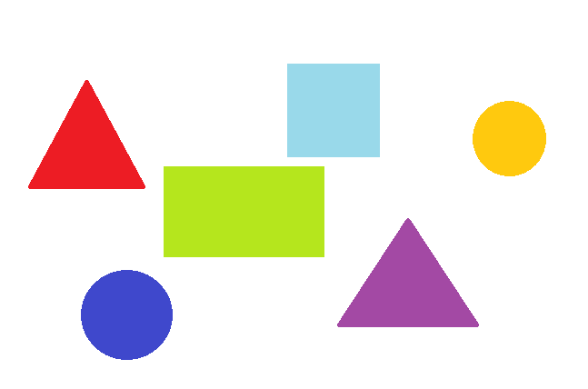
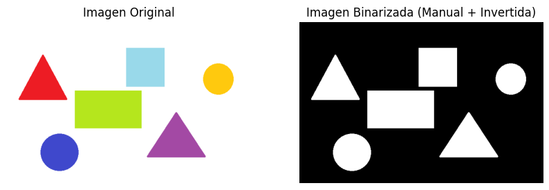
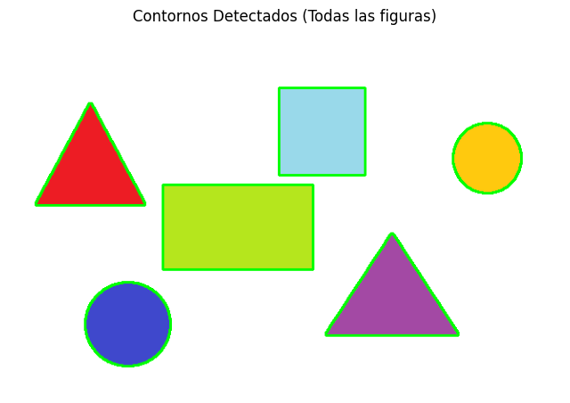
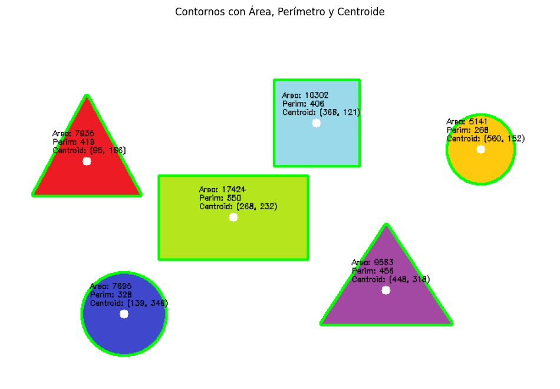

# Análisis de Figuras Geométricas
## Nombres
- Juan David Buitrago Salazar
- Juan David Cardenas Galvis
- Nicolás Rodríguez Piraban
- Camilo Andres Medina Sanchez
- Juan Felipe Fajardo Garzón

## Fecha de Entrega

`2026-05-11`

---

## Descripción Breve

Detección y análisis de figuras geométricas en imágenes utilizando técnicas de
procesamiento de imagen con OpenCV. Se implementó la binarización de imágenes,
detección de contornos y cálculo de propiedades geométricas como área, perímetro
y centroide.

---

## Implementaciones

### Python / OpenCV

Se trabajó con una imagen que contiene múltiples figuras geométricas. El proceso
incluye los siguientes pasos:

1. **Carga y preprocesamiento**: Se carga la imagen original y se convierte a escala
   de grises.

2. **Binarización**: Se aplica un umbral (threshold) para convertir la imagen en
   binaria, permitiendo aislar las figuras del fondo.

3. **Detección de contornos**: Se utiliza `cv2.findContours` para detectar los
   contornos externos de las figuras.

4. **Cálculo de propiedades**: Para cada contorno detectado se calcula:
   - Área usando `cv2.contourArea`
   - Perímetro usando `cv2.arcLength`
   - Centroide usando momentos (`cv2.moments`)

5. **Visualización**: Se dibujan los contornos y las métricas calculadas sobre la
   imagen original.

---

## Resultados visuales

### Python - Implementación



Esta imagen muestra las figuras geométricas originales que fueron analizadas.



Esta imagen muestra el resultado de la binarización de la imagen original,
donde las figuras aparecen en blanco sobre fondo negro.



Esta imagen muestra los contornos detectados dibujados en verde sobre la imagen
original.



Esta imagen muestra los contornos con sus propiedades calculadas (área, perímetro
y centroide) dibujadas sobre cada figura.

---

## Código relevante

### Ejemplo de código Python (OpenCV)

Este fragmento de código muestra cómo se detectan los contornos en la imagen
binarizada:

```python
# Encontrar contornos en la imagen binarizada
contours, hierarchy = cv2.findContours(
    binarized_image.copy(),
    cv2.RETR_EXTERNAL,
    cv2.CHAIN_APPROX_SIMPLE
)

# Dibujar todos los contornos encontrados
cv2.drawContours(contours_image, contours, -1, (0, 255, 0), 2)
```

Este fragmento de código muestra cómo se calculan las propiedades de cada
contorno:

```python
for contour in contours:
    # Calcular el área
    area = cv2.contourArea(contour)

    # Calcular el perímetro
    perimeter = cv2.arcLength(contour, True)

    # Calcular los momentos para encontrar el centroide
    M = cv2.moments(contour)
    cX = int(M["m10"] / M["m00"])
    cY = int(M["m01"] / M["m00"])
```

---

## Prompts utilizados

python:

```text
Crea un script en Python usando OpenCV que cargue una imagen con figuras
geométricas, detecte los contornos de las figuras, y calcule el área, perímetro
y centroide de cada figura. Muestra los resultados visualmente dibujando los
contornos y las propiedades sobre la imagen.
```

---

## Aprendizajes y dificultades

Con este taller aprendí cómo utilizar las funciones de OpenCV para el análisis
de imágenes y detección de contornos. Aprendí a calcular propiedades geométricas
como el área, perímetro y centroide de formas irregulares, lo cual es útil para
muchas aplicaciones de visión por computadora.

Una parte compleja fue encontrar el valor de umbral adecuado para la binarización.
dependiendo del contraste de la imagen, diferentes valores de threshold producen
resultados diferentes. Fue necesario ajustar el valor para obtener una separación
limpia entre las figuras y el fondo.

Estoy satisfecho con el resultado obtenido. La detección de contornos funciona
correctamente y las propiedades calculadas son precisas. Como mejora futura,
se podría implementar la clasificación automática de las figuras (círculo,
cuadrado, triángulo, etc.) basándose en sus propiedades.
