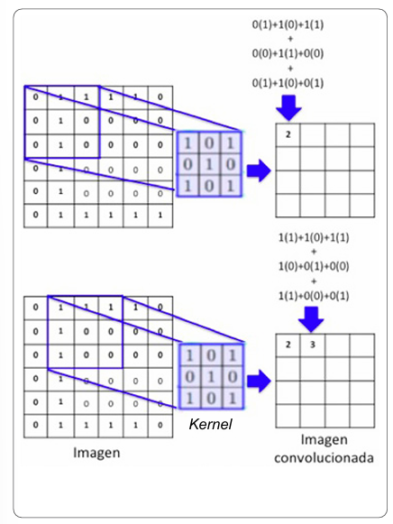
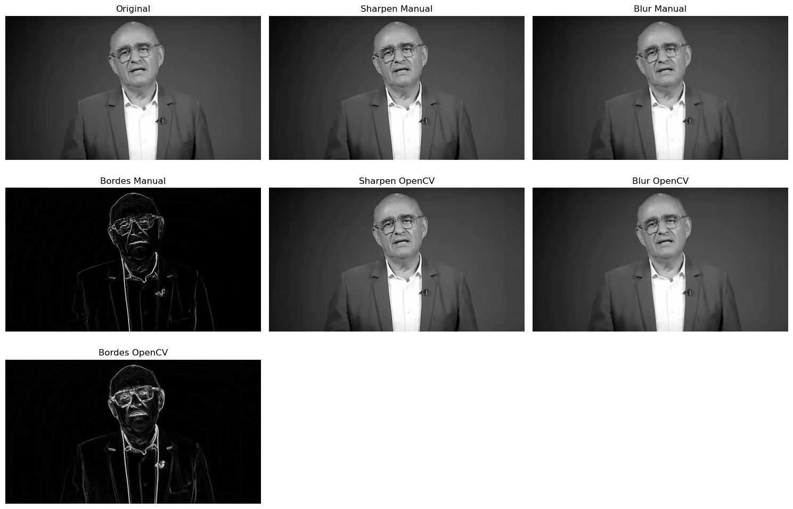
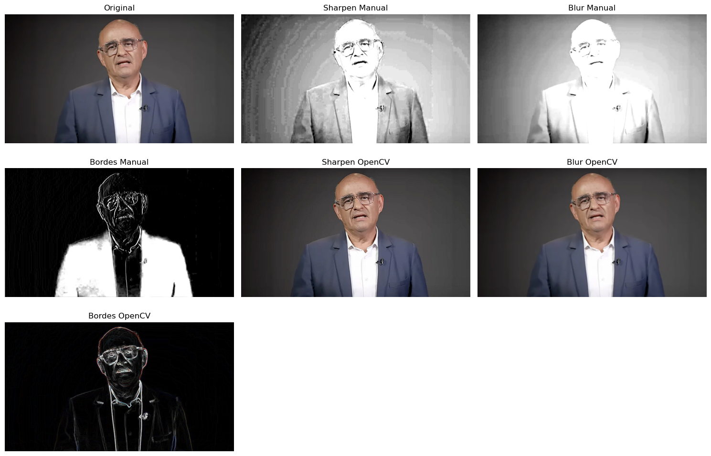

# Convoluciones personalizadas

## Autores del Proyecto

- Juan David Buitrago Salazar
- Juan David Cardenas Galvis
- Nicolás Rodríguez Piraban
- Camilo Andres Medina Sanchez
- Juan Felipe Fajardo Garzón

**Fecha de Entrega:** 11 de mayo de 2026

---

## Objetivo

Implementar convoluciones personalizadas sobre imagenes en blanco y negro haciendo uso de python para enteneder las bases del procesamiento de imagenes por computador y la computación visual.

---

### Explicación general de la operación de convolución

En terminos generales, la convolución permite extraer características de una imagen por medio de un kernel o máscara de convolución.
Generalmente, el filtro tiene un tamaño menor que la imagen, este filtro se desplaza por la imagen y se aplica cada vez que la recorre.
Es importante que la imagen esté normalizada. Usualmente los pixeles tienen un valor de 0 a 255, la red neuronal los debe procesar de 0 a 1.


**Fórmula general de la convolución sobre una imagen**

$$S(i,j) = (K * I)(i,j) = \sum_m \sum_n I(m,n)K(i-m, j-n)$$

Donde: 
- $I(m,n)$ es la imagen original, las coordenadas m,n representan el pixel de la imagen sobre el cual se desea trabajar.
- $K$ es el kernel o máscara de convolución, este es el que aplica el filtro sobre la imagen.
- Notese que también está en uso el símbolo $*$. Este no representa una multiplicación usual de matrices, pues la convolución no es en esencia esto
- S(i,j): Matriz de la imagen resultante luego de la aplicación de la convolución

### Ejemplo de la aplicación de convolución

**Imagen de entrada**
\[
I =
\begin{bmatrix}
1 & 2 & 3 \\
4 & 5 & 6 \\
7 & 8 & 9
\end{bmatrix}
\]

**Kernel a aplicar**
\[
K =
\begin{bmatrix}
1 & 0 \\
0 & -1
\end{bmatrix}
\]

**Proceso de convolución**

El kernel se desplaza sobre la imagen tomando regiones de tamaño 2x2.

*Primera región*

\[
\begin{bmatrix}
1 & 2 \\
4 & 5
\end{bmatrix}
\]

Multiplicación elemento a elemento:

\[
(1 \cdot 1) + (2 \cdot 0) + (4 \cdot 0) + (5 \cdot -1)
\]

Resultado:

\[
1 + 0 + 0 - 5 = -4
\]

Por lo tanto:

\[
S(0,0) = -4
\]

*Segunda región*

\[
\begin{bmatrix}
2 & 3 \\
5 & 6
\end{bmatrix}
\]

Resultado:

\[
(2 \cdot 1) + (3 \cdot 0) + (5 \cdot 0) + (6 \cdot -1)
\]

\[
2 - 6 = -4
\]

*Tercera región*

\[
\begin{bmatrix}
4 & 5 \\
7 & 8
\end{bmatrix}
\]

Resultado:

\[
4 - 8 = -4
\]

*Cuarta región*

\[
\begin{bmatrix}
5 & 6 \\
8 & 9
\end{bmatrix}
\]

Resultado:

\[
5 - 9 = -4
\]

*Resultado final*

\[
S =
\begin{bmatrix}
-4 & -4 \\
-4 & -4
\end{bmatrix}
\]

### Definición del kernel 

Como ya se ha establecido, el kernel es una matriz pequeña que sirve para cambiar la estructura de la imagen dada como input, los tamaños usuales del kernel son:
- 3x3
- 5x5
- 7x7

#### Tipos de kernels 

**Blur - Suavizado**

Objetivo: 
- Reducción de ruido
- Eliminación de detalles pequeños
- Suavización de imagenes

$$ \frac{1}{9} \begin{bmatrix} 1 & 1 & 1 \\ 1 & 1 & 1 \\ 1 & 1 & 1 \end{bmatrix} $$

​**Sharpen - Enfoque**

Objetivo: 
- Aumentar la nitidez
- Resaltar detalles

$$ \begin{bmatrix} 0 & -1 & 0 \\ -1 & 5 & -1 \\ 0 & -1 & 0 \end{bmatrix} $$

**Edge detection - Detección de bordes**

*Sobel x*
$$ \begin{bmatrix} -1 & 0 & 1 \\ -2 & 0 & 2 \\ -1 & 0 & 1 \end{bmatrix} $$
*Sobel y*
$$ \begin{bmatrix} -1 & -2 & -1 \\ 0 & 0 & 0 \\ 1 & 2 & 1 \end{bmatrix} $$

**Emboss**
Objetivo:
- Crear un efecto relieve

$$ \begin{bmatrix} -2 & -1 & 0 \\ -1 & 1 & 1 \\ 0 & 1 & 2 \end{bmatrix} $$

**Gaussian blur**
Objetivo: 
- Blur más avanzado y natural
$$ \frac{1}{16} \begin{bmatrix} 1 & 2 & 1 \\ 2 & 4 & 2 \\ 1 & 2 & 1 \end{bmatrix} $$

#### Elección del kernel

El proceso de elección de kernel depende del efecto deseado.

Con los kernels pequeños, como de tamaño 3x3 se tienen procesos rápidos y con menos costo computacional. 

Por otro lado, los kernels grandes, por ejemplo, 7x7 o 11x11 tienen un efecto más fuerte sobre el input, pero con la desventaja que tienen un costo computacional mayor.

De forma general, los kernels se eligen de un tamaño impar, pues tienen un centro definido. 
El problema con los kernels de dimensión par es que no tienen un centro definido por lo cual puede generar desplazamientos en el resultado de la convolución.

### Padding

Durante la convolución, el kernel necesita vecinos alrededor de cada píxel. 

El problema aparece en los bordes de la imagen, donde no existen suficientes píxeles vecinos para aplicar completamente el kernel.

Para solucionar esto se utiliza padding, que consiste en agregar filas y columnas adicionales alrededor de la imagen.

Los tipos más comunes son:

- Zero padding: rellena con ceros.
- Reflection padding: refleja los bordes.
- Replication padding: repite los valores del borde.

### Implementación en Python

Los detalles más profundos de como se desarrolla la implementación se hallan en el documento de jupyter. 
A grosso modo, se pretende abrir la imagen en blanco y negro para aplicarle los siguientes filtros:
- Blur.
- Sharpen.
- Sobel.

La función convolucion recibe como argumentos la imagen y el kernel, se recorre la imagen (Con su padding) y se desarrolla la multiplicación junto con la suma de los valores.
En cada una de las iteraciones se va asignando el valor apropiado a la imagen y como último paso se retorna la imagen con el filtro aplicado.

Los resultados de Sobel X y Sobel Y fueron combinados utilizando la magnitud del gradiente:

$$
G = \sqrt{G_x^2 + G_y^2}
$$

Esto permite obtener la intensidad total del borde considerando tanto cambios horizontales como verticales.

Se utilizó `float32` para evitar errores numéricos durante las operaciones matemáticas y posteriormente se aplicó `clip` para mantener los valores dentro del rango válido de una imagen en escala de grises (0-255).

A su vez, para ampliación de la practica y una comprensión total, se desarrolla la convolución sobre la misma imagen, pero la imagen en color. 
La complejidad algoritmica pasa a ser $O(n^3)$ puesto que existen los canales. Por tanto, va a ser un poco más demorado. 

### Resultados visuales y explicación
#### Convolución en blanco y negro


Como ya se mencionó anteriormente, al desarrollar la convolución en blanco y negro cada pixel posee unicamente un valor de intensidad.
- 0: Negro
- 255: Blanco

Por tanto, la imagen es representada como una matriz bidimensional y la complejidad algoritmica de recorrerla será de 
$$
O(H \times W \times K_h \times K_w)
$$
Donde:

- $H$ y $W$ representan el alto y ancho de la imagen.
- $K_h$ y $K_w$ representan el tamaño del kernel.

**Sharpen Manual**

El filtro sharpen manual incrementó la nitidez de la imagen resaltando diferencias locales entre píxeles vecinos.

**Blur Manual**

El filtro blur produjo un suavizado general de la imagen.
Debido a que la imagen original ya presentaba una iluminación uniforme y poco ruido, el efecto blur no resultó.

**Bordes Manual**

La detección de bordes fue implementada utilizando los operadores Sobel X y Sobel Y.
Posteriormente ambos resultados fueron combinados utilizando la magnitud del gradiente:

$$
G = \sqrt{G_x^2 + G_y^2}
$$

Visualmente la imagen resultante muestra:

- Fondo negro
- Contornos resaltados en blanco
- Bordes del rostro
- Bordes de las gafas
- Límites del saco y camisa
- Diferencias fuertes de iluminación

##### Comparación con OpenCV

Los resultados obtenidos manualmente fueron comparados con las funciones optimizadas de OpenCV utilizando `cv2.filter2D()` y `cv2.Sobel()`.

Visualmente los resultados son similares, lo cual valida la implementación manual desarrollada.

Sin embargo, OpenCV produce resultados más estables debido a que:

- Utiliza optimizaciones internas en C/C++
- Maneja mejor la precisión numérica
- Controla de forma más eficiente la saturación de valores
- Optimiza operaciones matriciales

La implementación manual permitió comprender el funcionamiento interno de la convolución, mientras que OpenCV facilita su aplicación eficiente en sistemas reales.

#### Convolución a color


En la convolución a color la imagen ya no es representada como una matriz bidimensional, sino como una matriz tridimensional.

La estructura de la imagen ahora tiene la forma:

```text
alto × ancho × canales
```

Generalmente los canales corresponden a:

- Blue
- Green
- Red

(OpenCV trabaja internamente en formato BGR).

Cada píxel contiene tres valores de intensidad independientes, uno para cada canal de color.

Ejemplo:

```text
[120, 80, 200]
```

Esto significa:

- Azul = 120
- Verde = 80
- Rojo = 200

Durante la convolución, el kernel no se aplica sobre toda la imagen simultáneamente, sino de forma independiente sobre cada canal de color.
Debido a esto, la complejidad computacional aumenta respecto a escala de grises, ya que deben procesarse tres matrices independientes.

**Sharpen Manual**

El filtro sharpen aplicado manualmente produjo un incremento fuerte en la intensidad de los colores y el contraste.

Visualmente se observa:

- Incremento fuerte de brillo
- Sobreexposición en zonas claras
- Saturación parcial de colores
- Bordes más notorios
- Pérdida de detalle en regiones muy iluminadas


**Blur Manual**

Visualmente se aprecia:

- Reducción de detalles
- Suavizado de contornos
- Menor definición facial
- Transiciones de color más suaves
- Apariencia desenfocada

El blur funciona promediando los valores vecinos de cada canal de color.

**Sobel**
El sobel permite de forma bastante acertada la identificación de los bordes de la imagen, dejendo un fondo negro y resaltando en blanco los bordes representativos.

**Sharpen OpenCV**

La implementación utilizando OpenCV produjo un sharpen mucho más estable visualmente.

Se observa:

- Incremento moderado de nitidez
- Conservación de colores
- Mejor manejo del brillo
- Menor saturación

**Blur OpenCV**

El blur implementado mediante OpenCV generó un suavizado más natural y uniforme.

Visualmente se aprecia:

- Reducción controlada de detalles
- Conservación parcial de colores
- Menor pérdida de contraste
- Desenfoque más estable

**Bordes OpenCV**

La detección de bordes utilizando OpenCV produjo resultados más limpios y estables.

Se observa:

- Menor ruido visual
- Bordes más definidos
- Mejor control de intensidad
- Mayor estabilidad numérica

### Interpretación computacional

Después de aplicar las convoluciones, el computador ya no analiza únicamente una imagen visual convencional.

Cada transformación modifica la información matemática disponible:

- Blur elimina detalles y ruido.
- Sharpen resalta diferencias locales.
- Sobel transforma la imagen en información de contornos.

Las imágenes de bordes son especialmente importantes porque reducen la cantidad de información visual y permiten que sistemas computacionales identifiquen:

- Formas
- Objetos
- Contornos
- Regiones importantes

Este principio constituye la base de:

- Visión por computador
- Reconocimiento facial
- Segmentación semántica
- Detección de objetos
- Redes neuronales convolucionales (CNN)

### Referencias
- DOI: https://doi.org/10.53903/01212095.161
- https://www.datacamp.com/es/tutorial/introduction-to-convolutional-neural-networks-cnns
- https://dcain.etsin.upm.es/~carlos/bookAA/05.7_RRNN_Convoluciones_CIFAR_10_INFORMATIVO.html
- https://es.wikipedia.org/wiki/Red_neuronal_convolucional
- https://www.ibm.com/es-es/think/topics/convolutional-neural-networks
