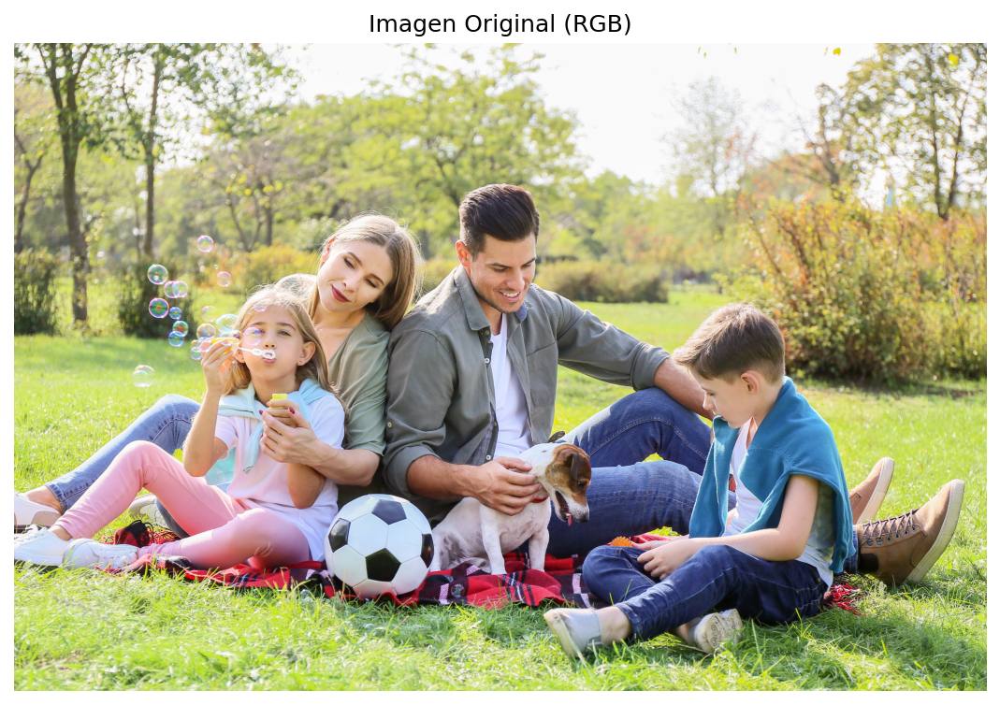
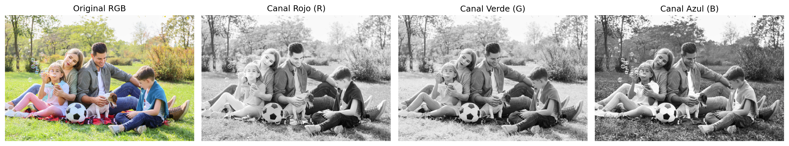
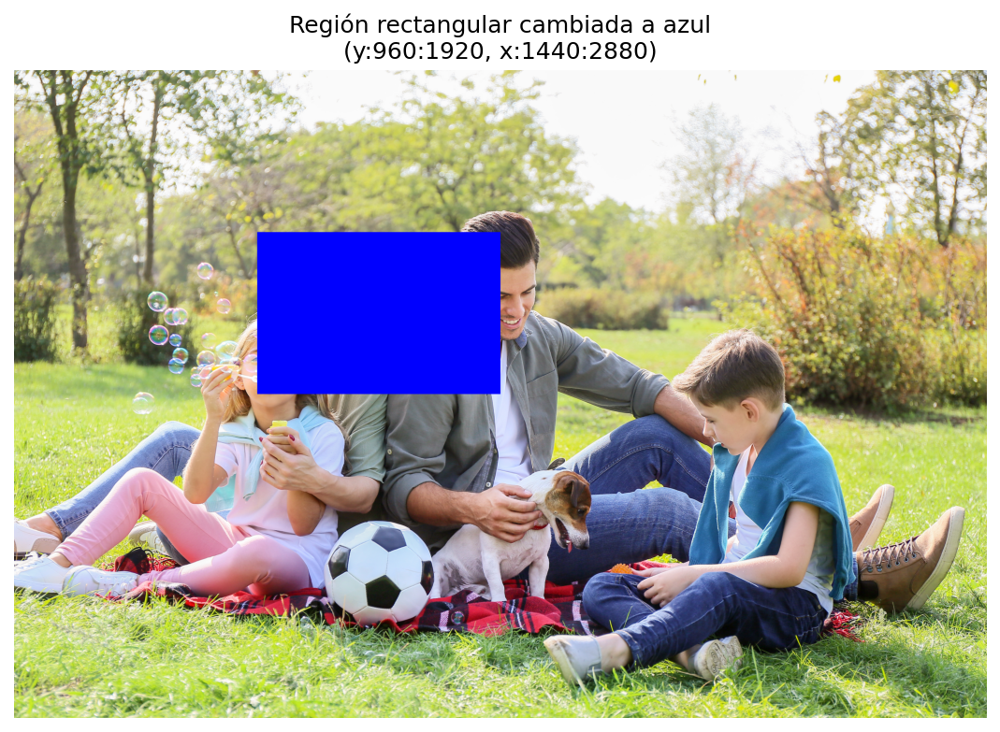
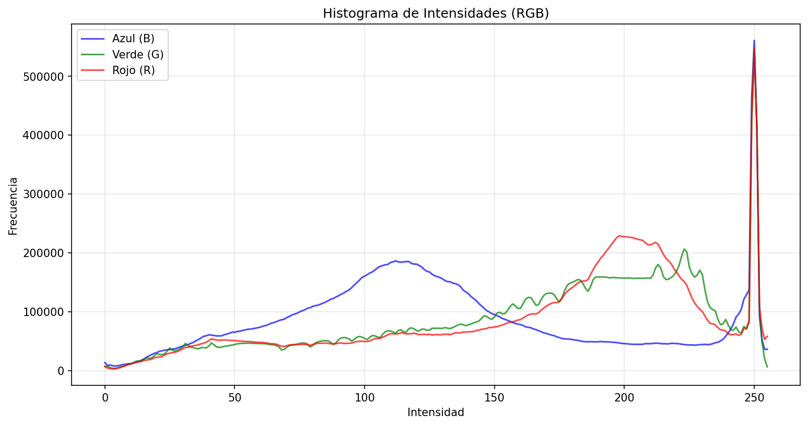
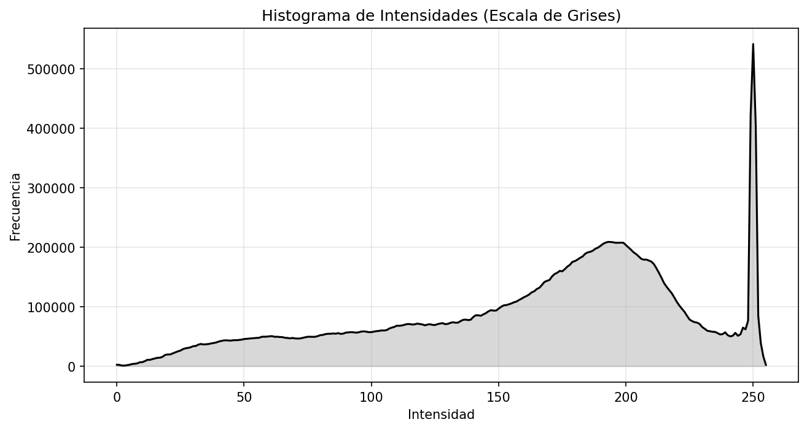
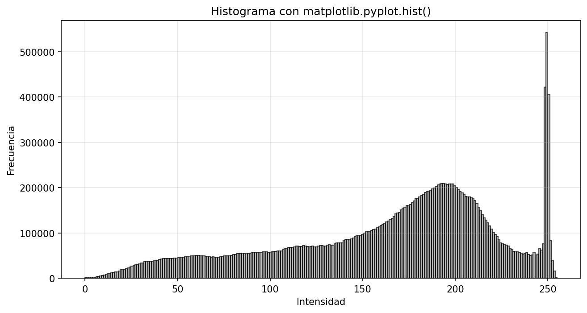
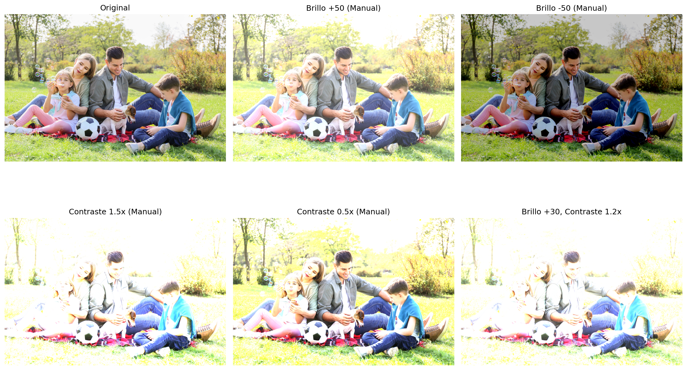
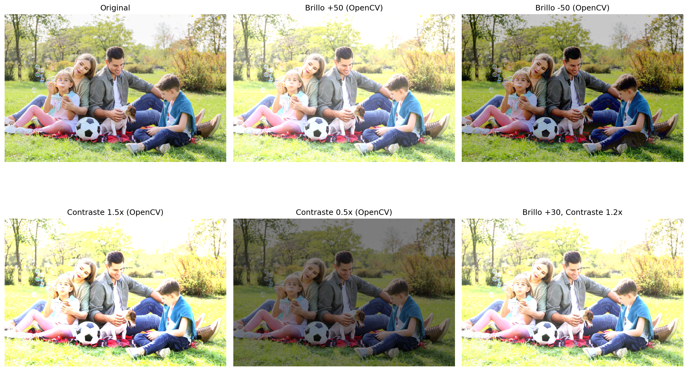

# Taller: De Píxeles a Coordenadas — Explorando la Imagen como Matriz

**Fecha de entrega:** May 9, 2026

---

## 1. Descripción del Taller

Este taller tiene como objetivo fundamental comprender cómo se representa una imagen digital como una matriz numérica y cómo manipular sus componentes a nivel de píxel. Se abordó de manera práctica el acceso directo a los valores de color y brillo, así como la manipulación de regiones específicas de la imagen para su análisis o modificación.

A través del uso de OpenCV y NumPy, se exploraron las técnicas esenciales para el tratamiento de imágenes a nivel más elemental: el píxel. Este conocimiento constituye la base para cualquier aplicación de visión por computador, desde el procesamiento simple hasta los algoritmos más sofisticados de aprendizaje automático.

---

## 2. Objetivos Alcanzados

- Comprender la representación matricial de una imagen digital en memoria.
- Manipular canales de color RGB y HSV de forma independiente.
- Aplicar técnicas de slicing de matrices para modificar regiones específicas.
- Calcular y visualizar histogramas de intensidades mediante diferentes métodos.
- Implementar ajustes de brillo y contraste mediante ecuaciones manuales y funciones de OpenCV.
- Desarrollar una función interactiva para modificación en tiempo real de parámetros de imagen.

---

## 3. Implementaciones Realizadas

### 3.1 Entorno Python (Jupyter Notebook)

Se desarrolló un notebook completo que integra las siguientes implementaciones:

#### Carga de Imagen en Color
Utilización de `cv2.imread()` para cargar imágenes en formato BGR (orden nativo de OpenCV), con conversión a RGB para visualización correcta en matplotlib. Se implementó un mecanismo de generación automática de imagen de ejemplo cuando no se dispone de un archivo de entrada.

```python
img_bgr = cv2.imread(INPUT_IMAGE)
img_rgb = cv2.cvtColor(img_bgr, cv2.COLOR_BGR2RGB)
```

#### Separación de Canales RGB y HSV
Acceso a los canales individuales mediante `cv2.split()`:
- **RGB**: Separación en canales Rojo, Verde y Azul
- **HSV**: Conversión mediante `cv2.cvtColor()` y separación en canales de Tono (Hue), Saturación y Valor

#### Manipulación de Regiones mediante Slicing de Matrices
- **Cambio de color en región rectangular**: Selección de una submatriz mediante indexación `img[y_start:y_end, x_start:x_end]` y asignación de valores de color.
- **Sustitución de regiones**: Extracción de una región de la imagen y posicionamiento en otra ubicación, demostrando el manejo directo de submatrices.

```python
# Cambiar color de un área rectangular
img_modified[y_start:y_end, x_start:x_end] = [255, 0, 0]

# Intercambiar regiones
src_region = img_bgr[0:region_height, 0:region_width].copy()
img_region_swap[dst_y:dst_y+region_height, dst_x:dst_x+region_width] = src_region
```

#### Cálculo y Visualización de Histogramas
- **Usando `cv2.calcHist()`**: Cálculo del histograma para cada canal de color.
- **Usando `matplotlib.pyplot.hist()`**: Generación de histogramas con la biblioteca de visualización.
- Análisis de histogramas en escala de grises y por canal de color.

```python
hist_b = cv2.calcHist([img_bgr], [0], None, [256], [0, 256])
plt.hist(img_gray.flatten(), bins=256, color='darkgray')
```

#### Ajustes de Brillo y Contraste

**Método manual (por ecuación)**:
```python
def adjust_brightness_contrast_manual(image, brightness=0, contrast=0):
    img_contrast = np.clip(image.astype(np.float32) * (contrast + 1), 0, 255)
    img_bright = np.clip(img_contrast + brightness, 0, 255)
    return img_bright.astype(np.uint8)
```

**Método con OpenCV**:
```python
adjusted = cv2.convertScaleAbs(img, alpha=1.2, beta=30)
```

#### Bonus: Función Interactiva con Trackbars
Implementación de una ventana interactiva con `cv2.createTrackbar()` que permite modificar brillo y contraste en tiempo real. Esta función está diseñada para ejecutarse en entornos con soporte GUI.

---

## 4. Contribuciones del Equipo

El desarrollo de este taller fue un esfuerzo colaborativo donde todos los miembros participaron activamente en las diversas etapas de implementación, pruebas y documentación. Cada integrante contribuyó de manera significativa en diferentes aspectos de los talleres, abarcando desde el diseño y codificación hasta la generación de evidencia visual y la elaboración de la documentación técnica.

---

## 5. Prompts Utilizados

Durante el desarrollo del taller, se utilizaron los siguientes prompts representativos que guiarion la construcción del código y la documentación:

1. *"Create a Python notebook for image matrix manipulation using OpenCV and NumPy. Include loading images, displaying RGB and HSV channels separately, matrix slicing for region modification, histogram calculation with cv2.calcHist(), and brightness/contrast adjustments both manually and with cv2.convertScaleAbs(). Save outputs to a media folder."*

2. *"Generate a function with cv2.createTrackbar() for interactive brightness and contrast adjustment in real-time."*

3. *"Create a comprehensive workshop README that explains image representation as matrices, pixel-level manipulation, and includes all the implementations from the Python notebook."*

---

## 6. Evidencia Visual

La carpeta `media/` contiene las siguientes evidencias del funcionamiento del taller:

### 6.1 Imagen Original



**Descripción:** Imagen de entrada cargada en formato RGB mediante `cv2.imread()`. Se observa la representación visual de la matriz de píxeles en sus tres canales de color (Rojo, Verde, Azul).

---

### 6.2 Canales RGB Separados



**Descripción:** Visualización independiente de cada canal de color. De izquierda a derecha: imagen original en RGB, canal Rojo, canal Verde y canal Azul. Se aprecia cómo cada canal captura diferentes componentes de la información de color, donde los objetos de color similar al canal aparecen más brillantes.

---

### 6.3 Canales HSV Separados


**Descripción:** Representación de la imagen en el espacio de color HSV (Hue/Saturation/Value). De izquierda a derecha: imagen original, canal de Tono (H), canal de Saturación (S) y canal de Valor (V). Este espacio de color permite manipulaciones más intuitivas como ajustar la intensidad sin afectar el matiz.

---

### 6.4 Modificación de Región - Cambio de Color



**Descripción:** Resultado de modificar una región rectangular específica de la matriz de la imagen. Se cambió el color de un área central a azul puro mediante slicing de matrices: `img_modified[y_start:y_end, x_start:x_end] = [255, 0, 0]`. Esto demuestra el acceso directo a submatrices de la imagen.

---

### 6.5 Intercambio de Regiones


**Descripción:** Demostración de intercambio de regiones dentro de la misma imagen. La región de la esquina superior izquierda fue copiada y posicionada en la esquina inferior derecha. Esto ilustra la manipulación de submatrices para copiar, mover y reemplazar regiones de la imagen.

---

### 6.6 Histograma RGB



**Descripción:** Histograma de intensidades calculado con `cv2.calcHist()` para cada canal de color (Rojo, Verde, Azul). El eje X representa los valores de intensidad de 0 (oscuro) a 255 (brillante), mientras que el eje Y indica la frecuencia de píxeles en cada nivel de intensidad.

- **Canal Azul (B):** La curva azul muestra una fuerte concentración en el rango de tonos medios, especialmente entre valores de intensidad de 90–140, lo que indica una presencia significativa de tonos fríos y áreas sombreadas. También presenta un pico tajamazco cerca de 250–255, correspondiente a regiones muy brillantes.

- **Canal Verde (G):** La curva verde está ampliamente distribuida, con frecuencias más altas en el rango de intensidad brillante (180–230). Esto sugiere que los tonos verdes dominan la imagen, probablemente debido a vegetación y pasto. Al igual que los otros canales, presenta un pronunciado pico cerca de 255.

- **Canal Rojo (R):** La curva roja aumenta notablemente en la región de alta intensidad (190–220), reflejando tonos cálidos y colores de piel presentes en la escena. También exhibe un gran pico cerca de la intensidad 255.

- **Interpretación general:** El histograma indica que la imagen es generalmente brillante, con muchos píxeles concentrados cerca de los valores máximos de intensidad. Los fuertes picos cerca de 255 en los tres canales sugieren áreas sobreexpuestas o altamente iluminadas, probablemente causadas por la luz solar y los reflejos brillantes en la escena al aire libre.

---

### 6.7 Histograma en Escala de Grises



**Descripción:** Histograma de la imagen convertida a escala de grises. La curva muestra la distribución de intensidades luminadas, donde los picos indican valores predominantes. Este histograma es fundamental para análisis de contraste y aplicación de ecualización.

---

### 6.8 Histograma con Matplotlib



**Descripción:** Histograma generado alternativamente mediante `matplotlib.pyplot.hist()` sobre los valores de píxel de la imagen en escala de grises. Este método ofrece una visualización alternativa con barras solidas en lugar de líneas continuas.

---

### 6.9 Brillo y Contraste - Método Manual



**Descripción:** Resultados de aplicar ajustes de brillo y contraste mediante una función manual basada en operaciones aritméticas: `pixel * (contrast + 1) + brightness`. Se muestra la imagen original y las variaciones resultantes con brillo positivo/negativo y contraste alto/bajo.

---

### 6.10 Brillo y Contraste - Método OpenCV



**Descripción:** Mismos ajustes de brillo y contraste pero implementados con la función `cv2.convertScaleAbs()` de OpenCV, que utiliza los parámetros `alpha` (contraste) y `beta` (brillo). Compara directamente con el método manual demostrando resultados equivalentes.

---

### Análisis de los Resultados

Los histogramas generados muestran la distribución de intensidades en la imagen, permitiendo identificar características como el rango dinámico, el contraste y la presencia de picos en valores específicos. El análisis detallado del histograma RGB revela una imagen generalmente brillante con predominancia de tonos verdes (vegetación), tonos cálidos en el canal rojo (pieles y elementos cálidos), y una fuerte presencia de áreas sobreexpuestas cerca del valor máximo 255 en todos los canales.

La manipulación de regiones mediante slicing demuestra el acceso directo a la matriz de la imagen, mientras que los ajustes de brillo y contraste ilustran la transformación de la escala de valores de píxel. Las operaciones de cambio de color e intercambio de regiones evidencian cómo la imagen se almacena como una matriz tridimensional donde cada posición puede ser accedida y modificada de manera eficiente mediante indexación de NumPy.

---

## 7. Aprendizajes y Dificultades

### Aprendizajes Adquiridos

- **Comprensión profunda de la representación de imágenes**: Una imagen digital es esencialmente una matriz tridimensional donde cada elemento representa la intensidad de un canal de color en una posición espacial específica.
- **Manipulación eficiente de píxeles**: El uso de slicing de NumPy permite modificar regiones de manera eficiente sin necesidad de iterar pixel por pixel.
- **Flexibilidad de los espacios de color**: Los canales HSV ofrecen ventajas significativas para certain operaciones como el ajuste de saturación o la detección de colores específicos.

### Dificultades Encontradas

- La ejecución de funciones interactivas con `cv2.createTrackbar()` requiere un entorno con soporte GUI, lo cual limitó las pruebas en entornos de notebook sin visualización directa.
- La comprensión del formato BGR de OpenCV versus RGB de matplotlib requiere atención constante para evitar errores de color en la visualización.

---

## 8. Estructura del Repositorio

```
semana_09_3_imagen_matriz_pixeles/
├── python/
│   └── workshop.ipynb          # Notebook con todas las implementaciones
├── media/                      # Evidencias visuales del taller
└── README.md                   # Este documento
```

---

## 9. Conclusiones

Este taller proporcionó una comprensión práctica y fundamental sobre cómo las imágenes digitales se almacenan y manipulan a nivel de píxel. Las técnicas aprendidas constituyen la base para cualquier desarrollo posterior en visión por computador, desde filtros simples hasta redes neuronales convolucionales. La capacidad de acceder y modificar directamente la matriz de una imagen es una habilidad esencial que permite implementar algoritmos personalizados de procesamiento de imágenes.
