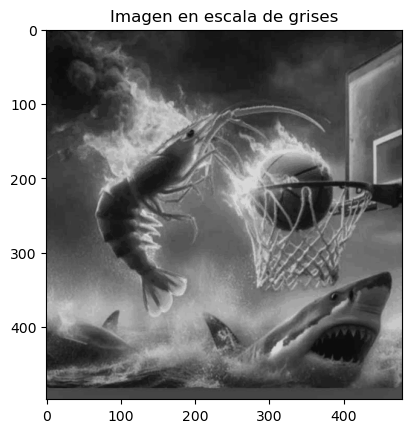
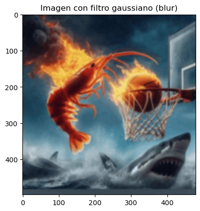
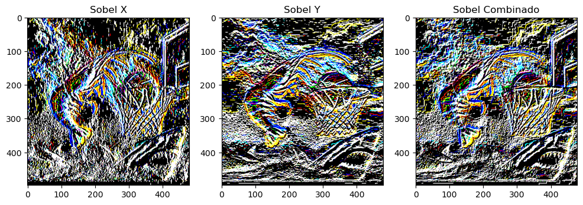
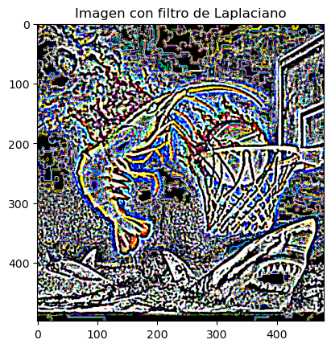
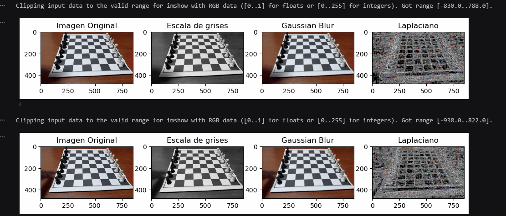

# Taller - Ojos Digitales: Introducción a la Visión Artificial
## Nombres:

- Juan David Buitrago Salazar
- Juan David Cardenas Galvis
- Nicolás Rodríguez Piraban
- Camilo Andres Medina Sanchez
- Juan Felipe Fajardo Garzón

## Fecha de entrega: 11/05/2026

## Descripción breve:
Este taller introduce los conceptos fundamentales de visión artificial, específicamente el procesamiento de imágenes mediante filtros convolucionales y detectores de bordes. Se implementaron técnicas para transformar imágenes (escala de grises y suavizado Gaussiano), detectar bordes (sobel y laplaciano) y aplicar este procesamiento en tiempo real desde un video pregrabado o cámara web.

## Implementaciones:

### Python:
Se trabajó con la librería `OpenCV` para implementar filtros de procesamiento de imágenes. Inicialmente se cargó una imagen a color para convertirla a escala de grises usando `cv2.cvtColor(img, cv2.COLOR_BGR2GRAY)` , luego se aplicó el filtro Gaussiano `cv2.GaussianBlur` para difuminar la imagen y reducir ruido, se usó un tamaño de kernel de 7x7. Posteriormente se implementaron detectores de bordes: Filtro Sobel (en direcciones X e Y, además de su combinación) y filtro Laplaciano. Todos estos filtros fueron aplicados tanto a la imágen estática como a frames de un video en tiempo real.

Todas la imágenes fueron graficadad con la librería `matplotlib.pyplot`

## Resultados visuales:

### Python:
Primero se presenta la imagen original a color


Luego se cambia el mapa de color a escala de grises



Ahora se aplica un ligero filtro gausiano para reducir el ruido y suavizar contornos



Posteriormente se aplica el detector de bordes sobel con un tamaño de kernel 3x3, se evidencia como al aplicarlo en las direcciones X y Y revelan distintos bordes, los cuales son combinados en la tercera imagen para realzar completamente la gran mayoría de bordes de la imagen



Ahora se aplicó el detector de bordes laplaciano, el cual tiene un mejor desempeño que Sobel, puesto que resalta de una mejor manera los bordes principales de la imagen, siendo menos sensible al ruido. Este desempeño se debe a que calcula el gradiente en todas las direcciones de la imagen y no solo en direccion X o Y



Para finalizar se usó `cv2.VideoCapture(0)` para obtener las imágenes a procesar a partir de los frames de un video de la webcam, luego se le aplica el mismo procesamiento descrito anteriormente a ciertos frames del video

(Nota: se puede reemplazar el 0 en el código por el nombre de un archivo de video para capturar los frames del video, en la carpeta de media se presenta una copia del video grabado desde la webcam al cual se le aplicó el procesamiento)




## Código relevante:
A continuación se presenta el código para aplicar el detector de bordes Laplaciano a una imagen, utilizando primero un blur gaussiano para reducir el ruido:

```python
laplaciano = cv2.Laplacian(blur, cv2.CV_64F, ksize=3)
plt.imshow(laplaciano, cmap='gray')
plt.title("Imagen con filtro de Laplaciano")
plt.show()
```

El siguiente fragmento muestra cómo aplicar detectores de bordes Sobel combinando las direcciones X y Y:

```python
sobelx = cv2.Sobel(img, cv2.CV_64F, 1, 0, ksize=3)
sobely = cv2.Sobel(img, cv2.CV_64F, 0, 1, ksize=3)
sobel_combined = cv2.addWeighted(sobelx, 0.5, sobely, 0.5, 0)
```

Ahora se presenta el código usado para la captura en vivo

Primero se inicia la camara y se verifica que no haya ocurrido ningún error

```python
cap = cv2.VideoCapture(0) 
frame_skip = 10 # Cada cuantos frame se toma una imagen, no se usan todos los frames para evitar sobrecargar la salida
count = 0

# Verificar si la cámara o el video se abrió correctamente
if not cap.isOpened():
    print("No se pudo abrir la cámara o el video.")
    raise SystemExit
```

Luego se ejecuta un bucle que se repite mientras queden frames en la grabacion, se guarda una copia del frame actual para aplicar el procesamiento con los mismos códigos presentados antes

```python
while True:
    ret, frame = cap.read()
    if not ret: # Si no se pudo leer un frame, se ha llegado al final del video
        print("No hay más frames.")
        break

    count += 1
    if count % frame_skip != 0: # Saltar frames para no sobrecargar la salida
        continue

    img = frame.copy()
```

Finalmente solo se grafican los resultados


## Prompts utilizados:
No se hizo uso de IA generativa

## Aprendizajes y dificultades:
Este taller ayudó a comprender cómo los filtros convolucionales permiten extraer información específica de las imágenes. El detector de bordes Laplaciano es útil para detectar cambios rápidos de intensidad, mientras que Sobel es mejor para detectar bordes en direcciones específicas. La principal dificultad fue entender cómo aplicar los métodos presentes en la librería OpenCV