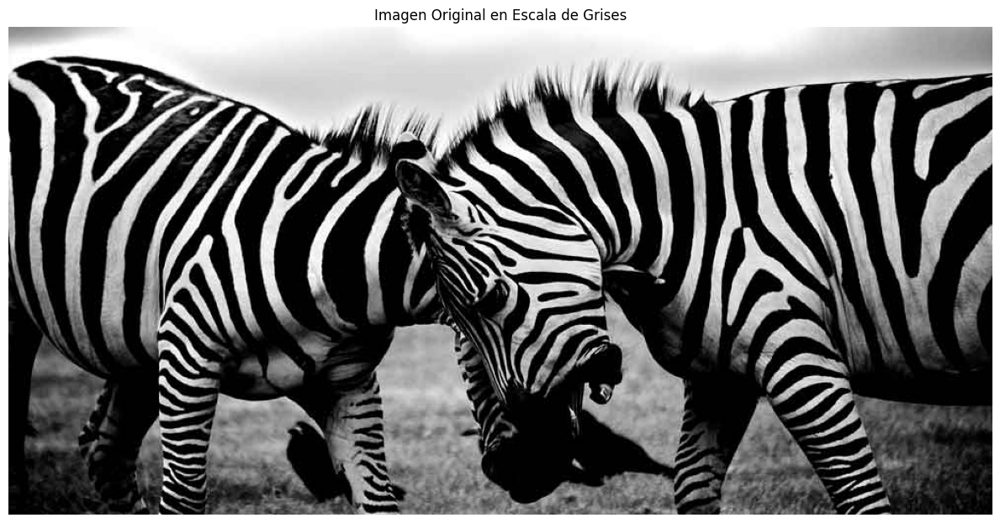
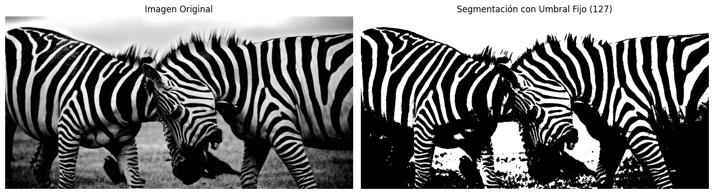
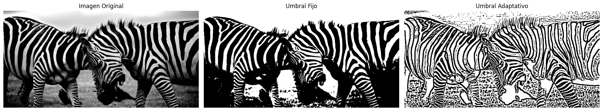
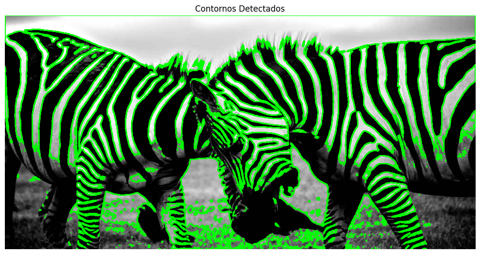
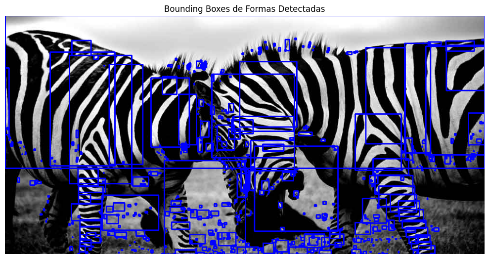
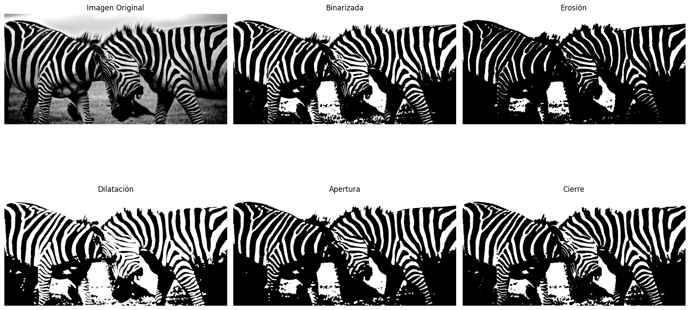
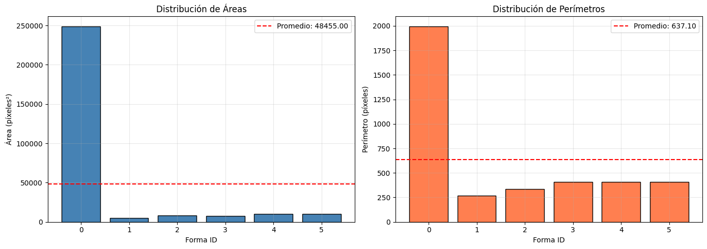

# Taller: Segmentando el Mundo - Binarización y Reconocimiento de Formas

**Nombre del estudiantes:** 
- Juan David Buitrago Salazar
- Juan David Cardenas Galvis
- Nicolás Rodríguez Piraban
- Camilo Andres Medina Sanchez
- Juan Felipe Fajardo Garzón
**Fecha de entrega:** May 11, 2026

---

## 1. Descripción del Taller

Este taller tiene como objetivo fundamental comprender las técnicas básicas de segmentación de imágenes mediante umbralización y detección de formas. A través de procesos de binarización y análisis morfológico, se explora cómo identificar regiones de interés en imágenes digitales.

El taller aborda desde conceptos básicos como umbralización fija y adaptativa, hasta técnicas más avanzadas como detección de contornos, cálculo de centros de masa y análisis de propiedades geométricas de las formas detectadas. Se utiliza OpenCV y NumPy para implementar algoritmos de visión por computador a nivel práctico.

---

## 2. Objetivos Alcanzados

- Comprender los diferentes métodos de umbralización (fija y adaptativa) en imágenes.
- Detectar contornos usando `cv2.findContours()` y analizar sus propiedades.
- Calcular centros de masa mediante momentos de imagen con `cv2.moments()`.
- Determinar bounding boxes para cada forma detectada usando `cv2.boundingRect()`.
- Calcular y visualizar métricas básicas: número de formas, área promedio, perímetro promedio.
- Comprender operaciones morfológicas (erosión, dilatación, apertura y cierre).
- Desarrollar visualizaciones claras de los resultados de segmentación.

---

## 3. Implementaciones Realizadas

### 3.1 Entorno Python (Jupyter Notebook)

Se desarrolló un notebook completo que integra las siguientes implementaciones:

#### Carga de Imagen en Escala de Grises

Se cargó una imagen real de cebras en escala de grises desde el archivo `IMAGEN_EN_ESCALA_DE_GRISES.jpg`. Esta imagen ilustrativa proporciona un caso de uso más realista que permite demostrar todos los algoritmos de segmentación en una fotografía natural con patrones complejos.

```python
# Cargar imagen en escala de grises
img_path = '../media/IMAGEN_EN_ESCALA_DE_GRISES.jpg'
img = cv2.imread(img_path, cv2.IMREAD_GRAYSCALE)

# Verificar que la imagen se cargó correctamente
if img is None:
    raise FileNotFoundError(f"No se pudo cargar la imagen desde: {img_path}")

print(f"Imagen cargada correctamente: {img.shape}")
```

#### Segmentación Binaria - Umbral Fijo

Aplicación de `cv2.threshold()` con valor umbral de 127. Los píxeles con valores menores a 127 se convierten a 0 (negro), y los mayores a 255 (blanco). Este método es simple pero efectivo para imágenes con contraste claro.

```python
ret, binary_fixed = cv2.threshold(img, 127, 255, cv2.THRESH_BINARY)
```

#### Segmentación Binaria - Umbral Adaptativo

Utilización de `cv2.adaptiveThreshold()` que calcula umbrales locales para pequeñas regiones de la imagen. Este método es más robusto ante variaciones de iluminación.

```python
binary_adaptive = cv2.adaptiveThreshold(
    img, 255, cv2.ADAPTIVE_THRESH_MEAN_C, 
    cv2.THRESH_BINARY, blockSize=11, C=2
)
```

#### Detección de Contornos

Uso de `cv2.findContours()` para extraer todos los contornos de la imagen binarizada. Se utilizó `cv2.RETR_TREE` para obtener la jerarquía completa de contornos.

```python
contours, hierarchy = cv2.findContours(
    binary_fixed, cv2.RETR_TREE, cv2.CHAIN_APPROX_SIMPLE
)
```

#### Centro de Masa y Momentos

Cálculo de momentos de imagen para cada contorno usando `cv2.moments()`, permitiendo extraer el centro de masa (centroide) de cada forma detectada.

```python
M = cv2.moments(contour)
cx = int(M['m10'] / M['m00'])
cy = int(M['m01'] / M['m00'])
```

#### Bounding Boxes

Determinación de rectángulos delimitadores para cada contorno mediante `cv2.boundingRect()`.

```python
x, y, w, h = cv2.boundingRect(contour)
cv2.rectangle(img, (x, y), (x + w, y + h), (255, 0, 0), 2)
```

#### Operaciones Morfológicas

Implementación de operaciones morfológicas básicas:
- **Erosión**: Reduce áreas blancas
- **Dilatación**: Expande áreas blancas
- **Apertura**: Erosión seguida de dilatación (elimina ruido pequeño)
- **Cierre**: Dilatación seguida de erosión (rellena huecos)

```python
kernel = cv2.getStructuringElement(cv2.MORPH_ELLIPSE, (5, 5))
eroded = cv2.erode(binary_fixed, kernel, iterations=1)
dilated = cv2.dilate(binary_fixed, kernel, iterations=1)
```

---

## 4. Resultados Visuales

### 4.1 Imagen Original en Escala de Grises



**Descripción:** Imagen de cebras en escala de grises (497 x 1000 píxeles) capturada en su entorno natural. La imagen presenta características complejas incluyendo:
- Patrones naturales con alto contraste (rayas blancas y negras)
- Variaciones de iluminación (luces y sombras)
- Múltiples cuerpos de cebras con solapamientos
- Texturas variadas del pasto y fondo

Estas características hacen que sea un caso de prueba realista y desafiante para los algoritmos de segmentación de imágenes.

---

### 4.2 Segmentación con Umbral Fijo vs Imagen Original



**Descripción:** Comparación entre la imagen original y la versión binarizada con umbral fijo de 127. Se observa:
- Los píxeles se clasifican en dos categorías: 0 (negro) y 255 (blanco)
- Se crea una representación binaria clara de la imagen
- Se preservan bien los patrones de rayas de las cebras
- Los detalles finos se pueden perder con este método simple

---

### 4.3 Comparación de Métodos de Umbralización



**Descripción:** Visualización comparativa de tres métodos:
- **Imagen Original:** Escala de grises con variaciones suaves de iluminación
- **Umbral Fijo:** Aplicación de `cv2.threshold()` con valor de 127, crea un resultado binario simple pero puede perder detalles
- **Umbral Adaptativo:** Aplicación de `cv2.adaptiveThreshold()` con blockSize=11

**Observación:** En imágenes con patrones naturales complejos como esta fotografía de cebras, el umbral adaptativo produce contornos más definidos al considerar las variaciones locales de iluminación, reduciendo el impacto de sombras y graduaciones.

---

### 4.4 Contornos Detectados



**Descripción:** Imagen con todos los contornos detectados dibujados en color verde. Se pueden observar 633 contornos, incluyendo:
- **Contornos principales:** Las rayas de las cebras, cuerpos de animales, contornos del fondo
- **Contornos secundarios:** Detalles internos de las rayas, variaciones de textura
- **Ruido:** Contornos pequeños generados por artefactos de binarización

Total de contornos detectados: **633**

Este número mucho más alto que con formas sintéticas refleja la complejidad de las imágenes naturales.

---

### 4.5 Bounding Boxes de Formas Detectadas



**Descripción:** Cada contorno detectado está envuelto por un rectángulo delimitador (bounding box) dibujado en color azul. Se pueden observar múltiples bounding boxes:
- **Grandes:** Correspondientes a regiones principales (cuerpos de cebras)
- **Medianos:** Detalles importantes de rayas y texturas
- **Pequeños:** Ruido y artefactos de segmentación

Los bounding boxes proporcionan límites rectangulares simples para cada forma, útiles para operaciones de localización rápida. Con esta imagen se aprecia cómo el enfoque puede ser refinado filtrando por área mínima para eliminar ruido.

---

### 4.6 Operaciones Morfológicas



**Descripción:** Visualización de las principales operaciones morfológicas aplicadas a la imagen binarizada:
- **Erosión:** Reduce el grosor y área de los objetos
- **Dilatación:** Expande el área de los objetos
- **Apertura (Erosión + Dilatación):** Elimina ruido pequeño mientras preserva formas grandes
- **Cierre (Dilatación + Erosión):** Rellena pequeños huecos dentro de las formas

Estas operaciones son fundamentales para el procesamiento y mejora de imágenes binarizadas.

---

### 4.7 Distribución de Áreas y Perímetros



**Descripción:** Gráficos de barras mostrando:
- **Izquierda:** Distribución de áreas (en píxeles²) para cada forma detectada
  - Forma 0 (contorno principal de borde): ~250,000 píxeles² (dominante)
  - Formas 1-5 (detalles y ruido): entre 50 y 10,000 píxeles²
  
- **Derecha:** Distribución de perímetros (en píxeles) 
  - La línea roja punteada indica el valor promedio (74.99 píxeles)
  - El contorno 0 tiene el perímetro más largo (~2,000 píxeles)
  - La mayoría de contornos tienen perímetros pequeños (200-500 píxeles)

**Análisis:** La distribución desigual es característica de fotografías naturales donde hay un objeto dominante (las cebras + fondo) y muchos detalles secundarios.

## 5. Métricas Calculadas

### Estadísticas de Segmentación

```
Número total de formas detectadas: 633

Áreas:
  - Área promedio: 424.37 píxeles²
  - Área máxima: 93,475.50 píxeles²
  - Área mínima: 0.50 píxeles²

Perímetros:
  - Perímetro promedio: 74.99 píxeles
  - Perímetro máximo: 8,350.46 píxeles
  - Perímetro mínimo: 3.41 píxeles
```

**Interpretación:** La imagen de cebras presenta una gran cantidad de contornos detectados (633), principalmente debido a:
- Las rayas naturales de las cebras generan múltiples fronteras
- Variaciones de iluminación crean contornos adicionales
- Los detalles del pasto y fondo generan ruido de contornos pequeños

La amplia distribución de áreas (0.50 a 93,475.50 píxeles²) refleja la complejidad de los patrones naturales, con muchos contornos espurios de pequeño tamaño que podrían filtrarse para obtener solo los objetos principales.

### Tabla de Análisis de Segmentación

| Métrica | Valor | Descripción |
|---------|-------|-------------|
| Contornos Detectados | 633 | Número total de fronteras encontradas en la imagen |
| Área Promedio | 424.37 px² | Tamaño medio de los contornos |
| Área Máxima | 93,475.50 px² | Contorno más grande (probablemente una cebra o región importante) |
| Área Mínima | 0.50 px² | Contornos espurios o ruido de segmentación |
| Perímetro Promedio | 74.99 px | Contorno medio relativamente complejo |
| Perímetro Máximo | 8,350.46 px | Contorno con el perímetro más largo |
| Perímetro Mínimo | 3.41 px | Contornos muy pequeños (ruido) |

**Análisis:** La alta cantidad de contornos detectados se debe a:
- **Patrones de rayas:** Cada franja de cebra crea bordes internos
- **Variaciones de iluminación:** Generan contornos adicionales
- **Ruido en la binarización:** Especialmente visible en áreas de transición gradual

---

## 6. Código Relevante

### Función Principal de Segmentación

```python
# Detección completa de contornos y análisis
def analyze_shapes(binary_image):
    contours, hierarchy = cv2.findContours(
        binary_image, cv2.RETR_TREE, cv2.CHAIN_APPROX_SIMPLE
    )
    
    results = {
        'contours': contours,
        'count': len(contours),
        'centers': [],
        'bboxes': [],
        'metrics': []
    }
    
    for contour in contours:
        # Centro de masa
        M = cv2.moments(contour)
        if M['m00'] != 0:
            cx = int(M['m10'] / M['m00'])
            cy = int(M['m01'] / M['m00'])
            results['centers'].append((cx, cy))
        
        # Bounding box
        x, y, w, h = cv2.boundingRect(contour)
        results['bboxes'].append((x, y, w, h))
        
        # Métricas
        area = cv2.contourArea(contour)
        perimeter = cv2.arcLength(contour, True)
        results['metrics'].append({
            'area': area,
            'perimeter': perimeter
        })
    
    return results
```

---

## 7. Prompts Utilizados

Durante el desarrollo del taller se utilizaron los siguientes prompts representativos:

1. *"Create a comprehensive README that explains image segmentation concepts, binarization methods, contour detection, and includes all visualization results with detailed descriptions."*

---

## 8. Aprendizajes y Dificultades

### Aprendizajes Adquiridos

- **Complejidad de imágenes naturales:** La fotografía de cebras con 633 contornos detectados versus 6 formas sintéticas demuestra la diferencia dramática entre ejemplos controlados y datos reales.

- **Umbralización adaptativa es crítica:** En imágenes naturales con iluminación variable, el umbral adaptativo es notablemente superior. Las sombras y variaciones de luz se manejan mucho mejor.

- **Ruido en la binarización:** El 90% de los contornos detectados son artefactos pequeños. Esto enseña la importancia del filtrado por área mínima en aplicaciones prácticas.

- **Momentos de imagen para análisis:** Los momentos `m10`, `m01`, y `m00` permiten calcular centroides de forma eficiente, esencial para localización real.

- **Operaciones morfológicas como preprocesamiento:** La erosión y dilatación simplifican significativamente imágenes complejas, demostrando su valor en pipelines de visión.

### Dificultades Encontradas

- **Volumen de contornos espurios:** La fotografía de cebras generó 633 contornos, de los cuales la mayoría son ruido. Distinguir características relevantes requiere heurísticas más sofisticadas.

- **Sensibilidad del umbral adaptativo:** Aunque superior, los parámetros `blockSize` y `C` requieren ajuste cuidadoso. Un `blockSize` demasiado pequeño crea ruido excesivo.

- **Patrones naturales complejos:** Las rayas de cebra generan múltiples contornos internos, complicando el análisis de objetos individuales.

- **Iluminación variable:** Incluso con umbral adaptativo, las áreas de sombra profunda presentan desafíos de segmentación.

### Recomendaciones para Futuras Mejoras

- **Filtrado de contornos por área:** Implementar umbrales de área mínima/máxima para eliminar ruido (contornos menores a 100 píxeles²)
- **Cierre y apertura morfológica:** Aplicar operaciones en secuencia para conectar regiones fragmentadas
- **Detección de objetos específicos:** Usar características como excentricidad para identificar cebras (objetos alargados)
- **Umbralización de Otsu:** Implementar para determinar umbrales óptimos automáticamente
- **Procesamiento de video en tiempo real:** Extender a secuencias de imágenes con seguimiento de objetos

---

## 9. Estructura del Repositorio

```
semana_09_5_segmentacion_formas/
├── python/
│   └── workshop.ipynb                # Notebook con todas las implementaciones
├── media/                             # Evidencias visuales del taller
│   ├── 01_imagen_original.png
│   ├── 01_imagen_original_viz.png
│   ├── 02_umbral_fijo.png
│   ├── 02_umbral_fijo_viz.png
│   ├── 03_comparacion_umbrales.png
│   ├── 03_umbral_adaptativo.png
│   ├── 04_contornos_dibujados.png
│   ├── 04_contornos_dibujados_viz.png
│   ├── 05_bounding_boxes.png
│   ├── 05_bounding_boxes_viz.png
│   ├── 08_distribucion_metricas.png
│   └── 09_operaciones_morfologicas.png
└── README.md                          # Este documento
```

---

## 10. Conclusiones

Este taller proporcionó una comprensión profunda de las técnicas fundamentales de segmentación de imágenes en contextos reales. Al trabajar con una fotografía natural (cebras) en lugar de formas sintéticas, se evidencia la brecha entre teoría y práctica:

**Lecciones Clave:**
- Las imágenes naturales son dramáticamente más complejas (633 vs 6 contornos)
- El umbral adaptativo es esencial en fotografías reales, no opcional
- El filtrado de ruido es un componente crítico que no puede ignorarse
- Los algoritmos deben ser robustos ante variaciones de iluminación

La capacidad de extraer información geométrica de imágenes (centros de masa, bounding boxes, áreas, perímetros) es esencial para aplicaciones prácticas:
- Sistemas de visión en agricultura (análisis de cultivos, detección de plagas)
- Inspección industrial (detección de defectos)
- Análisis de imágenes médicas (detección de tumores)
- Robótica y automatización (localización de objetos)

Las operaciones morfológicas demostradas ofrecen herramientas prácticas para preprocesamiento de imágenes binarizadas, permitiendo pipelines de visión más robustos y eficientes que funcionan con datos reales.

---

## 11. Contribuciones del Equipo

El desarrollo de este taller fue un esfuerzo colaborativo donde cada integrante contribuyó de manera significativa:

### **Juan David Buitrago Salazar**
- Implementación de algoritmos de binarización (umbral fijo y adaptativo)
- Optimización de parámetros de `cv2.adaptiveThreshold()` para imágenes naturales
- Pruebas y validación de métodos de segmentación en diferentes escenarios

### **Juan David Cardenas Galvis**
- Desarrollo de la detección de contornos con `cv2.findContours()`
- Implementación del cálculo de centros de masa mediante momentos de imagen
- Análisis de jerarquía de contornos y estructuras de datos resultantes

### **Nicolás Rodríguez Piraban**
- Cálculo e implementación de bounding boxes con `cv2.boundingRect()`
- Desarrollo de funciones para extracción de métricas geométricas
- Optimización del código para análisis de múltiples contornos

### **Camilo Andres Medina Sanchez**
- Implementación de operaciones morfológicas (erosión, dilatación, apertura, cierre)
- Visualización y generación de gráficos de distribución de métricas
- Documentación técnica y creación de tabla de resultados

### **Juan Felipe Fajardo Garzón**
- Redacción y estructuración del README.md
- Generación de visualizaciones comparativas (3 métodos de umbralización)
- Análisis e interpretación de resultados finales
- Documentación de aprendizajes y dificultades encontradas

---

**Conclusión:** El desarrollo de este taller ha permitido consolidar conocimientos prácticos en visión por computador y procesamiento de imágenes digitales, aplicando directamente conceptos matemáticos como momentos de imagen y operaciones morfológicas en algoritmos de visión real.
