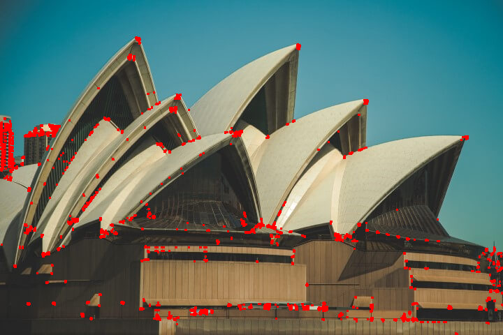
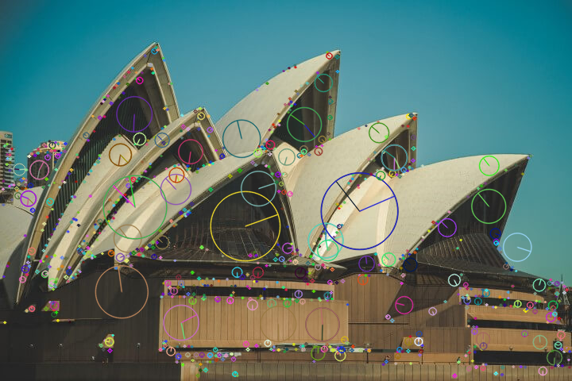
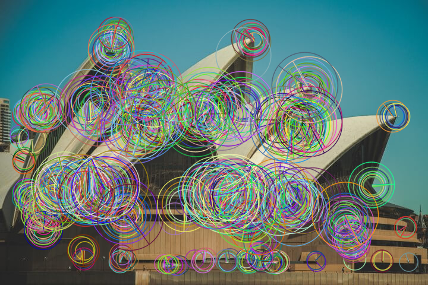
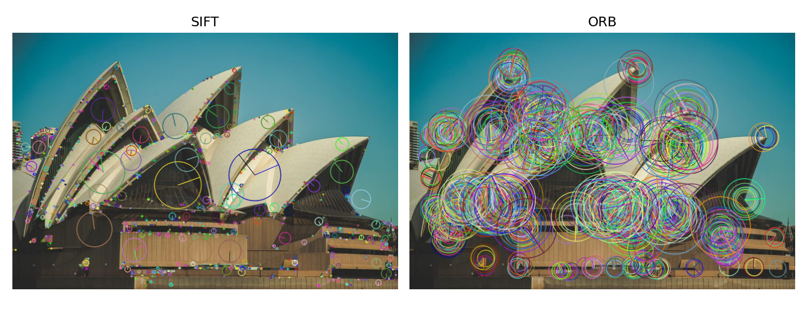
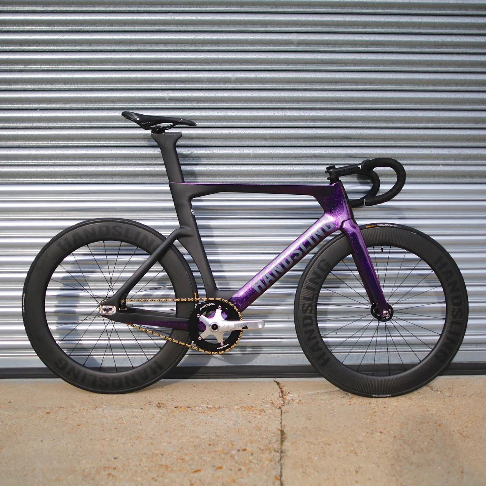
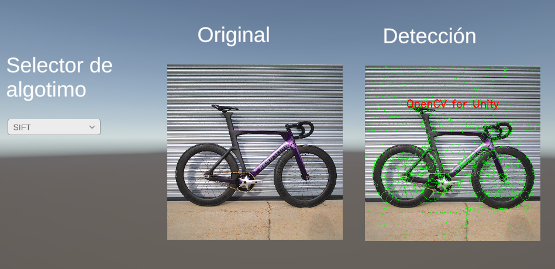
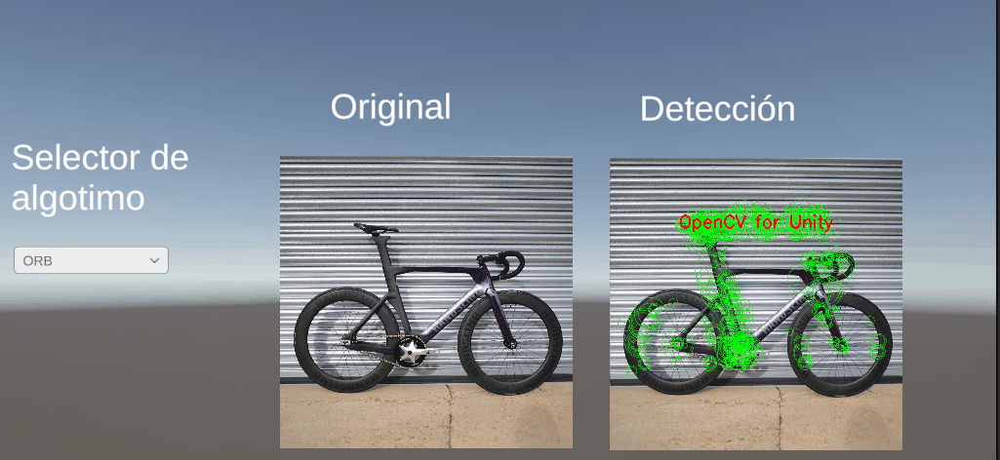

# Taller: Extraccion de Caracteristicas con SIFT y ORB

**Nombre de los estudiantes:**
- Juan David Buitrago Salazar
- Juan David Cardenas Galvis
- Nicolas Rodriguez Piraban
- Camilo Andres Medina Sanchez
- Juan Felipe Fajardo Garzon

**Fecha de entrega:** May 18, 2026

---

## 1. Descripcion del taller

El objetivo de este taller es implementar y comparar detectores de puntos clave y descriptores de caracteristicas con SIFT (Scale-Invariant Feature Transform) y ORB (Oriented FAST and Rotated BRIEF). Se parte de una imagen real y se estudia la deteccion de esquinas, la distribucion de keypoints, el rendimiento temporal y la robustez frente a transformaciones basicas (rotacion, escala e iluminacion). Los resultados visuales y tablas se guardan en la carpeta media/.

---

## 2. Objetivos alcanzados

- Implementar deteccion de esquinas con Harris para analizar estructuras locales.
- Extraer keypoints y descriptores con SIFT y ORB usando `detectAndCompute`.
- Visualizar los keypoints con orientacion y escala usando `cv2.drawKeypoints`.
- Comparar cantidad de keypoints y tiempos de ejecucion.
- Evaluar robustez ante cambios de rotacion, escala e iluminacion.
- Generar evidencias visuales y archivos CSV con resultados cuantitativos.

---

## 3. Implementaciones realizadas

### 3.1 Entorno Python (Jupyter Notebook)

Se desarrollo un notebook que incluye las siguientes etapas:

#### Carga de imagen
Se carga la imagen desde la carpeta media/ y se prepara la version en escala de grises para los detectores.

```python
img_bgr = cv2.imread(str(IMAGE_PATH))
gray = cv2.cvtColor(img_bgr, cv2.COLOR_BGR2GRAY)
```

#### Harris Corner Detector
Se aplica el detector de Harris para identificar esquinas y se guarda la visualizacion en color.

```python
harris_bgr, harris_map = detect_harris(img_bgr)
cv2.imwrite(str(MEDIA_DIR / "harris_corners.png"), harris_bgr)
```

#### SIFT
SIFT detecta keypoints robustos a cambios de escala y rotacion. Se guardan las visualizaciones con keypoints ricos.

```python
sift = cv2.SIFT_create()
kp_sift, des_sift = sift.detectAndCompute(gray, None)
```

#### ORB
ORB combina FAST + BRIEF, es mas rapido y liviano que SIFT. Se generan visualizaciones equivalentes para comparacion.

```python
orb = cv2.ORB_create(nfeatures=1000)
kp_orb, des_orb = orb.detectAndCompute(gray, None)
```

#### Comparacion visual lado a lado
Se crea una figura comparativa SIFT vs ORB para observar diferencias en distribucion y densidad de puntos.

#### Comparacion de rendimiento
Se mide el tiempo promedio en varias repeticiones y se guarda en un CSV:

```python
mean_sift, std_sift, n_sift = time_detector(sift, gray)
mean_orb, std_orb, n_orb = time_detector(orb, gray)
```

#### Robustez ante transformaciones
Se evalua la cantidad de keypoints ante rotaciones, cambios de escala y variaciones de iluminacion. Los resultados se guardan en `robustness_summary.csv`.

#### Bonus: AKAZE y BRISK
Se incluyen detectores alternativos para explorar comportamientos adicionales.

### 3.2 Entorno Unity (OpenCV for Unity)

Se desarrollo el script (FestureDetector.cs) que carga una imagen desde Resources y aplica ORB y SIFT. La escena incluye un dropdown para alternar entre algoritmos y muestra los keypoints detectados directamente sobre la imagen original con marcadores verdes. Se presenta la imagen original al lado de la deteccion para facilitar la comparacion. Por uso del free trial de OpenCV for Unity, se observa una marca de agua en las visualizaciones.

---

## 4. Resultados visuales

### 4.1 Python

#### Imagen original


**Descripcion:** Imagen base utilizada para la extraccion de caracteristicas.

#### Harris corners


**Descripcion:** Esquinas detectadas por Harris, resaltadas en rojo sobre la imagen.

#### Keypoints con SIFT


**Descripcion:** Keypoints con escala y orientacion. Se observa buena cobertura en zonas con textura.

#### Keypoints con ORB


**Descripcion:** Keypoints detectados con ORB, generalmente mas concentrados en bordes de alto contraste.

#### Comparacion SIFT vs ORB


**Descripcion:** Comparacion directa de distribucion y densidad de keypoints.

### 4.2 Unity

#### Imagen de prueba


#### Deteccion con ORB


#### Deteccion con SIFT


#### Selector en tiempo real


---

## 5. Resultados cuantitativos

Los resultados numericos se guardan en:

- `media/performance_summary.csv` (tiempos promedio y desviacion estandar)
- `media/robustness_summary.csv` (keypoints en transformaciones)

Tabla de referencia:

| Algoritmo | Tiempo medio (s) | Desv. estandar (s) | Keypoints |
|-----------|------------------:|-------------------:|----------:|
| SIFT      | 0.057357          | 0.008466           | 1056 |
| ORB       | 0.004477          | 0.000341           | 1000 |

**Interpretacion general:** SIFT suele entregar mas keypoints y mayor robustez, mientras que ORB ofrece tiempos menores con menor costo computacional.

---

## 6. Codigo relevante

### Python: SIFT y ORB con visualizacion de keypoints

```python
sift = cv2.SIFT_create()
kp_sift, des_sift = sift.detectAndCompute(gray, None)
sift_draw = cv2.drawKeypoints(
    img_bgr, kp_sift, None,
    flags=cv2.DRAW_MATCHES_FLAGS_DRAW_RICH_KEYPOINTS
)

orb = cv2.ORB_create(nfeatures=1000)
kp_orb, des_orb = orb.detectAndCompute(gray, None)
orb_draw = cv2.drawKeypoints(
    img_bgr, kp_orb, None,
    flags=cv2.DRAW_MATCHES_FLAGS_DRAW_RICH_KEYPOINTS
)
```

### Python: Medicion de rendimiento

```python
mean_sift, std_sift, n_sift = time_detector(sift, gray)
mean_orb, std_orb, n_orb = time_detector(orb, gray)
```

### Unity: Deteccion con ORB y SIFT

```cs
if (currentAlgorithm == AlgorithmType.ORB)
{
    ORB orb = ORB.create();
    orb.detect(originalMat, keyPoints);
    orb.Dispose();
}
else if (currentAlgorithm == AlgorithmType.SIFT)
{
    SIFT sift = SIFT.create();
    sift.detect(originalMat, keyPoints);
    sift.Dispose();
}

Features2d.drawKeypoints(originalMat, keyPoints, outputMat, new Scalar(0, 255, 0, 255), 4);
OpenCVMatUtils.MatToTexture2D(outputMat, resultTexture);
```

---

## 7. Prompts utilizados

1. "Documenta un poco el .ipynb, de forma tecnica."
2. "Dame un script sencillo que realice la deteccion de Keypoints usando SIFT, y utilizando el asset OpenCV For Unity"

---

## 8. Aprendizajes y dificultades

### Aprendizajes

- SIFT es mas robusto a variaciones de escala y rotacion por su naturaleza multiescala.
- ORB prioriza velocidad, lo que lo hace util para tiempo real o dispositivos con recursos limitados.
- La visualizacion de keypoints permite evaluar cobertura y densidad de caracteristicas.
- Medir tiempos en multiples repeticiones reduce el sesgo por fluctuaciones del sistema.
- Integrar OpenCV en Unity facilita visualizar resultados en escenas interactivas.

### Dificultades

- Ajuste de parametros (Harris y ORB) para controlar sensibilidad y ruido.
- Diferencias notables en la cantidad de keypoints entre algoritmos, lo que complica comparaciones directas.
- Importacion de dependencias y configuracion de OpenCV for Unity.
- Garantizar consistencia en la exportacion de resultados para documentacion.

---

## 9. Estructura del repositorio

```
semana_10_1_extraccion/
├── python/
│   └── taller_sift_orb.ipynb
├── unity/
├── media/
│   ├── Imagen_taller_10_1.jpg
│   ├── harris_corners.png
│   ├── sift_keypoints.png
│   ├── orb_keypoints.png
│   ├── sift_orb_side_by_side.png
│   ├── performance_summary.csv
│   ├── robustness_summary.csv
│   ├── bike.jpg
│   ├── orb_detection_bike.png
│   ├── sift_detection_bike.png
│   └── selector_bike.gif
└── README.md
```

---

## 10. Contribuciones del equipo

### Juan David Buitrago Salazar
- Implementacion de Harris Corner Detector y visualizaciones asociadas.
- Documentacion tecnica del flujo de procesamiento inicial en Python.

### Juan David Cardenas Galvis
- Implementacion de SIFT y visualizacion de keypoints en Python.
- Analisis cualitativo de distribucion de puntos clave.

### Nicolas Rodriguez Piraban
- Implementacion de ORB y comparacion con SIFT en Python.
- Apoyo en la generacion de la comparacion lado a lado.

### Camilo Andres Medina Sanchez
- Medicion de rendimiento y generacion de `performance_summary.csv`.
- Pruebas de robustez ante transformaciones y generacion de `robustness_summary.csv`.

### Juan Felipe Fajardo Garzon
- Implementacion Unity: script de deteccion y UI con dropdown.
- Estructuracion del README e integracion de evidencias visuales.

---

## 11. Conclusiones

Este taller evidencia la diferencia entre un detector robusto pero mas costoso (SIFT) y uno ligero y veloz (ORB). La eleccion depende del escenario: si se requiere precision y estabilidad ante transformaciones, SIFT suele ser mas adecuado; si se necesita rapidez, ORB es una alternativa practica. La combinacion de visualizaciones y metricas permite tomar decisiones informadas sobre el detector mas conveniente para cada aplicacion.
