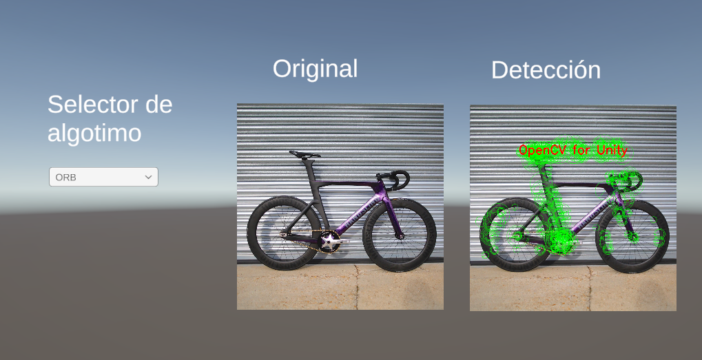

# Taller - Extracción de Características con SIFT y ORB
## Nombre: 


- Juan David Buitrago Salazar
- Juan David Cardenas Galvis
- Nicolás Rodríguez Piraban
- Camilo Andres Medina Sanchez
- Juan Felipe Fajardo Garzón

## Fecha de entrega: 18/05/2026

## Descripción breve:
En este taller se implementaron técnicas de extracción de características de imágenes utilizando los algoritmos ORB y SIFT en Unity mediante OpenCV For Unity, permitiendo detectar y visualizar puntos clave en imágenes.

## Implementaciones:

### Unity:
Se desarrolló el script (`FestureDetector.cs`) que carga una imagen desde los recursos de Unity y aplica los algoritmos de detección de características ORB y SIFT. La escena incluye un dropdown para alternar entre ambos algoritmos y muestra los keypoints detectados directamente sobre la imagen original con marcadores verdes.

## Resultados visuales:

### Unity:

Se hizo uso de la siguiente imagen de prueba


La escea de Unity permite visualizar los puntos característicos detectados en una imagen, mostrando con indicadores verdes la ubicación de cada keypoint encontrado. El dropdown permite cambiar entre los algoritmos ORB y SIFT para comparar los resultados.

Adicionalmente se muestra la imagen original al lado de la detección para una mejor visualización

**Nota:** Puesto que se usa el free Trial de OpenCV for Unity, se tiene una marca de agua dentro de la imagen con la detección de los puntos

Deteccion Usando ORB



Detección usando SIFT


A continuacion se muestra una prueba de funcionalidad del selector de algoritmo en tiempo real


## Código relevante:

El script principal implementa la detección de características mediante un enum para seleccionar el algoritmo. 

Este Script posee 2 metodos principales, en el método `LoadImageFromResources()` se carga la imagen original que es del tipo `Texture2D`, luego se usa `Texture2DToMat` para convertir la imagen en un objeto del tipo `Mat` (Matriz) y poderlo procesar con OpenCV

```cs
void LoadImageFromResources()
{
    Texture2D imgTexture = Resources.Load<Texture2D>(resourceImageName);
    if (imgTexture == null)
    {
        Debug.LogError($"No se encontró la imagen '{resourceImageName}' en la carpeta Resources.");
        return;
    }

    originalMat = new Mat(imgTexture.height, imgTexture.width, CvType.CV_8UC4);
    outputMat = new Mat(imgTexture.height, imgTexture.width, CvType.CV_8UC4);

    
    OpenCVMatUtils.Texture2DToMat(imgTexture, originalMat);
    
    resultTexture = new Texture2D(originalMat.cols(), originalMat.rows(), TextureFormat.RGBA32, false);
    displayImage.texture = resultTexture;
}

```


En el método `ProcessImage()` se crea el detector correspondiente (segun el algoritmo elegído en el dropdown), se utilizan los métodos `detect()` para realizar la identificación de los keyPoints y `drawKeypoints()` para dibujarlos encima de la imagen original, finalmente se convierte el objeto `Mat` a `Texture2D` con `MatToTexture2D` para renderizar la imagen con los keypoints dentro de la escena


```cs
if (currentAlgorithm == AlgorithmType.ORB)
{
    ORB orb = ORB.create();
    orb.detect(originalMat, keyPoints);
    orb.Dispose();
}
else if (currentAlgorithm == AlgorithmType.SIFT)
{
    SIFT sift = SIFT.create();
    sift.detect(originalMat, keyPoints);
    sift.Dispose();
}

Features2d.drawKeypoints(originalMat, keyPoints, outputMat, new Scalar(0, 255, 0, 255), 4);

OpenCVMatUtils.MatToTexture2D(outputMat, resultTexture);
```

## Prompts utilizados:

Dame un script sencillo que realice la deteccion de Keypoints usando SIFT, y utilizando el asset OpenCV For Unity

## Aprendizajes y dificultades:
Este taller permitió comprender cómo funcionan los detectores de características en visión por computador, entendiendo la diferencia entre ORB (más rápido, basado en esquinas) y SIFT (más robusto, invariante a escala y rotación). La principal dificultad fue importar y utilizar correctamente los métodos de OpenCV For Unity, puesto que requiere importar ciertas dependencias para que todo funcione correctamente 