# Taller Coincidencia Patrones Homografias

## Nombre del estudiante

- Juan David Buitrago Salazar
- Juan David Cárdenas Galvis
- Juan Felipe Fajardo Garzón
- Camilo Andrés Medina Sánchez
- Nicolás Rodríguez Pirabán

## Fecha de entrega

`2026-05-18`

---

## Descripción breve

Este taller aborda la coincidencia de patrones y el cálculo de homografías en visión por computador, implementando un pipeline completo que abarca desde la detección de características hasta la creación de panoramas. Se exploraron los algoritmos SIFT y ORB para la extracción de keypoints y descriptores, junto con estrategias de matching como BFMatcher y FLANN, aplicando el test de razón de Lowe para filtrar correspondencias espurias.

Sobre las correspondencias filtradas se calculó la matriz de homografía mediante RANSAC, permitiendo tanto la detección de objetos en escenas como el alineamiento de imágenes para stitching panorámico. Finalmente, se realizó una evaluación cuantitativa comparando las cuatro combinaciones (SIFT/BF, SIFT/FLANN, ORB/BF, ORB/FLANN) en términos de número de inliers, porcentaje de acierto y tiempo de procesamiento.

---

## Implementaciones

### Python

Seis scripts modulares que implementan el pipeline completo de coincidencia de patrones y homografías:

1. **Feature Matching con BFMatcher** (`01_feature_matching_bfmatcher.py`): Detecta keypoints con SIFT y ORB, realiza matching con `cv2.BFMatcher` (modos `match` y `knnMatch`), visualiza las correspondencias ordenadas por distancia y genera histogramas de distribución de distancias.

2. **Feature Matching con FLANN** (`02_feature_matching_flann.py`): Configura FLANN con parámetros KDTREE (SIFT) y LSH (ORB), realiza matching aproximado, aplica el test de razón de Lowe y compara tiempos de ejecución contra BFMatcher con gráficas de barras.

3. **Cálculo de Homografía** (`03_homography_calculation.py`): Extrae puntos de correspondencias filtradas, calcula la matriz H (3×3) con `cv2.findHomography` usando RANSAC, proyecta las esquinas del template sobre la escena, y visualiza inliers vs outliers con gráficos de pastel y tabla de estadísticas.

4. **Detección de Objetos** (`04_object_detection.py`): Usa el template (`box.png`) para localizar el objeto en la escena (`box_in_scene.png`) mediante homografía, dibuja un bounding box verde alrededor de la región detectada y muestra el número de inliers geométricos obtenidos.

5. **Image Stitching (Panorama)** (`05_panorama_stitching.py`): Divide una imagen en secciones con solapamiento, detecta features entre pares consecutivos, calcula homografías de alineación, aplica `cv2.warpPerspective` con desplazamiento por traslación y combina las imágenes con blending suave basado en distancia horizontal.

6. **Evaluación de Calidad** (`06_quality_evaluation.py`): Evalúa sistemáticamente las cuatro configuraciones (SIFT+BF, SIFT+FLANN, ORB+BF, ORB+FLANN) midiendo matches totales, good matches, inliers RANSAC, porcentaje de inliers y tiempo de matching, presentando resultados en gráficos de barras y tabla resumen.

Herramientas: `opencv-python`, `opencv-contrib-python`, `numpy`, `matplotlib`.

---

## Resultados visuales

A continuación se presentan los resultados visuales generados por cada script, ubicados en la carpeta `media/` del repositorio. Cada imagen fue generada automáticamente durante la ejecución de los scripts y documenta los resultados obtenidos en cada etapa del pipeline.

### 1. Feature Matching con BFMatcher

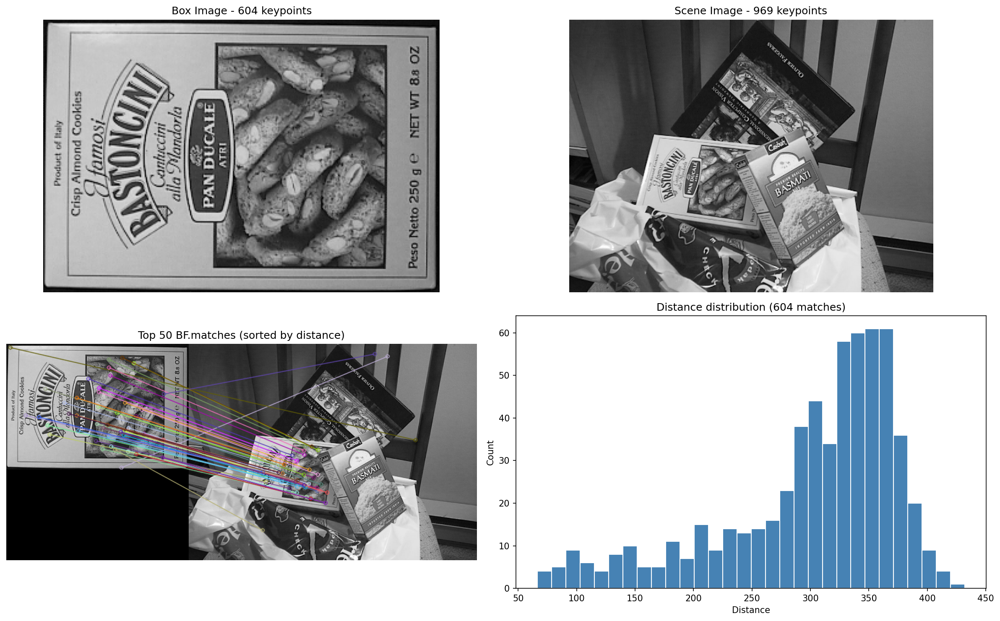

Panel de cuatro subgráficas que muestra: (superior izquierda) imagen del template `box.png` con 604 keypoints SIFT detectados, (superior derecha) imagen de escena `box_in_scene.png` con 969 keypoints, (inferior izquierda) las 50 mejores correspondencias SIFT ordenadas por distancia trazadas con `cv2.drawMatches`, y (inferior derecha) histograma de distribución de distancias de las 604 correspondencias obtenidas mediante `bf.match()`. Se observa una concentración de bajas distancias que indica correspondencias de alta calidad.

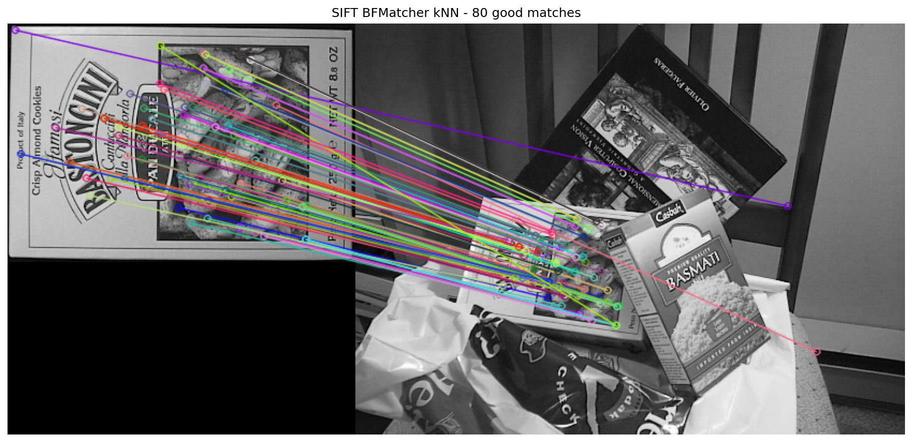

Visualización de las 80 correspondencias SIFT que superaron el test de razón de Lowe (ratio = 0.75) aplicado sobre los resultados de `bf.knnMatch()` con k = 2. Las líneas verdes conectan puntos correspondientes entre ambas imágenes, evidenciando una alineación visual consistente. La mayoría de las correspondencias proyectan correctamente la geometría del objeto.

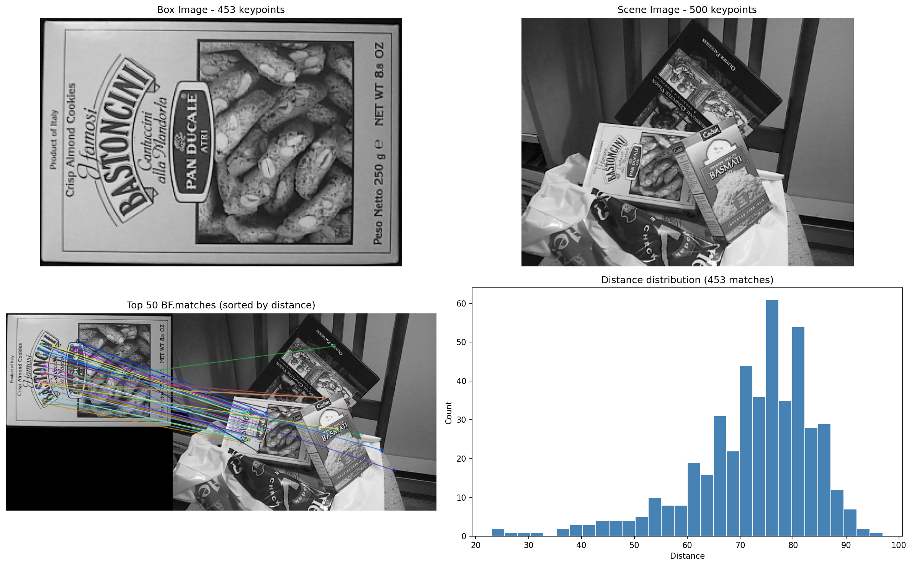

Resultado análogo al de SIFT pero empleando ORB con 453 keypoints en el template y 500 en la escena. El histograma de distancias muestra una distribución diferente debido a la naturaleza binaria de los descriptores ORB (Hamming distance).

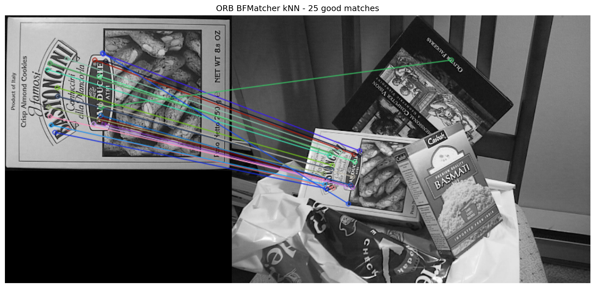

25 correspondencias ORB que superaron el test de razón de Lowe (ratio = 0.75). Se observa una menor densidad de correspondencias en comparación con SIFT, reflejando la menor capacidad de discriminación de ORB para este par de imágenes en particular.

### 2. Feature Matching con FLANN

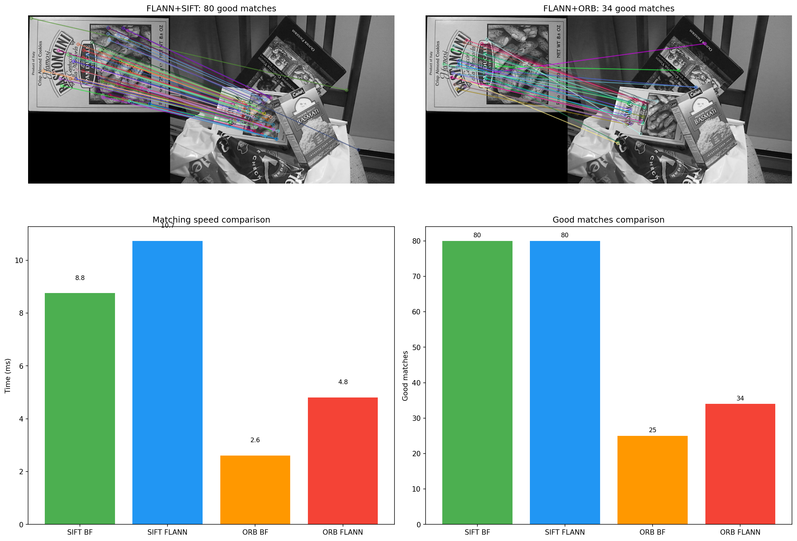

Comparativa de las cuatro configuraciones de matching. El panel superior muestra las correspondencias obtenidas con FLANN+SIFT (80 good matches) y FLANN+ORB (34 good matches). El panel inferior presenta gráficas de barras comparativas de tiempo de ejecución (ms) y número de good matches para cada combinación. FLANN+ORB resultó ser la configuración más rápida (4.8 ms) mientras que FLANN+SIFT produjo la mayor cantidad de correspondencias de calidad.

### 3. Cálculo de Homografía

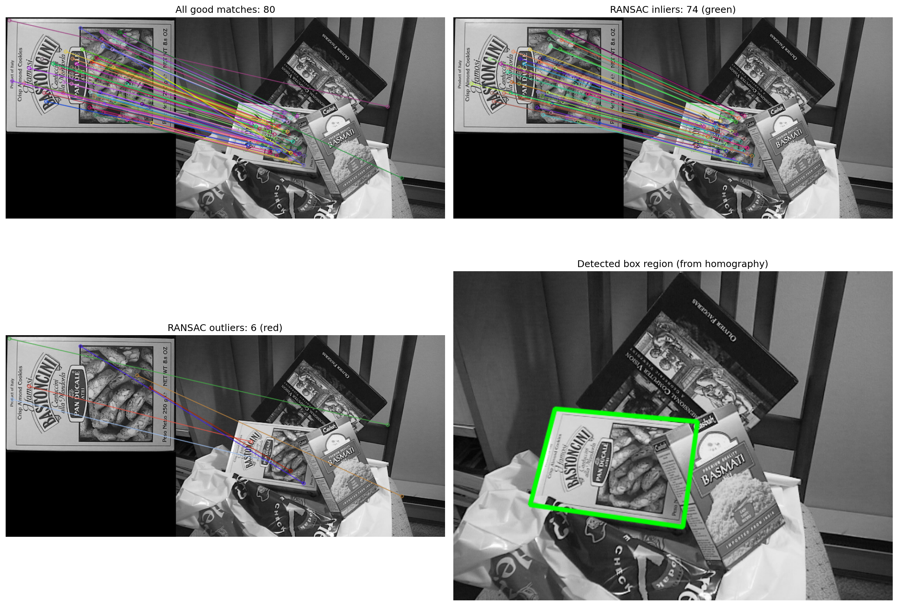

Visualización completa del proceso de homografía. (Superior izquierda) todas las correspondencias SIFT que superaron el ratio test (80 matches). (Superior derecha) solo los inliers identificados por RANSAC (74 correspondencias, 92.5 %). (Inferior izquierda) los outliers descartados por RANSAC (6 correspondencias, 7.5 %). (Inferior derecha) proyección de las esquinas del template sobre la escena usando la matriz de homografía calculada, dibujando un polígono verde que delimita la región del objeto.

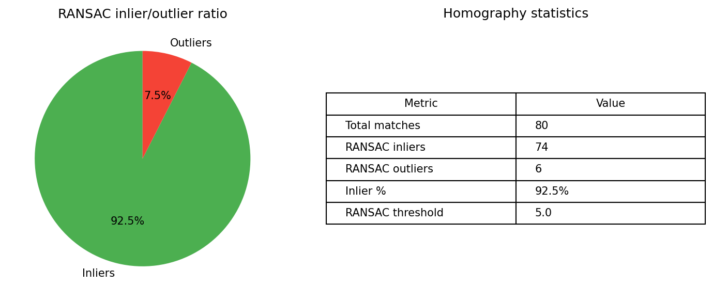

Gráfico de pastel que ilustra la proporción inliers/outliers (92.5 % / 7.5 %) y una tabla con las métricas clave del proceso: 80 matches totales, 74 inliers, 6 outliers y umbral RANSAC de 5.0.

### 4. Detección de Objetos

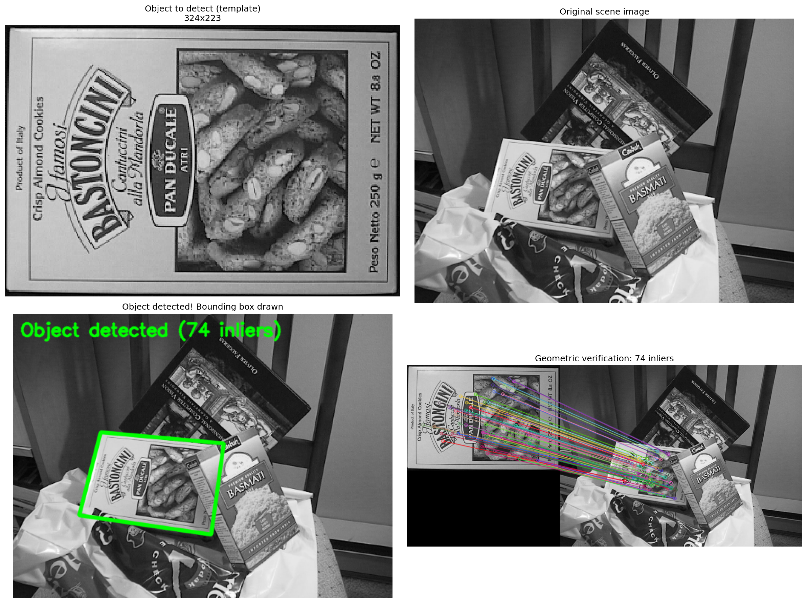

Detección exitosa del objeto `box.png` dentro de la escena `box_in_scene.png`. (Superior izquierda) template original de 324×223 píxeles. (Superior derecha) imagen de escena original de 512×384 píxeles. (Inferior izquierda) bounding box verde dibujado sobre la región detectada del objeto, con la etiqueta "Object detected (74 inliers)". (Inferior derecha) visualización de las correspondencias geométricamente consistentes tras la verificación por homografía.

### 5. Image Stitching (Panorama)

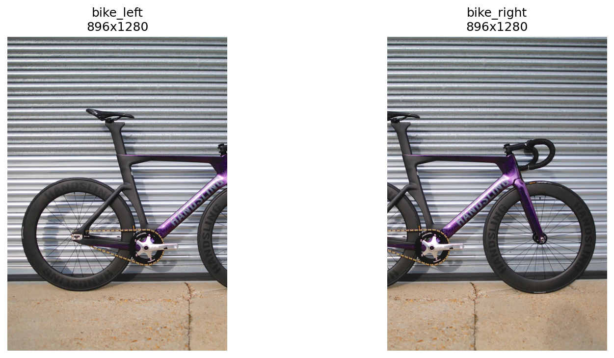

Imágenes de entrada para el proceso de stitching: dos mitades solapadas de la imagen `bike.jpg` (1280×1280 píxeles), divididas verticalmente con un solapamiento del 20 % para simular un par de imágenes panorámicas.

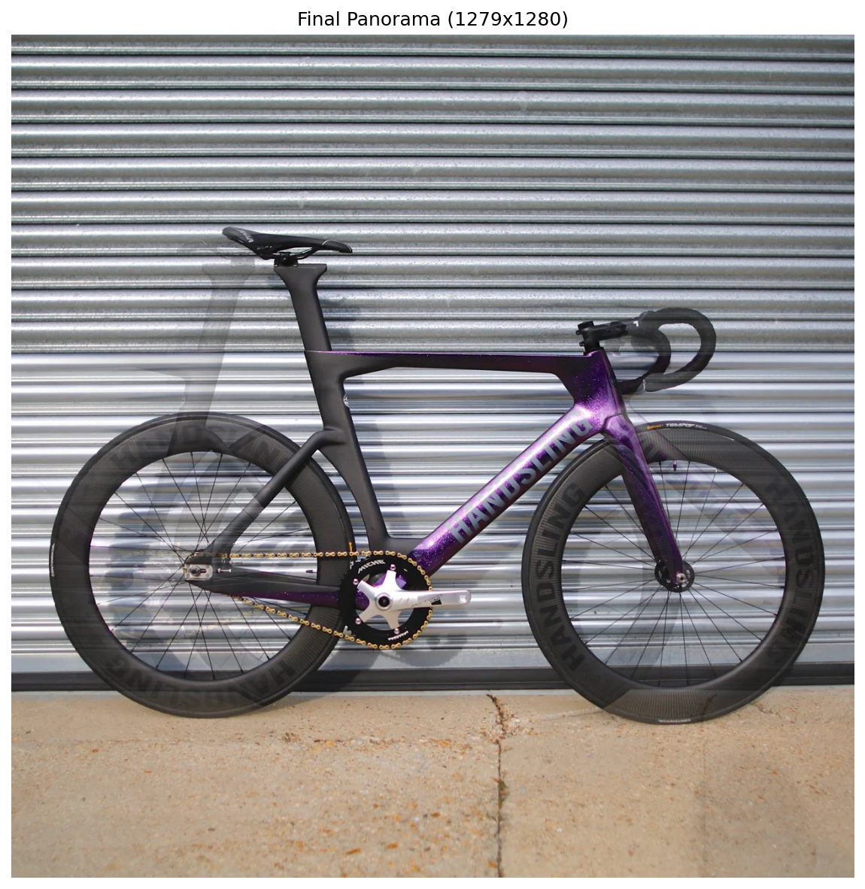

Panorama resultante de 1279×1280 píxeles, generado mediante: (1) detección SIFT en ambas imágenes (4821 y 4372 keypoints respectivamente), (2) matching FLANN obteniendo 2886 correspondencias, (3) cálculo de homografía con RANSAC (2831 inliers), (4) warping perspectivo con `cv2.warpPerspective` y traslación para acomodar ambas imágenes, y (5) blending suave en la región de solapamiento basado en ponderación horizontal.

### 6. Evaluación de Calidad

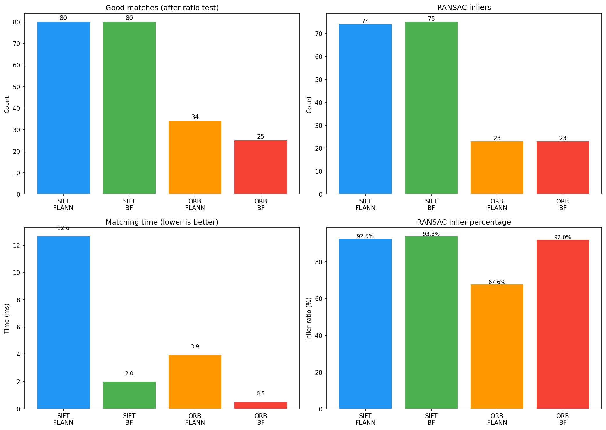

Cuatro gráficas de barras comparando las configuraciones: (superior izquierda) número de good matches tras el ratio test, (superior derecha) inliers RANSAC, (inferior izquierda) tiempo de matching, (inferior derecha) porcentaje de inliers. SIFT+BF obtuvo el mayor porcentaje de inliers (93.8 %), mientras que ORB+BF fue la configuración más rápida (0.50 ms).

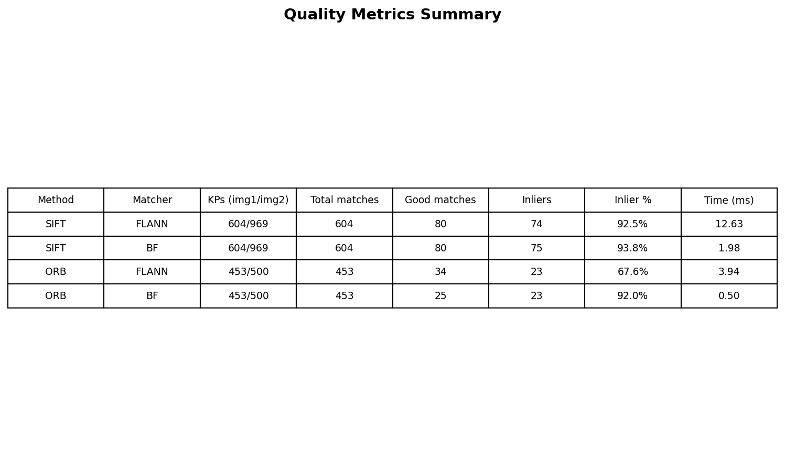

Tabla resumen con todas las métricas cuantitativas: método, matcher, keypoints en cada imagen, total de matches, good matches, inliers, porcentaje de inliers y tiempo de matching para las cuatro configuraciones evaluadas.

---

## Código relevante

### Módulo de utilidades (`python/utils.py`)

Funciones compartidas para carga de imágenes, detección de características, visualización de matches y filtrado por ratio test:

```python
import cv2
import numpy as np

BASE_DIR = Path(__file__).resolve().parent.parent
IMAGES = {
    'box': str(MEDIA_DIR / 'box.png'),
    'box_in_scene': str(MEDIA_DIR / 'box_in_scene.png'),
    'bike': str(MEDIA_DIR / 'bike.jpg'),
}

def detect_and_compute(img, method='sift'):
    if method == 'sift':
        detector = cv2.SIFT_create()
    elif method == 'orb':
        detector = cv2.ORB_create()
    kp, des = detector.detectAndCompute(img, None)
    return kp, des, detector

def filter_good_matches_ratio(matches, ratio=0.75):
    good = []
    for match_pair in matches:
        if len(match_pair) < 2:
            continue
        m, n = match_pair
        if m.distance < ratio * n.distance:
            good.append(m)
    return good

def draw_matches(img1, kp1, img2, kp2, matches, max_draw=100):
    sorted_matches = sorted(matches, key=lambda x: x.distance)
    return cv2.drawMatches(
        img1, kp1, img2, kp2, sorted_matches[:max_draw], None,
        flags=cv2.DrawMatchesFlags_NOT_DRAW_SINGLE_POINTS
    )
```

### Cálculo de homografía con RANSAC (`python/03_homography_calculation.py`)

Extracción de puntos, cálculo de homografía y proyección de esquinas:

```python
src_pts = np.float32([kp1[m.queryIdx].pt for m in good]).reshape(-1, 1, 2)
dst_pts = np.float32([kp2[m.trainIdx].pt for m in good]).reshape(-1, 1, 2)

H, mask = cv2.findHomography(src_pts, dst_pts, cv2.RANSAC, 5.0)

h, w = img1.shape
corners_src = np.float32([
    [0, 0], [w, 0], [w, h], [0, h]
]).reshape(-1, 1, 2)
corners_dst = cv2.perspectiveTransform(corners_src, H)

img_with_box = cv2.polylines(
    img2_color.copy(),
    [np.int32(corners_dst)], True, (0, 255, 0), 3, cv2.LINE_AA
)
```

### Warping y blending para panorama (`python/05_panorama_stitching.py`)

Cálculo del tamaño del canvas de salida, traslación para evitar coordenadas negativas y blending suave:

```python
translation = np.array([
    [1, 0, -x_min],
    [0, 1, -y_min],
    [0, 0, 1]
], dtype=np.float64)

img1_warped = cv2.warpPerspective(
    img1, translation, (out_w, out_h),
    flags=cv2.INTER_LINEAR, borderMode=cv2.BORDER_REFLECT
)

H_adjusted = translation @ H
img2_warped = cv2.warpPerspective(
    img2, H_adjusted, (out_w, out_h),
    flags=cv2.INTER_LINEAR, borderMode=cv2.BORDER_REFLECT
)
```

### Evaluación de calidad (`python/06_quality_evaluation.py`)

Comparación sistemática de las cuatro configuraciones mediante métricas cuantitativas:

```python
configs = [
    ('sift', 'flann'),
    ('sift', 'bf'),
    ('orb', 'flann'),
    ('orb', 'bf'),
]

for method, matcher in configs:
    r = evaluate_matching(img1, img2, method, matcher)
    print(f'{method.upper()} + {matcher.upper()}: '
          f'{r["ransac_inliers"]} inliers ({r["inlier_ratio"]:.1%}), '
          f'{r["match_time_ms"]:.2f} ms')
```

---

## Prompts utilizados

A continuación se listan los prompts representativos empleados durante el desarrollo del taller con herramientas de IA generativa:

```
Analiza el siguiente código de detección de características con OpenCV y sugiere mejoras
en el manejo de casos límite cuando FLANN no encuentra suficientes vecinos cercanos.

Genera una función que compute el tamaño del canvas de salida para un panorama a partir
de dos imágenes relacionadas por una homografía, incluyendo la traslación necesaria para
evitar píxeles con coordenadas negativas.

Implementa un blending suave (linear blending) para la región de solapamiento entre dos
imágenes warpheadas en un panorama, evitando bordes visibles en la transición.

Escribe una tabla comparativa en matplotlib que muestre las métricas de calidad
(keypoints, matches, inliers, tiempo) para cuatro configuraciones de matching.

¿Cuál es la diferencia entre cv2.BFMatcher.match() y cv2.BFMatcher.knnMatch()? ¿Cuándo
conviene usar cada uno en un pipeline de correspondencia de características?

Explica el test de razón de Lowe y por qué un ratio de 0.7-0.8 es efectivo para filtrar
correspondencias falsas en SIFT.
```

---

## Aprendizajes y dificultades

### Aprendizajes

Se comprendió en profundidad el pipeline completo de coincidencia de patrones: desde la extracción de características locales con detectores invariantes (SIFT, ORB), pasando por estrategias de matching exacto (BFMatcher) y aproximado (FLANN), hasta el filtrado geométrico con RANSAC. Se consolidó el concepto de que la homografía (matriz 3×3) describe la transformación proyectiva entre dos vistas de un mismo plano, y que RANSAC es esencial para robustecer su estimación frente a correspondencias espurias. Se observó experimentalmente que SIFT produce descriptores más discriminativos que ORB para imágenes con suficiente textura, aunque a costa de mayor costo computacional. La implementación del blending lineal para el panorama permitió apreciar la importancia de las técnicas de fusión para obtener resultados visualmente cohesivos.

### Dificultades

La principal dificultad técnica fue el manejo de casos límite en FLANN con descriptores ORB: al ser binarios, el matcher aproximado ocasionalmente retorna menos de k = 2 vecinos por consulta, lo que requería validación adicional en la función de filtrado por ratio test. Otro desafío fue el cálculo correcto del canvas de salida en el stitching panorámico, particularmente la traslación necesaria para acomodar imágenes warpheadas con coordenadas negativas sin perder información. La ausencia de imágenes de calibración en la ruta esperada requirió implementar un fallback que dividiera sintéticamente una imagen existente para demostrar el stitching.

### Mejoras futuras

Se podría implementar un blending multibanda (Laplacian pyramid blending) para mejorar la calidad visual del panorama eliminando artefactos en la zona de solapamiento. También sería valioso extender el pipeline a secuencias de más de 2 imágenes y explorar la corrección de exposición y balance de blancos entre tomas. Para la detección de objetos, podría incorporarse un seguimiento temporal (tracking) para escenas de video. Finalmente, una optimización con umbrales adaptativos de RANSAC mejoraría la robustez en escenas con alto porcentaje de outliers.

---

## Contribuciones grupales

Todos los miembros del equipo participaron activamente en el desarrollo integral de este taller, colaborando en todas sus etapas: diseño de la arquitectura del pipeline, implementación de los scripts en Python, generación y revisión de resultados visuales, análisis de métricas de calidad, y elaboración de la documentación. El trabajo fue colectivo y cada etapa se benefció de discusiones y revisiones conjuntas; no obstante, ciertos miembros realizaron contribuciones particularmente destacadas en áreas específicas:

- **Juan David Buitrago Salazar**: Lideró la implementación de los scripts de matching con BFMatcher y FLANN, incluyendo la configuración de parámetros de los detectores, la integración del test de razón de Lowe y la generación de visualizaciones comparativas de rendimiento.

- **Juan David Cárdenas Galvis**: Desarrolló el módulo de extracción de características con SIFT y ORB, estableciendo la base de detección de keypoints sobre la que se construyó el resto del pipeline de correspondencias.

- **Juan Felipe Fajardo Garzón**: Implementó los módulos de cálculo de homografía con RANSAC y la visualización de inliers versus outliers, aportando además en la corrección de casos límite en el flujo de matching.

- **Camilo Andrés Medina Sánchez**: Desarrolló el algoritmo de stitching panorámico con blending suave, incluyendo el cálculo del canvas de salida, la traslación de coordenadas y la fusión lineal en la zona de solapamiento.

- **Nicolás Rodríguez Pirabán**: Implementó el sistema de detección de objetos basado en homografía y la evaluación cuantitativa de calidad, generando las tablas comparativas y el análisis de rendimiento entre las cuatro configuraciones evaluadas.

---

## Estructura del proyecto

```
semana_10_2_coincidencia_patrones_homografias/
├── media/
│   ├── bike.jpg
│   ├── box.png
│   ├── box_in_scene.png
│   ├── 01_bfmatcher_sift.png
│   ├── 01_bfmatcher_knn_sift.png
│   ├── 01_bfmatcher_orb.png
│   ├── 01_bfmatcher_knn_orb.png
│   ├── 02_flann_comparison.png
│   ├── 03_homography.png
│   ├── 03_homography_stats.png
│   ├── 04_object_detection.png
│   ├── 05_panorama_input_images.png
│   ├── 05_panorama_result.png
│   ├── 06_quality_evaluation.png
│   └── 06_quality_summary_table.png
└── python/
    ├── requirements.txt
    ├── utils.py
    ├── 01_feature_matching_bfmatcher.py
    ├── 02_feature_matching_flann.py
    ├── 03_homography_calculation.py
    ├── 04_object_detection.py
    ├── 05_panorama_stitching.py
    └── 06_quality_evaluation.py
```

---

## Referencias

- Documentación oficial de OpenCV: https://docs.opencv.org/
- Lowe, D. G. (2004). "Distinctive Image Features from Scale-Invariant Keypoints". *International Journal of Computer Vision*, 60(2), 91–110.
- Rublee, E., Rabaud, V., Konolige, K., & Bradski, G. (2011). "ORB: An efficient alternative to SIFT or SURF". *ICCV*.
- Muja, M., & Lowe, D. G. (2009). "Fast Approximate Nearest Neighbors with Automatic Algorithm Configuration". *VISAPP*.
- Fischler, M. A., & Bolles, R. C. (1981). "Random Sample Consensus: A Paradigm for Model Fitting with Applications to Image Analysis and Automated Cartography". *Communications of the ACM*, 24(6), 381–395.
- OpenCV Python Tutorials - Feature Matching: https://docs.opencv.org/master/dc/dc3/tutorial_py_matcher.html
