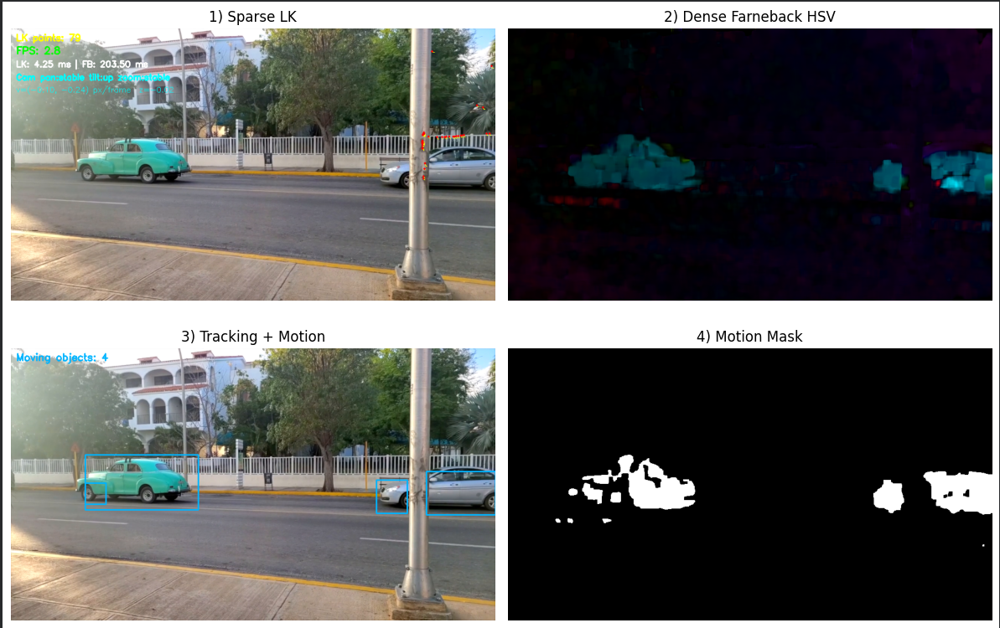
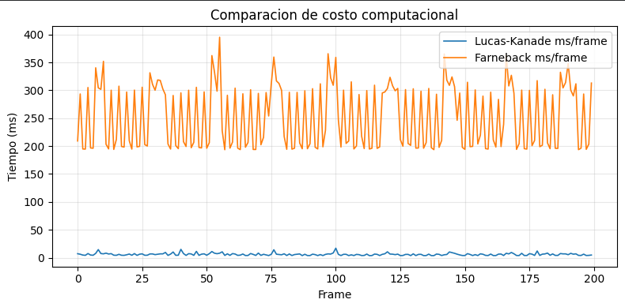

# Flujo Optico y Tracking de Movimiento
## Nombres
- Juan David Buitrago Salazar
- Juan David Cardenas Galvis
- Nicolás Rodríguez Piraban
- Camilo Andres Medina Sanchez
- Juan Felipe Fajardo Garzón

## Fecha de Entrega
`2026-05-18`

---

## Descripcion Breve

En este taller se implementaron tecnicas de flujo optico y tracking de movimiento
en Python con OpenCV. El trabajo incluye flujo optico disperso (Lucas-Kanade),
flujo optico denso (Farneback), seguimiento por ROI, deteccion de movimiento y
medicion de rendimiento para comparar metodos en una secuencia de video.

---

## Implementaciones

### Python / OpenCV

El proceso desarrollado incluye:

1. **Flujo optico disperso (Lucas-Kanade):** deteccion de puntos con
   `cv2.goodFeaturesToTrack`, seguimiento con `cv2.calcOpticalFlowPyrLK` y
   re-deteccion de puntos perdidos.

2. **Flujo optico denso (Farneback):** calculo de campo de movimiento con
   `cv2.calcOpticalFlowFarneback` y visualizacion HSV (direccion y magnitud).

3. **Tracking de objeto por ROI:** seleccion/definicion de ROI y actualizacion de
   bounding box para el seguimiento cuadro a cuadro.

4. **Estimacion de movimiento de camara:** analisis de flujo global para inferir
   tendencias de pan, tilt y zoom.

5. **Deteccion de movimiento:** mascara por magnitud de flujo, limpieza
   morfologica y conteo de objetos en movimiento por contornos.

6. **Analisis de rendimiento:** medicion de FPS y comparacion de tiempos entre
   Lucas-Kanade y Farneback.

---

## Resultados visuales

### Python - Implementacion



Visualizacion del procesamiento general del video en el notebook.



Comparacion de resultados entre enfoques de flujo optico y metricas de ejecucion.


Demostracion animada del comportamiento del tracking y del flujo optico.

Video utilizado para pruebas:

- [`Video.mp4`](./media/Video.mp4)

---

## Codigo relevante

### Ejemplo de flujo optico disperso

```python
p1, st, err = cv2.calcOpticalFlowPyrLK(prev_gray, gray, p0, None, **lk_params)
good_new = p1[st == 1]
good_old = p0[st == 1]

for new, old in zip(good_new, good_old):
    a, b = new.ravel()
    c, d = old.ravel()
    cv2.line(mask, (int(a), int(b)), (int(c), int(d)), (0, 255, 0), 2)
    cv2.circle(frame_vis, (int(a), int(b)), 3, (0, 0, 255), -1)
```

### Ejemplo de flujo optico denso

```python
flow = cv2.calcOpticalFlowFarneback(
    prev_gray, gray, None, 0.5, 3, 15, 3, 5, 1.2, 0
)
mag, ang = cv2.cartToPolar(flow[..., 0], flow[..., 1])

hsv[..., 0] = ang * 180 / np.pi / 2
hsv[..., 1] = 255
hsv[..., 2] = cv2.normalize(mag, None, 0, 255, cv2.NORM_MINMAX)
flow_bgr = cv2.cvtColor(hsv.astype(np.uint8), cv2.COLOR_HSV2BGR)
```

---

## Prompts utilizados

python:

```text
Implementa en un notebook de Python con OpenCV un taller de flujo optico que
incluya Lucas-Kanade, Farneback, tracking por ROI, deteccion de movimiento y
comparacion de rendimiento, con salida compatible para Google Colab.
```

---

## Aprendizajes y dificultades

Con este taller se reforzo la diferencia entre flujo optico disperso y denso,
y su aplicacion para seguimiento y analisis de movimiento en video. Tambien se
entendio como los parametros de cada metodo afectan estabilidad, sensibilidad y
costo computacional.

La principal dificultad fue ajustar parametros de tracking y de mascara de
movimiento para reducir ruido sin perder objetos relevantes. Adicionalmente,
adaptar la visualizacion para Colab requirio evitar funciones GUI de OpenCV y
usar una estrategia de renderizado compatible en notebook.
