# Taller - Detección de Bordes y Contornos

## Nombre del estudiante / integrantes

- Juan David Buitrago Salazar
- Juan David Cardenas Galvis
- Nicolás Rodríguez Piraban
- Camilo Andres Medina Sanchez
- Juan Felipe Fajardo Garzón

## Fecha de entrega

18/05/2026

---

## Descripción breve

Este taller implementa múltiples técnicas de detección de bordes y análisis de contornos en imágenes utilizando Python (OpenCV, scikit-image, matplotlib) y Processing. El objetivo es comprender las diferencias entre operadores de gradiente de primer orden (Sobel, Prewitt, Scharr), operadores de segundo orden (Laplaciano) y el detector Canny, así como aplicar técnicas de análisis de contornos para extraer información estructural de las imágenes.

En la implementación en Python se desarrollaron seis scripts que abarcan desde operadores básicos de detección de bordes hasta una aplicación completa de inspección de calidad con detección de defectos, clasificación de formas y cálculo de momentos geométricos. En Processing se creó un sketch interactivo que aplica 16 efectos visuales diferentes sobre una imagen, incluyendo detección de bordes, filtros de convolución y efectos artísticos.

---

## Implementaciones

### Python

Se desarrollaron 6 scripts modulares que implementan progresivamente las técnicas solicitadas:

1. **01_edge_operators.py**: Aplica los operadores Sobel (X, Y, magnitud), Prewitt (X, Y, magnitud), Laplaciano y Scharr (X, Y, magnitud) sobre la imagen `bike.jpg`. Genera una comparativa visual de todos los operadores.

2. **02_canny_detector.py**: Implementa el detector de bordes Canny con experimentación de umbrales bajo/alto y análisis del efecto del suavizado Gaussiano previo (variando sigma). Compara los resultados con Sobel umbralizado.

3. **03_contour_detection.py**: Encuentra y dibuja contornos usando `cv2.findContours()` con diferentes modos de jerarquía (RETR_TREE, RETR_EXTERNAL) y umbral adaptativo. Filtra contornos por área mínima.

4. **04_shape_approximation.py**: Aproxima contornos con polígonos usando `cv2.approxPolyDP()` y clasifica formas geométricas (triángulos, cuadrados, rectángulos, círculos) según el número de vértices. Utiliza una imagen sintética de prueba y también procesa la imagen real `bike.jpg`.

5. **05_moment_analysis.py**: Calcula momentos de imagen con `cv2.moments()` para encontrar centroides, orientación y excentricidad de cada forma. Muestra los resultados en una tabla y visualiza los centroides y ejes de orientación.

6. **06_inspection_application.py**: Aplicación de control de calidad que detecta defectos en piezas mediante análisis de solidez (relación área/área del convex hull), cuenta objetos, mide dimensiones con bounding boxes y clasifica formas automáticamente.

### Processing

Se desarrolló un sketch que aplica 16 efectos diferentes organizados en 4 filas: filtros básicos de detección de bordes (Sobel X, Y y magnitud), filtros de procesamiento (Edge Detection, Sharpen, Blur), efectos artísticos (Negativo, Sepia, Posterizar, Relieve) y bordes artísticos (Borde Invertido, Color Falso, Solarizado, Estilo Dibujo).

---

## Resultados visuales

### Python - Operadores de borde

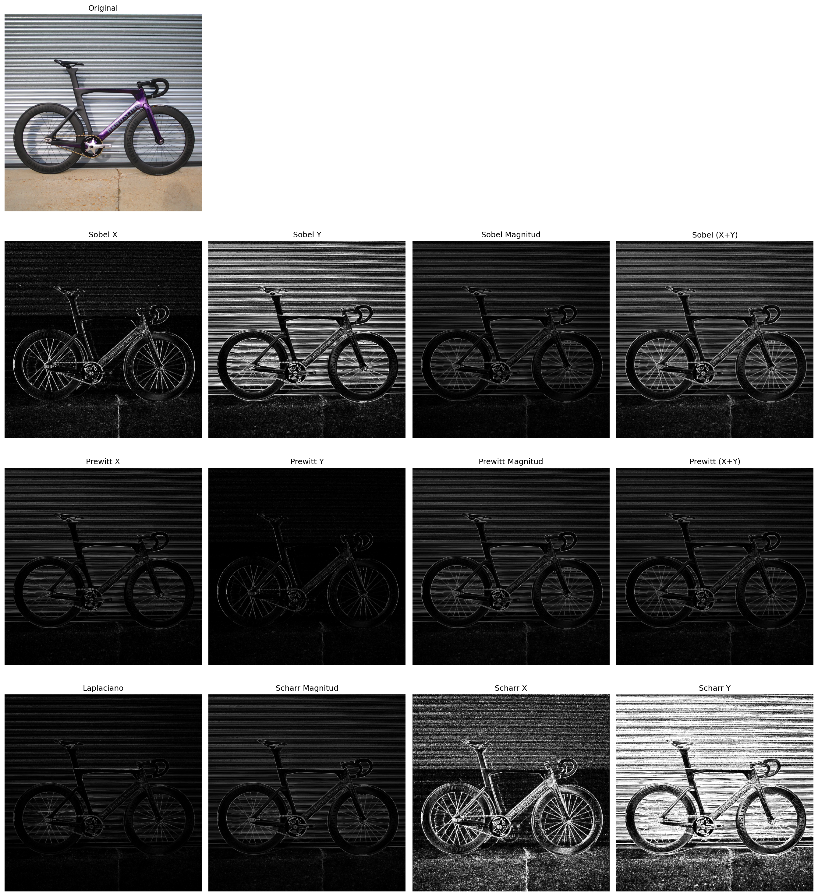

*Figura 1: Comparativa de todos los operadores de detección de bordes aplicados a `bike.jpg`. En la primera fila se muestra la imagen original. La segunda fila presenta Sobel en sus variantes X, Y, magnitud y combinación lineal. La tercera fila muestra Prewitt X, Y, magnitud y suma absoluta. La cuarta fila incluye Laplaciano, Scharr magnitud, Scharr X y Scharr Y. Se observa que Sobel y Scharr producen bordes más definidos que Prewitt, mientras que Laplaciano detecta bordes en todas las direcciones pero es más sensible al ruido.*

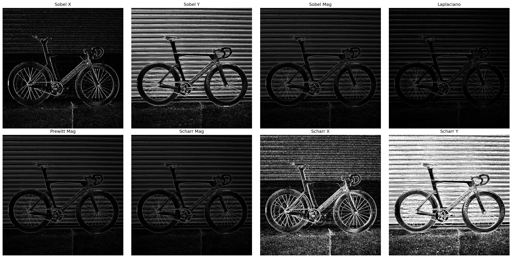

*Figura 2: Grid compacto con 8 resultados de detección de bordes: Sobel X, Sobel Y, Sobel magnitud, Laplaciano, Prewitt magnitud, Scharr magnitud, Scharr X y Scharr Y. Los operadores direccionales (Sobel X, Sobel Y) muestran bordes predominantemente en una orientación, mientras que las magnitudes combinan ambas direcciones.*

### Python - Detector Canny

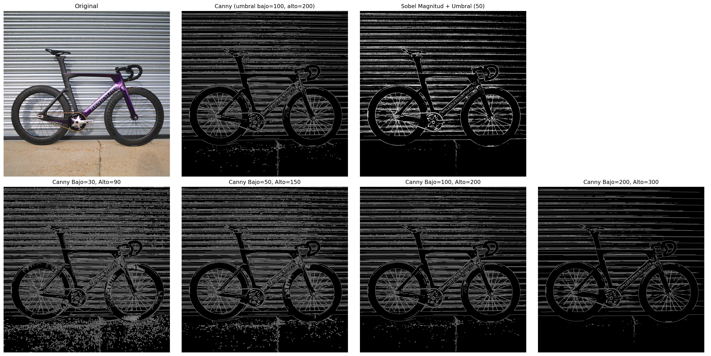

*Figura 3: Efecto de diferentes umbrales en el detector Canny. La primera fila muestra la imagen original, Canny con umbrales por defecto (100, 200) y Sobel magnitud umbralizada para comparación. La segunda fila muestra Canny con cuatro configuraciones de umbral: (30,90) produce muchos bordes incluyendo ruido; (50,150) ofrece un balance razonable; (100,200) es el valor por defecto; (200,300) es demasiado restrictivo y pierde bordes importantes.*

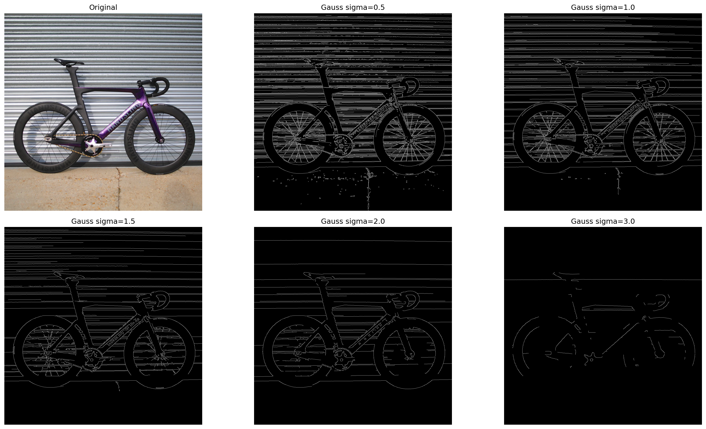

*Figura 4: Efecto del suavizado Gaussiano previo al detector Canny con diferentes valores de sigma. Sigma=0.5 produce bordes finos con algo de ruido; sigma=1.0-1.5 ofrece el mejor balance; sigma=2.0-3.0 suaviza en exceso perdiendo detalles finos.*

### Python - Detección de contornos

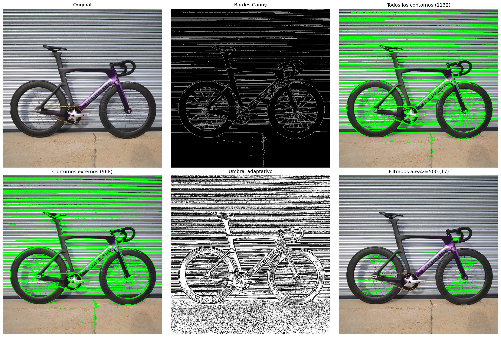

*Figura 5: Pipeline de detección de contornos. Se muestra la imagen original, los bordes obtenidos con Canny, todos los contornos encontrados con RETR_TREE (1132 contornos), los contornos externos con RETR_EXTERNAL (968 contornos), el umbral adaptativo y los contornos filtrados por área mínima de 500 píxeles (17 contornos). El filtrado por área reduce significativamente el número de contornos, eliminando el ruido pequeño.*

### Python - Aproximación de formas

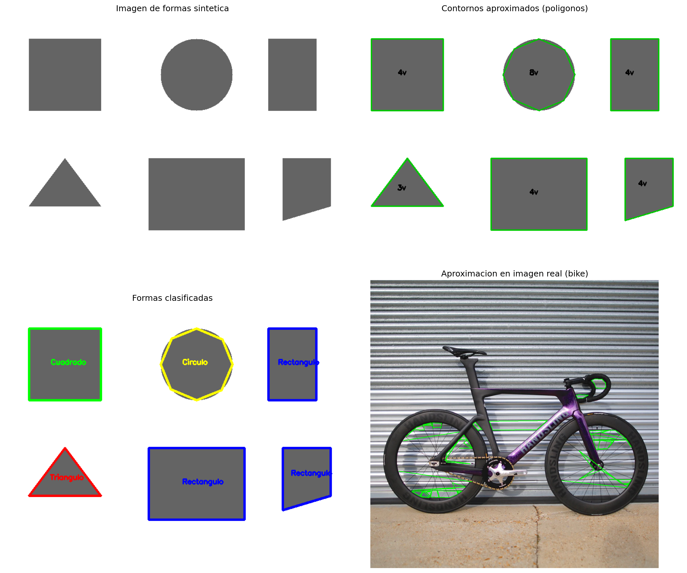

*Figura 6: Aproximación de formas mediante `cv2.approxPolyDP()`. La imagen sintética contiene 6 formas geométricas (rectángulo, cuadrado, triángulo, círculo, etc.). Se muestran los contornos aproximados con el número de vértices y la clasificación por tipo de forma (Rectángulo, Cuadrado, Triángulo, Círculo). La imagen real (bike) también se procesa mostrando las aproximaciones poligonales de los contornos detectados.*

### Python - Análisis de momentos

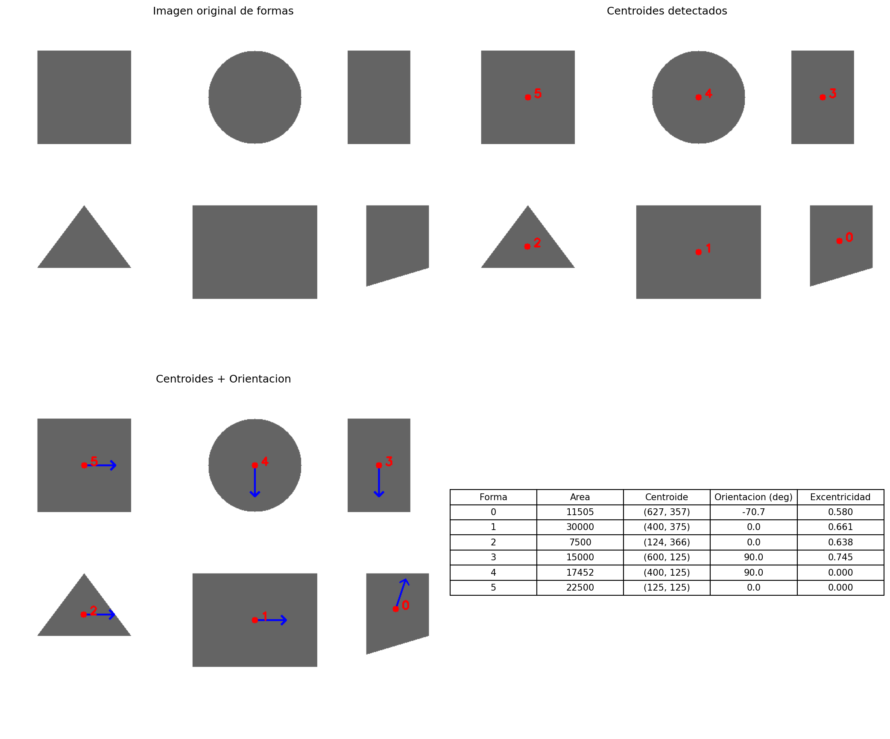

*Figura 7: Análisis de momentos geométricos sobre formas sintéticas. Se muestra la imagen original, los centroides detectados (puntos azules), la orientación de cada forma (flechas rojas) y una tabla resumen con área, centroide, orientación en grados y excentricidad. La excentricidad del círculo es 0 (perfectamente circular), mientras que las formas alargadas tienen excentricidad cercana a 1.*

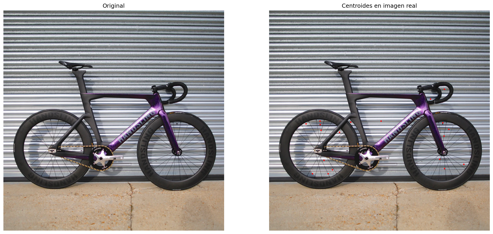

*Figura 8: Centroides detectados en la imagen real `bike.jpg`. Los puntos azules marcan el centro de masa de cada contorno con área mayor a 300 píxeles.*

### Python - Aplicación de inspección

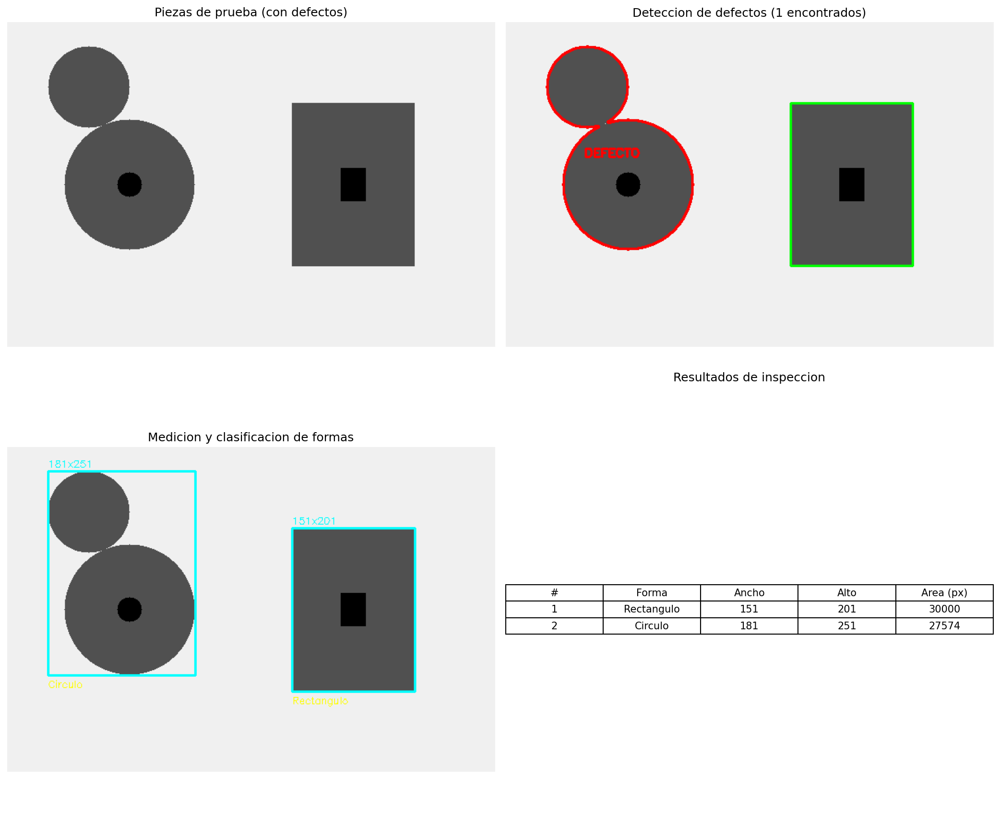

*Figura 9: Aplicación de control de calidad sobre piezas de prueba. Se detectan 2 objetos, de los cuales 1 presenta un defecto (marcado en rojo). La tabla muestra las dimensiones medidas con bounding boxes y la clasificación de forma. La detección de defectos utiliza el análisis de solidez: si la relación área del contorno / área del convex hull es menor a 0.9, se considera defectuoso.*

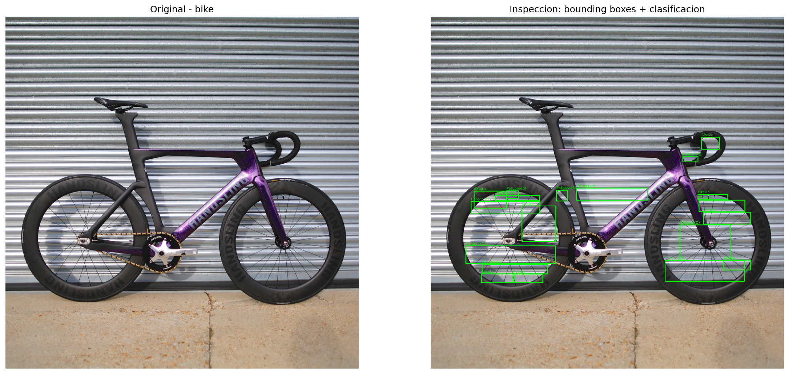

*Figura 10: Inspección aplicada a la imagen real `bike.jpg`. Se muestran bounding boxes verdes alrededor de cada objeto detectado con su clasificación de forma. Se identificaron 9 círculos, 2 rectángulos y varios polígonos.*

### Processing

Se hizo uso de la siguiente imagen de prueba:


La aplicación muestra una grilla con 16 resultados diferentes:

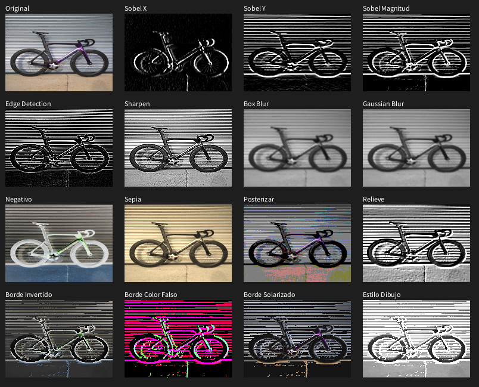

Los operadores Sobel detectan cambios abruptos de intensidad en direcciones horizontales y verticales:

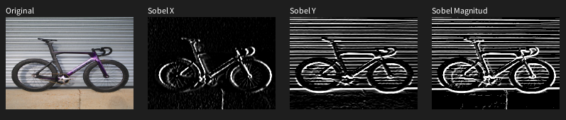

La segunda fila incluye detectores de bordes, sharpen, blur Gaussiano y blur de promedio:

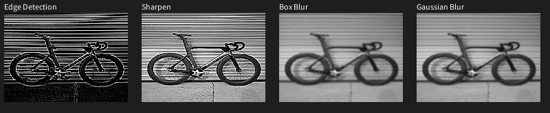

Filtros artísticos (negativo, sepia, posterizar, relieve):

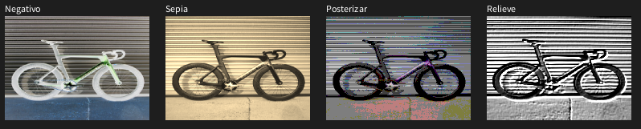

Efectos de bordes artísticos:

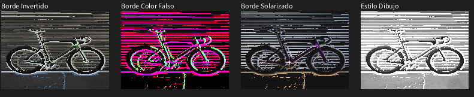

---

## Código relevante

### Python - Operadores Sobel, Prewitt, Laplaciano y Scharr

```python
# Operadores Sobel
sobel_x = cv2.Sobel(img_gray, cv2.CV_64F, 1, 0, ksize=3)
sobel_y = cv2.Sobel(img_gray, cv2.CV_64F, 0, 1, ksize=3)
sobel_mag = np.sqrt(sobel_x**2 + sobel_y**2)

# Prewitt (scikit-image)
prewitt_x = filters.prewitt_h(img_float)
prewitt_y = filters.prewitt_v(img_float)

# Laplaciano
laplacian = cv2.Laplacian(img_gray, cv2.CV_64F, ksize=3)

# Scharr (variante mejorada de Sobel)
scharr_x = cv2.Scharr(img_gray, cv2.CV_64F, 1, 0)
```

### Python - Detector de bordes Canny con suavizado Gaussiano

```python
for sigma in sigmas:
    ksize = int(2 * round(3 * sigma) + 1)
    blurred = cv2.GaussianBlur(img_gray, (ksize, ksize), sigma)
    canny = cv2.Canny(blurred, 100, 200)
```

### Python - Aproximación de contornos y clasificación de formas

```python
peri = cv2.arcLength(contour, True)
approx = cv2.approxPolyDP(contour, 0.02 * peri, True)
vertices = len(approx)
area = cv2.contourArea(contour)

if vertices == 3:
    shape = 'Triangulo'
elif vertices == 4:
    x, y, w, h = cv2.boundingRect(approx)
    aspect = w / float(h)
    shape = 'Cuadrado' if 0.9 <= aspect <= 1.1 else 'Rectangulo'
elif vertices > 6:
    shape = 'Circulo'
```

### Python - Cálculo de momentos, orientación y excentricidad

```python
M = cv2.moments(contour)
cx = int(M['m10'] / M['m00'])
cy = int(M['m01'] / M['m00'])

mu20 = M['mu20'] / area
mu02 = M['mu02'] / area
mu11 = M['mu11'] / area

theta = 0.5 * np.arctan2(2 * mu11, mu20 - mu02)

a = mu20 + mu02
b = np.sqrt(4 * mu11**2 + (mu20 - mu02)**2)
eccentricity = np.sqrt(1 - (a - b) / (a + b))
```

### Python - Detección de defectos por solidez

```python
hull = cv2.convexHull(contour)
hull_area = cv2.contourArea(hull)
solidity = area / hull_area
if solidity < 0.9:
    # El objeto tiene un defecto
    defectos.append(contour)
```

### Processing - Convolución con kernels personalizados

```java
PImage convolver(PImage origen, float[][] kernel) {
    int w = origen.width, h = origen.height;
    int kw = kernel.length, offset = kw / 2;
    PImage resultado = createImage(w, h, RGB);
    origen.loadPixels();
    resultado.loadPixels();
    for (int py = 0; py < h; py++) {
        for (int px = 0; px < w; px++) {
            float sum = 0;
            for (int ky = 0; ky < kw; ky++) {
                for (int kx = 0; kx < kw; kx++) {
                    int imgX = constrain(px + kx - offset, 0, w-1);
                    int imgY = constrain(py + ky - offset, 0, h-1);
                    sum += green(origen.pixels[imgY * w + imgX]) * kernel[ky][kx];
                }
            }
            resultado.pixels[py * w + px] = color(constrain(sum, 0, 255));
        }
    }
    resultado.updatePixels();
    return resultado;
}
```

---

## Prompts utilizados

- "Generate a Python script using OpenCV to apply Sobel, Prewitt, Laplacian and Scharr edge detectors and display them in a matplotlib figure grid"
- "Implement Canny edge detection in Python with threshold experiments and Gaussian blur parameter analysis"
- "Create a Python script for contour detection using cv2.findContours with hierarchy analysis and area filtering"
- "Implement shape approximation with cv2.approxPolyDP and classify geometric shapes by vertex count in Python"
- "Generate a Python script for moment analysis with centroid, orientation and eccentricity calculation using cv2.moments"
- "Create an inspection application in Python that detects defects using convex hull solidity and measures object dimensions"
- "Genera un Script en processing (.pde) que use kernels personalizados para aplicar multiples tipos de filtros a una imagen de prueba"

---

## Aprendizajes y dificultades

### Aprendizajes

Este taller permitió comprender en profundidad cómo funcionan los operadores de gradiente para detección de bordes. Se aprendió que Sobel y Scharr son operadores de primer orden que calculan la derivada espacial de la intensidad, mientras que el Laplaciano es de segundo orden y responde a cambios abruptos en cualquier dirección. El detector Canny demostró ser superior al incorporar supresión no máxima y doble umbralizado, produciendo bordes más limpios y delgados.

En el análisis de contornos, se comprendió la importancia de la jerarquía de contornos (RETR_TREE vs RETR_EXTERNAL) y cómo el filtrado por área elimina el ruido. La aproximación de polígonos con `approxPolyDP` resultó ser una herramienta poderosa para simplificar contornos y clasificar formas geométricas. El cálculo de momentos permitió extraer características cuantitativas como centroide, orientación y excentricidad, útiles para aplicaciones de inspección industrial.

### Dificultades

La principal dificultad fue comprender la diferencia entre los distintos modos de jerarquía de contornos en OpenCV (RETR_TREE, RETR_EXTERNAL, RETR_LIST) y cómo interpretar el array de jerarquía devuelto por `cv2.findContours()`. También fue desafiante ajustar los parámetros de Canny (umbrales bajo/alto y sigma del Gaussiano) para obtener resultados óptimos en diferentes tipos de imágenes. La detección de defectos mediante solidez requirió experimentación con el umbral de decisión para distinguir correctamente entre piezas buenas y defectuosas.

### Mejoras futuras

Para futuros proyectos, se podría implementar una interfaz interactiva con sliders para ajustar en tiempo real los parámetros de Canny y los umbrales de detección. También sería interesante incorporar técnicas de deep learning (como redes neuronales convolucionales) para la clasificación de formas y detección de defectos, así como implementar un sistema de medición de objetos con referencia de escala conocida.

---

## Contribuciones grupales

Todos los integrantes del grupo colaboraron en todas las etapas del desarrollo del taller, incluyendo la implementación en Python y Processing, la generación de resultados visuales y la documentación. A continuación se destacan las fortalezas particulares de cada miembro:

- **Juan David Buitrago Salazar**: Se enfocó en la implementación de los operadores de borde (Sobel, Prewitt, Laplaciano, Scharr) y el detector Canny en Python, así como en la depuración de los parámetros de umbralizado.
- **Juan David Cardenas Galvis**: Trabajó en los scripts de detección y aproximación de contornos, especialmente en la clasificación de formas geométricas y el análisis de momentos.
- **Nicolás Rodríguez Piraban**: Desarrolló la aplicación de inspección de calidad con detección de defectos y contribuyó a la generación de imágenes sintéticas de prueba.
- **Camilo Andres Medina Sanchez**: Implementó el sketch en Processing con los 16 efectos visuales y los kernels de convolución personalizados.
- **Juan Felipe Fajardo Garzón**: Se encargó de la integración de resultados, la generación de las figuras comparativas y la redacción de la documentación técnica en el README.

---

## Estructura del proyecto

```
semana_10_4_deteccion_bordes_contornos/
├── python/
│   ├── .venv/
│   ├── 01_edge_operators.py
│   ├── 02_canny_detector.py
│   ├── 03_contour_detection.py
│   ├── 04_shape_approximation.py
│   ├── 05_moment_analysis.py
│   ├── 06_inspection_application.py
│   ├── utils.py
│   └── requirements.txt
├── processing/
│   └── filtros_imagen_pde/
├── media/
│   ├── python/
│   │   ├── 01_edge_operators_comparison.png
│   │   ├── 01_edge_operators_grid.png
│   │   ├── 02_canny_thresholds.png
│   │   ├── 02_canny_gaussian_sigma.png
│   │   ├── 03_contour_detection.png
│   │   ├── 04_shape_approximation.png
│   │   ├── 05_moment_analysis.png
│   │   ├── 05_moment_analysis_bike.png
│   │   ├── 06_inspection_defects.png
│   │   └── 06_inspection_bike.png
│   ├── art_border_bike.png
│   ├── bike.jpg
│   ├── color_filters_bike.png
│   ├── complete_grid_bike.png
│   ├── miscellaneous_processing_bike.png
│   └── sobel_bike.png
└── README.md
```

---

## Referencias

- Documentación oficial de OpenCV: https://docs.opencv.org/
- Documentación de scikit-image: https://scikit-image.org/
- Documentación de matplotlib: https://matplotlib.org/
- Canny, J. (1986). "A Computational Approach to Edge Detection". IEEE Transactions on Pattern Analysis and Machine Intelligence, 8(6), 679-698.
- Sobel, I. & Feldman, G. (1968). "A 3x3 Isotropic Gradient Operator for Image Processing". Stanford Artificial Intelligence Project.
- Processing Foundation: https://processing.org/
