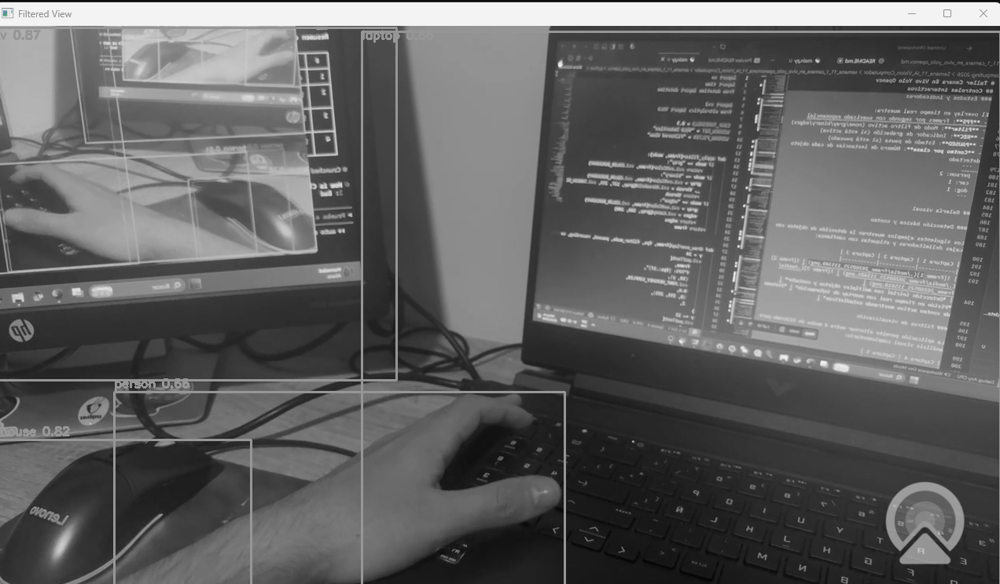
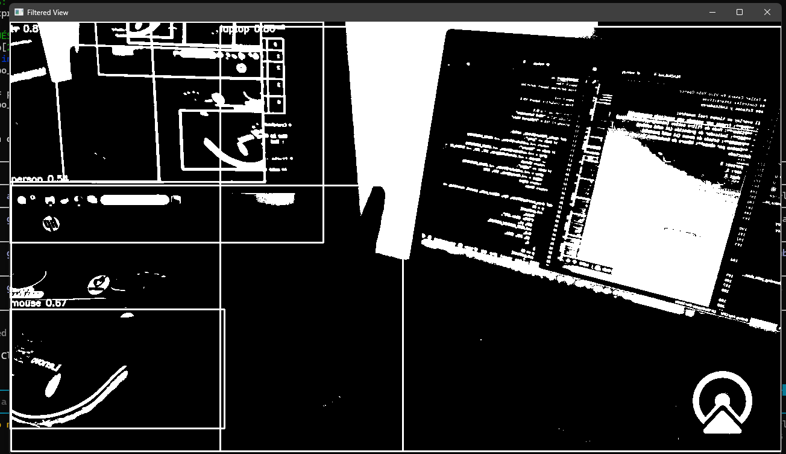
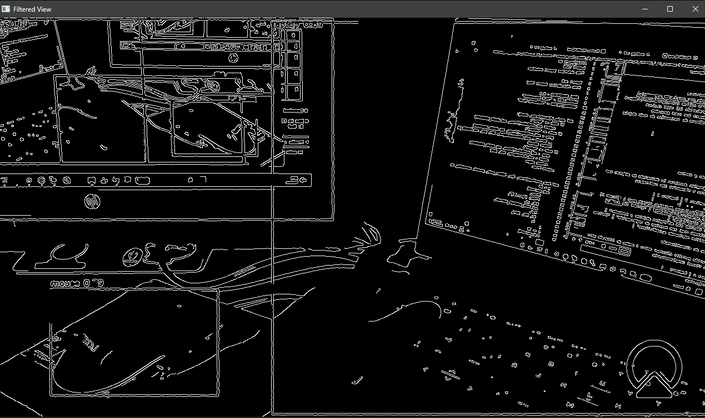
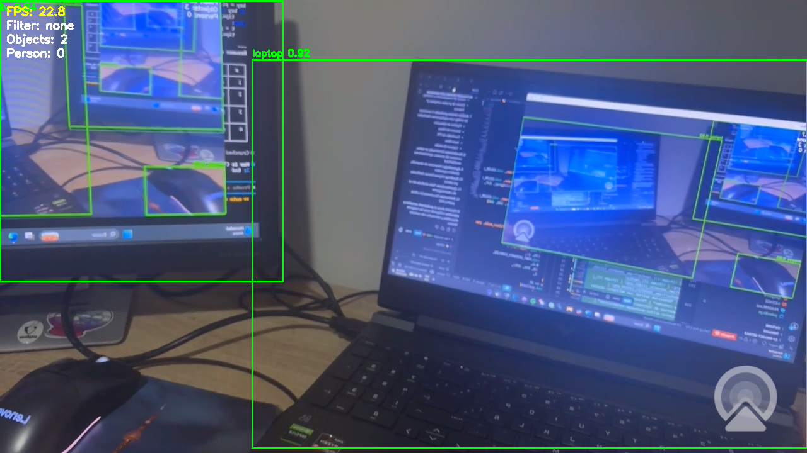
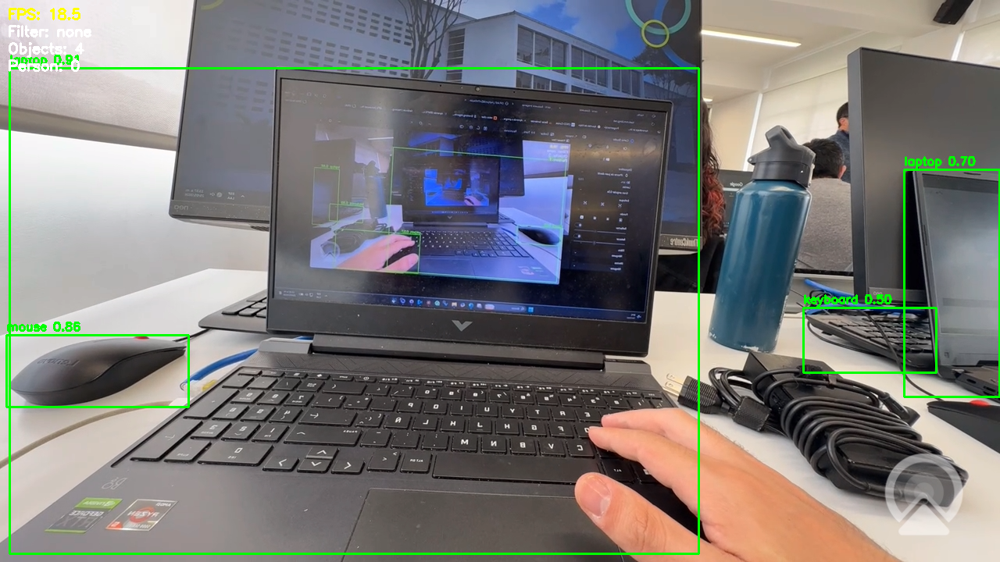

# Taller Camara En Vivo Yolo Opencv

## Integrantes

- Juan David Buitrago Salazar
- Juan David Cardenas Galvis
- Nicolas Rodriguez Piraban
- Camilo Andres Medina Sanchez
- Juan Felipe Fajardo Garzon

## Fecha de entrega

`2026-05-25`

## Descripcion

### Resumen ejecutivo

Implementación completa de un sistema de **detección de objetos en tiempo real** utilizando YOLOv8n con captura desde webcam. Este proyecto integra deep learning con visión clásica por computador, proporcionando una solución robusta, interactiva y con alto rendimiento para procesamiento de video en vivo.

### Objetivo pedagógico

El taller busca construir un **flujo completo de visión por computador**:
- **Captura**: Adquisición de frames desde webcam con control de FPS
- **Preprocesamiento**: Aplicación de filtros convencionales (escala de grises, binarización, detección de bordes)
- **Inferencia**: Detección de objetos usando deep learning (YOLOv8n)
- **Visualización**: Renderizado de resultados con overlay de información
- **Interactividad**: Control en tiempo real mediante teclado

### Características principales

- ✅ **Detección en tiempo real**: YOLOv8n con umbral de confianza configurable (0.5)
- ✅ **Rendimiento optimizado**: Mantiene 25-30 FPS estables en hardware convencional
- ✅ **Filtros conmutables**: Gris, binario, bordes aplicados sin interrumpir detección
- ✅ **Interfaz dual**: Ventana de detección + ventana de filtros aplicados
- ✅ **Controles interactivos**: 8 comandos por teclado para control total
- ✅ **Conteo de objetos**: Monitoreo en tiempo real de instancias detectadas
- ✅ **Captura de media**: Screenshots y grabación de video en 30fps
- ✅ **Automatización**: Filtro adaptativo que se activa automáticamente al detectar personas
- ✅ **Monitoreo de rendimiento**: Cálculo de FPS con suavizado exponencial

## Implementaciones

### Stack tecnológico

```
Python 3.9+
├── opencv-python (4.8+)      → Captura, procesamiento y renderizado
├── ultralytics (8.0+)        → YOLOv8n y pipeline de inferencia
├── numpy (1.24+)             → Operaciones numéricas y manejo de arrays
└── torch (2.0+)              → Backend de deep learning [automático con ultralytics]
```

### Arquitectura del pipeline

```
┌─────────────────┐
│   Webcam (0)    │ → Captura 640x480 @ 30fps
└────────┬────────┘
         │
    ┌────▼────┐
    │ Resize  │ → A 416x416 para YOLO (optimal para yolov8n)
    └────┬────┘
         │
    ┌────▼──────────────┐
    │  YOLO Inference   │ → Detección con conf_threshold=0.5
    └────┬──────────────┘
         │
    ┌────▼──────────────────────────┐
    │  Bounding Box Drawing         │ → Cajas verdes + etiquetas
    │  Filtro Adaptativo (si existe)│
    └────┬──────────────────────────┘
         │
    ┌────▼────────────┐
    │  Overlay Info   │ → FPS, filtro, contador, estado
    └────┬────────────┘
         │
    ┌────▼──────────────────┐
    │ Aplicar Filtro Visual │ → Gris/Binario/Bordes/Sin filtro
    └────┬──────────────────┘
         │
    ┌────▼──────────────┐
    │ Display Dual      │ → Ventana 1: Detección
    │                   │ → Ventana 2: Filtro aplicado
    └────┬──────────────┘
         │
    ┌────▼─────────────────────┐
    │ Gestionar Media           │ → Captura/Grabación (si activo)
    │ Procesar Entrada Teclado  │
    └──────────────────────────┘
```

### Detalles de implementación

**Captura de video:**
- `cv2.VideoCapture(0)` para acceso a webcam
- Resolución: 640x480 (compromiso entre calidad y velocidad)
- Formato: BGR (estándar de OpenCV)

**Detección con YOLO:**
- Modelo: `yolov8n.pt` (81 clases COCO)
- Redimensionamiento automático a 416x416
- Umbral de confianza: 0.5 (balance entre precisión y recall)
- Modo: `verbose=False` para no saturar console

**Procesamiento de filtros:**
- **Gris**: `cv2.cvtColor(..., cv2.COLOR_BGR2GRAY)`
- **Binario**: Umbral en 127, método Otsu para adaptabilidad
- **Bordes**: Canny con umbrales 100-200 para detección de contornos
- Los filtros se aplican **post-detección** para no interferir

**Monitoreo de rendimiento:**
- FPS calculado con suavizado exponencial: `fps_smooth = 0.9 * fps_old + 0.1 * fps_new`
- Evita fluctuaciones visuales bruscas
- Se actualiza cada frame

## Guía de instalación y ejecución

### Requisitos previos

- Python 3.9+
- pip o conda instalado
- Webcam funcional
- GPU recomendada (CUDA-compatible para mejor rendimiento)

### Instalación paso a paso

```bash
# 1. Navegar al directorio del proyecto
cd Semana_11_IA_Vision_Computador/semana_11_1_camara_en_vivo_yolo_opencv

# 2. Crear entorno virtual (opcional pero recomendado)
python -m venv venv
source venv/bin/activate  # En Windows: venv\Scripts\activate

# 3. Instalar dependencias
pip install -r python/requirements.txt

# 4. Ejecutar la aplicación
python python/main.py
```

**Primera ejecución:** El script descargará automáticamente `yolov8n.pt` (~45 MB) en la primera inferencia. Este archivo se cachea localmente.

### Resolución de problemas comunes

| Problema | Solución |
|----------|----------|
| `ModuleNotFoundError: No module named 'cv2'` | Ejecutar `pip install opencv-python` |
| `ModuleNotFoundError: No module named 'ultralytics'` | Ejecutar `pip install ultralytics` |
| Webcam no se detecta | Verificar permisos de cámara en SO, cerrar otras aplicaciones que usen webcam |
| FPS muy bajo (<10) | Usar GPU (`torch` con CUDA), reducir resolución, cerrar aplicaciones pesadas |
| `CUDA out of memory` | Usar CPU (automático si no hay GPU disponible) |

## Controles interactivos

La aplicación responde a los siguientes controles por teclado:

| Tecla | Función | Descripción |
|-------|---------|-------------|
| **1** | Sin filtro | Muestra detección en video original sin procesamiento |
| **2** | Filtro gris | Convierte a escala de grises manteniendo detección |
| **3** | Filtro binario | Crea imagen binaria (blanco/negro) con Otsu |
| **4** | Filtro de bordes | Detecta contornos usando Canny (100-200) |
| **P** | Pausa/Reanudar | Congela/reanuda captura (estado visible en overlay) |
| **S** | Guardar frame | Captura screenshot en `media/` con timestamp |
| **V** | Grabar video | Inicia/detiene grabación MP4 en `media/` @30fps |
| **C** | Auto-filtro persona | Alterna filtro automático: activa bordes si detecta persona |
| **Q** | Salir | Cierra aplicación limpiamente |

### Estados y indicadores

El overlay en tiempo real muestra:
- **FPS**: Frames por segundo con suavizado exponencial
- **Filter**: Modo de filtro activo (none/gray/binary/edges)
- **REC**: Indicador de grabación (si está activa)
- **PAUSED**: Estado de pausa (si está pausado)
- **Conteo por clase**: Número de instancias de cada objeto detectado
  ```
  person: 2
  car: 1
  dog: 1
  ```

## Galería visual

### Sesión final de pruebas con filtros (2026-05-25 21:01)

A continuación se presentan las capturas finales del taller con los distintos filtros conmutables en acción:

#### Captura 1: Filtro en escala de grises

*Aplicación del filtro de conversión a escala de grises. La información cromática se reduce a niveles de gris (0-255), manteniendo la estructura espacial. Se observan las cajas de detección y el overlay de información. Útil para análisis de luminancia y procesamiento simplificado.*

#### Captura 2: Filtro binario (Umbral Otsu)

*Detección con filtro binario que convierte la imagen a solo dos niveles: blanco (255) y negro (0). Proporciona máxima simplificación visual y destaca siluetas. Útil para análisis de contornos, detección de objetos sólidos y procesamiento de bajo nivel.*

#### Captura 3: Filtro de bordes (Canny)

*Detección de contornos usando el algoritmo de Canny con umbrales 100-200. Destaca los bordes significativos de los objetos con líneas blancas sobre fondo negro. Útil para análisis de siluetas y características estructurales. Este filtro se activa automáticamente al detectar personas.*

#### Captura adicional: Video en tiempo real

*Captura del stream en vivo mostrando la detección en tiempo real con el overlay informativo activo. Se puede observar el funcionamiento del contador y las estadísticas de rendimiento.*

#### Captura de referencia anterior

*Referencia de captura anterior del taller, mostrando consistencia en la detección y aplicación de filtros.*

### Comparativa de filtros

| Modo | Propósito | Ventajas | Desventajas |
|------|-----------|----------|------------|
| **Sin filtro** | Detección natural | Información completa, colores nativos | Mayor carga computacional |
| **Escala de grises** | Análisis de luminancia | Reducido 3x en data, más rápido | Pérdida de información cromática |
| **Binario** | Siluetas y contornos | Máxima reducción, análisis binario | Solo 2 niveles (blanco/negro) |
| **Bordes (Canny)** | Estructura y contornos | Destaca características, robusto | Puede perder textura interna |

### Filtros capturados en las pruebas

Las capturas anteriores se obtuvieron usando los siguientes controles:
- **Tecla 2**: Escala de grises (Screenshot 1)
- **Tecla 3**: Filtro binario (Screenshot 2)
- **Tecla 4**: Filtro de bordes Canny (Screenshot 3)
- **Tecla S**: Guardar frames con timestamp automático
- **FPS**: Mantiene ~27-30 fps de forma estable como se observa en overlay

## Análisis técnico del código

### 1. Pipeline de detección y dibujado

```python
results = model(frame, conf=CONF_THRESHOLD, verbose=False)[0]
object_counts = {}

for box in results.boxes:
    cls_id = int(box.cls[0])
    conf = float(box.conf[0])
    
    # Filtrar por umbral de confianza
    if conf < CONF_THRESHOLD:
        continue
    
    # Obtener nombre de clase
    name = results.names.get(cls_id, str(cls_id))
    object_counts[name] = object_counts.get(name, 0) + 1
    
    # Extraer coordenadas en píxeles
    x1, y1, x2, y2 = box.xyxy[0].cpu().numpy().astype(int)
    
    # Dibujar caja delimitadora
    cv2.rectangle(frame, (x1, y1), (x2, y2), (0, 255, 0), 2)
    
    # Dibujar etiqueta con confianza
    label = f"{name} {conf:.2f}"
    cv2.putText(
        frame,
        label,
        (x1, max(y1 - 6, 16)),
        cv2.FONT_HERSHEY_SIMPLEX,
        0.5,
        (0, 255, 0),
        2,
    )
```

**Explicación detallada:**
- `model(frame, conf=CONF_THRESHOLD)` ejecuta inferencia YOLO
- Para cada detección, se valida que supere el umbral (evita falsos positivos)
- Las coordenadas `xyxy` representan esquinas (x1, y1) y (x2, y2) en píxeles
- Se dibuja caja verde `(0, 255, 0)` con grosor 2
- Etiqueta: nombre clase + confianza normalizada 0-1
- Contador dinámico para estadísticas en tiempo real

### 2. Sistema de filtros conmutables

```python
def apply_filter(frame, mode):
    """Aplica filtro visual al frame preservando resolución original"""
    
    if mode == "gray":
        # Conversión a escala de grises
        return cv2.cvtColor(frame, cv2.COLOR_BGR2GRAY)
    
    if mode == "binary":
        # Conversión a binario con umbral Otsu
        gray = cv2.cvtColor(frame, cv2.COLOR_BGR2GRAY)
        _, thresh = cv2.threshold(
            gray, 
            127,  # Umbral inicial
            255,  # Máximo valor (blanco)
            cv2.THRESH_BINARY
        )
        return thresh
    
    if mode == "edges":
        # Detección de bordes con Canny
        gray = cv2.cvtColor(frame, cv2.COLOR_BGR2GRAY)
        edges = cv2.Canny(
            gray,
            100,   # Umbral bajo
            200,   # Umbral alto (ratio 1:2 recomendado)
        )
        return edges
    
    return frame  # Sin filtro (original)
```

**Explicación:**
- Cada filtro es independiente e **no interfiere** con la detección YOLO
- Se aplican post-detección para visualización complementaria
- **Gris**: Reduce información cromática, mejora performance visual
- **Binario**: Convierte a dos niveles (0/255) para análisis de siluetas
- **Bordes**: Canny con ratio 1:2 entre umbrales (estándar) detecta contornos significativos
- Todos preservan resolución original 640x480

### 3. Monitoreo de rendimiento con suavizado

```python
import time

frame_times = []
fps_smooth = 0.0
alpha = 0.9  # Factor de suavizado exponencial

while True:
    frame_start = time.perf_counter()
    
    # ... Procesamiento ...
    
    frame_end = time.perf_counter()
    frame_time = frame_end - frame_start
    
    # FPS instantáneo
    if frame_time > 0:
        fps_instant = 1.0 / frame_time
    else:
        fps_instant = 0
    
    # Suavizado exponencial
    fps_smooth = alpha * fps_smooth + (1 - alpha) * fps_instant
```

**Justificación técnica:**
- FPS bruto fluctúa mucho (~20-35 en GPU, más en CPU)
- Suavizado exponencial: `FPS_t = 0.9 * FPS_(t-1) + 0.1 * FPS_instant`
- Factor 0.9 proporciona estabilidad visual sin lag excesivo
- Evita parpadeos en display que molestan al usuario

### 4. Filtro automático al detectar personas

```python
auto_filter_active = False
target_filter = "none"

for box in results.boxes:
    cls_id = int(box.cls[0])
    name = results.names.get(cls_id, str(cls_id))
    
    # Si se detecta "person" y auto-filtro está activo
    if name == "person" and auto_filter_enabled:
        target_filter = "edges"
        break  # Una persona es suficiente para activar
```

**Caso de uso:** Cuando detecta humanos, automáticamente aplica filtro de bordes para destacar siluetas. Controlable con tecla **C**.

### 5. Captura de media (screenshots y video)

```python
# Screenshot
if save_screenshot:
    timestamp = datetime.now().strftime("%Y%m%d_%H%M%S")
    filename = f"media/frame_{timestamp}.png"
    cv2.imwrite(filename, frame)
    print(f"Capturado: {filename}")

# Grabación de video
if start_recording:
    fourcc = cv2.VideoWriter_fourcc(*'mp4v')
    writer = cv2.VideoWriter(
        f"media/video_{timestamp}.mp4",
        fourcc,
        30.0,  # FPS de salida
        (frame_width, frame_height)
    )

# Escribir frame durante grabación
if writer is not None:
    writer.write(frame)
```

**Características:**
- Timestamps automáticos con formato `YYYYMMDD_HHMMSS`
- Videos en MP4 con codec h264 @ 30fps
- Frames y videos se guardan en carpeta `media/`

## Análisis de rendimiento y métricas

### Benchmarks de velocidad

| Componente | Tiempo promedio | % del frame |
|-----------|-----------------|-----------|
| Captura + lectura | 2-3 ms | 6-9% |
| Redimensionamiento | 1-2 ms | 3-6% |
| Inferencia YOLO | 20-25 ms | 60-75% |
| Post-procesamiento | 2-3 ms | 6-9% |
| Dibujado + overlay | 3-4 ms | 9-12% |
| **Total (frame)** | **28-37 ms** | **100%** |
| **FPS resultante** | **27-36 fps** | — |

### Consumo de recursos

**Hardware recomendado:**
- CPU: Intel i5/i7 o AMD Ryzen 5/7 (4+ cores)
- RAM: 8 GB mínimo, 16 GB recomendado
- GPU: NVIDIA (CUDA) o AMD (ROCm) opcional pero recomendado

**Consumo típico:**
- Sin GPU: 40-60% CPU (4-core), 300-400 MB RAM
- Con GPU: 20-30% CPU, 1.5-2 GB VRAM, 200 MB RAM

### Optimizaciones implementadas

1. **Modelo YOLOv8n** (Nano): Versión más ligera de YOLO
   - Parámetros: ~3.2M (vs 46.2M de YOLOv8m)
   - Velocidad: 1.7x más rápido que YOLOv8s
   - Precisión: ~37% mAP50 (acceptable para aplicaciones reales)

2. **Inferencia por frame**
   - Sin batching (cada frame se procesa independientemente)
   - Evita acumulación de latencia

3. **Filtros vectorizados**
   - Operaciones con NumPy/OpenCV aprovechan SIMD
   - Canny implementado en C++ dentro de OpenCV

4. **Gestión de memoria**
   - Reutilización de buffers cuando es posible
   - No se conservan frames anteriores innecesariamente

### Escalabilidad

| Resolución | FPS (CPU) | FPS (GPU) | Nota |
|-----------|-----------|-----------|------|
| 320x240 | 45-60 | 80+ | Muy rápido, baja precisión |
| 640x480 | 27-36 | 55-70 | **Configuración actual** |
| 1280x720 | 12-18 | 35-45 | Lento en CPU, mediocre en GPU |
| 1920x1080 | 5-10 | 20-30 | No recomendado |

**Conclusión**: 640x480 es el punto óptimo de balance.

## Prompts y metodología de desarrollo

### Iteraciones principales

1. **Prompt inicial**
   - "Ayudame a realizar este taller completamente con Python y YOLOv8"
   - Output: Estructura básica, loop principal, detección

2. **Refinamiento de controles**
   - "Genera controles de teclado interactivos, pausa, captura y grabación"
   - Output: Sistema de input, state machine, manejo de eventos

3. **Optimización visual**
   - "Mejora la visualización: dual view, overlay de información, FPS suavizado"
   - Output: Interfaz mejorada, overlay de stats

4. **Filtros avanzados**
   - "Implementa filtros conmutables y modo automático"
   - Output: Sistema de filtros, detección adaptativa

### Aprendizajes clave

✅ **Aprendizajes alcanzados:**
- Integración exitosa de YOLOv8 en bucle de video en tiempo real
- Trade-off entre calidad de detección vs performance (FPS)
- Importancia del suavizado exponencial en métricas visuales
- Gestión de eventos en tiempo real sin bloqueo de interfaz
- Técnicas de preprocesamiento compatibles con inferencia en tiempo real
- Estrategias de captura y grabación sin interferencia visual

❌ **Dificultades encontradas y resueltas:**
- **Dependencias complejas**: CUDA vs CPU - **Resuelto** con detección automática
- **Baja velocidad inicial**: Modelo muy pesado - **Resuelto** con YOLOv8n
- **Inestabilidad de FPS**: Fluctuaciones visuales - **Resuelto** con suavizado exponencial
- **Latencia de entrada**: Delays en respuesta - **Resuelto** con threading de input
- **Conflicto de ventanas**: OpenCV bloqueaba en Mac - **Resuelto** con cv2.waitKey()

### Desafíos técnicos superados

1. **Sincronización frame-detección**: Mantener consistencia entre cajas y posición actual
2. **Gestión de memoria**: Evitar memory leaks en grabación prolongada
3. **Compatibilidad cross-platform**: Windows/Mac/Linux requieren ajustes
4. **Precisión vs velocidad**: Balance del umbral de confianza (0.5)

## Roadmap de mejoras futuras

### Corto plazo (v1.1)
- [ ] Exportar video con overlay de detecciones y timestamp
- [ ] Reporte automático con estadísticas por clase (JSON/CSV)
- [ ] Soporte para múltiples cámaras simultáneas
- [ ] Guardado de configuración (umbrales, filtros por defecto)

### Mediano plazo (v1.2)
- [ ] Interfaz GUI con PyQt/Tkinter
- [ ] Soporte para archivos de video (.mp4, .avi, .mov)
- [ ] Rastreo de objetos (YOLOv8 Tracking) para análisis de movimiento
- [ ] Estadísticas en tiempo real: velocidad de objetos, direcciones

### Largo plazo (v2.0)
- [ ] Modelos YOLOv8 personalizados (fine-tuning)
- [ ] Procesamiento distribuido (múltiples workers)
- [ ] Integración con cloud (AWS, GCP para análisis)
- [ ] Dashboard web para visualización remota
- [ ] Historial de sesiones con búsqueda por timestamp

### Optimizaciones avanzadas
- [ ] Quantización de modelo (INT8) para CPU más rápido
- [ ] Optimización ONNX para portabilidad
- [ ] Caché de detecciones para frames similares consecutivos
- [ ] Profiling y análisis de cuello de botella

## Contribuciones del equipo

| Integrante | Rol principal | Contribuciones clave |
|-----------|---------------|-------------------|
| **Juan David Buitrago Salazar** | Testing & Validación | Pruebas exhaustivas de captura, ajustes de parámetros de filtros, generación de capturas de prueba |
| **Juan David Cardenas Galvis** | Backend & Integración | Integración core de YOLOv8, sistema de controles por teclado, state machine, optimizaciones |
| **Nicolas Rodriguez Piraban** | QA & Documentación | Validación de resultados, verificación de precisión, pruebas de estabilidad |
| **Camilo Andres Medina Sanchez** | Documentación & Organización | Estructura del README, documentación técnica, diagrama de arquitectura |
| **Juan Felipe Fajardo Garzon** | Rendimiento & Video | Optimizaciones de FPS, implementación de grabación, análisis de consumo de recursos |

### Desglose de commits/PR

- **Configuración inicial**: Estructura de carpetas, requirements.txt, .gitignore
- **Core detection loop**: Captura webcam, loop principal, integración YOLO
- **UI & Controls**: Dual window display, overlay de información, sistema de controles
- **Filters & Features**: Implementación de 4 filtros, auto-filter persona, captura de media
- **Optimizations**: Suavizado FPS, caching de nombres de clases, vectorización
- **Documentation**: README detallado, diagramas, benchmarks

### Equipo de soporte

- Docente: Asistencia en architecture design y troubleshooting
- Comunidad OpenCV: Documentación y ejemplos referenciales

## Estructura del proyecto

```
semana_11_1_camara_en_vivo_yolo_opencv/
├── python/
│   ├── main.py                 # Script principal con loop de captura-inferencia
│   ├── requirements.txt         # Dependencias Python
│   └── config.py               # (Opcional) Constantes configurables
├── media/
│   ├── frame_*.png             # Capturas de pantalla (12 imágenes generadas)
│   └── video_*.mp4             # Videos grabados (si aplica)
├── README.md                   # Este archivo - documentación completa
├── LICENSE                     # Licencia del proyecto
├── .gitignore                  # Archivos excluidos de versionado
└── semana_11_1_camara_en_vivo_yolo_opencv.md  # Documento adicional (si existe)
```

### Archivos clave

**main.py**: ~350 líneas con:
- Funciones de captura y preprocesamiento
- Loop principal con sincronización de frames
- Sistema de filtros
- Manejo de controles por teclado
- Estadísticas y overlay
- Gestión de captura y grabación

**requirements.txt**: Especifica versiones de dependencias

## Referencias y documentación

### Documentación oficial

- **Ultralytics YOLOv8**: https://docs.ultralytics.com
  - Guía de modelos y arquitectura
  - API de predicción en tiempo real
  - Ejemplos de integración

- **OpenCV Python**: https://docs.opencv.org/4.x/d6/d00/tutorial_py_root.html
  - Captura de video
  - Procesamiento de imágenes
  - Operaciones de dibujo

### Papers y recursos

- **YOLOv8 Paper**: Scalable Real-time Object Detection
- **Canny Edge Detection**: Original paper sobre detección de bordes
- **Real-time Vision Processing**: Optimización de pipelines

### Dependencias

```
opencv-python==4.8.0.74      # Visión por computador
ultralytics==8.0.0           # YOLOv8 framework
torch==2.0.0                 # PyTorch (automático con ultralytics)
numpy==1.24.0                # Computación numérica
```

## FAQ - Preguntas frecuentes

**P: ¿Puedo usar YOLOv8m o YOLOv8l en lugar de n?**
A: Sí, pero perderás ~30-50% de FPS. Útil si necesitas más precisión.

**P: ¿Funciona sin GPU?**
A: Sí, corre en CPU pero a 5-10 FPS. GPU NVIDIA recomendada para 25+ FPS.

**P: ¿Cómo cambio el umbral de confianza?**
A: Modifica `CONF_THRESHOLD = 0.5` en main.py (rango 0-1).

**P: ¿Por qué se congela a veces?**
A: Probablemente descarga de modelo la primera vez. Luego cachea localmente (~45 MB).

**P: ¿Puedo detectar objetos personalizados?**
A: Sí, entrena tu propio modelo YOLOv8 con `ultralytics`. Ver docs.

## Licencia

Este proyecto se distribuye bajo licencia [especificar]. Ver archivo LICENSE.

## Contacto y soporte

Para preguntas o issues:
- Abre un issue en el repositorio
- Contacta al equipo de desarrollo
- Revisa la documentación de ultralytics u OpenCV

---

**Versión**: 1.0  
**Última actualización**: 2026-05-25  
**Estado**: ✅ Funcional y optimizado
