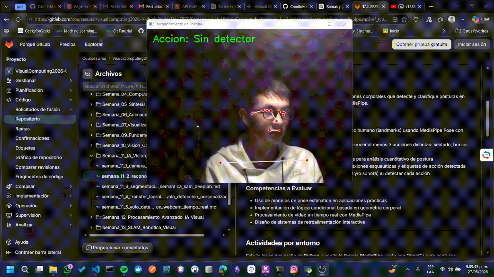

# Reconocimiento de Acciones Simples con Detección de Postura

## Autores del Proyecto

- Juan David Buitrago Salazar
- Juan David Cardenas Galvis
- Nicolás Rodríguez Piraban
- Camilo Andres Medina Sanchez
- Juan Felipe Fajardo Garzón

**Fecha de Entrega:** 25 de mayo de 2026

---

## Descripción general 

### Resumen ejecutivo

Se pretende el desarrollo de un sistema de reconocimiento de acciones corporales que las clasifique en tiempo real haciendo uso de MediaPipe Pose y OpenCV. El sistema detecta landmarks corporales del cuerpo humano mediante visión por computador y aplica reglas geométricas para reconocer diferentes acciones y posturas.

El proyecto permite identificar movimientos corporales utilizando procesamiento de video en tiempo real, mostrando visualmente el esqueleto detectado junto con la acción reconocida.

### Tecnologías utilizadas 

- Python 3.12
- OpenCV
- MediaPipe
- NumPy
- Pygame

## Implementación técnica

**Captura y procesamiento de video**
La captura de video en tiempo real se realizó utilizando OpenCV mediante acceso directo a la webcam del sistema:

```python
cap = cv2.VideoCapture(0)
```

Cada frame capturado es convertido desde formato BGR hacia RGB debido a que MediaPipe utiliza internamente el espacio de color RGB para el procesamiento de imágenes.

```python
rgb = cv2.cvtColor(frame, cv2.COLOR_BGR2RGB)
```

**Estimación de postura con MediaPipe Pose**

El sistema utiliza el modelo `MediaPipe Pose` para detectar y rastrear landmarks corporales en tiempo real.

```python
mp_pose = mp.solutions.pose

pose = mp_pose.Pose(
    min_detection_confidence=0.5,
    min_tracking_confidence=0.5
)
```

**Parámetros utilizados**

| Parámetro                  | Descripción                                                         |
| -------------------------- | ------------------------------------------------------------------- |
| `min_detection_confidence` | Umbral mínimo de confianza para validar la detección corporal       |
| `min_tracking_confidence`  | Confianza mínima para mantener el seguimiento temporal de landmarks |

El modelo retorna coordenadas normalizadas `(x, y, z)` correspondientes a 33 landmarks anatómicos del cuerpo humano.

**Detección y extracción de landmarks**

Los landmarks detectados son almacenados mediante:

```python
landmarks = results.pose_landmarks.landmark
```

Entre los puntos anatómicos utilizados para el reconocimiento de acciones se encuentran:

* NOSE
* LEFT_WRIST
* RIGHT_WRIST
* LEFT_HIP
* RIGHT_HIP
* LEFT_KNEE
* RIGHT_KNEE
* LEFT_ANKLE
* RIGHT_ANKLE

Estos landmarks permiten realizar análisis geométrico y espacial sobre la postura corporal.

**Clasificación de acciones**

La clasificación de acciones se implementó mediante reglas condicionales basadas en relaciones espaciales entre landmarks corporales.

*Detección de brazos levantados*

La acción se detecta cuando ambas muñecas se encuentran por encima de la nariz:

```python
if left_wrist.y < nose.y and right_wrist.y < nose.y:
    action = "Brazos levantados"
```

Debido al sistema de coordenadas de imagen, un menor valor en `y` representa una posición más alta en pantalla.

*Detección de postura sentada*

La postura sentada se identifica comparando la posición vertical de las caderas respecto a las rodillas:

```python
elif left_hip.y > left_knee.y and right_hip.y > right_knee.y:
    action = "Sentado"
```

Esta relación geométrica permite inferir flexión de piernas y descenso corporal.

*Detección de caminata*

La detección de caminata se realizó mediante análisis temporal del movimiento de los tobillos entre frames consecutivos.

El sistema almacena históricos de movimiento y calcula variaciones periódicas en la posición vertical de ambos pies.

```python
left_variation = max(history) - min(history)
```

Cuando la variación supera un umbral determinado, la acción es clasificada como caminata.

*Visualización y retroalimentación*

Los landmarks detectados son renderizados en tiempo real utilizando las utilidades gráficas de MediaPipe:

```python
mp_drawing.draw_landmarks(
    frame,
    results.pose_landmarks,
    mp_pose.POSE_CONNECTIONS
)
```

Además, el sistema muestra sobre cada frame la acción detectada utilizando OpenCV:

```python
cv2.putText(frame, action, ...)
```

Finalmente, se implementó retroalimentación sonora mediante `pygame` para notificar cambios en la acción reconocida.

## Resultados visuales

