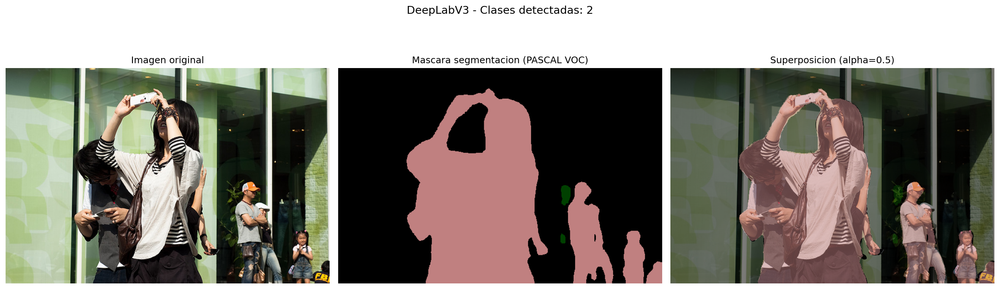
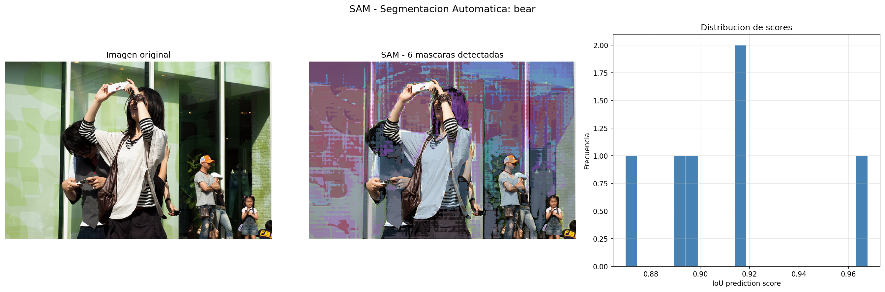
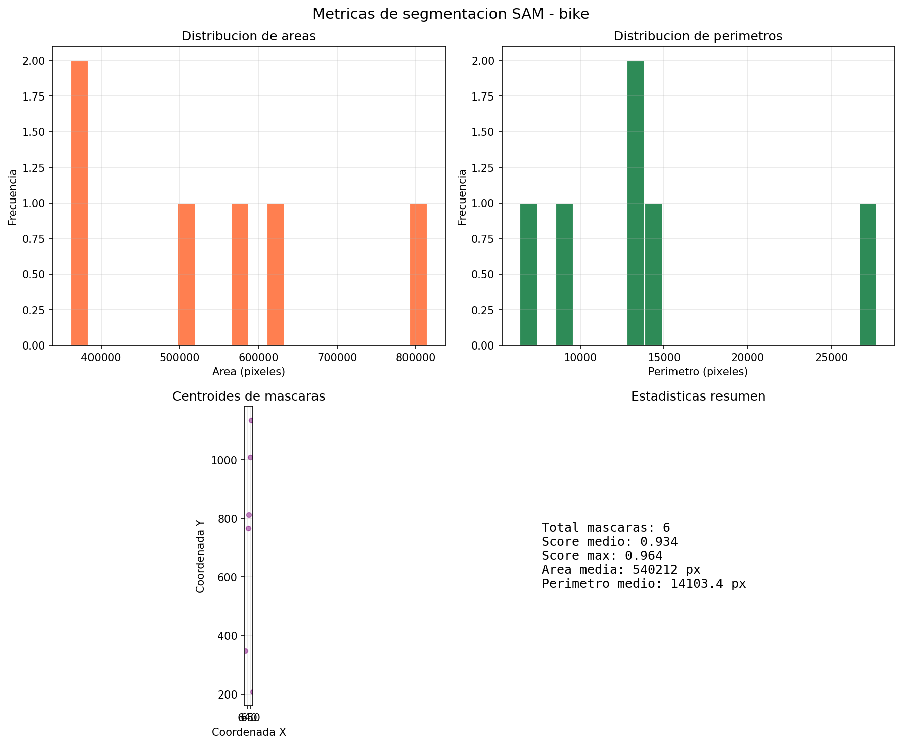
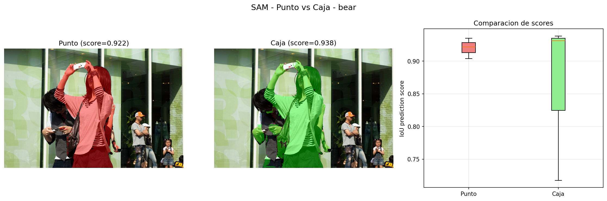
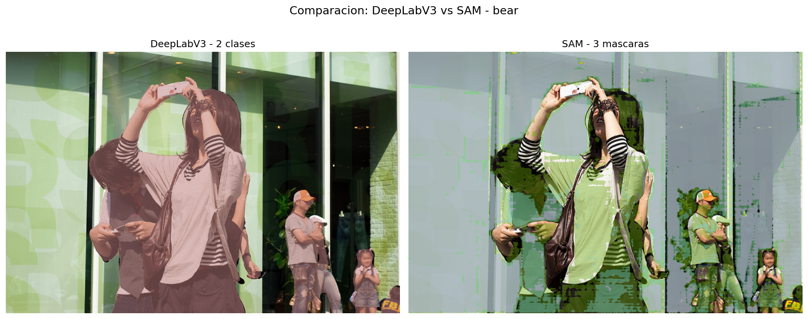
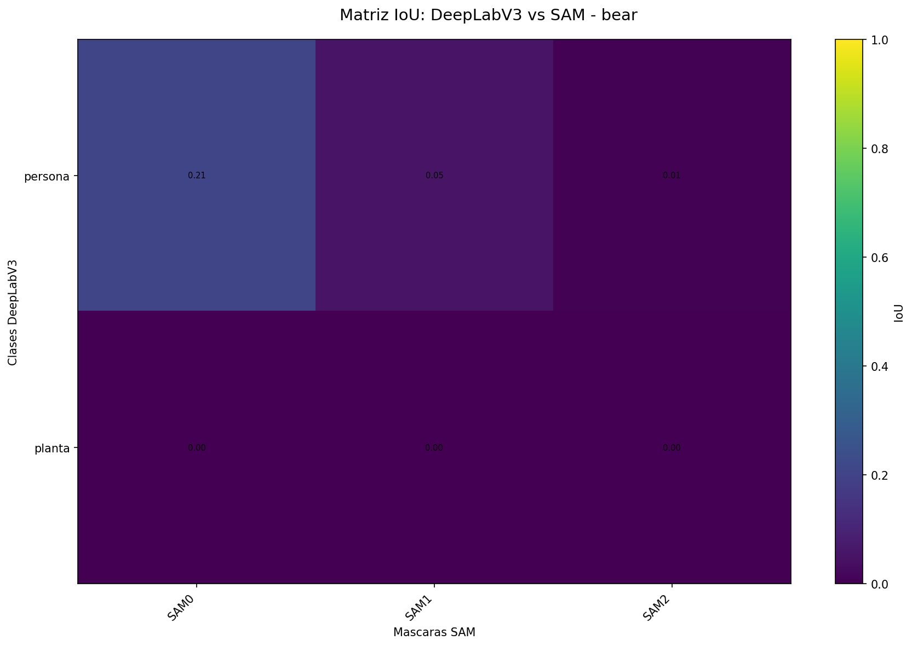
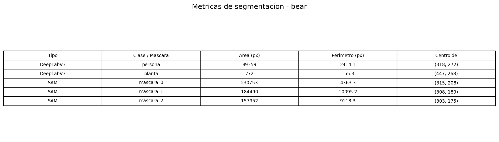
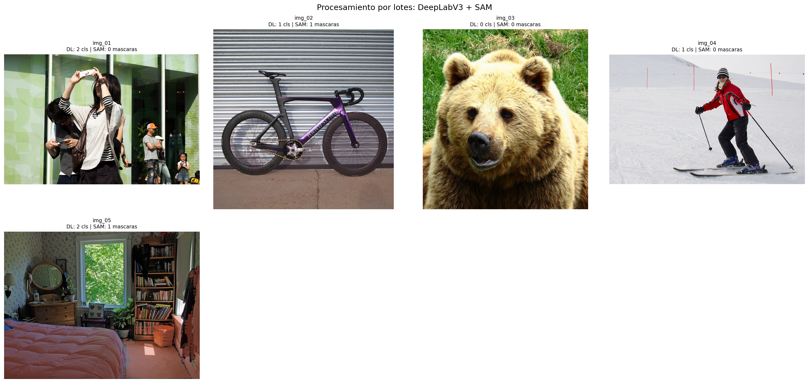
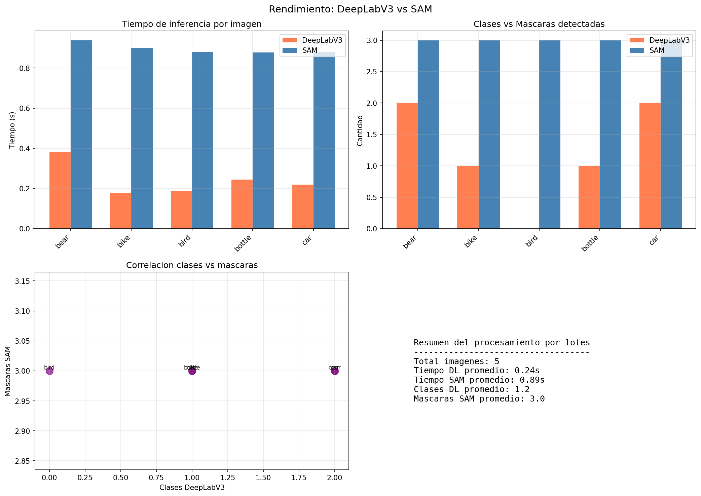

# Taller Segmentacion Semantica Multimodal: SAM y DeepLabV3

## Integrantes

- Juan David Buitrago Salazar
- Juan David Cardenas Galvis
- Nicolas Rodriguez Piraban
- Camilo Andres Medina Sanchez
- Juan Felipe Fajardo Garzon

## Fecha de entrega

`2026-05-22`

---

## Descripcion breve

Este taller implementa segmentacion semantica de imagenes utilizando dos modelos state-of-the-art: **DeepLabV3** (Google, basado en torchvision) y **SAM - Segment Anything Model** (Meta AI, via HuggingFace transformers). El objetivo es extraer y analizar regiones de interes a nivel de pixel, comparando las fortalezas y limitaciones de cada enfoque.

DeepLabV3 proporciona segmentacion semantica por clases predefinidas (21 categorias del dataset PASCAL VOC), mientras que SAM genera mascaras a nivel de instancia sin necesidad de clases predefinidas, soportando interaccion por puntos y cajas delimitadoras. Se procesaron 13 imagenes de prueba (12 del dataset COCO + 1 imagen local) y se calcularon metricas cuantitativas como area, perimetro, centroide e IoU entre metodos.

---

## Implementaciones

### Python

Se desarrollaron 5 scripts principales mas un modulo de utilidades compartidas y un script de descarga de datos:

1. **`01_deeplabv3_segmentation.py`**: Carga el modelo DeepLabV3-ResNet101 preentrenado y realiza segmentacion semantica sobre todas las imagenes. Genera visualizaciones con superposicion coloreada usando la paleta PASCAL VOC y mascaras binarias por clase detectada.

2. **`02_sam_auto_segmentation.py`**: Utiliza SAM con un grid de 16x16 puntos para generar mascaras automaticamente en toda la imagen. Aplica supresion de no-maximos (NMS) para eliminar redundancias. Produce visualizaciones compuestas, mascaras individuales y graficos de metricas (area, perimetro, centroide).

3. **`03_sam_interactive.py`**: Demuestra la segmentacion interactiva de SAM mediante dos modalidades: (a) punto central como referencia positiva, generando 3 mascaras candidatas con sus scores de confianza; (b) caja delimitadora calculada a partir de la mejor mascara obtenida por punto.

4. **`04_metrics_analysis.py`**: Ejecuta ambos modelos sobre las mismas imagenes, calcula metricas de segmentacion (area, perimetro, centroide) y genera una matriz de IoU cruzado entre las clases de DeepLabV3 y las mascaras de SAM.

5. **`05_batch_processing.py`**: Procesa 5 imagenes en lotes con ambos modelos, recolecta tiempos de inferencia y genera collages comparativos, graficos de rendimiento y resultados detallados por imagen.

El modulo `utils.py` contiene funciones compartidas para carga de imagenes, paleta de colores PASCAL VOC, superposicion de mascaras, calculo de metricas (area, perimetro, centroide, IoU) y guardado de figuras.

---

## Resultados visuales

Cada script genera salidas para **multiples imagenes de entrada** (13 imagenes en total), produciendo un total de **61 archivos de resultados** en `media/python/`. En esta seccion se documenta una **muestra representativa** (2-3 imagenes por script) para ilustrar el funcionamiento de cada algoritmo. La tabla siguiente detalla la cantidad total de imagenes generadas por cada script:

| Script | Archivos generados | Descripcion |
|--------|-------------------|-------------|
| `01_deeplabv3_segmentation.py` | 26 (13 overviews + 13 mascaras binarias) | Una imagen por cada una de las 13 imagenes de entrada |
| `02_sam_auto_segmentation.py` | 12 (4 composites + 4 individual + 4 metricas) | Procesa las primeras 4 imagenes |
| `03_sam_interactive.py` | 9 (3 point + 3 bbox + 3 comparison) | Procesa las primeras 3 imagenes |
| `04_metrics_analysis.py` | 8 (3 comparison + 3 tables + 2 heatmaps) | Procesa las primeras 3 imagenes |
| `05_batch_processing.py` | 7 (1 collage + 1 rendimiento + 5 detallados) | Procesa 5 imagenes en lote |
| **Total** | **61** | |

Las imagenes mostradas a continuacion son una seleccion de este conjunto completo. Todos los archivos estan disponibles en `./media/python/`.

### Script 01: DeepLabV3 - Segmentacion Semantica



*Resultado de DeepLabV3 sobre la imagen `bear.jpg`. Se muestran tres paneles: imagen original, mascara de segmentacion coloreada con la paleta PASCAL VOC (21 clases), y superposicion con alpha=0.5. El modelo detecto 2 clases: persona y planta. La imagen se redimensiona a 520px para la inferencia y se reescala al tamano original.*


*Mascaras binarias por clase detectadas por DeepLabV3 en la imagen `person_dog.jpg`. Se identificaron 6 categorias: botella, silla, mesa, persona, planta y tv. Cada mascara se genera umbralizando el mapa de prediccion del modelo y se superpone en escala de grises.*

### Script 02: SAM - Segmentacion Automatica



*Resultado de SAM automatico sobre `bear.jpg` usando un grid de 16x16 puntos (256 puntos en total). Tras aplicar NMS con umbral IoU=0.7 y filtro de score>0.85, se obtuvieron 6 mascaras. Se muestra la superposicion de todas las mascaras con colores aleatorios y un histograma de distribucion de scores de IoU.*



*Analisis de metricas para las mascaras generadas por SAM en `bike.jpg`. Se muestran histogramas de distribucion de areas y perimetros, un grafico de dispersion de centroides y un resumen estadistico con score promedio (0.958), area media y perimetro medio.*

### Script 03: SAM - Segmentacion Interactiva


*Segmentacion interactiva mediante punto de referencia en el centro de la imagen `bear.jpg`. SAM genera 3 posibles mascaras (multimask output) ordenadas por score de confianza. La mejor mascara alcanzo un score de 0.990, capturando correctamente el objeto central.*



*Comparacion de las dos modalidades de interaccion: punto vs caja delimitadora. La caja se calcula automaticamente a partir del bounding box de la mascara obtenida por punto. Se incluye un boxplot comparativo de los scores de las 3 mascaras generadas por cada metodo.*

### Script 04: Metricas y Analisis Comparativo



*Comparacion cualitativa lado a lado de los resultados de DeepLabV3 (2 clases: persona, planta) y SAM (3 mascaras) sobre `bear.jpg`. DeepLabV3 etiqueta semanticamente las regiones mientras que SAM segmenta por instancias sin etiquetas de clase.*



*Matriz de IoU (Intersection over Union) entre las clases de DeepLabV3 y las mascaras de SAM. El mejor solapamiento se obtuvo para la clase "persona" con IoU=0.209 frente a la mascara SAM mas cercana, reflejando las diferencias entre segmentacion semantica y por instancias.*



*Tabla comparativa de metricas de segmentacion (area en pixeles, perimetro en pixeles y coordenadas del centroide) para cada region detectada por DeepLabV3 y SAM.*

### Script 05: Procesamiento por Lotes



*Collage de resultados del procesamiento por lotes sobre 5 imagenes. Cada celda muestra la superposicion de SAM, el nombre de la imagen, el numero de clases detectadas por DeepLabV3 y la cantidad de mascaras de SAM.*



*Graficos de rendimiento comparativo: tiempos de inferencia por imagen (DeepLabV3 promedio 0.24s vs SAM promedio 0.89s en GPU RTX 2050), cantidad de clases vs mascaras detectadas, correlacion entre metodos y resumen estadistico.*

---

## Codigo relevante

### Segmentacion con DeepLabV3

```python
model = models.segmentation.deeplabv3_resnet101(pretrained=True).to(device)
model.eval()

preprocess = transforms.Compose([
    transforms.ToPILImage(),
    transforms.Resize(520),
    transforms.ToTensor(),
    transforms.Normalize(mean=[0.485, 0.456, 0.406], std=[0.229, 0.224, 0.225]),
])

input_tensor = preprocess(image_rgb).unsqueeze(0).to(device)
with torch.no_grad():
    output = model(input_tensor)['out']
output_predictions = output.argmax(1).squeeze().detach().cpu().numpy()
```

### Segmentacion automatica con SAM (grid de puntos)

```python
from transformers import SamModel, SamProcessor

processor = SamProcessor.from_pretrained("facebook/sam-vit-base")
model = SamModel.from_pretrained("facebook/sam-vit-base").to(device)

xs = np.linspace(0, w - 1, grid_size, dtype=int)
ys = np.linspace(0, h - 1, grid_size, dtype=int)
grid_pts = [[float(x), float(y)] for y in ys for x in xs]
labels = [1] * len(grid_pts)

inputs = processor(img_small, input_points=[grid_pts],
                   input_labels=[labels], return_tensors="pt").to(device)
with torch.no_grad():
    outputs = model(**inputs)

masks = processor.image_processor.post_process_masks(
    outputs.pred_masks.cpu(), inputs["original_sizes"].cpu(),
    inputs["reshaped_input_sizes"].cpu()
)[0].numpy()
```

### Supresion de no-maximos (NMS) para mascaras

```python
def non_max_suppression(masks, scores, iou_threshold=0.7, score_threshold=0.85):
    flat_scores = scores.flatten()
    sorted_idxs = np.argsort(flat_scores)[::-1]
    keep = []
    for idx in sorted_idxs:
        if flat_scores[idx] < score_threshold:
            continue
        keep_iou = True
        for k in keep:
            if compute_iou(masks[idx], masks[k]) > iou_threshold:
                keep_iou = False
                break
        if keep_iou:
            keep.append(idx)
    return keep
```

---

## Prompts utilizados

```
"Implementa un script en Python que cargue DeepLabV3-ResNet101 de torchvision y 
genere visualizaciones de segmentacion semantica con la paleta de colores PASCAL VOC"

"Crea una funcion que genere un grid de puntos para SAM y filtre las mascaras 
redundantes usando supresion de no-maximos con umbral de IoU"

"Implementa segmentacion interactiva con SAM usando puntos y cajas delimitadoras, 
mostrando las 3 mascaras candidatas con sus scores de confianza"

"Calcula metricas de segmentacion (area, perimetro, centroide) para las regiones 
detectadas por DeepLabV3 y SAM, y genera una matriz de IoU cruzado entre metodos"

"Procesa un lote de 5+ imagenes con ambos modelos, recolecta tiempos de inferencia 
y genera graficos comparativos de rendimiento"
```

---

## Aprendizajes y dificultades

### Aprendizajes

Este taller permitio comprender en profundidad las diferencias fundamentales entre la segmentacion semantica clasica (DeepLabV3, basada en clasificacion por pixel con categorias predefinidas) y la segmentacion por instancias con modelos foundation (SAM, basada en atencion y prompts). DeepLabV3 demuestra ser eficiente (0.24s por imagen en GPU) y proporciona etiquetas semanticas interpretables, pero limitado a 21 clases predefinidas. SAM, aunque mas lento (0.89s por imagen), ofrece una granularidad mucho mayor al poder segmentar cualquier objeto sin necesidad de entrenamiento previo, y su capacidad interactiva (puntos/cajas) lo hace ideal para aplicaciones donde se requiere intervencion del usuario.

### Dificultades

La principal dificultad fue la integracion de SAM a traves de la libreria transformers de HuggingFace, ya que la API difiere significativamente del repositorio original de Meta. Fue necesario comprender el formato esperado de los tensores de entrada (puntos como listas de floats, no arrays numpy) y manejar correctamente las dimensiones de salida (3 mascaras por punto debido a multimask_output). La gestion de resoluciones tambien presento desafios: SAM opera internamente a 640x640 mientras que las imagenes originales son de hasta 1280x1280, requiriendo reescalado de mascaras. La supresion de no-maximos para mascaras 2D requirio una implementacion personalizada.

### Mejoras futuras

Se podria extender el proyecto con: (a) implementacion de segmentacion por video usando SAM-tracking, (b) cuantizacion de los modelos para inferencia en tiempo real, (c) integracion de Grounding DINO para generar prompts textuales automaticos para SAM, y (d) una interfaz web interactiva para explorar los resultados.

---

## Contribuciones grupales

Todos los integrantes colaboraron en todas las etapas del desarrollo. A continuacion se destacan las areas donde cada miembro aporto particularmente:

- **Juan David Buitrago Salazar**: Implementacion del script de DeepLabV3 y configuracion del pipeline de preprocesamiento.
- **Juan David Cardenas Galvis**: Desarrollo del modulo de utilidades compartidas (utils.py) y la visualizacion de mascaras.
- **Nicolas Rodriguez Piraban**: Implementacion de SAM interactivo con puntos y cajas delimitadoras.
- **Camilo Andres Medina Sanchez**: Calculo de metricas de segmentacion (area, perimetro, centroide, IoU) y generacion de matrices de comparacion.
- **Juan Felipe Fajardo Garzon**: Procesamiento por lotes, generacion de collages y graficos de rendimiento comparativo.

---

## Estructura del proyecto

```
semana_11_3_segmentacion_semantica_sam_deeplab/
├── python/
│   ├── requirements.txt
│   ├── utils.py
│   ├── download_images.py
│   ├── 01_deeplabv3_segmentation.py
│   ├── 02_sam_auto_segmentation.py
│   ├── 03_sam_interactive.py
│   ├── 04_metrics_analysis.py
│   ├── 05_batch_processing.py
│   └── .venv/
├── media/
│   ├── input/
│   │   ├── bear.jpg
│   │   ├── bike.jpg
│   │   ├── bird.jpg
│   │   ├── bottle.jpg
│   │   ├── car.jpg
│   │   ├── cat.jpg
│   │   ├── chair.jpg
│   │   ├── elephant.jpg
│   │   ├── giraffe.jpg
│   │   ├── horse.jpg
│   │   ├── motorcycle.jpg
│   │   ├── person_dog.jpg
│   │   └── zebra.jpg
│   └── python/
│       └── (61 archivos de resultados — ver tabla en Resultados visuales)
├── semana_11_3_segmentacion_semantica_sam_deeplab.md
├── 04_plantilla_readme_entregas_talleres.md
└── README.md
```

---

## Referencias

- DeepLabV3: "Rethinking Atrous Convolution for Semantic Image Segmentation" - Chen et al. (https://arxiv.org/abs/1706.05587)
- SAM: "Segment Anything" - Kirillov et al., Meta AI (https://arxiv.org/abs/2304.02643)
- Documentacion de torchvision: https://pytorch.org/vision/stable/models.html
- Documentacion de HuggingFace Transformers (SAM): https://huggingface.co/docs/transformers/model_doc/sam
- Dataset COCO: "Microsoft COCO: Common Objects in Context" - Lin et al. (https://cocodataset.org/)
- Dataset PASCAL VOC: http://host.robots.ox.ac.uk/pascal/VOC/
